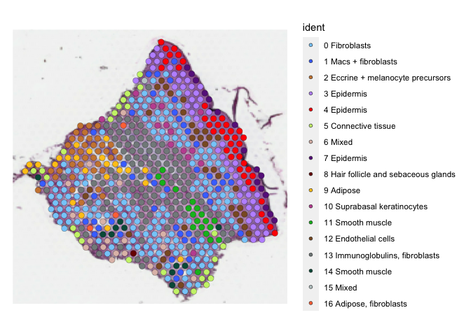

R Notebook
================

# PSO + PSA + NORMAL SKIN COMBINED ANALYSIS - PART 2

# CONTINUED

## Harmony-batch correction

## Table of content

| FIGURE NO | DESCRIPTION                                                             | LINK                                                |
|-----------|-------------------------------------------------------------------------|-----------------------------------------------------|
| S4A       | UMAP WITH ALL SPATIAL SAMPLES (Using Harmony batch correction)          | [FIGURE 3B and S4A](#figure-3b-and-s4a)             |
| 3B        | UMAP WITH ALL SPATIAL SAMPLES (Using Harmony batch correction)          | [FIGURE 3B](#figure-3b)                             |
| 3A        | NON-LESIONAL SKIN SAMPLE (ST 21 NL), and LESIONAL SKIN SAMPLE (ST 22 L) | [FIGURE 3A](#figure-3a-1)                           |
| S5        | Heatmap (After Harmony batch correction)                                | [SUPPLEMENTARY FIGURE S5](#supplementary-figure-s5) |
| 3C        | Percentage composition                                                  | [FIGURE 3C](#figure-3c)                             |
| S7B       | UMIs per cluster                                                        | [FIGURE S7B](#figure-s7b)                           |

## LOAD ALL PACKAGES

``` r
library(tidyverse)
```

    ## Warning: package 'tidyverse' was built under R version 4.1.2

    ## ── Attaching packages ─────────────────────────────────────── tidyverse 1.3.2 ──
    ## ✔ ggplot2 3.4.0      ✔ purrr   0.3.5 
    ## ✔ tibble  3.1.8      ✔ dplyr   1.0.10
    ## ✔ tidyr   1.2.1      ✔ stringr 1.4.1 
    ## ✔ readr   2.1.3      ✔ forcats 0.5.2

    ## Warning: package 'ggplot2' was built under R version 4.1.2

    ## Warning: package 'tibble' was built under R version 4.1.2

    ## Warning: package 'tidyr' was built under R version 4.1.2

    ## Warning: package 'readr' was built under R version 4.1.2

    ## Warning: package 'purrr' was built under R version 4.1.2

    ## Warning: package 'dplyr' was built under R version 4.1.2

    ## Warning: package 'stringr' was built under R version 4.1.2

    ## Warning: package 'forcats' was built under R version 4.1.2

    ## ── Conflicts ────────────────────────────────────────── tidyverse_conflicts() ──
    ## ✖ dplyr::filter() masks stats::filter()
    ## ✖ dplyr::lag()    masks stats::lag()

``` r
library(Seurat)
```

    ## Warning: package 'Seurat' was built under R version 4.1.2

    ## Attaching SeuratObject
    ## Attaching sp

``` r
library(cowplot)
library(ggsci)
library(ggpubr)
```

    ## 
    ## Attaching package: 'ggpubr'
    ## 
    ## The following object is masked from 'package:cowplot':
    ## 
    ##     get_legend

``` r
library(harmony)
```

    ## Loading required package: Rcpp

    ## Warning: package 'Rcpp' was built under R version 4.1.2

## LOAD DATA (Generated in PS_SAMPLES_PART_1)

``` r
All_Samples <- readRDS("/Volumes/Extreme Pro/GITHUB-DATA/ST-DATA/PSORIASIS-DATA/RDS-Files/All_Samples_list.RDS")
```

### Merging data for Harmony Batch correction

``` r
all_skin.merge <- merge(x=All_Samples[[1]], y=All_Samples[-1], merge.data=TRUE)
```

### Save RDS File of All Merged Samples

``` r
#saveRDS(all_skin.merge, file = "/gpfs/data/naiklab/Alex/GITHUB-DATA/ST-DATA/PSORIASIS-DATA/RDS-Files/all_samples_merged_obj.RDS")
```

### Load All Merged Samples & Run SCTransform

``` r
all_skin.merge <- readRDS("/Volumes/Extreme Pro/GITHUB-DATA/ST-DATA/PSORIASIS-DATA/RDS-Files/all_samples_merged_obj.RDS")

all_skin.merge <- SCTransform(all_skin.merge,assay = "Spatial", vars.to.regress = "sample.id")
```

    ## Calculating cell attributes from input UMI matrix: log_umi

    ## Variance stabilizing transformation of count matrix of size 21901 by 16424

    ## Model formula is y ~ log_umi

    ## Get Negative Binomial regression parameters per gene

    ## Using 2000 genes, 5000 cells

    ##   |                                                                              |                                                                      |   0%  |                                                                              |==================                                                    |  25%  |                                                                              |===================================                                   |  50%  |                                                                              |====================================================                  |  75%  |                                                                              |======================================================================| 100%

    ## Found 70 outliers - those will be ignored in fitting/regularization step

    ## Second step: Get residuals using fitted parameters for 21901 genes

    ##   |                                                                              |                                                                      |   0%  |                                                                              |==                                                                    |   2%  |                                                                              |===                                                                   |   5%  |                                                                              |=====                                                                 |   7%  |                                                                              |======                                                                |   9%  |                                                                              |========                                                              |  11%  |                                                                              |==========                                                            |  14%  |                                                                              |===========                                                           |  16%  |                                                                              |=============                                                         |  18%  |                                                                              |==============                                                        |  20%  |                                                                              |================                                                      |  23%  |                                                                              |==================                                                    |  25%  |                                                                              |===================                                                   |  27%  |                                                                              |=====================                                                 |  30%  |                                                                              |======================                                                |  32%  |                                                                              |========================                                              |  34%  |                                                                              |=========================                                             |  36%  |                                                                              |===========================                                           |  39%  |                                                                              |=============================                                         |  41%  |                                                                              |==============================                                        |  43%  |                                                                              |================================                                      |  45%  |                                                                              |=================================                                     |  48%  |                                                                              |===================================                                   |  50%  |                                                                              |=====================================                                 |  52%  |                                                                              |======================================                                |  55%  |                                                                              |========================================                              |  57%  |                                                                              |=========================================                             |  59%  |                                                                              |===========================================                           |  61%  |                                                                              |=============================================                         |  64%  |                                                                              |==============================================                        |  66%  |                                                                              |================================================                      |  68%  |                                                                              |=================================================                     |  70%  |                                                                              |===================================================                   |  73%  |                                                                              |====================================================                  |  75%  |                                                                              |======================================================                |  77%  |                                                                              |========================================================              |  80%  |                                                                              |=========================================================             |  82%  |                                                                              |===========================================================           |  84%  |                                                                              |============================================================          |  86%  |                                                                              |==============================================================        |  89%  |                                                                              |================================================================      |  91%  |                                                                              |=================================================================     |  93%  |                                                                              |===================================================================   |  95%  |                                                                              |====================================================================  |  98%  |                                                                              |======================================================================| 100%

    ## Computing corrected count matrix for 21901 genes

    ##   |                                                                              |                                                                      |   0%  |                                                                              |==                                                                    |   2%  |                                                                              |===                                                                   |   5%  |                                                                              |=====                                                                 |   7%  |                                                                              |======                                                                |   9%  |                                                                              |========                                                              |  11%  |                                                                              |==========                                                            |  14%  |                                                                              |===========                                                           |  16%  |                                                                              |=============                                                         |  18%  |                                                                              |==============                                                        |  20%  |                                                                              |================                                                      |  23%  |                                                                              |==================                                                    |  25%  |                                                                              |===================                                                   |  27%  |                                                                              |=====================                                                 |  30%  |                                                                              |======================                                                |  32%  |                                                                              |========================                                              |  34%  |                                                                              |=========================                                             |  36%  |                                                                              |===========================                                           |  39%  |                                                                              |=============================                                         |  41%  |                                                                              |==============================                                        |  43%  |                                                                              |================================                                      |  45%  |                                                                              |=================================                                     |  48%  |                                                                              |===================================                                   |  50%  |                                                                              |=====================================                                 |  52%  |                                                                              |======================================                                |  55%  |                                                                              |========================================                              |  57%  |                                                                              |=========================================                             |  59%  |                                                                              |===========================================                           |  61%  |                                                                              |=============================================                         |  64%  |                                                                              |==============================================                        |  66%  |                                                                              |================================================                      |  68%  |                                                                              |=================================================                     |  70%  |                                                                              |===================================================                   |  73%  |                                                                              |====================================================                  |  75%  |                                                                              |======================================================                |  77%  |                                                                              |========================================================              |  80%  |                                                                              |=========================================================             |  82%  |                                                                              |===========================================================           |  84%  |                                                                              |============================================================          |  86%  |                                                                              |==============================================================        |  89%  |                                                                              |================================================================      |  91%  |                                                                              |=================================================================     |  93%  |                                                                              |===================================================================   |  95%  |                                                                              |====================================================================  |  98%  |                                                                              |======================================================================| 100%

    ## Calculating gene attributes

    ## Wall clock passed: Time difference of 2.194504 mins

    ## Determine variable features

    ## Place corrected count matrix in counts slot

    ## Regressing out sample.id

    ## Centering data matrix

    ## Set default assay to SCT

``` r
all_skin.merge <- RunPCA(all_skin.merge,assay = "SCT")
```

    ## PC_ 1 
    ## Positive:  S100A8, S100A7, S100A9, KRT10, KRTDAP, SPRR2E, PI3, SPRR2A, SPRR2G, SPRR2D 
    ##     KRT1, SERPINB3, KRT6A, SPRR2B, DEFB4A, SERPINB4, CSTA, FLG, CDSN, CNFN 
    ##     SPRR1B, LCE3D, SBSN, S100A7A, FABP5, ASPRV1, SLURP1, LCE3E, LOR, GJB2 
    ## Negative:  COL1A1, COL1A2, CFD, DCN, COL3A1, TAGLN, ACTA2, DCD, MYL9, FBLN1 
    ##     MMP2, PI16, FTL, COL6A2, TNXB, MGP, SCGB2A2, S100A6, APOD, CCN5 
    ##     CXCL12, TPM2, VIM, FBLN2, CCDC80, SPARC, AEBP1, MFAP4, MYH11, FTH1 
    ## PC_ 2 
    ## Positive:  DCD, SCGB2A2, MUCL1, SCGB1D2, SCGB1B2P, PIP, SLC12A2, AQP5, KRT19, KRT7 
    ##     SNORC, ZG16B, KRT8, CLDN10, KRT18, SFRP1, AZGP1, MT-CO1, STAC2, MELTF 
    ##     LRRC26, NCALD, SERHL2, PPP1R1B, MT-CO3, CA6, DNER, SAA1, KCNN4, ATP1B1 
    ## Negative:  COL1A1, COL1A2, COL3A1, DCN, FBLN1, PI16, CFD, MMP2, COMP, CCN5 
    ##     COL6A2, TNXB, AEBP1, SFRP2, SPARC, FBLN2, LUM, CCDC80, CTSK, CST3 
    ##     COL6A1, C3, C1R, FSTL1, FBN1, SERPINF1, MFAP4, PCOLCE, ELN, TIMP2 
    ## PC_ 3 
    ## Positive:  DCD, SCGB2A2, COL1A2, COL1A1, SPRR2E, DCN, SCGB1D2, SCGB1B2P, PIP, SPRR2G 
    ##     SPRR2B, FBLN1, SPRR2D, MUCL1, LCE3D, SPRR2A, COL3A1, CNFN, CFD, LCE3E 
    ##     AQP5, PI3, PI16, SERPINB3, SPRR2F, SNORC, SLC12A2, MMP2, CDSN, CRCT1 
    ## Negative:  APOC1, KRT79, FADS2, MGST1, THRSP, GAL, PM20D1, FASN, ALOX15B, FADS1 
    ##     CRAT, ELOVL3, ACSBG1, AWAT2, INSIG1, DGAT2, MSMO1, ELOVL5, FAR2, DGAT2L6 
    ##     SOAT1, TMEM91, CIDEA, ACSL1, HMGCS1, SEC14L6, CHI3L1, CYB5A, APMAP, ACAA2 
    ## PC_ 4 
    ## Positive:  SPRR2G, SPRR2E, LCE3D, COL1A1, SPRR2B, LCE3E, COL1A2, CRCT1, SPRR2D, CNFN 
    ##     CDSN, LCN2, ARG1, COL3A1, SPRR2A, ASPRV1, FAM25A, DCN, AZGP1, SPRR2F 
    ##     LCE3A, KLK9, CFD, KPRP, TAGLN, FBLN1, PI16, CPA4, ACTA2, KLK6 
    ## Negative:  KRT10, KRT1, KRT14, S100A8, FABP5, KRT5, KRT2, LGALS7B, S100A2, SFN 
    ##     LY6D, AQP3, COL17A1, S100A14, PERP, DSP, RPS12, TYRP1, S100A7, RPLP1 
    ##     KRT6C, MT1X, CCL27, DSG1, PKP1, LGALS7, FGFBP1, KRT6A, PMEL, S100A9 
    ## PC_ 5 
    ## Positive:  FLG, LOR, FLG2, KRT10, KRT2, TAGLN, DES, ACTA2, MYH11, LCE2B 
    ##     ASPRV1, MYL9, TPM2, LCE1B, SERPINA12, LCE1C, KRT1, KPRP, ACTG2, C1orf68 
    ##     LCE2C, LCE1A, CNN1, LCE2D, LCE2A, HOPX, PCP4, CDSN, CASP14, MYLK 
    ## Negative:  DEFB4A, SERPINB4, KRT6A, PI3, COL1A1, COL1A2, SPRR2F, SERPINB3, GJB2, KRT6C 
    ##     SPRR2A, S100A8, KRT17, S100A7A, DEFB4B, S100A7, KRT16, DCN, RHCG, SPRR1B 
    ##     COL3A1, SPRR2D, IL36G, KRT6B, FABP5, S100A9, FBLN1, DCD, MMP2, CD24

## Code for the final figure

### Running Harmony batch correction

``` r
all_samples.hm.sct <- RunHarmony(all_skin.merge,assay.use = "SCT",project.dim = FALSE,group.by.vars = "sample.id")
```

    ## Harmony 1/10

    ## Harmony 2/10

    ## Harmony 3/10

    ## Harmony 4/10

    ## Harmony 5/10

    ## Harmony 6/10

    ## Harmony 7/10

    ## Harmony 8/10

    ## Harmony converged after 8 iterations

``` r
ElbowPlot(all_samples.hm.sct,ndims = 50)
```

<!-- -->

``` r
all_samples.hm.sct <- all_samples.hm.sct %>% 
    RunUMAP(reduction = "harmony", dims = 1:40) %>% 
    FindNeighbors(reduction = "harmony", dims = 1:40) %>% 
    FindClusters(resolution = 0.4) %>% 
    identity()
```

    ## Warning: The default method for RunUMAP has changed from calling Python UMAP via reticulate to the R-native UWOT using the cosine metric
    ## To use Python UMAP via reticulate, set umap.method to 'umap-learn' and metric to 'correlation'
    ## This message will be shown once per session

    ## 15:22:51 UMAP embedding parameters a = 0.9922 b = 1.112

    ## 15:22:51 Read 16424 rows and found 40 numeric columns

    ## 15:22:51 Using Annoy for neighbor search, n_neighbors = 30

    ## 15:22:51 Building Annoy index with metric = cosine, n_trees = 50

    ## 0%   10   20   30   40   50   60   70   80   90   100%

    ## [----|----|----|----|----|----|----|----|----|----|

    ## **************************************************|
    ## 15:22:53 Writing NN index file to temp file /var/folders/8p/2clwbcfn719f5l1kjsyx4v6s2r9kgj/T//RtmppmAbDt/filea21739212733
    ## 15:22:53 Searching Annoy index using 1 thread, search_k = 3000
    ## 15:22:59 Annoy recall = 100%
    ## 15:22:59 Commencing smooth kNN distance calibration using 1 thread with target n_neighbors = 30
    ## 15:23:00 Initializing from normalized Laplacian + noise (using irlba)
    ## 15:23:01 Commencing optimization for 200 epochs, with 769924 positive edges
    ## 15:23:10 Optimization finished
    ## Computing nearest neighbor graph
    ## Computing SNN

    ## Modularity Optimizer version 1.3.0 by Ludo Waltman and Nees Jan van Eck
    ## 
    ## Number of nodes: 16424
    ## Number of edges: 754026
    ## 
    ## Running Louvain algorithm...
    ## Maximum modularity in 10 random starts: 0.9242
    ## Number of communities: 17
    ## Elapsed time: 2 seconds

``` r
DimPlot(all_samples.hm.sct)
```

<!-- -->

``` r
DimPlot(all_samples.hm.sct,split.by = "DISEASE_STATUS")
```

<!-- -->

## IMPORT Pre-computed harmony results to get same embeddings and cluster labels as presented in the paper.

Pre-computed harmony batch results used in the final manuscript

``` r
skin_data.hm.sct <- readRDS(file="/Volumes/Extreme Pro/GITHUB-DATA/ST-DATA/PSORIASIS-DATA/RDS-Files/ALL_SPATIAL_SAMPLES(HM_BATCH_CORRECTED).RDS")
```

``` r
DimPlot(skin_data.hm.sct)
```

<!-- -->

``` r
## COLOR FOR LABELS
color.labels.heatmap <- c("#87CEFA",
"#4876FF",
"#CD853F",
"#BF96FF",
"#FF0000",
"#CAF178",
"#E0BFB6",
"#68228B",
"#7B0000",
"#FFC71A",
"#C355A0",
"#00B923",
"#8B5A2B",
"#838B8B",
"#005947",
"#C1CDCD",
"#FF7545")
```

## Find Markers for Each Cluster & Plot Heat Map of Top 10 Markers Per Cluster

``` r
DefaultAssay(skin_data.hm.sct) <- "SCT"
Idents(skin_data.hm.sct) <- "seurat_clusters"
skin_data.hm.sct.markers <- FindAllMarkers(skin_data.hm.sct, only.pos = TRUE, min.pct = 0.25, logfc.threshold = 0.25,assay = "SCT") %>% filter(p_val_adj<0.05)
```

    ## Calculating cluster 0

    ## Calculating cluster 1

    ## Calculating cluster 2

    ## Calculating cluster 3

    ## Calculating cluster 4

    ## Calculating cluster 5

    ## Calculating cluster 6

    ## Warning in FindMarkers.default(object = data.use, slot = data.slot, counts =
    ## counts, : No features pass logfc.threshold threshold; returning empty data.frame

    ## Calculating cluster 7

    ## Calculating cluster 8

    ## Calculating cluster 9

    ## Calculating cluster 10

    ## Calculating cluster 11

    ## Calculating cluster 12

    ## Calculating cluster 13

    ## Calculating cluster 14

    ## Calculating cluster 15

    ## Calculating cluster 16

``` r
top10 <- skin_data.hm.sct.markers %>%
    group_by(cluster) %>%
    filter(gene %in% rownames(skin_data.hm.sct@assays$SCT@scale.data)) %>%
    top_n(n = 10, wt = avg_log2FC)

DoHeatmap(skin_data.hm.sct, features = top10$gene,assay = "SCT",group.colors = color.labels.heatmap,angle=90) + NoLegend()
```

<!-- -->

### Defining cluster labels based on marker genes

``` r
## ADDING CLUSTER LABELS
cluster.labels <- c("0 Fibroblasts",
"1 Macs + fibroblasts",
"2 Eccrine + melanocyte precursors",
"3 Epidermis",
"4 Epidermis",
"5 Connective tissue",
"6 Mixed",
"7 Epidermis",
"8 Hair follicle and sebaceous glands",
"9 Adipose",
"10 Suprabasal keratinocytes",
"11 Smooth muscle",
"12 Endothelial cells",
"13 Immunoglobulins, fibroblasts",
"14 Smooth muscle",
"15 Mixed",
"16 Adipose, fibroblasts")

## COLOR FOR LABELS
color.labels <- c("0 Fibroblasts"="#87CEFA",
"1 Macs + fibroblasts"="#4876FF",
"2 Eccrine + melanocyte precursors"="#CD853F",
"3 Epidermis"="#BF96FF",
"4 Epidermis"="#FF0000",
"5 Connective tissue"="#CAF178",
"6 Mixed"="#E0BFB6",
"7 Epidermis"="#68228B",
"8 Hair follicle and sebaceous glands"="#7B0000",
"9 Adipose"="#FFC71A",
"10 Suprabasal keratinocytes"="#C355A0",
"11 Smooth muscle"="#00B923",
"12 Endothelial cells"="#8B5A2B",
"13 Immunoglobulins, fibroblasts"="#838B8B",
"14 Smooth muscle"="#005947",
"15 Mixed"="#C1CDCD",
"16 Adipose, fibroblasts"="#FF7545")
```

``` r
names(cluster.labels) <- levels(skin_data.hm.sct)
skin_data.hm.sct <- RenameIdents(skin_data.hm.sct, cluster.labels)
skin_data.hm.sct[["Spatial.regions"]] <- Idents(object = skin_data.hm.sct)
Idents(skin_data.hm.sct) <- "Spatial.regions"
```

``` r
DimPlot(skin_data.hm.sct, split.by="DISEASE_STATUS",cols=color.labels, pt.size=3.5)
```

<!-- -->

## FIGURE 3B and S4A

## FIGURE 3B

### UMAP WITH ALL SPATIAL SAMPLES (AFTER HARMONY BATCH CORRECTION)

<a id="3b">

``` r
DimPlot(skin_data.hm.sct, cols=color.labels, pt.size=3.5)
```

<!-- -->

</a>

## FIGURE 3A

### NON-LESIONAL SKIN SAMPLE (ST 21 NL)

<a id="3a">

``` r
SpatialDimPlot(skin_data.hm.sct,images = c("ST_21_NL_Batch_6"),cols=color.labels,pt.size.factor = 2.5)
```

<!-- -->

## FIGURE 3A

### LESIONAL SKIN SAMPLE (ST 22 L)

``` r
SpatialDimPlot(skin_data.hm.sct,images = c("ST_22L_Batch_8"),cols=color.labels,pt.size.factor = 2.5)
```

<!-- -->

</a>

### LESIONAL SKIN SAMPLE (ST 22 L)

``` r
SpatialDimPlot(skin_data.hm.sct,images = c("ST_22L_Batch_8"), cols=color.labels,pt.size.factor = 2.5)
```

<!-- -->

``` r
#pdf(width = 8,height=10,file = "HEALTHY_FEMALE_SAMPLE_1_R2_SPATIAL_PLOT(HM_CORRECTED).pdf")
SpatialDimPlot(skin_data.hm.sct, images="ST.HF.1.R2", cols = color.labels,pt.size.factor = 2.4)
```

<!-- -->

``` r
#dev.off()
```

### Get Top Markers for Harmony Batch Corrected Samples With Labeled Clusters

``` r
DefaultAssay(skin_data.hm.sct) <- "SCT"
Idents(skin_data.hm.sct) <- "Spatial.regions"

top10 <- skin_data.hm.sct.markers %>%
    group_by(cluster) %>%
    filter(gene %in% rownames(skin_data.hm.sct@assays$SCT@scale.data)) %>%
    top_n(n = 10, wt = avg_log2FC)
```

## SUPPLEMENTARY FIGURE S5

### HEATMAP showing top marker genes after Harmony batch correction

<a id="s5">

``` r
DoHeatmap(skin_data.hm.sct, features = top10$gene,assay = "SCT", group.colors = color.labels,angle=90) + NoLegend()
```

<!-- -->

</a>

### Fraction of spots per group (DISEASE STATUS)

``` r
seurat_clusters.df.v2 <- table(skin_data.hm.sct@active.ident, skin_data.hm.sct@meta.data$DISEASE_STATUS,skin_data.hm.sct@meta.data$sample.id) %>% as.data.frame() %>%
  dplyr::rename(Cluster_id=Var1,Group=Var2,Sample_id=Var3) %>% filter(Freq!=0)  %>% group_by(Sample_id)%>% mutate(Fraction=Freq*100/sum(Freq)) %>% mutate(SUM_OF_FRACTIONS=sum(Fraction)) 
```

## FIGURE 3C

### PERCENTAGE COMPOSITION PLOT

<a id="3c">

``` r
black.bold.16.text <- element_text(face = "bold", color = "black", size = 14,angle = 90, vjust = 0.5, hjust=1)
brks <- c(0, 0.25, 0.5, 0.75, 1)

ggplot(seurat_clusters.df.v2,aes(x=Group,y=Freq,fill=Cluster_id)) + geom_bar(stat="identity",position="fill") + ggplot2::theme(panel.grid.major = element_blank(), panel.grid.minor = element_blank(),
panel.background = element_blank(),axis.text.x =black.bold.16.text) + scale_y_continuous(breaks = brks, labels = scales::percent(brks)) + scale_fill_manual(values = color.labels)
```

<!-- -->

</a>

### FIGURE S7B

### (1) UMIs per cluster

<a id="s7b">

### (2) Number of genes expressed per cluster

``` r
VlnPlot(skin_data.hm.sct,features =  "nFeature_Spatial") + scale_fill_manual(values = color.labels)
```

<!-- -->

``` r
VlnPlot(skin_data.hm.sct,features =  "nCount_Spatial") + scale_fill_manual(values = color.labels)
```

<!-- -->

</a>

``` r
#saveRDS(skin_data.hm.sct.markers, "/gpfs/data/naiklab/Alex/GITHUB-DATA/ST-DATA/PSORIASIS-DATA/RDS-Files/ALL_ST_HARMONY_ALIGNED_MARKERS.RDS")
```

## Spatial plots with cluster labels

``` r
Images(skin_data.hm.sct)
```

    ##  [1] "ST_13_L_Batch_1"                               
    ##  [2] "ST_14_L_R1_Batch_2"                            
    ##  [3] "ST_17_L_Batch_2"                               
    ##  [4] "ST_14_L_R2_Batch_5"                            
    ##  [5] "ST_20_L_Batch_6"                               
    ##  [6] "ST_21_L_Batch_6"                               
    ##  [7] "ST_16_L_Batch_1"                               
    ##  [8] "ST_15_L_R1_Batch_3"                            
    ##  [9] "ST_18_L_R1_Batch_4"                            
    ## [10] "ST_15_L_R2_Batch_5"                            
    ## [11] "ST_18_L_R2_Batch_5"                            
    ## [12] "PSA_Lesional_Patient2_Batch_8_ROCHESTER_SAMPLE"
    ## [13] "PSO_Lesional_Patient1_Batch_8_ROCHESTER_SAMPLE"
    ## [14] "ST_22L_Batch_8"                                
    ## [15] "ST_13_NL_Batch_1"                              
    ## [16] "ST_14_NL_Batch_2"                              
    ## [17] "ST_17_NL_Batch_2"                              
    ## [18] "ST_20_NL_Batch_6"                              
    ## [19] "ST_21_NL_Batch_6"                              
    ## [20] "ST_16_NL_Batch_1"                              
    ## [21] "ST_15_NL_Batch_3"                              
    ## [22] "ST_18_NL_Batch_4"                              
    ## [23] "ST_22NL_Batch_8"                               
    ## [24] "ST.HM.1.R1"                                    
    ## [25] "ST.HM.1.R2"                                    
    ## [26] "ST.HF.1.R1"                                    
    ## [27] "ST.HF.1.R2"                                    
    ## [28] "ST.HF.1.R3"                                    
    ## [29] "ST.HF.2.R1"                                    
    ## [30] "ST.HF.2.R2"

``` r
## HEALTHY SAMPLE
SpatialDimPlot(skin_data.hm.sct, pt.size.factor = 2.5, crop = TRUE, images = "ST.HF.1.R2", cols = color.labels) 
```

<!-- -->

``` r
## NON-LESIONAL PSO SAMPLE
# PSO_Non_Lesional_Patient5_Batch_6 (SAMPLE ID NEEDS TO BE CORRECTED)
SpatialDimPlot(skin_data.hm.sct,  pt.size.factor = 2.5, crop = TRUE, images = "ST_21_NL_Batch_6", cols = color.labels)
```

<!-- -->

``` r
## LESIONAL PSO SAMPLE
# PSO_Lesional_Patient5_Batch_6 (SAMPLE ID NEEDS TO BE CORRECTED)
SpatialDimPlot(skin_data.hm.sct, pt.size.factor = 2.5, crop = TRUE, images = "ST_21_L_Batch_6", cols = color.labels)
```

<!-- -->

``` r
## LESIONAL PSA SAMPLE
# PSA_LesionalSkinPatient1_Batch_1
SpatialDimPlot(skin_data.hm.sct, pt.size.factor = 2.5, crop = TRUE, images = "ST_16_L_Batch_1", cols = color.labels)
```

<!-- -->

``` r
## NON-LESIONAL PSA SAMPLE
SpatialDimPlot(skin_data.hm.sct, pt.size.factor = 2.5, crop = TRUE, images = "ST_16_NL_Batch_1", cols = color.labels)
```

<!-- -->

## ALTERNATIVE APPROACH

Not used in the final manuscript

``` r
all_skin.list <-  lapply(X = All_Samples, 
                       FUN = SCTransform, 
                       method = "glmGamPoi", 
                       return.only.var.genes = FALSE,assay="Spatial",verbose=FALSE)

features <- SelectIntegrationFeatures(object.list = all_skin.list, nfeatures = 7500)
all_skin.merge <- merge(x=all_skin.list[[1]],y=all_skin.list[2:length(all_skin.list)], merge.data=TRUE)

VariableFeatures(all_skin.merge) <- features
all_skin.merge <- RunPCA(all_skin.merge,assay = "SCT")
all_samples.hm.sct <- RunHarmony(all_skin.merge,assay.use = "SCT",project.dim = FALSE, group.by.vars = "sample.id")
```

``` r
all_samples.hm.sct <- all_samples.hm.sct %>% 
    RunUMAP(reduction = "harmony", dims = 1:40) %>% 
    FindNeighbors(reduction = "harmony", dims = 1:40) %>% 
    FindClusters(resolution = 0.5) %>% 
    identity()
```

``` r
DimPlot(all_samples.hm.sct, split.by = "DISEASE_STATUS")
```

### Fraction of spots per group (DISEASE STATUS)

``` r
seurat_clusters.df.v1 <- table(all_samples.hm.sct@active.ident, all_samples.hm.sct@meta.data$DISEASE_STATUS,all_samples.hm.sct@meta.data$sample.id) %>% 
  as.data.frame() %>%
  dplyr::rename(Cluster_id=Var1,Group=Var2,Sample_id=Var3) %>% 
  filter(Freq!=0) %>% 
  group_by(Sample_id) %>% 
  mutate(Fraction=Freq*100/sum(Freq)) %>% 
  mutate(SUM_OF_FRACTIONS=sum(Fraction)) 
```

``` r
black.bold.16.text <- element_text(face = "bold", color = "black", size = 14,angle = 90, vjust = 0.5, hjust=1)
brks <- c(0, 0.25, 0.5, 0.75, 1)

ggplot(seurat_clusters.df.v1,aes(x=Group,y=Freq,fill=Cluster_id)) + geom_bar(stat="identity",position="fill") + ggplot2::theme(panel.grid.major = element_blank(), panel.grid.minor = element_blank(),
panel.background = element_blank(),axis.text.x =black.bold.16.text) + scale_y_continuous(breaks = brks, labels = scales::percent(brks))
```
