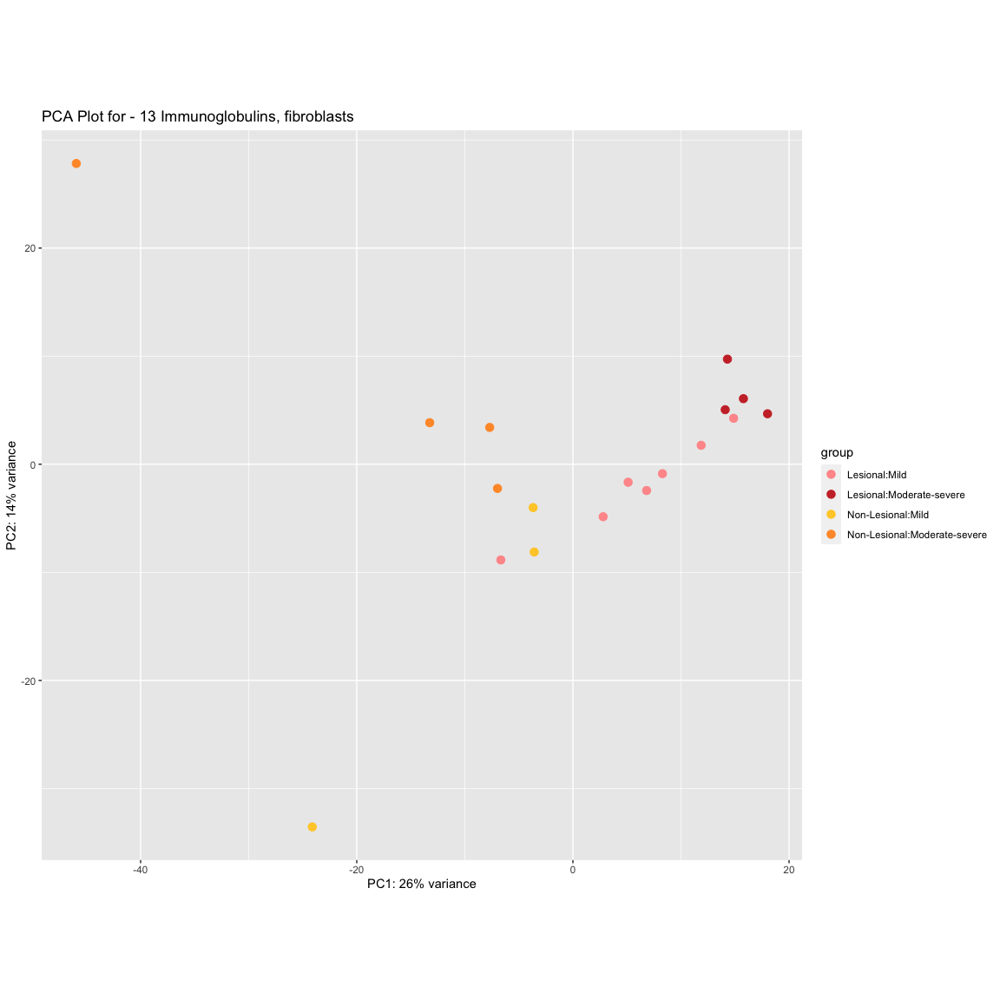
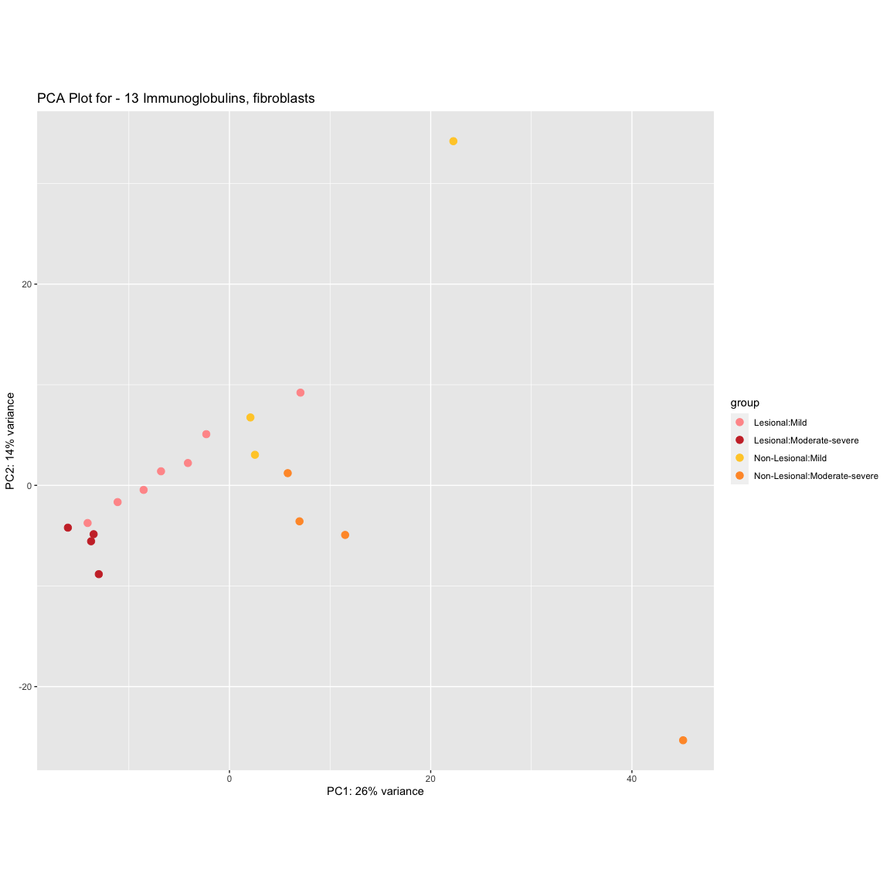
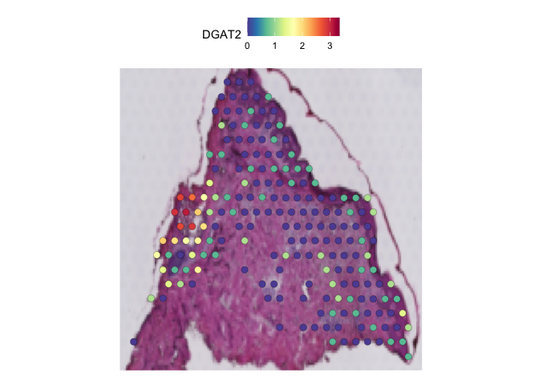
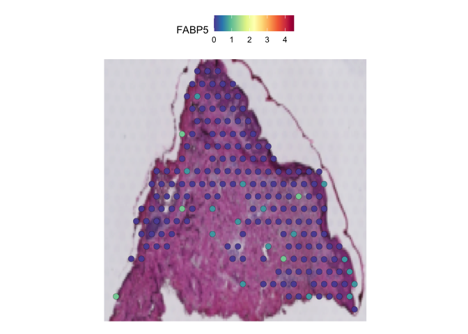
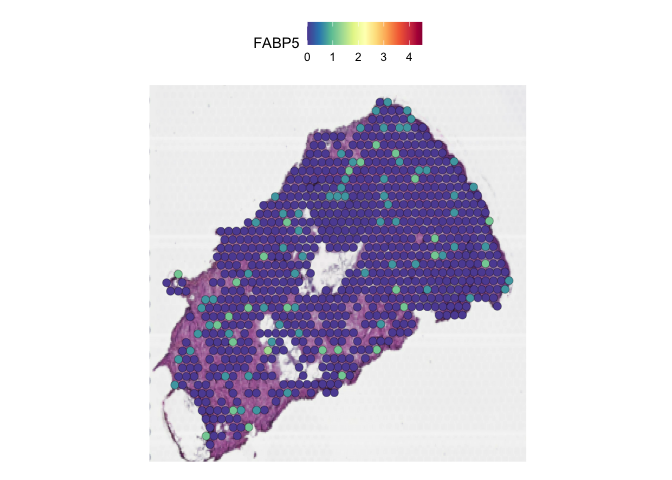

PS SAMPLES PART 4
================

## PSEUDO-BULK ANALYSIS

### *DIFFERENTIAL TESTING BETWEEN CONDITIONS - LESIONAL, NON-LESIONAL AND HEALTHY*

| FIGURE NO | DESCRIPTION                                                | LINK                                                                                |
|-----------|------------------------------------------------------------|-------------------------------------------------------------------------------------|
| 6A        | Hierarchical clustering based heatmap for all samples      | [FIGURE 6A](#figure-6a)                                                             |
| 6B        | PCA plot for all samples - grouped by PS group             | [FIGURE 6B / 6C](#figure-6b-6c)                                                     |
| 6C        | PCA plot for all samples - grouped by Disease severity     | [FIGURE 6B / 6C](#figure-6b-6c)                                                     |
| 8A        | PCA plot for - Cluster 1 (Dermis macrophages, fibroblasts) | [FIGURE 8A and 8B](#figure-8a-and-8b)                                               |
| 8B        | PCA plot for - Cluster 12 (Dermis lymphatics)              | [FIGURE 8A and 8B](#figure-8a-and-8b)                                               |
| 8E        | Spatial Feature plots for DE genes of interest \#1         | [FIGURE 8E](#figure-8e)                                                             |
| S9        | Dendogram for all samples                                  | [FIGURE S9](#figure-s9-1)                                                           |
| S10       | PCA plots - per cluster basis (PS samples only)            | [CLUSTER SPECIFIC (PSEUDO-BULK) PCA-plots](#cluster-specific-pseudo-bulk-pca-plots) |
| S13       | Spatial Feature plots for DE genes of interest \#2         | [FIGURE S13](#figure-s13)                                                           |

### LOAD PACKAGES

``` r
library(DESeq2)
```

    ## Loading required package: S4Vectors

    ## Warning: package 'S4Vectors' was built under R version 4.1.3

    ## Loading required package: stats4

    ## Loading required package: BiocGenerics

    ## Warning: package 'BiocGenerics' was built under R version 4.1.1

    ## 
    ## Attaching package: 'BiocGenerics'

    ## The following objects are masked from 'package:stats':
    ## 
    ##     IQR, mad, sd, var, xtabs

    ## The following objects are masked from 'package:base':
    ## 
    ##     anyDuplicated, append, as.data.frame, basename, cbind, colnames,
    ##     dirname, do.call, duplicated, eval, evalq, Filter, Find, get, grep,
    ##     grepl, intersect, is.unsorted, lapply, Map, mapply, match, mget,
    ##     order, paste, pmax, pmax.int, pmin, pmin.int, Position, rank,
    ##     rbind, Reduce, rownames, sapply, setdiff, sort, table, tapply,
    ##     union, unique, unsplit, which.max, which.min

    ## 
    ## Attaching package: 'S4Vectors'

    ## The following objects are masked from 'package:base':
    ## 
    ##     expand.grid, I, unname

    ## Loading required package: IRanges

    ## Warning: package 'IRanges' was built under R version 4.1.1

    ## Loading required package: GenomicRanges

    ## Warning: package 'GenomicRanges' was built under R version 4.1.2

    ## Loading required package: GenomeInfoDb

    ## Warning: package 'GenomeInfoDb' was built under R version 4.1.2

    ## Loading required package: SummarizedExperiment

    ## Warning: package 'SummarizedExperiment' was built under R version 4.1.1

    ## Loading required package: MatrixGenerics

    ## Warning: package 'MatrixGenerics' was built under R version 4.1.1

    ## Loading required package: matrixStats

    ## Warning: package 'matrixStats' was built under R version 4.1.2

    ## 
    ## Attaching package: 'MatrixGenerics'

    ## The following objects are masked from 'package:matrixStats':
    ## 
    ##     colAlls, colAnyNAs, colAnys, colAvgsPerRowSet, colCollapse,
    ##     colCounts, colCummaxs, colCummins, colCumprods, colCumsums,
    ##     colDiffs, colIQRDiffs, colIQRs, colLogSumExps, colMadDiffs,
    ##     colMads, colMaxs, colMeans2, colMedians, colMins, colOrderStats,
    ##     colProds, colQuantiles, colRanges, colRanks, colSdDiffs, colSds,
    ##     colSums2, colTabulates, colVarDiffs, colVars, colWeightedMads,
    ##     colWeightedMeans, colWeightedMedians, colWeightedSds,
    ##     colWeightedVars, rowAlls, rowAnyNAs, rowAnys, rowAvgsPerColSet,
    ##     rowCollapse, rowCounts, rowCummaxs, rowCummins, rowCumprods,
    ##     rowCumsums, rowDiffs, rowIQRDiffs, rowIQRs, rowLogSumExps,
    ##     rowMadDiffs, rowMads, rowMaxs, rowMeans2, rowMedians, rowMins,
    ##     rowOrderStats, rowProds, rowQuantiles, rowRanges, rowRanks,
    ##     rowSdDiffs, rowSds, rowSums2, rowTabulates, rowVarDiffs, rowVars,
    ##     rowWeightedMads, rowWeightedMeans, rowWeightedMedians,
    ##     rowWeightedSds, rowWeightedVars

    ## Loading required package: Biobase

    ## Warning: package 'Biobase' was built under R version 4.1.1

    ## Welcome to Bioconductor
    ## 
    ##     Vignettes contain introductory material; view with
    ##     'browseVignettes()'. To cite Bioconductor, see
    ##     'citation("Biobase")', and for packages 'citation("pkgname")'.

    ## 
    ## Attaching package: 'Biobase'

    ## The following object is masked from 'package:MatrixGenerics':
    ## 
    ##     rowMedians

    ## The following objects are masked from 'package:matrixStats':
    ## 
    ##     anyMissing, rowMedians

``` r
library(Seurat)
```

    ## Warning: package 'Seurat' was built under R version 4.1.2

    ## Attaching SeuratObject

    ## Attaching sp

    ## 
    ## Attaching package: 'Seurat'

    ## The following object is masked from 'package:SummarizedExperiment':
    ## 
    ##     Assays

``` r
library(tidyverse)
```

    ## Warning: package 'tidyverse' was built under R version 4.1.2

    ## ── Attaching packages
    ## ───────────────────────────────────────
    ## tidyverse 1.3.2 ──

    ## ✔ ggplot2 3.4.0      ✔ purrr   0.3.5 
    ## ✔ tibble  3.1.8      ✔ dplyr   1.0.10
    ## ✔ tidyr   1.2.1      ✔ stringr 1.4.1 
    ## ✔ readr   2.1.3      ✔ forcats 0.5.2

    ## Warning: package 'ggplot2' was built under R version 4.1.2

    ## Warning: package 'tibble' was built under R version 4.1.2

    ## Warning: package 'tidyr' was built under R version 4.1.2

    ## Warning: package 'readr' was built under R version 4.1.2

    ## Warning: package 'purrr' was built under R version 4.1.2

    ## Warning: package 'dplyr' was built under R version 4.1.2

    ## Warning: package 'stringr' was built under R version 4.1.2

    ## Warning: package 'forcats' was built under R version 4.1.2

    ## ── Conflicts ────────────────────────────────────────── tidyverse_conflicts() ──
    ## ✖ dplyr::collapse()   masks IRanges::collapse()
    ## ✖ dplyr::combine()    masks Biobase::combine(), BiocGenerics::combine()
    ## ✖ dplyr::count()      masks matrixStats::count()
    ## ✖ dplyr::desc()       masks IRanges::desc()
    ## ✖ tidyr::expand()     masks S4Vectors::expand()
    ## ✖ dplyr::filter()     masks stats::filter()
    ## ✖ dplyr::first()      masks S4Vectors::first()
    ## ✖ dplyr::lag()        masks stats::lag()
    ## ✖ ggplot2::Position() masks BiocGenerics::Position(), base::Position()
    ## ✖ purrr::reduce()     masks GenomicRanges::reduce(), IRanges::reduce()
    ## ✖ dplyr::rename()     masks S4Vectors::rename()
    ## ✖ dplyr::slice()      masks IRanges::slice()

``` r
library(RColorBrewer)
```

    ## Warning: package 'RColorBrewer' was built under R version 4.1.2

``` r
library(pheatmap)
```

### LOAD HELPER FUNCTIONS

``` r
source("../SPATIAL_FUNCTIONS.R")
```

    ## Warning: package 'reticulate' was built under R version 4.1.2

    ## Warning: package 'clusterProfiler' was built under R version 4.1.1

    ## 

    ## Registered S3 method overwritten by 'ggtree':
    ##   method      from 
    ##   identify.gg ggfun

    ## clusterProfiler v4.0.5  For help: https://yulab-smu.top/biomedical-knowledge-mining-book/
    ## 
    ## If you use clusterProfiler in published research, please cite:
    ## T Wu, E Hu, S Xu, M Chen, P Guo, Z Dai, T Feng, L Zhou, W Tang, L Zhan, X Fu, S Liu, X Bo, and G Yu. clusterProfiler 4.0: A universal enrichment tool for interpreting omics data. The Innovation. 2021, 2(3):100141. doi: 10.1016/j.xinn.2021.100141

    ## 
    ## Attaching package: 'clusterProfiler'

    ## The following object is masked from 'package:purrr':
    ## 
    ##     simplify

    ## The following object is masked from 'package:IRanges':
    ## 
    ##     slice

    ## The following object is masked from 'package:S4Vectors':
    ## 
    ##     rename

    ## The following object is masked from 'package:stats':
    ## 
    ##     filter

    ## Loading required package: AnnotationDbi

    ## 
    ## Attaching package: 'AnnotationDbi'

    ## The following object is masked from 'package:clusterProfiler':
    ## 
    ##     select

    ## The following object is masked from 'package:dplyr':
    ## 
    ##     select

    ## 

### LOAD DATA

``` r
# 1. All Spatial Samples with Harmony Batch Correction
skin_data.hm.sct <- readRDS(file = "/Volumes/Extreme Pro/GITHUB-DATA//ST-DATA/PSORIASIS-DATA/RDS-Files/ALL_SPATIAL_SAMPLES(HM_BATCH_CORRECTED).RDS")

# 2. All Spatial Samples Sample ID Meta Data
meta.data <- read.csv("/Volumes/Extreme Pro/GITHUB-DATA//ST-DATA/PSORIASIS-DATA/Meta-Data/all_skin_corrected.meta.data.csv")
skin_data.hm.sct$sample.id <- meta.data$sample.id
```

### RE-NORMALIZING TO REGRESS OUT BATCH

``` r
skin_data.hm.sct_re_normalized <- SCTransform(skin_data.hm.sct,assay = "Spatial", new.assay.name ="SCT_BATCH_REGRESSED", vars.to.regress = c("sample.id"))
```

    ## Calculating cell attributes from input UMI matrix: log_umi

    ## Variance stabilizing transformation of count matrix of size 21901 by 16424

    ## Model formula is y ~ log_umi

    ## Get Negative Binomial regression parameters per gene

    ## Using 2000 genes, 5000 cells

    ##   |                                                                              |                                                                      |   0%  |                                                                              |==================                                                    |  25%  |                                                                              |===================================                                   |  50%  |                                                                              |====================================================                  |  75%  |                                                                              |======================================================================| 100%

    ## Found 70 outliers - those will be ignored in fitting/regularization step

    ## Second step: Get residuals using fitted parameters for 21901 genes

    ##   |                                                                              |                                                                      |   0%  |                                                                              |==                                                                    |   2%  |                                                                              |===                                                                   |   5%  |                                                                              |=====                                                                 |   7%  |                                                                              |======                                                                |   9%  |                                                                              |========                                                              |  11%  |                                                                              |==========                                                            |  14%  |                                                                              |===========                                                           |  16%  |                                                                              |=============                                                         |  18%  |                                                                              |==============                                                        |  20%  |                                                                              |================                                                      |  23%  |                                                                              |==================                                                    |  25%  |                                                                              |===================                                                   |  27%  |                                                                              |=====================                                                 |  30%  |                                                                              |======================                                                |  32%  |                                                                              |========================                                              |  34%  |                                                                              |=========================                                             |  36%  |                                                                              |===========================                                           |  39%  |                                                                              |=============================                                         |  41%  |                                                                              |==============================                                        |  43%  |                                                                              |================================                                      |  45%  |                                                                              |=================================                                     |  48%  |                                                                              |===================================                                   |  50%  |                                                                              |=====================================                                 |  52%  |                                                                              |======================================                                |  55%  |                                                                              |========================================                              |  57%  |                                                                              |=========================================                             |  59%  |                                                                              |===========================================                           |  61%  |                                                                              |=============================================                         |  64%  |                                                                              |==============================================                        |  66%  |                                                                              |================================================                      |  68%  |                                                                              |=================================================                     |  70%  |                                                                              |===================================================                   |  73%  |                                                                              |====================================================                  |  75%  |                                                                              |======================================================                |  77%  |                                                                              |========================================================              |  80%  |                                                                              |=========================================================             |  82%  |                                                                              |===========================================================           |  84%  |                                                                              |============================================================          |  86%  |                                                                              |==============================================================        |  89%  |                                                                              |================================================================      |  91%  |                                                                              |=================================================================     |  93%  |                                                                              |===================================================================   |  95%  |                                                                              |====================================================================  |  98%  |                                                                              |======================================================================| 100%

    ## Computing corrected count matrix for 21901 genes

    ##   |                                                                              |                                                                      |   0%  |                                                                              |==                                                                    |   2%  |                                                                              |===                                                                   |   5%  |                                                                              |=====                                                                 |   7%  |                                                                              |======                                                                |   9%  |                                                                              |========                                                              |  11%  |                                                                              |==========                                                            |  14%  |                                                                              |===========                                                           |  16%  |                                                                              |=============                                                         |  18%  |                                                                              |==============                                                        |  20%  |                                                                              |================                                                      |  23%  |                                                                              |==================                                                    |  25%  |                                                                              |===================                                                   |  27%  |                                                                              |=====================                                                 |  30%  |                                                                              |======================                                                |  32%  |                                                                              |========================                                              |  34%  |                                                                              |=========================                                             |  36%  |                                                                              |===========================                                           |  39%  |                                                                              |=============================                                         |  41%  |                                                                              |==============================                                        |  43%  |                                                                              |================================                                      |  45%  |                                                                              |=================================                                     |  48%  |                                                                              |===================================                                   |  50%  |                                                                              |=====================================                                 |  52%  |                                                                              |======================================                                |  55%  |                                                                              |========================================                              |  57%  |                                                                              |=========================================                             |  59%  |                                                                              |===========================================                           |  61%  |                                                                              |=============================================                         |  64%  |                                                                              |==============================================                        |  66%  |                                                                              |================================================                      |  68%  |                                                                              |=================================================                     |  70%  |                                                                              |===================================================                   |  73%  |                                                                              |====================================================                  |  75%  |                                                                              |======================================================                |  77%  |                                                                              |========================================================              |  80%  |                                                                              |=========================================================             |  82%  |                                                                              |===========================================================           |  84%  |                                                                              |============================================================          |  86%  |                                                                              |==============================================================        |  89%  |                                                                              |================================================================      |  91%  |                                                                              |=================================================================     |  93%  |                                                                              |===================================================================   |  95%  |                                                                              |====================================================================  |  98%  |                                                                              |======================================================================| 100%

    ## Calculating gene attributes

    ## Wall clock passed: Time difference of 2.460073 mins

    ## Determine variable features

    ## Place corrected count matrix in counts slot

    ## Regressing out sample.id

    ## Centering data matrix

    ## Warning: Keys should be one or more alphanumeric characters followed by an
    ## underscore, setting key from sct_batch_regressed_ to sctbatchregressed_

    ## Set default assay to SCT_BATCH_REGRESSED

### IDENTIFY DE GENES - LESIONAL VS HEALTHY

``` r
LES_vs_HEALTHY_v1 <- FindMarkers(skin_data.hm.sct_re_normalized, group.by = "DISEASE_STATUS", ident.1 = "Lesional", ident.2 = "Healthy skin")
LES_vs_HEALTHY_v2  <- FindMarkers(skin_data.hm.sct_re_normalized, group.by = "DISEASE_STATUS", ident.1 = "Lesional", ident.2 = "Healthy skin")

NON_LES_vs_HEALTHY <- FindMarkers(skin_data.hm.sct_re_normalized, group.by = "DISEASE_STATUS", ident.1 = "Non-Lesional", ident.2 = "Healthy skin")
LES_VS_NON_LES <- FindMarkers(skin_data.hm.sct_re_normalized, group.by = "DISEASE_STATUS", ident.1 = "Lesional", ident.2 = "Non-Lesional")
```

## PSEUDO-BULK APPROACH

### Get Pseudocounts & View Summary

``` r
# Get Pseudo counts group in by sample.id
pseudo.counts <- Seurat:::PseudobulkExpression(object = skin_data.hm.sct, assays = "Spatial", group.by = "sample.id", slot = "counts", pb.method = "aggregate") 

# Pseudo Counts Data Frame
pseudo.counts.df <- as.data.frame(pseudo.counts$Spatial)

# View Summary of pseudo-counts
summary(colSums(pseudo.counts$Spatial))
```

    ##     Min.  1st Qu.   Median     Mean  3rd Qu.     Max. 
    ##   211576   963567  1826699  2826222  4051790 10120020

### Read & Process colData (Counts Meta Data)

``` r
# Read Pseudo-Bulk Meta Data, Filter Empty Sample IDs, & combine Group_1 & Severity into DISEASE_and_SEVERITY column
groups.table <- read.csv(file="/Volumes/Extreme Pro/GITHUB-DATA//ST-DATA/PSORIASIS-DATA/Pseudo-Bulk-Data/groups.table.csv", stringsAsFactors = TRUE) %>% 
  filter(Sample.ID!="") %>%
  column_to_rownames("Sample.ID") %>%
  unite("DISEASE_and_SEVERITY", "GROUP_I", "SEVERITY", sep = "_", remove = FALSE, na.rm = FALSE)

# Add Sample IDs to be Sample.ID Column also
groups.table['Sample.ID'] <- rownames(groups.table)
```

### Match Counts Data Columns with colData rows

These need to be in the exact same order to create a DESeq2 Object

``` r
# Match Samples (rownames) to be in same order as counts column names
groups.table <- groups.table[match(colnames(pseudo.counts.df), rownames(groups.table)),]
```

# DESeq Workflow

## 1. Create DESeq Object & Run DESeq2

``` r
# 1. Create DESeq Object
dds <- DESeqDataSetFromMatrix(countData = pseudo.counts.df, colData=groups.table, design = ~ BATCH + GROUP_I)

#2. Collapse Replicates
dds <- collapseReplicates(dds,groupby = dds$Sample.group)

#3. Run DESeq2
dds <- DESeq(dds, quiet = TRUE)
```

## 2. Generate Transformed Counts for Downstream Analysis

``` r
# 1. Get Normalized Counts
normalized.counts <- counts(dds, normalized=TRUE)
colSums(normalized.counts)
```

    ## 4305-006.1 4305-006.2        HV1        HV2        HV3    ST-13 L   ST-13 NL 
    ##    2412625    2502846    2143087    1853342    2043985    3890702    2098460 
    ##    ST-14 L   ST-14 NL    ST-15 L   ST-15 NL    ST-16 L   ST-16 NL    ST-17 L 
    ##    2253164    2209078    3113652    2171831    3567068    2133936    2670300 
    ##   ST-17 NL    ST-18-L   ST-18-NL    ST-20 L   ST-20-NL    ST-21 L   ST-21 NL 
    ##    2454333    2859352    2237288    2448362    2003432    3069982    2201583 
    ##    ST-22-L   ST-22-NL 
    ##    2208021    1989692

``` r
# 2. Variance Stabilized Transformation (VST) Object
dds.vst <- vst(dds, blind=TRUE)
```

### FIGURE 6B / 6C

PCA plots showing clustering of samples based on disease group and
severity / PASI score.

``` r
# 1. PCA Plot grouping Skin Sample Type & Disease Status
#pdf("ALL_SAMPLES_PCA_PLOT_(GROUPED_BY_STATUS).pdf",height = 8,width = 10)
plotPCA(dds.vst, intgroup=c("GROUP_I", "GROUP_II")) + 
  scale_color_manual(values=c("dimgray","#cc3333","#ffcc33","#ff9999","#ff9933"))
```

<!-- -->

``` r
#dev.off()

# 2. PCA Plot Grouped by DISEASE_and_SEVERITY scaled by PASI score
pcaData <- plotPCA(dds.vst, intgroup=c("SEVERITY", "PASI_SCORE", "DISEASE_and_SEVERITY", "Sample.group"), returnData=TRUE)
percentVar <- round(100 * attr(pcaData, "percentVar"))

#pdf("ALL_SAMPLES_PCA_PLOT.pdf",height = 8,width = 10)
ggplot(pcaData, aes(PC1, PC2, fill = PASI_SCORE, shape = DISEASE_and_SEVERITY)) +
  geom_point(size=3) +
  xlab(paste0("PC1: ", percentVar[1], "% variance")) +
  ylab(paste0("PC2: ", percentVar[2], "% variance")) + 
  coord_fixed() +
  scale_shape_manual(values=c(21,22,23,24,25))
```

<!-- -->

``` r
#dev.off()
```

``` r
# 3. PCA Plot by DISEASE_and_SEVERITY Labeled Samples
#pdf("ALL_SAMPLES_PCA_PLOT(WITH_SAMPLE_IDS).pdf",height = 10,width = 15 )
ggplot(pcaData, aes(PC1, PC2,label=Sample.group)) +
  geom_point(size=3,mapping = aes(color=DISEASE_and_SEVERITY)) +
  xlab(paste0("PC1: ",percentVar[1],"% variance")) +
  ylab(paste0("PC2: ",percentVar[2],"% variance")) + 
  coord_fixed() + geom_text(hjust=0.5, vjust=0) + 
  scale_color_manual(values=c("dimgray","#cc3333","#ffcc33","#ff9999","#ff9933"))
```

<!-- -->

``` r
#dev.off()
```

### FIGURE 6A

### Hierarchical Clustering - Samples cluster by disease severity not systemic co-morbidity

``` r
sampleDists <- dist(t(assay(dds.vst)))
sampleDistMatrix <- as.matrix(sampleDists)

rownames(sampleDistMatrix) <- paste(dds.vst$GROUP_I, dds.vst$SEVERITY,dds.vst$GROUP_II,dds.vst$Sample.group, sep="-")
colnames(sampleDistMatrix) <- NULL

colors <- colorRampPalette(brewer.pal(9, "RdYlBu")) (255)

pdf("HC_WITH_HEATMAP.pdf",height = 15,width = 15)
print(pheatmap(sampleDistMatrix,
         clustering_distance_rows=sampleDists,
         clustering_distance_cols=sampleDists,
         col=colors))
dev.off()
```

    ## pdf 
    ##   3

### FIGURE S9

## DENDOGRAM

``` r
hc <- hclust(sampleDists)

## Printing dendogram with - Disease Severity
print(plot(hc, labels=paste(dds.vst$GROUP_I, dds.vst$SEVERITY, dds.vst$GROUP_II,dds.vst$PASI_SCORE, sep = ":")))
```

<!-- -->

    ## NULL

``` r
## Printing Dendogram - with sample ids
#pdf("DENDOGRAM-WITH-SAMPLE-IDS(UPDATED_V1).pdf",height = 14,width=10)
plot(hc, labels=paste(dds.vst$GROUP_I, dds.vst$Sample.group, dds.vst$GROUP_II,dds.vst$PASI_SCORE, sep = ":"))
```

<!-- -->

``` r
#dev.off() 
```

### Figure S9

### CLUSTER SPECIFIC (PSEUDO-BULK) PCA-plots

#### PART 1

``` r
# 1. All Cluster Labels
cluster.labels <- unique(skin_data.hm.sct@meta.data$Spatial.regions) %>% 
  as.vector() %>% 
  sort(decreasing = TRUE)

# 2. Cluster Labels for Specific Groups of Interest
cluster.labels.filtered <- c("9 Adipose","10 Suprabasal keratinocytes","11 Smooth muscle","12 Endothelial cells","13 Immunoglobulins, fibroblasts","14 Smooth muscle","15 Mixed","16 Adipose, fibroblasts")
```

``` r
# 1. File Path for Groups Table CSV
groups.tbl.path <- "/Volumes/Extreme Pro/GITHUB-DATA//ST-DATA/PSORIASIS-DATA/Pseudo-Bulk-Data/groups.table.csv"

dir.create("PSEUDO_BULK_OUTPUT/ALL_PS_SAMPLES/")

for(x in cluster.labels){
  subset.data <- subset(skin_data.hm.sct,Spatial.regions %in% c(x))
  dds <- pseudo_bulk_out(subset.data, group_label = "sample.id", groups_tbl_path = groups.tbl.path)
  if(!is.null(dds)){
    tryCatch({
      dds.vst <- vst(dds, blind=TRUE,nsub = 100)
      
      # ALL PSORIASIS SAMPLES
      dds.vst_subset <- dds.vst[ ,dds.vst$GROUP_I %in% c("Lesional","Non-Lesional")]
      
      ## PCA PLOT
      #pdf(file=paste("PSEUDO_BULK_OUTPUT/ALL_PS_SAMPLES/",x,"_PCA_PLOT_PSEUDOBULK_ALL_SAMPLES.pdf"),height = 8,width = 10)
      print(plotPCA(dds.vst_subset, intgroup=c("GROUP_I", "SEVERITY"))+ ggtitle(paste("PCA Plot for -",x)) + 
              scale_color_manual(values=c("#ff9999","#cc3333","#ffcc33","#ff9933")))
      #dev.off()
      
    }, error=function(e){ skip_to_next <<- TRUE})
  }
}
```

<!-- --><!-- --><!-- --><!-- --><!-- --><!-- --><!-- --><!-- --><!-- --><!-- --><!-- --><!-- --><!-- --><!-- --><!-- --><!-- --><!-- -->

#### PART-2

``` r
dir.create("PSEUDO_BULK_OUTPUT/ALL_SAMPLES")
for(x in cluster.labels.filtered) {
  subset.data <- subset(skin_data.hm.sct,Spatial.regions %in% c(x))
  dds <- pseudo_bulk_out(subset.data,group_label = "sample.id", groups_tbl_path = groups.tbl.path)
  dds <- collapseReplicates(dds,groupby = dds$Sample.group)

  if(!is.null(dds)){
    tryCatch({
      dds.vst <- vst(dds, blind=TRUE,nsub = 100)
      normalized.counts <- counts(dds, normalized=TRUE)
      
      # ONLY PSORIASIS SAMPLES
      dds.vst_subset <- dds.vst[ ,dds.vst$GROUP_I %in% c("Lesional","Non-Lesional")]
      
      ## PCA PLOT
      #pdf(file=paste("PSEUDO_BULK_OUTPUT/ALL_SAMPLES/",x,"_PCA_PLOT_PSEUDOBULK_ALL_SAMPLES.pdf"),height = 8,width = 10)
      print(plotPCA(dds.vst_subset, intgroup=c("GROUP_I", "SEVERITY"))+ ggtitle(paste("PCA Plot for -",x)) +
              scale_color_manual(values=c("#ff9999","#cc3333","#ffcc33","#ff9933"))) 
      #dev.off()
      
    }, error=function(e){ skip_to_next <<- TRUE})
  }
}
```

<!-- --><!-- --><!-- --><!-- --><!-- --><!-- --><!-- --><!-- -->

### FIGURE 8A and 8B

``` r
subset.data <- subset(skin_data.hm.sct,Spatial.regions %in% c("1 Macs + fibroblasts"))

dds <- pseudo_bulk_out(subset.data,group_label = "sample.id", groups_tbl_path = groups.tbl.path)
dds <- collapseReplicates(dds,groupby = dds$Sample.group)

dds.vst <- vst(dds, blind=TRUE, nsub = 100)

# ALL PSORIASIS SAMPLES
dds.vst_subset_2 <- dds.vst[,dds.vst$GROUP_I %in% c("Lesional","Non-Lesional")]
#pdf(file=paste("PSEUDO_BULK_OUTPUT/ALL_PS_SAMPLES/","1 Macs + fibroblasts","_PCA_PLOT_PSEUDOBULK_ALL_SAMPLES(WITH_LABELS)(V2).pdf"),height = 8,width = 10)
plotPCA(dds.vst_subset_2, intgroup=c("GROUP_I", "SEVERITY")) + geom_text(label = dds.vst_subset_2$PASI_SCORE,nudge_x = 0.50, nudge_y = 1) + scale_color_manual(values=c("#ff9999","#cc3333","#ffcc33","#ff9933"))
```

<!-- -->

``` r
#dev.off()

#12 Endothelial cells
subset.data <- subset(skin_data.hm.sct,Spatial.regions %in% c("12 Endothelial cells"))
dds <- pseudo_bulk_out(subset.data,group_label = "sample.id", groups_tbl_path = groups.tbl.path)
dds <- collapseReplicates(dds,groupby = dds$Sample.group)

dds.vst <- vst(dds, blind=TRUE,nsub = 100)

# ALL PSORIASIS SAMPLES
dds.vst_subset_2 <- dds.vst[ ,dds.vst$GROUP_I %in% c("Lesional","Non-Lesional")]

#pdf(file=paste("PSEUDO_BULK_OUTPUT/ALL_PS_SAMPLES/","12 Endothelial cells","_PCA_PLOT_PSEUDOBULK_ALL_SAMPLES(WITH_LABELS)(V2).pdf"),height = 8,width = 10)
plotPCA(dds.vst_subset_2, intgroup=c("GROUP_I", "SEVERITY")) + geom_text(label = dds.vst_subset_2$PASI_SCORE,nudge_x = 0.50, nudge_y = 1)  + scale_color_manual(values=c("#ff9999","#cc3333","#ffcc33","#ff9933"))
```

<!-- -->

``` r
#dev.off()
```

### FIGURE 8E

### GENE / FEATURE EXPRESSION PLOTS

``` r
DefaultAssay(skin_data.hm.sct) <- "SCT"

SpatialColors <- colorRampPalette(colors = rev(x = brewer.pal(n = 11, name = "Spectral")))
cols <- SpatialColors(n = 100)

## SPATIAL GENE EXPRESSION PLOTS - CHOOSING SPECIFIC SAMPLES
images <- c("ST.HF.1.R2","ST_16_L_Batch_1","ST_16_NL_Batch_1","ST_22L_Batch_8","ST_21_L_Batch_6","ST_18_NL_Batch_4","ST_21_NL_Batch_6")

## GENES SELECTED FROM DE TEST BETWEEN
for(y in images){
  #pdf(file = paste("FEATURE_PLOTS/",y,"_GENE_EXPRESSION_","DGAT2",".pdf"),width = 10,height = 15)
  print(SpatialFeaturePlot(skin_data.hm.sct, features = c("DGAT2"), pt.size.factor = 2.5, crop = TRUE,images = y)+ scale_fill_gradientn(colors=cols,limits = c(0,3.35)))
  #dev.off()
}
```

    ## Scale for fill is already present.
    ## Adding another scale for fill, which will replace the existing scale.
    ## Scale for fill is already present.
    ## Adding another scale for fill, which will replace the existing scale.

<!-- -->

    ## Scale for fill is already present.
    ## Adding another scale for fill, which will replace the existing scale.

<!-- -->

    ## Scale for fill is already present.
    ## Adding another scale for fill, which will replace the existing scale.

<!-- -->

    ## Scale for fill is already present.
    ## Adding another scale for fill, which will replace the existing scale.

<!-- -->

    ## Scale for fill is already present.
    ## Adding another scale for fill, which will replace the existing scale.

<!-- -->

    ## Scale for fill is already present.
    ## Adding another scale for fill, which will replace the existing scale.

<!-- --><!-- -->

``` r
for(y in images){
  #pdf(file = paste("FEATURE_PLOTS/",y,"_GENE_EXPRESSION_","FGFR3",".pdf"),width = 10,height = 15)
  print(SpatialFeaturePlot(skin_data.hm.sct, features = c("FGFR3"), pt.size.factor = 2.5, crop = TRUE,images = y)+ scale_fill_gradientn(colors=cols,limits = c(0,1.8)))
  #dev.off()
}
```

    ## Scale for fill is already present.
    ## Adding another scale for fill, which will replace the existing scale.
    ## Scale for fill is already present.
    ## Adding another scale for fill, which will replace the existing scale.

<!-- -->

    ## Scale for fill is already present.
    ## Adding another scale for fill, which will replace the existing scale.

<!-- -->

    ## Scale for fill is already present.
    ## Adding another scale for fill, which will replace the existing scale.

<!-- -->

    ## Scale for fill is already present.
    ## Adding another scale for fill, which will replace the existing scale.

<!-- -->

    ## Scale for fill is already present.
    ## Adding another scale for fill, which will replace the existing scale.

<!-- -->

    ## Scale for fill is already present.
    ## Adding another scale for fill, which will replace the existing scale.

<!-- --><!-- -->

### FIGURE S13

### ADDTIONAL GENE / FEATURE EXPRESSION PLOTS

``` r
for(y in images){
  #pdf(file = paste("FEATURE_PLOTS/",y,"_GENE_EXPRESSION_","FABP5",".pdf"),width = 10,height = 15)
  print(SpatialFeaturePlot(skin_data.hm.sct, features = c("FABP5"), pt.size.factor = 2.5, crop = TRUE,images = y)+ scale_fill_gradientn(colors=cols,limits = c(0,4.5)))
  #dev.off()
}
```

    ## Scale for fill is already present.
    ## Adding another scale for fill, which will replace the existing scale.
    ## Scale for fill is already present.
    ## Adding another scale for fill, which will replace the existing scale.

<!-- -->

    ## Scale for fill is already present.
    ## Adding another scale for fill, which will replace the existing scale.

<!-- -->

    ## Scale for fill is already present.
    ## Adding another scale for fill, which will replace the existing scale.

<!-- -->

    ## Scale for fill is already present.
    ## Adding another scale for fill, which will replace the existing scale.

<!-- -->

    ## Scale for fill is already present.
    ## Adding another scale for fill, which will replace the existing scale.

<!-- -->

    ## Scale for fill is already present.
    ## Adding another scale for fill, which will replace the existing scale.

<!-- --><!-- -->

``` r
for(y in images){
  #pdf(file = paste("FEATURE_PLOTS/",y,"_GENE_EXPRESSION_","FADS2",".pdf"),width = 10,height = 15)
  print(SpatialFeaturePlot(skin_data.hm.sct, features = c("FADS2"), pt.size.factor = 2.5, crop = TRUE,images = y)+ scale_fill_gradientn(colors=cols,limits = c(0,4.5)))
  #dev.off()
}
```

    ## Scale for fill is already present.
    ## Adding another scale for fill, which will replace the existing scale.
    ## Scale for fill is already present.
    ## Adding another scale for fill, which will replace the existing scale.

<!-- -->

    ## Scale for fill is already present.
    ## Adding another scale for fill, which will replace the existing scale.

<!-- -->

    ## Scale for fill is already present.
    ## Adding another scale for fill, which will replace the existing scale.

<!-- -->

    ## Scale for fill is already present.
    ## Adding another scale for fill, which will replace the existing scale.

<!-- -->

    ## Scale for fill is already present.
    ## Adding another scale for fill, which will replace the existing scale.

<!-- -->

    ## Scale for fill is already present.
    ## Adding another scale for fill, which will replace the existing scale.

<!-- --><!-- -->

``` r
for(y in images){
  #pdf(file = paste("FEATURE_PLOTS/",y,"_GENE_EXPRESSION_","SERPINB4",".pdf"),width = 10,height = 15)
  print(SpatialFeaturePlot(skin_data.hm.sct, features = c("SERPINB4"), pt.size.factor = 2.5, crop = TRUE,images = y))
  #dev.off()
}
```

<!-- --><!-- --><!-- --><!-- --><!-- --><!-- --><!-- -->
