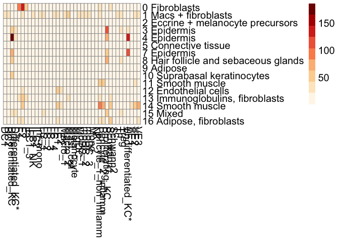

# PS SAMPLES PART 5

## PSORIASIS SAMPLES - CONTINUED - PART 5

## PSO + PSA + NORMAL SKIN COMBINED ANALYSIS

## Integration with PS skin scRNA data from (dataset 2) Reynolds et al.

## (DOI - <https://doi.org/10.1126/science.aba6500>).

| LINK / FIG NO             | DESCRIPTION                                         |
|---------------------------|-----------------------------------------------------|
| [FIGURE S9C](#figure-s9c) | UMAP for (PS only) dataset 2                        |
| [FIGURE 5B](#figure-5b)   | MIA for (PS only) dataset 2 - Immune cell types     |
| [FIGURE S9E](#figure-s9e) | MIA for (PS only) dataset 2 - Structural cell types |

### LOAD ALL PACKAGES

``` r
library(tidyverse)
```

    ## Warning: package 'tidyverse' was built under R version 4.1.2

    ## ── Attaching packages ─────────────────────────────────────── tidyverse 1.3.2 ──
    ## ✔ ggplot2 3.4.0      ✔ purrr   0.3.5 
    ## ✔ tibble  3.1.8      ✔ dplyr   1.0.10
    ## ✔ tidyr   1.2.1      ✔ stringr 1.4.1 
    ## ✔ readr   2.1.3      ✔ forcats 0.5.2

    ## Warning: package 'ggplot2' was built under R version 4.1.2

    ## Warning: package 'tibble' was built under R version 4.1.2

    ## Warning: package 'tidyr' was built under R version 4.1.2

    ## Warning: package 'readr' was built under R version 4.1.2

    ## Warning: package 'purrr' was built under R version 4.1.2

    ## Warning: package 'dplyr' was built under R version 4.1.2

    ## Warning: package 'stringr' was built under R version 4.1.2

    ## Warning: package 'forcats' was built under R version 4.1.2

    ## ── Conflicts ────────────────────────────────────────── tidyverse_conflicts() ──
    ## ✖ dplyr::filter() masks stats::filter()
    ## ✖ dplyr::lag()    masks stats::lag()

``` r
library(Seurat)
```

    ## Warning: package 'Seurat' was built under R version 4.1.2

    ## Attaching SeuratObject
    ## Attaching sp

``` r
library(cowplot)
library(ggsci)
library(RColorBrewer)
```

    ## Warning: package 'RColorBrewer' was built under R version 4.1.2

``` r
library(pheatmap)
library(SeuratDisk)
```

    ## Registered S3 method overwritten by 'SeuratDisk':
    ##   method            from  
    ##   as.sparse.H5Group Seurat

### LOAD HELPER FUNCTIONS

``` r
source("../SPATIAL_FUNCTIONS.R")
```

    ## Warning: package 'reticulate' was built under R version 4.1.2

    ## Warning: package 'clusterProfiler' was built under R version 4.1.1

    ## 

    ## Registered S3 method overwritten by 'ggtree':
    ##   method      from 
    ##   identify.gg ggfun

    ## clusterProfiler v4.0.5  For help: https://yulab-smu.top/biomedical-knowledge-mining-book/
    ## 
    ## If you use clusterProfiler in published research, please cite:
    ## T Wu, E Hu, S Xu, M Chen, P Guo, Z Dai, T Feng, L Zhou, W Tang, L Zhan, X Fu, S Liu, X Bo, and G Yu. clusterProfiler 4.0: A universal enrichment tool for interpreting omics data. The Innovation. 2021, 2(3):100141. doi: 10.1016/j.xinn.2021.100141

    ## 
    ## Attaching package: 'clusterProfiler'

    ## The following object is masked from 'package:purrr':
    ## 
    ##     simplify

    ## The following object is masked from 'package:stats':
    ## 
    ##     filter

    ## Loading required package: AnnotationDbi

    ## Loading required package: stats4

    ## Loading required package: BiocGenerics

    ## Warning: package 'BiocGenerics' was built under R version 4.1.1

    ## 
    ## Attaching package: 'BiocGenerics'

    ## The following objects are masked from 'package:dplyr':
    ## 
    ##     combine, intersect, setdiff, union

    ## The following objects are masked from 'package:stats':
    ## 
    ##     IQR, mad, sd, var, xtabs

    ## The following objects are masked from 'package:base':
    ## 
    ##     anyDuplicated, append, as.data.frame, basename, cbind, colnames,
    ##     dirname, do.call, duplicated, eval, evalq, Filter, Find, get, grep,
    ##     grepl, intersect, is.unsorted, lapply, Map, mapply, match, mget,
    ##     order, paste, pmax, pmax.int, pmin, pmin.int, Position, rank,
    ##     rbind, Reduce, rownames, sapply, setdiff, sort, table, tapply,
    ##     union, unique, unsplit, which.max, which.min

    ## Loading required package: Biobase

    ## Warning: package 'Biobase' was built under R version 4.1.1

    ## Welcome to Bioconductor
    ## 
    ##     Vignettes contain introductory material; view with
    ##     'browseVignettes()'. To cite Bioconductor, see
    ##     'citation("Biobase")', and for packages 'citation("pkgname")'.

    ## Loading required package: IRanges

    ## Warning: package 'IRanges' was built under R version 4.1.1

    ## Loading required package: S4Vectors

    ## Warning: package 'S4Vectors' was built under R version 4.1.3

    ## 
    ## Attaching package: 'S4Vectors'

    ## The following object is masked from 'package:clusterProfiler':
    ## 
    ##     rename

    ## The following objects are masked from 'package:dplyr':
    ## 
    ##     first, rename

    ## The following object is masked from 'package:tidyr':
    ## 
    ##     expand

    ## The following objects are masked from 'package:base':
    ## 
    ##     expand.grid, I, unname

    ## 
    ## Attaching package: 'IRanges'

    ## The following object is masked from 'package:clusterProfiler':
    ## 
    ##     slice

    ## The following object is masked from 'package:sp':
    ## 
    ##     %over%

    ## The following objects are masked from 'package:dplyr':
    ## 
    ##     collapse, desc, slice

    ## The following object is masked from 'package:purrr':
    ## 
    ##     reduce

    ## 
    ## Attaching package: 'AnnotationDbi'

    ## The following object is masked from 'package:clusterProfiler':
    ## 
    ##     select

    ## The following object is masked from 'package:dplyr':
    ## 
    ##     select

    ## 

### LOAD COLOR PALETTE USED FOR ALL PLOTS

``` r
col.pal <- RColorBrewer::brewer.pal(9, "OrRd")
```

### Integration with dataset 1 (Hughes et al)

Importing Harmonized (Batch corrected) ST data (produced in PS Samples part 1 notebook).

``` r
# 1. All Spatial Samples with Harmony Batch Correction
skin_data.hm.sct <- readRDS(file = "/Volumes/Extreme Pro/GITHUB-DATA/ST-DATA/PSORIASIS-DATA/RDS-Files/ALL_SPATIAL_SAMPLES(HM_BATCH_CORRECTED).RDS")

# 2. Single Cell Markers
skin_data.hm.sct.markers <- readRDS("/Volumes/Extreme Pro/GITHUB-DATA/ST-DATA/PSORIASIS-DATA/RDS-Files/ALL_ST_HARMONY_ALIGNED_MARKERS.RDS")
```

``` r
## COLOR FOR LABELS
color.labels <- c("0 Fibroblasts"="#87CEFA",
"1 Macs + fibroblasts"="#4876FF",
"2 Eccrine + melanocyte precursors"="#CD853F",
"3 Epidermis"="#BF96FF",
"4 Epidermis"="#FF0000",
"5 Connective tissue"="#CAF178",
"6 Mixed"="#E0BFB6",
"7 Epidermis"="#68228B",
"8 Hair follicle and sebaceous glands"="#7B0000",
"9 Adipose"="#FFC71A",
"10 Suprabasal keratinocytes"="#C355A0",
"11 Smooth muscle"="#00B923",
"12 Endothelial cells"="#8B5A2B",
"13 Immunoglobulins, fibroblasts"="#838B8B",
"14 Smooth muscle"="#005947",
"15 Mixed"="#C1CDCD",
"16 Adipose, fibroblasts"="#FF7545")
```

Load data-set 2 (Reynolds et al.) scRNA data

``` r
library(SeuratDisk)
```

``` r
hnf.data <- LoadH5Seurat("/Volumes/Extreme Pro/GITHUB-DATA/SC-RNA-DATA/HANIFFA-DATA/RDS-Files/submission.h5seurat")

hnf.data.PS <- subset(hnf.data,Status %in% c("Psoriasis"))
```

``` r
hnf.data.PS <- NormalizeData(hnf.data.PS)
hnf.data.PS<- FindVariableFeatures(hnf.data.PS, selection.method = "vst", nfeatures = 2000)
hnf.data.PS<- ScaleData(hnf.data.PS)
hnf.data.PS<- RunPCA(hnf.data.PS, features = VariableFeatures(object = hnf.data.PS))
hnf.data.PS <- FindNeighbors(hnf.data.PS, dims = 1:40)
hnf.data.PS <- FindClusters(hnf.data.PS)
hnf.data.PS <- RunUMAP(hnf.data.PS, dims = 1:40)
```

``` r
saveRDS(hnf.data.PS,file="HNF_SC_RNA_PSORIASIS_DATA.RDS")
```

``` r
hnf.data.PS <- readRDS("/Volumes/Extreme Pro/GITHUB-DATA/SC-RNA-DATA/HANIFFA-DATA/RDS-Files/HNF_SC_RNA_PSORIASIS_DATA.RDS")
```

``` r
hnf.data.PS.subset <- subset(hnf.data.PS,final_clustering != c("nan"))
```

### FIGURE S9C {#figure-s9c}

``` r
#pdf(width = 12,height=8,file = "UMAP_HANNIFA_DATA_PS_SAMPLES_ONLY.pdf")
DimPlot(hnf.data.PS.subset,group.by = "final_clustering",pt.size = 1.2,raster=FALSE)
```

<!-- -->

``` r
#dev.off()
```

``` r
DimPlot(hnf.data.PS.subset,group.by = "final_clustering",pt.size = 1.2,raster=FALSE)
```

<!-- -->

``` r
hnf.data.PS.subsampled <- hnf.data.PS.subset[, sample(colnames(hnf.data.PS.subset), size =25000, replace=F)]

#pdf(width = 12,height=8,file = "UMAP_HANNIFA_DATA_PS_SAMPLES_ONLY(AFTER_DOWNSAMPLING).pdf")
DimPlot(hnf.data.PS.subsampled,group.by = "final_clustering",pt.size = 3.5,raster=FALSE)
```

<!-- -->

``` r
#dev.off()
```

``` r
Idents(hnf.data.PS.subsampled) <- "final_clustering"
Marker_genes.HNF <- FindAllMarkers(hnf.data.PS.subsampled,max.cells.per.ident=1000,min.pct = 0.25)
saveRDS(Marker_genes.HNF,file="/Volumes/Extreme Pro/GITHUB-DATA/SC-RNA-DATA/HANIFFA-DATA/RDS-Files/Marker_genes.HNF.PS.RDS")
```

### MIA enrichment analysis with dataset 2

``` r
Marker_genes.HNF <- readRDS(file = "/Volumes/Extreme Pro/GITHUB-DATA/SC-RNA-DATA/HANIFFA-DATA/RDS-Files/Marker_genes.HNF.PS.RDS")

filtered_single_cell.markers <- Marker_genes.HNF %>% filter(p_val_adj<=0.05) %>% group_by(cluster) %>% top_n(n =300,wt = avg_log2FC) %>% filter(avg_log2FC>0.25)
filtered_spatial_markers <- skin_data.hm.sct.markers %>% filter(p_val_adj<=0.05) %>% group_by(cluster) %>% top_n(n =300,wt = avg_log2FC) %>% filter(avg_log2FC>0.25)

##INTERSECT GENES BETWEEN scRNA and Spatial data
st.genes <- unique(rownames(skin_data.hm.sct@assays$Spatial@counts))
sc.genes <- unique(rownames(hnf.data.PS@assays$RNA@counts))
all.genes.scrna_and_spt <- unique(intersect(sc.genes,st.genes))

MIA_results <- MIA(total_genes = length(all.genes.scrna_and_spt),single_cell.markers = filtered_single_cell.markers,spatial.markers = filtered_spatial_markers)

E.data <- MIA_results %>% column_to_rownames("cluster")
E.data <- E.data[,order(colnames(E.data))]
pheatmap(E.data,cluster_cols = FALSE,cluster_rows = FALSE,fontsize=15,color = col.pal)
```

<!-- -->

### FIGURE 5B {#figure-5b}

MIA (Immune cells only)

``` r
immune_only.E.data <- E.data[,c("DC1","DC2","Macro_1","Macro_2","moDC_1","moDC_2","moDC_3","MigDC","Mono","Inf_mono","ILC1_NK","ILC2","ILC1_3","ILC2","Tc","Th","Treg","Mast_cell","NK")]
#pdf(file = "MIA_regions_IMMUNE_CELLS_HANIFFA_DATA.pdf",width = 10,height = 10)
pheatmap(immune_only.E.data,cluster_cols = FALSE,cluster_rows = FALSE,fontsize=15,color = col.pal)
```

<!-- -->

``` r
#dev.off()
```

### FIGURE S9E {#figure-s9e}

MIA (Structural cells only)

``` r
structure_only.E_data <- E.data %>% dplyr::select(-c("DC1","DC2","Macro_1","Macro_2","moDC_1","moDC_2","moDC_3","MigDC","Mono","Inf_mono","ILC1_NK","ILC2","ILC1_3","ILC2","Tc","Th","Treg","Mast_cell","NK"))
#pdf(file = "MIA_regions_STRUCTURAL_CELLS_HANIFFA_DATA.pdf",width = 10,height = 10)
pheatmap(structure_only.E_data,cluster_cols = FALSE,cluster_rows = FALSE,fontsize=15,color = col.pal)
```

<!-- -->

``` r
#dev.off()
```
