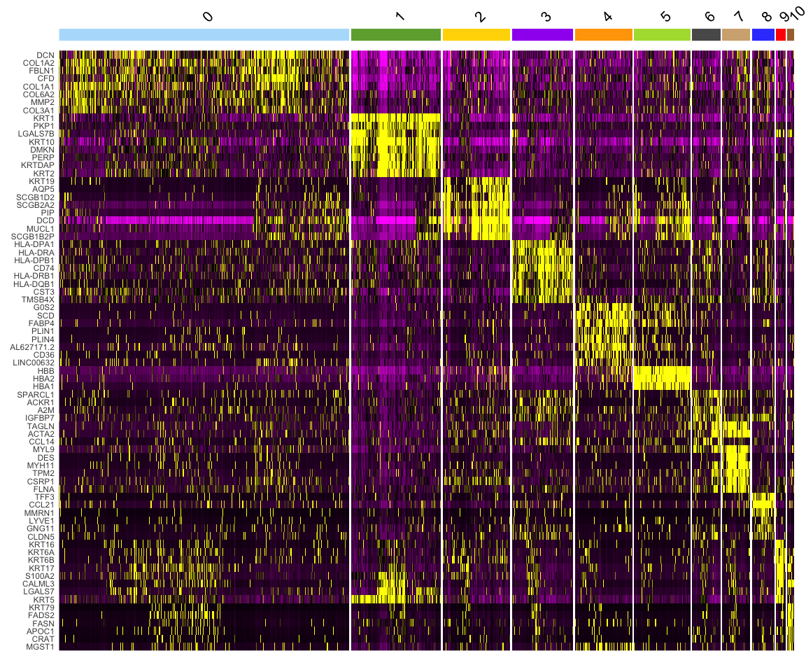

Healthy donors - Spatial Transcriptomics data analysis workflow
================

# ST HEALTHY SAMPLES - PART 1

This notebook covers the basic to advanced analysis of ST (Spatial
Transcriptomics) samples from healthy / normal human skin -

- Pre-processing

- Quality Control

- Clustering

- Dimensionality Reduction (UMAP)

- Batch Correction

- Marker Genes

### TABLE OF CONTENTS

| FIGURE NO | LINK         |
|-----------|--------------|
| 1B        | [link](#1b)  |
| 1C        | [link](#1c)  |
| 1D        | [link](#1d)  |
| S3-A      | [link](#s3a) |
| S3-B      | [link](#s3b) |
| S3-C      | [link](#s3c) |
| S2-C      | [link](#s2c) |
| S2-D      | [link](#s2d) |

## Load required packages

``` r
library(tidyverse)
```

    ## Warning: package 'tidyverse' was built under R version 4.1.2

    ## ── Attaching packages ─────────────────────────────────────── tidyverse 1.3.2 ──
    ## ✔ ggplot2 3.4.0      ✔ purrr   0.3.5 
    ## ✔ tibble  3.1.8      ✔ dplyr   1.0.10
    ## ✔ tidyr   1.2.1      ✔ stringr 1.4.1 
    ## ✔ readr   2.1.3      ✔ forcats 0.5.2

    ## Warning: package 'ggplot2' was built under R version 4.1.2

    ## Warning: package 'tibble' was built under R version 4.1.2

    ## Warning: package 'tidyr' was built under R version 4.1.2

    ## Warning: package 'readr' was built under R version 4.1.2

    ## Warning: package 'purrr' was built under R version 4.1.2

    ## Warning: package 'dplyr' was built under R version 4.1.2

    ## Warning: package 'stringr' was built under R version 4.1.2

    ## Warning: package 'forcats' was built under R version 4.1.2

    ## ── Conflicts ────────────────────────────────────────── tidyverse_conflicts() ──
    ## ✖ dplyr::filter() masks stats::filter()
    ## ✖ dplyr::lag()    masks stats::lag()

``` r
library(Seurat)
```

    ## Warning: package 'Seurat' was built under R version 4.1.2

    ## Attaching SeuratObject
    ## Attaching sp

``` r
library(cowplot)
library(RColorBrewer)
```

    ## Warning: package 'RColorBrewer' was built under R version 4.1.2

``` r
library(pheatmap)
library(scales)
```

    ## Warning: package 'scales' was built under R version 4.1.2

    ## 
    ## Attaching package: 'scales'
    ## 
    ## The following object is masked from 'package:purrr':
    ## 
    ##     discard
    ## 
    ## The following object is masked from 'package:readr':
    ## 
    ##     col_factor

``` r
library(ggsci)
library(harmony)
```

    ## Loading required package: Rcpp

    ## Warning: package 'Rcpp' was built under R version 4.1.2

## Import functions from the custom R script

``` r
source("../SPATIAL_FUNCTIONS.R")
```

    ## Warning: package 'reticulate' was built under R version 4.1.2

    ## Warning: package 'clusterProfiler' was built under R version 4.1.1

    ## 

    ## Registered S3 method overwritten by 'ggtree':
    ##   method      from 
    ##   identify.gg ggfun

    ## clusterProfiler v4.0.5  For help: https://yulab-smu.top/biomedical-knowledge-mining-book/
    ## 
    ## If you use clusterProfiler in published research, please cite:
    ## T Wu, E Hu, S Xu, M Chen, P Guo, Z Dai, T Feng, L Zhou, W Tang, L Zhan, X Fu, S Liu, X Bo, and G Yu. clusterProfiler 4.0: A universal enrichment tool for interpreting omics data. The Innovation. 2021, 2(3):100141. doi: 10.1016/j.xinn.2021.100141

    ## 
    ## Attaching package: 'clusterProfiler'

    ## The following object is masked from 'package:purrr':
    ## 
    ##     simplify

    ## The following object is masked from 'package:stats':
    ## 
    ##     filter

    ## Loading required package: AnnotationDbi

    ## Loading required package: stats4

    ## Loading required package: BiocGenerics

    ## Warning: package 'BiocGenerics' was built under R version 4.1.1

    ## 
    ## Attaching package: 'BiocGenerics'

    ## The following objects are masked from 'package:dplyr':
    ## 
    ##     combine, intersect, setdiff, union

    ## The following objects are masked from 'package:stats':
    ## 
    ##     IQR, mad, sd, var, xtabs

    ## The following objects are masked from 'package:base':
    ## 
    ##     anyDuplicated, append, as.data.frame, basename, cbind, colnames,
    ##     dirname, do.call, duplicated, eval, evalq, Filter, Find, get, grep,
    ##     grepl, intersect, is.unsorted, lapply, Map, mapply, match, mget,
    ##     order, paste, pmax, pmax.int, pmin, pmin.int, Position, rank,
    ##     rbind, Reduce, rownames, sapply, setdiff, sort, table, tapply,
    ##     union, unique, unsplit, which.max, which.min

    ## Loading required package: Biobase

    ## Warning: package 'Biobase' was built under R version 4.1.1

    ## Welcome to Bioconductor
    ## 
    ##     Vignettes contain introductory material; view with
    ##     'browseVignettes()'. To cite Bioconductor, see
    ##     'citation("Biobase")', and for packages 'citation("pkgname")'.

    ## Loading required package: IRanges

    ## Warning: package 'IRanges' was built under R version 4.1.1

    ## Loading required package: S4Vectors

    ## Warning: package 'S4Vectors' was built under R version 4.1.3

    ## 
    ## Attaching package: 'S4Vectors'

    ## The following object is masked from 'package:clusterProfiler':
    ## 
    ##     rename

    ## The following objects are masked from 'package:dplyr':
    ## 
    ##     first, rename

    ## The following object is masked from 'package:tidyr':
    ## 
    ##     expand

    ## The following objects are masked from 'package:base':
    ## 
    ##     expand.grid, I, unname

    ## 
    ## Attaching package: 'IRanges'

    ## The following object is masked from 'package:clusterProfiler':
    ## 
    ##     slice

    ## The following object is masked from 'package:sp':
    ## 
    ##     %over%

    ## The following objects are masked from 'package:dplyr':
    ## 
    ##     collapse, desc, slice

    ## The following object is masked from 'package:purrr':
    ## 
    ##     reduce

    ## 
    ## Attaching package: 'AnnotationDbi'

    ## The following object is masked from 'package:clusterProfiler':
    ## 
    ##     select

    ## The following object is masked from 'package:dplyr':
    ## 
    ##     select

    ## 

### Import Healthy Samples

(Raw Data stored in GEO repo: GSE202011)

(Sample meta-data in XXX)

``` r
## HEALTHY SAMPLES
## HEALTHY MALE SKIN 1 & 2
HEALTHY.Male.s1 <- Load10X_Spatial(data.dir ="/Volumes/Extreme Pro/GITHUB-DATA/ST-DATA/HEALTHY-DATA/Spatial-Data/ST_HM_1/", slice="ST-HM-1-R1")
```

    ## Warning: Invalid name supplied, making object name syntactically valid. New
    ## object name is ST.HM.1.R1; see ?make.names for more details on syntax validity

    ## Warning: Keys should be one or more alphanumeric characters followed by an
    ## underscore, setting key from st.hm.1.r1_ to sthm1r1_

``` r
HEALTHY.Male.s2 <- Load10X_Spatial(data.dir ="/Volumes/Extreme Pro/GITHUB-DATA/ST-DATA/HEALTHY-DATA/Spatial-Data/ST_HM_1_R2/", slice="ST-HM-1-R2")
```

    ## Warning: Invalid name supplied, making object name syntactically valid. New
    ## object name is ST.HM.1.R2; see ?make.names for more details on syntax validity

    ## Warning: Keys should be one or more alphanumeric characters followed by an
    ## underscore, setting key from st.hm.1.r2_ to sthm1r2_

``` r
## HEALTHY FEMALE SKIN 1 & 2 (FROM THE SAME DONOR)
HEALTHY.Female1.s1 <- Load10X_Spatial(data.dir ="/Volumes/Extreme Pro/GITHUB-DATA/ST-DATA/HEALTHY-DATA/Spatial-Data/ST_HF_1/", slice="ST-HF-1-R1")
```

    ## Warning: Invalid name supplied, making object name syntactically valid. New
    ## object name is ST.HF.1.R1; see ?make.names for more details on syntax validity

    ## Warning: Keys should be one or more alphanumeric characters followed by an
    ## underscore, setting key from st.hf.1.r1_ to sthf1r1_

``` r
HEALTHY.Female1.s2 <- Load10X_Spatial(data.dir ="/Volumes/Extreme Pro/GITHUB-DATA/ST-DATA/HEALTHY-DATA/Spatial-Data/ST_HF_1_R2/", slice="ST-HF-1-R2")
```

    ## Warning: Invalid name supplied, making object name syntactically valid. New
    ## object name is ST.HF.1.R2; see ?make.names for more details on syntax validity

    ## Warning: Keys should be one or more alphanumeric characters followed by an
    ## underscore, setting key from st.hf.1.r2_ to sthf1r2_

``` r
HEALTHY.Female1.s3 <- Load10X_Spatial(data.dir ="/Volumes/Extreme Pro/GITHUB-DATA/ST-DATA/HEALTHY-DATA/Spatial-Data/ST_HF_1T/", slice="ST-HF-1-R3")
```

    ## Warning: Invalid name supplied, making object name syntactically valid. New
    ## object name is ST.HF.1.R3; see ?make.names for more details on syntax validity

    ## Warning: Keys should be one or more alphanumeric characters followed by an
    ## underscore, setting key from st.hf.1.r3_ to sthf1r3_

``` r
## HEALTHY FEMALE
HEALTHY.Female2.s1 <- Load10X_Spatial(data.dir ="/Volumes/Extreme Pro/GITHUB-DATA/ST-DATA/HEALTHY-DATA/Spatial-Data/ST_HF_2E/", slice="ST-HF-2-R1")
```

    ## Warning: Invalid name supplied, making object name syntactically valid. New
    ## object name is ST.HF.2.R1; see ?make.names for more details on syntax validity

    ## Warning: Keys should be one or more alphanumeric characters followed by an
    ## underscore, setting key from st.hf.2.r1_ to sthf2r1_

``` r
HEALTHY.Female2.s2 <- Load10X_Spatial(data.dir ="/Volumes/Extreme Pro/GITHUB-DATA/ST-DATA/HEALTHY-DATA/Spatial-Data/ST_HF_2T/", slice="ST-HF-2-R2")
```

    ## Warning: Invalid name supplied, making object name syntactically valid. New
    ## object name is ST.HF.2.R2; see ?make.names for more details on syntax validity

    ## Warning: Keys should be one or more alphanumeric characters followed by an
    ## underscore, setting key from st.hf.2.r2_ to sthf2r2_

### Import the spots to be removed.

(Outlier spots identified using visual inspection in loupe browser)

Outlier spots here are spots that visually do not appear to be part of
the tissue slice

``` r
# HEALTHY FEMALE SKIN 2
# REMOVE SPOTS
remove.spots <- read.csv(file="/Volumes/Extreme Pro/GITHUB-DATA/ST-DATA/HEALTHY-DATA/Remove-Spots-Files/HEALTHY.Female1.s2.remove.spots.csv")
subset_spots <- Cells(HEALTHY.Female1.s2)[which((!(rownames(HEALTHY.Female1.s2@meta.data) %in% remove.spots$Barcode)))]
HEALTHY.Female1.s2.clean <- subset(HEALTHY.Female1.s2,cells=subset_spots)
```

### SAMPLE IDS

(HV - Healthy Volunteer, R - Replicate)

``` r
HEALTHY.Male.s1$sample.id<- "HV1_S1_R1" 
HEALTHY.Male.s2$sample.id<- "HV1_S1_R2"

HEALTHY.Female1.s1$sample.id <- "HV2_S1_R1"
HEALTHY.Female1.s2.clean$sample.id <- "HV2_S1_R2"
HEALTHY.Female1.s3$sample.id <- "HV2_S2"

HEALTHY.Female2.s1$sample.id <- "HV3_S1"
HEALTHY.Female2.s2$sample.id <- "HV3_S2"
```

### SAMPLE IDS (version 2) - (Full name + Biopsy site)

Biopsy sites - Trunk and FA (Forearm)

``` r
HEALTHY.Male.s1$orig.ident <- "Healthy Volunteer 1 - TRUNK R1" 
HEALTHY.Male.s2$orig.ident <-"Healthy Volunteer 1 - TRUNK R2"

HEALTHY.Female1.s1$orig.ident <- "Healthy Volunteer 2 - FA R1"
HEALTHY.Female1.s2.clean$orig.ident <- "Healthy Volunteer 2 - FA R2"
HEALTHY.Female1.s3$orig.ident <- "Healthy Volunteer 2 - TRUNK"

HEALTHY.Female2.s1$orig.ident <- "Healthy Volunteer 3 - FA R1"
HEALTHY.Female2.s2$orig.ident <- "Healthy Volunteer 3 - TRUNK"
```

### Combine all samples into one list

``` r
Healthy_Samples <- c(HEALTHY.Male.s1, HEALTHY.Male.s2, HEALTHY.Female1.s1, HEALTHY.Female1.s2.clean, HEALTHY.Female1.s3, HEALTHY.Female2.s1, HEALTHY.Female2.s2)
```

### Standard spatial plots (before filtering)

Generated per sample

``` r
for (x in Healthy_Samples){
  st_plot(x)
}
```

### QC (Quality control) plots for each healthy sample

``` r
for (x in Healthy_Samples){
  st_plot_QC(x)
}
```

### Standard QC scatter plots

(**UMI** / **nCount Spatial** vs. **Number of genes** / **features
expressed**)

Pre-set limits for X and Y axis - (12500,8500)

``` r
for (x in Healthy_Samples){
  st_scatter_QC(x)
}
```

### QC filtering

Remove spots with low depth (Defined by number of genes expressed per
spot)

\- 200 genes minimum per spot

``` r
i <- 1
while(i <= length(Healthy_Samples)){
  filtered_data <- st_filter_by_genes(st.data = Healthy_Samples[[i]],x = 200)
  Healthy_Samples[[i]] <- filtered_data
  i <- i+1
}
```

### Batch correction - Using Seurat Anchor integration

Original vignette
(<https://satijalab.org/seurat/articles/integration_introduction.html>)

Reference paper- (<https://doi.org/10.1016/j.cell.2019.05.031>)

Each sample - replicate is treated as an individual batch to account for
differences in sequencing depth between replicates and sample to sample
heterogeneity in human patient samples.

``` r
new.skin.combined <- st_combine(Healthy_Samples, ndim = 20, res = 0.6)
```

``` r
# Save new.skin.combined object to RDS file
saveRDS(new.skin.combined, "/Volumes/Extreme Pro/GITHUB-DATA/ST-DATA/HEALTHY-DATA/RDS-Files/HEALTHY_SKIN_SAMPLES_ST.RDS")
```

### Load the pre-processed data

(The RDS was processed using the same parameters that have been defined
above)

``` r
new.skin.combined <- readRDS("/Volumes/Extreme Pro/GITHUB-DATA/ST-DATA/HEALTHY-DATA/RDS-Files/HEALTHY_SKIN_SAMPLES_ST.RDS")
```

### Defining and viewing color scheme for clustering based UMAP and spatial plots

``` r
# Define Color Scheme
custom_colors <- c("#B4DFFC","#6EAB3D","#FFD700","#A020F0","#FFA500","#AEDD3C","#595959","#D2AF81FF","#3A49FC","#FF0000","#A86F3D","#A18FAA")

# View Color Scheme
show_col(custom_colors)
```

<!-- -->

### Finding marker genes for batch corrected healthy samples + plotting for top 8 marker genes per cluster heat-map

``` r
# Find top 8 marker genes for each cluster for heat map
new.skin.combined <- PrepSCTFindMarkers(new.skin.combined,assay = "SCT")
```

    ## Minimum UMI unchanged. Skipping re-correction.

``` r
Idents(new.skin.combined) <- "seurat_clusters"
new.skin.combined.markers <- FindAllMarkers(new.skin.combined, only.pos = TRUE, min.pct = 0.25, logfc.threshold = 0.25, assay = "SCT")
```

    ## Calculating cluster 0

    ## Warning in FindMarkers.default(object = data.use, slot = data.slot, counts =
    ## counts, : No features pass logfc.threshold threshold; returning empty data.frame

    ## Calculating cluster 1

    ## Calculating cluster 2

    ## Calculating cluster 3

    ## Calculating cluster 4

    ## Calculating cluster 5

    ## Calculating cluster 6

    ## Calculating cluster 7

    ## Calculating cluster 8

    ## Calculating cluster 9

    ## Calculating cluster 10

    ## Calculating cluster 11

``` r
DefaultAssay(new.skin.combined) <- "SCT"
top8 <- new.skin.combined.markers %>%
    dplyr::group_by(cluster) %>%
    dplyr::filter(p_val_adj < 0.05) %>%
    top_n(n = 8, wt = avg_log2FC)
```

``` r
# Save Healthy Skin Markers RDS File (Used later in Healthy Samples Part 2 & 4)
saveRDS(new.skin.combined.markers, "/gpfs/data/naiklab/Alex/GITHUB-DATA/ST-DATA/HEALTHY-DATA/RDS-Files/HEALTHY_ST_MARKERS.RDS")
```

<a id="s2c"></a>

``` r
DoHeatmap(new.skin.combined, features = top8$gene,assay = "SCT", group.colors = custom_colors) + NoLegend()
```

    ## Warning in DoHeatmap(new.skin.combined, features = top8$gene, assay = "SCT", :
    ## The following features were omitted as they were not found in the scale.data
    ## slot for the SCT assay: SCGB1B2P, SCGB2A2, SCGB1D2, PIP, AQP5

<!-- -->

</a>

### Assign spatial region specific cluster ids

``` r
new.cluster.ids <- c("0 Mixed","1 Dermis","2 Dermis Adipose","3 Epidermis 1","4 Dermis Connective Tissue",
                     "5 Upper follicle (UF) and Perifollicular dermis","6 Epidermis 2","7 Dermis 2",
                     "8 Dermis Smooth Muscle","9 Hair follicle","10 Dermis Lymphatics","11 Dermis vasculature")

names(new.cluster.ids) <- levels(new.skin.combined)
```

``` r
new.skin.combined <- RenameIdents(new.skin.combined, new.cluster.ids)
new.skin.combined <- StashIdent(new.skin.combined, save.name = "Spatial.regions")
```

    ## With Seurat 3.X, stashing identity classes can be accomplished with the following:
    ## new.skin.combined[["Spatial.regions"]] <- Idents(object = new.skin.combined)

### Save RDS file skin.new.combined with cluster ids

``` r
#saveRDS(new.skin.combined, "/gpfs/data/naiklab/Alex/GITHUB-DATA/ST-DATA/HEALTHY-DATA/RDS-Files/HEALTHY_SKIN_SAMPLES_ST_CLUSTERS_LABELED.RDS")
```

``` r
new.skin.combined <- readRDS("/Volumes/Extreme Pro/GITHUB-DATA/ST-DATA/HEALTHY-DATA/RDS-Files/HEALTHY_SKIN_SAMPLES_ST_CLUSTERS_LABELED.RDS")
```

``` r
# DEFINE COLORS FOR EACH SPATIAL REGION
color.labels.anchor <- c("#B4DFFC","#6EAB3D","#FFD700","#A020F0","#FFA500","#AEDD3C","#595959","#D2AF81FF","#3A49FC","#FF0000","#A86F3D","#A18FAA")
names(color.labels.anchor) <- new.cluster.ids
```

### General UMAP with defined color scheme

#### FIGURE 1-C

<a id="1c">

``` r
#pdf(width = 12, height=8, file = "UMAP_HEALTHY_SAMPLES_CLUSTERS_ONLY.pdf")
DimPlot(new.skin.combined, cols = custom_colors, pt.size = 3.5)
```

<!-- -->

``` r
#dev.off()

# FOR IN NOTEBOOK VIEW
DimPlot(new.skin.combined, cols = custom_colors, pt.size = 3.5)
```

<!-- -->

</a>

### UMAP plot split by samples

``` r
DimPlot(new.skin.combined, split.by = "sample.id")
```

<!-- -->

### Spatial plot for HV2_S1_R2 / Healthy Volunteer 2 -

``` r
#pdf(width = 8,height=10,file = "HEALTHY_FEMALE_SAMPLE_1_R2_SPATIAL_PLOT.pdf")
SpatialDimPlot(new.skin.combined,images="HV2.S1.R2",cols = color.labels.anchor,pt.size.factor = 2.4)
```

<!-- -->

``` r
#dev.off()
```

### VIEW SPATIAL PLOT HERE

**FIGURE 1-B**

``` r
names(new.skin.combined@images) <- c("HV1.S1.R1","HV1.S1.R2","HV2.S1.R1","HV2.S1.R2","HV2.S1.R2","HV3.S1","HV3.S2")
```

<a id="1b">

``` r
SpatialDimPlot(new.skin.combined, images="HV2.S1.R2", cols = color.labels.anchor, pt.size.factor = 2.4)
```

<!-- -->

</a>

### Generate Spatial plot for all samples

``` r
images <- Images(new.skin.combined) %>% as.vector()
for(x in images){
  pdf(width = 8, height = 10, file = paste(x, "_SPATIAL_PLOT.pdf"))
  print(SpatialDimPlot(new.skin.combined, images=x,cols = custom_colors, pt.size.factor = 2))
  dev.off()
}
```

### Pathway analysis - Performed per cluster

``` r
for(i in seq(0,11)){
  cluster <- new.skin.combined.markers %>% filter(cluster==i)
  GO_PATHWAYS_ENRICH(cluster, ONT="BP", OUTPUT = i)
  GO_PATHWAYS_ENRICH(cluster, ONT="CC", OUTPUT = i)
  GO_PATHWAYS_ENRICH(cluster, ONT="MF", OUTPUT = i)
  KEGG_PATHWAYS(cluster, OUTPUT = i)
}
```

### Violin Plot: UMI counts per cluster basis

<a id="s2d">

``` r
#pdf(file = "VIOLIN_PLOT_UMIs_and_CLUSTERS_HEALTHY_SAMPLES.pdf",width = 16,height=12)
VlnPlot(new.skin.combined, group.by = "seurat_clusters", features = "nCount_Spatial", cols = custom_colors)
```

<!-- -->

``` r
#dev.off()
```

</a>

# LOG TRANSFORMED UMI COUNTS

``` r
#pdf(file = "VIOLIN_PLOT_UMIs_and_CLUSTERS_HEALTHY_SAMPLES(LOG_TRANSFORMED).pdf",width = 16,height=12)
VlnPlot(new.skin.combined,group.by = "seurat_clusters", features = "nCount_Spatial", cols = custom_colors, log = TRUE)
```

<!-- -->

``` r
#dev.off()
```

``` r
# SPOT FREQUENCY TABLE - BY SPATIAL REGION
spatial.freq <- as.data.frame(table(new.skin.combined@meta.data$Spatial.regions))

# Write Spatial Frequency Results to CSV
#write.csv(spatial.freq, file="SPATIAL_REGIONS_CLUSTERS_SPOT_COUNTS.csv")
```

## AVERAGE GENE COUNTS

``` r
Idents(new.skin.combined) <- "seurat_clusters"

clusters <- unique(new.skin.combined@meta.data$seurat_clusters) %>% as.vector()

for(x in clusters){
  avg_exp.cluster <- AverageExpression(new.skin.combined,slot = "counts", assay="Spatial") %>% 
    as.data.frame() %>%
    dplyr::select(paste("Spatial.",x,sep = "")) %>% 
    filter(x>0) %>% 
    write.csv(file = paste("CLUSTER_",x,"_GENE_COUNTS.csv",sep = ""))
}
```

## **FIGURE 1D**

## PERCENTAGE PLOT FOR DIFFERENT SPATIAL REGIONS

<a id="1d">

``` r
Regions.df <- table(new.skin.combined@meta.data$Spatial.regions, new.skin.combined@meta.data$sample.id) %>% as.data.frame() %>% dplyr::rename(Spatial_Region=Var1, Sample=Var2) 

black.bold.16.text <- element_text(face = "bold", color = "black", size = 14,angle = 90, vjust = 0.5, hjust=1)

brks <- c(0, 0.25, 0.5, 0.75, 1)

#pdf(file="PERCENTAGE_COMPOSTION_PLOT_HEALTHY_SAMPLES.pdf",height = 14,width = 8)
ggplot(Regions.df,aes(x=Sample,y=Freq,fill=Spatial_Region)) + geom_bar(stat="identity", position="fill") + scale_fill_manual(values =color.labels.anchor)  + ggplot2::theme(panel.grid.major = element_blank(), panel.grid.minor = element_blank(),
panel.background = element_blank(), axis.text.x=black.bold.16.text) + scale_y_continuous(breaks = brks, labels = scales::percent(brks)) + ylab("% Composition of Sample by Spatial Region / Clusters")
```

<!-- -->

``` r
#dev.off()
```

</a>

# Harmony Batch Correction

### Merge Samples, Run PCA & Harmony Batch Correction

``` r
# Healthy_Samples was generated as list of Samples at the top of the script
healthy_skin.merge <- merge(x=Healthy_Samples[[1]], y=Healthy_Samples[-1])
```

    ## Warning in CheckDuplicateCellNames(object.list = objects): Some cell names are
    ## duplicated across objects provided. Renaming to enforce unique cell names.

``` r
healthy_skin.merge <- SCTransform(healthy_skin.merge, assay = "Spatial", vars.to.regress = c("orig.ident"))
```

    ## Calculating cell attributes from input UMI matrix: log_umi

    ## Variance stabilizing transformation of count matrix of size 17353 by 3815

    ## Model formula is y ~ log_umi

    ## Get Negative Binomial regression parameters per gene

    ## Using 2000 genes, 3815 cells

    ##   |                                                                              |                                                                      |   0%  |                                                                              |==================                                                    |  25%  |                                                                              |===================================                                   |  50%  |                                                                              |====================================================                  |  75%  |                                                                              |======================================================================| 100%

    ## Found 46 outliers - those will be ignored in fitting/regularization step

    ## Second step: Get residuals using fitted parameters for 17353 genes

    ##   |                                                                              |                                                                      |   0%  |                                                                              |==                                                                    |   3%  |                                                                              |====                                                                  |   6%  |                                                                              |======                                                                |   9%  |                                                                              |========                                                              |  11%  |                                                                              |==========                                                            |  14%  |                                                                              |============                                                          |  17%  |                                                                              |==============                                                        |  20%  |                                                                              |================                                                      |  23%  |                                                                              |==================                                                    |  26%  |                                                                              |====================                                                  |  29%  |                                                                              |======================                                                |  31%  |                                                                              |========================                                              |  34%  |                                                                              |==========================                                            |  37%  |                                                                              |============================                                          |  40%  |                                                                              |==============================                                        |  43%  |                                                                              |================================                                      |  46%  |                                                                              |==================================                                    |  49%  |                                                                              |====================================                                  |  51%  |                                                                              |======================================                                |  54%  |                                                                              |========================================                              |  57%  |                                                                              |==========================================                            |  60%  |                                                                              |============================================                          |  63%  |                                                                              |==============================================                        |  66%  |                                                                              |================================================                      |  69%  |                                                                              |==================================================                    |  71%  |                                                                              |====================================================                  |  74%  |                                                                              |======================================================                |  77%  |                                                                              |========================================================              |  80%  |                                                                              |==========================================================            |  83%  |                                                                              |============================================================          |  86%  |                                                                              |==============================================================        |  89%  |                                                                              |================================================================      |  91%  |                                                                              |==================================================================    |  94%  |                                                                              |====================================================================  |  97%  |                                                                              |======================================================================| 100%

    ## Computing corrected count matrix for 17353 genes

    ##   |                                                                              |                                                                      |   0%  |                                                                              |==                                                                    |   3%  |                                                                              |====                                                                  |   6%  |                                                                              |======                                                                |   9%  |                                                                              |========                                                              |  11%  |                                                                              |==========                                                            |  14%  |                                                                              |============                                                          |  17%  |                                                                              |==============                                                        |  20%  |                                                                              |================                                                      |  23%  |                                                                              |==================                                                    |  26%  |                                                                              |====================                                                  |  29%  |                                                                              |======================                                                |  31%  |                                                                              |========================                                              |  34%  |                                                                              |==========================                                            |  37%  |                                                                              |============================                                          |  40%  |                                                                              |==============================                                        |  43%  |                                                                              |================================                                      |  46%  |                                                                              |==================================                                    |  49%  |                                                                              |====================================                                  |  51%  |                                                                              |======================================                                |  54%  |                                                                              |========================================                              |  57%  |                                                                              |==========================================                            |  60%  |                                                                              |============================================                          |  63%  |                                                                              |==============================================                        |  66%  |                                                                              |================================================                      |  69%  |                                                                              |==================================================                    |  71%  |                                                                              |====================================================                  |  74%  |                                                                              |======================================================                |  77%  |                                                                              |========================================================              |  80%  |                                                                              |==========================================================            |  83%  |                                                                              |============================================================          |  86%  |                                                                              |==============================================================        |  89%  |                                                                              |================================================================      |  91%  |                                                                              |==================================================================    |  94%  |                                                                              |====================================================================  |  97%  |                                                                              |======================================================================| 100%

    ## Calculating gene attributes

    ## Wall clock passed: Time difference of 50.41422 secs

    ## Determine variable features

    ## Place corrected count matrix in counts slot

    ## Regressing out orig.ident

    ## Centering data matrix

    ## Set default assay to SCT

``` r
DefaultAssay(healthy_skin.merge) <- "SCT"
healthy_skin.merge <- RunPCA(healthy_skin.merge)
```

    ## PC_ 1 
    ## Positive:  KRT10, KRT1, KRT2, DMKN, KRTDAP, SBSN, FLG, LOR, LGALS7B, PERP 
    ##     DSG1, FLG2, CDSN, HOPX, PKP1, LGALS7, SERPINA12, DSP, ASPRV1, TMEM45A 
    ##     C1orf68, CALML5, KRT14, LY6D, LCE2B, SLURP1, SFN, SPINK5, LCE1B, KRT5 
    ## Negative:  DCN, CFD, COL1A1, COL1A2, GSN, FTL, VIM, FBLN1, S100A6, FTH1 
    ##     APOD, COL3A1, CST3, SPARC, ADIRF, MYL9, CXCL12, COL6A2, TAGLN, IGFBP6 
    ##     CCDC80, CCN5, MGP, TNXB, RNASE1, ACTA2, PI16, MFAP4, TPSB2, C3 
    ## PC_ 2 
    ## Positive:  DCD, MUCL1, SCGB2A2, PIP, SCGB1D2, SCGB1B2P, AQP5, SLC12A2, KRT19, MT-CO1 
    ##     KRT7, MT-CO3, SNORC, ATP1A1, AZGP1, KRT18, KRT8, MT-CO2, MT-ND3, SFRP1 
    ##     MT-ND5, HBB, STAC2, ATP1B1, CLDN10, MT-ATP6, DNER, MT-ND4, SERHL2, NCALD 
    ## Negative:  COL1A2, DCN, COL1A1, FBLN1, CFD, COL3A1, PI16, CST3, KRT10, COL6A2 
    ##     KRT1, MMP2, AEBP1, CCN5, TNXB, KRT2, DMKN, CTSK, GSN, MFAP4 
    ##     C1R, SCARA5, CLEC3B, COL6A1, SPARC, FBLN2, CD74, TIMP2, KRTDAP, C3 
    ## PC_ 3 
    ## Positive:  FABP4, G0S2, SCD, PLIN4, PLIN1, HBB, ADIPOQ, AL627171.2, HBA2, PPP1R1A 
    ##     CD36, GPD1, LPL, RBP4, CIDEC, LINC00632, HBA1, PLAAT3, MTRNR2L12, MCAM 
    ##     LIPE, LEP, TAGLN, ADIRF, MYL9, GPAM, CRYAB, HSPB6, MGST1, AOC3 
    ## Negative:  COL1A2, COL1A1, DCN, MUCL1, SCGB2A2, DCD, PIP, SCGB1B2P, FBLN1, COL3A1 
    ##     SCGB1D2, AQP5, CFD, SLC12A2, PI16, MMP2, SNORC, KRT7, KRT19, CCN5 
    ##     TNXB, AZGP1, AEBP1, COL6A2, IGFBP6, SCARA5, KRT18, KRT8, GSN, ATP1B1 
    ## PC_ 4 
    ## Positive:  HBB, FABP4, G0S2, HBA2, SCD, PLIN1, PLIN4, AL627171.2, HBA1, LINC00632 
    ##     ADIPOQ, CD36, GPD1, RBP4, LPL, COL1A1, COL1A2, ADH1B, CIDEC, PPP1R1A 
    ##     CFD, MTRNR2L12, LEP, DCN, MGST1, LIPE, FTL, GPAM, MT-ND2, COL3A1 
    ## Negative:  TAGLN, ACTA2, MYL9, MYH11, DES, TPM2, ACTG2, CSRP1, CNN1, MYLK 
    ##     FLNA, PCP4, C11orf96, SYNPO2, FLNC, TPM1, LMOD1, PLN, PPP1R14A, P2RX1 
    ##     ACTA1, MCAM, SMTN, SYNM, ITGA8, RASL12, CARMN, MUSTN1, SPARCL1, ACTC1 
    ## PC_ 5 
    ## Positive:  CD74, HLA-DRA, HLA-DPB1, HLA-DRB1, HLA-DPA1, LYZ, HLA-DQB1, KRT14, HLA-DQA1, CST3 
    ##     KRT5, CD52, IL32, TMSB4X, TRBC2, S100A2, KRT6A, CPVL, CCL19, KRT6B 
    ##     CORO1A, CCL14, TPSAB1, HLA-DMB, ACKR1, COTL1, APCDD1, LGALS7B, PTGDS, HLA-DRB5 
    ## Negative:  COL1A2, COL1A1, HBB, HBA2, DCN, HBA1, DES, COL3A1, G0S2, PLIN4 
    ##     LOR, FABP4, MYH11, MYL9, SCD, FBLN1, PLIN1, CFD, TPM2, ACTG2 
    ##     IGFBP6, FLG, FLG2, GSN, CCN5, SPARC, C1orf68, ASPRV1, KPRP, LCE1B

``` r
all_healthy_samples.hm.sct <- RunHarmony(healthy_skin.merge, assay.use = "SCT", project.dim = FALSE, group.by.vars = "sample.id")
```

    ## Harmony 1/10

    ## Harmony 2/10

    ## Harmony 3/10

    ## Harmony 4/10

    ## Harmony 5/10

    ## Harmony 6/10

    ## Harmony converged after 6 iterations

### View Elbow Plot to Determine Dims for UMAP

``` r
ElbowPlot(all_healthy_samples.hm.sct)
```

<!-- -->

### Run UMAP & Clustering

``` r
all_healthy_samples.hm.sct <- all_healthy_samples.hm.sct %>% 
    RunUMAP(reduction = "harmony", dims = 1:20) %>% 
    FindNeighbors(reduction = "harmony", dims = 1:20) %>% 
    FindClusters(resolution = 0.35) %>% 
    identity()
```

    ## Warning: The default method for RunUMAP has changed from calling Python UMAP via reticulate to the R-native UWOT using the cosine metric
    ## To use Python UMAP via reticulate, set umap.method to 'umap-learn' and metric to 'correlation'
    ## This message will be shown once per session

    ## 18:07:10 UMAP embedding parameters a = 0.9922 b = 1.112

    ## 18:07:10 Read 3815 rows and found 20 numeric columns

    ## 18:07:10 Using Annoy for neighbor search, n_neighbors = 30

    ## 18:07:10 Building Annoy index with metric = cosine, n_trees = 50

    ## 0%   10   20   30   40   50   60   70   80   90   100%

    ## [----|----|----|----|----|----|----|----|----|----|

    ## **************************************************|
    ## 18:07:11 Writing NN index file to temp file /var/folders/8p/2clwbcfn719f5l1kjsyx4v6s2r9kgj/T//RtmpDkazXq/file12efc20e2ebc3
    ## 18:07:11 Searching Annoy index using 1 thread, search_k = 3000
    ## 18:07:12 Annoy recall = 100%
    ## 18:07:12 Commencing smooth kNN distance calibration using 1 thread with target n_neighbors = 30
    ## 18:07:13 Initializing from normalized Laplacian + noise (using irlba)
    ## 18:07:14 Commencing optimization for 500 epochs, with 170830 positive edges
    ## 18:07:20 Optimization finished
    ## Computing nearest neighbor graph
    ## Computing SNN

    ## Modularity Optimizer version 1.3.0 by Ludo Waltman and Nees Jan van Eck
    ## 
    ## Number of nodes: 3815
    ## Number of edges: 145357
    ## 
    ## Running Louvain algorithm...
    ## Maximum modularity in 10 random starts: 0.8908
    ## Number of communities: 12
    ## Elapsed time: 0 seconds

``` r
# Save Harmonized Healthy Samples
#saveRDS(all_healthy_samples.hm.sct, "/gpfs/data/naiklab/Alex/GITHUB-DATA/ST-DATA/HEALTHY-DATA/RDS-Files/HEALTHY_ST_(Harmonized_for_final_figure).RDS")
```

### Load Harmonized Healthy Samples

``` r
all_healthy_samples.hm.sct <- readRDS("/Volumes/Extreme Pro/GITHUB-DATA/ST-DATA/HEALTHY-DATA/RDS-Files/HEALTHY_ST_(Harmonized_for_final_figure).RDS")
```

### View UMAP

``` r
#pdf(width = 12,height=8,file = "UMAP_HEALTHY_SAMPLES_(HM_VER_FINAL).pdf")
DimPlot(all_healthy_samples.hm.sct, pt.size = 3.5, cols = custom_colors)
```

<!-- -->

``` r
#dev.off()
```

### Find All Markers for Harmonized Healthy Samples

``` r
# Find All Healthy Harmonized Cluster Markers
Idents(all_healthy_samples.hm.sct) <- "seurat_clusters"
all_healthy_samples.hm.sct.markers <- FindAllMarkers(all_healthy_samples.hm.sct, only.pos = TRUE, min.pct = 0.25, logfc.threshold = 0.25,assay = "SCT")
```

    ## Calculating cluster 0

    ## Calculating cluster 1

    ## Calculating cluster 2

    ## Calculating cluster 3

    ## Calculating cluster 4

    ## Calculating cluster 5

    ## Calculating cluster 6

    ## Calculating cluster 7

    ## Calculating cluster 8

    ## Calculating cluster 9

    ## Calculating cluster 10

``` r
# Get Top 8 genes from each Cluster
DefaultAssay(all_healthy_samples.hm.sct) <- "SCT"
top8 <- all_healthy_samples.hm.sct.markers %>%
    dplyr::group_by(cluster) %>%
    dplyr::filter(p_val_adj<0.05) %>%
    top_n(n = 8, wt = avg_log2FC)

#pdf(width = 20,height=15,file = "HEATMAP_HEALTHY_SAMPLES_(HM_VER_FINAL).pdf")
DoHeatmap(all_healthy_samples.hm.sct, features = top8$gene,assay = "SCT", group.colors = custom_colors) + NoLegend()
```

    ## Warning in DoHeatmap(all_healthy_samples.hm.sct, features = top8$gene, assay
    ## = "SCT", : The following features were omitted as they were not found in the
    ## scale.data slot for the SCT assay: HLA-E

<!-- -->

``` r
#dev.off()
```

### Generate Spatial plot for all samples

``` r
Regions.df <- table(all_healthy_samples.hm.sct@meta.data$seurat_clusters, all_healthy_samples.hm.sct@meta.data$sample.id) %>% 
  as.data.frame() %>% 
  dplyr::rename(Spatial_Region=Var1,Sample=Var2) 

black.bold.16.text <- element_text(face = "bold", color = "black", size = 14,angle = 90, vjust = 0.5, hjust=1)

brks <- c(0, 0.25, 0.5, 0.75, 1)

#pdf(file="PERCENTAGE_COMPOSTION_PLOT_HEALTHY_SAMPLES(AFTER_HM_CORRECTION).pdf",height = 14,width = 8)
ggplot(Regions.df,aes(x=Sample,y=Freq,fill=Spatial_Region)) + geom_bar(stat="identity", position="fill") + ggplot2::theme(panel.grid.major = element_blank(), panel.grid.minor = element_blank(),
panel.background = element_blank(), axis.text.x = black.bold.16.text) + 
  scale_y_continuous(breaks = brks, labels = scales::percent(brks)) + 
  ylab("% Composition of Sample by Spatial Region / Clusters") +  
  scale_fill_manual(values = custom_colors)
```

<!-- -->

``` r
#dev.off()
```

``` r
#pdf(width = 8,height=10,file = "HEALTHY_FEMALE_SAMPLE_1_R2_SPATIAL_PLOT(HM_VERSION_FINAL).pdf")
SpatialDimPlot(all_healthy_samples.hm.sct, images="HV2.S1.R2", pt.size.factor = 2.4) + 
  scale_fill_manual(values = custom_colors) 
```

    ## Scale for fill is already present.
    ## Adding another scale for fill, which will replace the existing scale.

<!-- -->

``` r
#dev.off()
```

## Alternative approach

``` r
for (i in 1:length(Healthy_Samples)) {
    Healthy_Samples[[i]] <- SCTransform(Healthy_Samples[[i]], verbose = FALSE, assay="Spatial")
}

all.variable.features <- c()

for(x in Healthy_Samples){
  x <- FindVariableFeatures(x)
  vf <- VariableFeatures(x)
  all.variable.features <- c(all.variable.features, vf) 
}
```

``` r
# Merge Samples
healthy_skin.merge <- merge(x=Healthy_Samples[[1]], y=Healthy_Samples[-1])

# Find Variable Features & Run Harmony
VariableFeatures(healthy_skin.merge) <- all.variable.features
DefaultAssay(healthy_skin.merge) <- "SCT"
healthy_skin.merge <- PrepSCTFindMarkers(healthy_skin.merge)
```

    ## Found 7 SCT models. Recorrecting SCT counts using minimum median counts: 533

``` r
healthy_skin.merge <- RunPCA(healthy_skin.merge)
```

    ## PC_ 1 
    ## Positive:  DCN, CFD, COL1A2, VIM, GSN, COL1A1, S100A6, FTL, FBLN1, CST3 
    ##     FTH1, APOD, CXCL12, TMSB10, SPARC, COL3A1, MGP, CCDC80, COL6A2, TNXB 
    ##     ADIRF, RNASE1, C3, CCN5, MFAP4, MMP2, SERPING1, LGALS1, IGFBP7, PI16 
    ## Negative:  KRT10, KRT1, DMKN, PERP, DSP, KRT2, KRTDAP, LGALS7B, SFN, PKP1 
    ##     KRT14, DSG1, SBSN, KRT5, LOR, FLG, CALML5, DSC3, HOPX, LY6D 
    ##     JUP, FLG2, TMEM45A, TRIM29, CDSN, SERPINA12, AQP3, LYPD3, SPINK5, TACSTD2 
    ## PC_ 2 
    ## Positive:  MT-CO1, DCD, MUCL1, MT-ND3, MT-CO3, MT-ND5, ATP1A1, MT-ND2, FABP4, MT-ND4 
    ##     MT-ND1, SLC12A2, MT-ND4L, GAPDH, SCD, HBB, SFRP1, ATP1B1, MT-ATP8, G0S2 
    ##     HBA2, CRYAB, CHCHD10, MTRNR2L12, AZGP1, PLIN4, ACTA2, PDK3, SOX9, CSRP1 
    ## Negative:  COL1A2, DCN, COL1A1, FBLN1, CFD, COL3A1, COL6A2, KRT10, MMP2, KRT1 
    ##     TNXB, PI16, CCN5, KRT2, DMKN, AEBP1, CST3, CXCL14, COL6A1, KRTDAP 
    ##     GSN, TIMP2, LOR, C1R, MFAP4, CTSK, FBLN2, THBS2, SCARA5, SBSN 
    ## PC_ 3 
    ## Positive:  CD74, HLA-DRA, HLA-DRB1, B2M, HLA-DPB1, HLA-DPA1, HLA-B, HLA-DQB1, TMSB4X, HLA-DQA1 
    ##     CST3, IGFBP7, VIM, LYZ, SPARCL1, TMSB10, A2M, CCL14, PTGDS, RPL13 
    ##     CD52, ACKR1, HLA-E, IL32, IFITM3, IFI27, HLA-DMB, HLA-DMA, TPSAB1, CLDN5 
    ## Negative:  COL1A2, DCN, COL1A1, DCD, CFD, FBLN1, MUCL1, IGFBP6, COL3A1, CCN5 
    ##     MMP2, GSN, TNXB, SPARC, PI16, MT-ND2, MT-ND4, MFAP5, SCARA5, HBB 
    ##     MT-ND1, MT-CO1, MT-CO3, COL12A1, AZGP1, FSTL1, COL6A2, FBLN2, HBA2, MT-ND5 
    ## PC_ 4 
    ## Positive:  KRT14, ATP1A1, KRT6B, S100A2, GAPDH, KRT5, MUCL1, KRT6A, ATP1B1, KRT15 
    ##     KRT17, CSRP1, SLC12A2, SOX9, COL1A2, KRT16, RPL13, SFRP1, CHCHD10, MYLK 
    ##     C19orf33, NCALD, DEFB1, ACTB, MYH11, PDK3, CRABP2, CNN1, ATP2A3, ACTA2 
    ## Negative:  FABP4, G0S2, AL627171.2, SCD, HBB, PLIN4, PLIN1, HBA2, CD36, LINC00632 
    ##     ADIPOQ, PPP1R1A, MTRNR2L12, HBA1, RBP4, GPD1, ADIRF, FHL1, MT-ND2, LPL 
    ##     ADH1B, FTH1, MT-ND3, FTL, CIDEC, FLG, CRYAB, FLG2, MT-ATP8, LOR 
    ## PC_ 5 
    ## Positive:  HLA-DRA, FTL, CD74, CST3, HLA-DPB1, HLA-DRB1, HLA-DPA1, RNASE1, LYZ, FTH1 
    ##     TMSB10, HLA-DQA1, TMSB4X, HLA-DQB1, F13A1, SELENOP, IL32, CD52, ATP1A1, LINC00632 
    ##     KRT14, TYROBP, C1QA, FCER1G, KRT6A, RPL13, DEFB1, AL627171.2, CFD, MT1X 
    ## Negative:  MYL9, TAGLN, ACTA2, TPM2, MYH11, FLNA, DES, CSRP1, CNN1, MYLK 
    ##     TPM1, C11orf96, MCAM, LMOD1, SYNPO2, FLNC, PPP1R14A, SMTN, CARMN, CALD1 
    ##     SPARCL1, MUSTN1, SYNM, ACTB, PDLIM7, RBPMS, PPP1R12B, FN1, RHOB, AOC3

``` r
all_healthy_samples.hm.sct.alt <- RunHarmony(healthy_skin.merge, assay.use = "SCT", project.dim = FALSE,group.by.vars = "sample.id")
```

    ## Harmony 1/10

    ## Harmony 2/10

    ## Harmony 3/10

    ## Harmony 4/10

    ## Harmony 5/10

    ## Harmony 6/10

    ## Harmony converged after 6 iterations

``` r
all_healthy_samples.hm.sct.alt <- all_healthy_samples.hm.sct.alt %>% 
    RunUMAP(reduction = "harmony", dims = 1:40) %>% 
    FindNeighbors(reduction = "harmony", dims = 1:40) %>% 
    FindClusters(resolution = 0.6) %>% 
    identity()
```

    ## 18:09:30 UMAP embedding parameters a = 0.9922 b = 1.112

    ## 18:09:30 Read 3815 rows and found 40 numeric columns

    ## 18:09:30 Using Annoy for neighbor search, n_neighbors = 30

    ## 18:09:30 Building Annoy index with metric = cosine, n_trees = 50

    ## 0%   10   20   30   40   50   60   70   80   90   100%

    ## [----|----|----|----|----|----|----|----|----|----|

    ## **************************************************|
    ## 18:09:31 Writing NN index file to temp file /var/folders/8p/2clwbcfn719f5l1kjsyx4v6s2r9kgj/T//RtmpDkazXq/file12efc271c7260
    ## 18:09:31 Searching Annoy index using 1 thread, search_k = 3000
    ## 18:09:32 Annoy recall = 100%
    ## 18:09:32 Commencing smooth kNN distance calibration using 1 thread with target n_neighbors = 30
    ## 18:09:33 Initializing from normalized Laplacian + noise (using irlba)
    ## 18:09:33 Commencing optimization for 500 epochs, with 179546 positive edges
    ## 18:09:40 Optimization finished
    ## Computing nearest neighbor graph
    ## Computing SNN

    ## Modularity Optimizer version 1.3.0 by Ludo Waltman and Nees Jan van Eck
    ## 
    ## Number of nodes: 3815
    ## Number of edges: 250803
    ## 
    ## Running Louvain algorithm...
    ## Maximum modularity in 10 random starts: 0.8158
    ## Number of communities: 9
    ## Elapsed time: 0 seconds

``` r
#saveRDS(all_healthy_samples.hm.sct.alt, file="/Volumes/Extreme Pro/GITHUB-DATA/ST-DATA/HEALTHY-DATA/RDS-Files/HEALTHY_ST(Harmonized_Alt_Approach).RDS")
```

## Alternative Harmony Approach Plots

### Load RDS File

``` r
all_healthy_samples.hm.sct.alt <- readRDS("/Volumes/Extreme Pro/GITHUB-DATA/ST-DATA/HEALTHY-DATA/RDS-Files/HEALTHY_ST(Harmonized_Alt_Approach).RDS")
```

### Colors of Alternative Downstream Plots

``` r
custom_colors_alt <- c("#B4DFFC","#6EAB3D","#FFD700","#A020F0","#FFA500","#AEDD3C","#595959","#D2AF81FF","#3A49FC")
show_col(custom_colors_alt)
```

<!-- -->

### Spatial DimPlots All Samples

``` r
#dir.create("HM_CORRECTED_HEALTHY_SAMPLES/")

images <- Images(all_healthy_samples.hm.sct.alt) %>% as.vector()
for(x in images){
  #pdf(width = 8,height=10,file = paste("HM_CORRECTED_HEALTHY_SAMPLES/",x,"_(HM_CORRECTED)_HEALTHY_SPATIAL_PLOT.pdf"))
  print(SpatialDimPlot(all_healthy_samples.hm.sct.alt, images=x, pt.size.factor = 2) +
          scale_fill_manual(values = custom_colors_alt))
  #dev.off()
}
```

### Top Marker Genes Heat Map

<a id="s3a">

``` r
all_healthy_samples.hm.sct.alt <- PrepSCTFindMarkers(all_healthy_samples.hm.sct.alt,assay = "SCT")
```

    ## Minimum UMI unchanged. Skipping re-correction.

``` r
Idents(all_healthy_samples.hm.sct.alt) <- "seurat_clusters"

all_healthy_samples.hm.sct.alt.markers <- FindAllMarkers(all_healthy_samples.hm.sct.alt, only.pos = TRUE, min.pct = 0.25, logfc.threshold = 0.25,assay = "SCT")
```

    ## Calculating cluster 0

    ## Calculating cluster 1

    ## Warning in FindMarkers.default(object = data.use, slot = data.slot, counts =
    ## counts, : No features pass logfc.threshold threshold; returning empty data.frame

    ## Calculating cluster 2

    ## Calculating cluster 3

    ## Calculating cluster 4

    ## Calculating cluster 5

    ## Calculating cluster 6

    ## Calculating cluster 7

    ## Calculating cluster 8

``` r
DefaultAssay(all_healthy_samples.hm.sct.alt) <- "SCT"
top8 <- all_healthy_samples.hm.sct.alt.markers %>%
    dplyr::group_by(cluster) %>%
    dplyr::filter(p_val_adj<0.05) %>%
    top_n(n = 8, wt = avg_log2FC)

#pdf(width = 20,height=15,file = "HEATMAP_HEALTHY_SAMPLES_(HM_VER_1).pdf")
print(DoHeatmap(all_healthy_samples.hm.sct.alt, features = top8$gene,assay = "SCT", group.colors = custom_colors_alt) + NoLegend())
```

    ## Warning in DoHeatmap(all_healthy_samples.hm.sct.alt, features = top8$gene, : The
    ## following features were omitted as they were not found in the scale.data slot
    ## for the SCT assay: SCGB1B2P, SCGB2A2, SCGB1D2, PIP, AQP5

<!-- -->

``` r
#dev.off()
```

</a>

### Assign Cluster Labels

``` r
cluster.labels <- c("0 Dermis fibroblasts", "1 Mixed", "2 Dermis adipose, connective tissue", "3 Macrophages", "4 Epidermis 1", "5 Smooth muscle cells", "6 Epidermis 2", "7 Melanocytes", "8 Dermal lymphatics")
names(cluster.labels) <- levels(all_healthy_samples.hm.sct.alt)

all_healthy_samples.hm.sct.alt <- RenameIdents(all_healthy_samples.hm.sct.alt, cluster.labels)
all_healthy_samples.hm.sct.alt[["Spatial.regions"]] <- Idents(object = all_healthy_samples.hm.sct.alt)
```

### Plot UMAP

<a id="s3b">

``` r
#pdf(width = 12,height=8,file = "UMAP_HEALTHY_SAMPLES_(HM_VER_1).pdf")
DimPlot(all_healthy_samples.hm.sct.alt,cols = custom_colors_alt, pt.size = 3.5)
```

<!-- -->

``` r
#dev.off(){r}
```

</a>

### Percentage plot for different spatial regions

<a id="s3c">

``` r
Regions.df <- table(all_healthy_samples.hm.sct.alt@meta.data$Spatial.regions,all_healthy_samples.hm.sct.alt@meta.data$sample.id) %>% 
  as.data.frame() %>% 
  dplyr::rename(Spatial_Region=Var1,Sample=Var2) 

black.bold.16.text <- element_text(face = "bold", color = "black", size = 14,angle = 90, vjust = 0.5, hjust=1)

brks <- c(0, 0.25, 0.5, 0.75, 1)

#pdf(file="HM_CORRECTED_HEALTHY_SAMPLES/PERCENTAGE_COMPOSTION_PLOT_HEALTHY_SAMPLES(AFTER_HM_CORRECTION).pdf",height = 14,width = 8)
ggplot(Regions.df,aes(x=Sample,y=Freq,fill=Spatial_Region)) + geom_bar(stat="identity",position="fill") + scale_fill_manual(values = custom_colors_alt)  + 
  ggplot2::theme(panel.grid.major = element_blank(), panel.grid.minor = element_blank(), 
                 panel.background = element_blank(),axis.text.x = black.bold.16.text) + 
  scale_y_continuous(breaks = brks, labels = scales::percent(brks)) + 
  ylab("% Composition of Sample by Spatial Region / Clusters")
```

<!-- -->

``` r
#dev.off()
```

</a>
