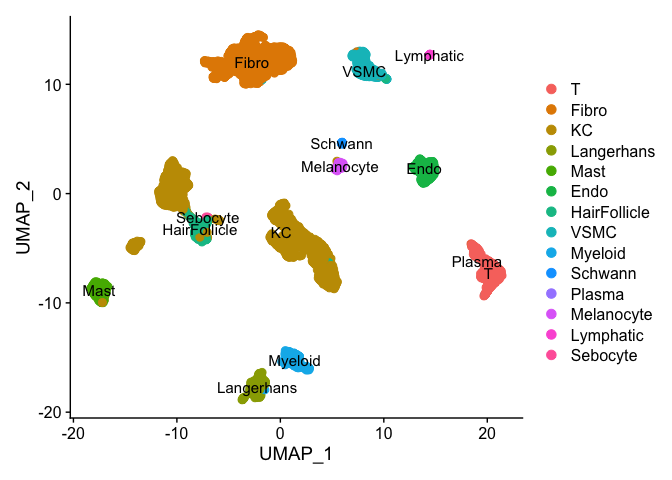
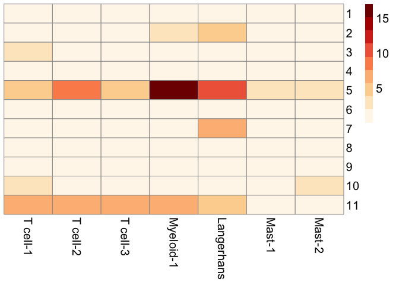
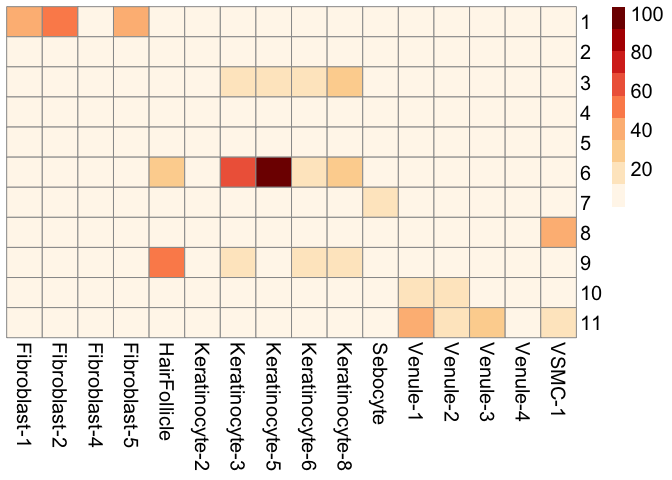
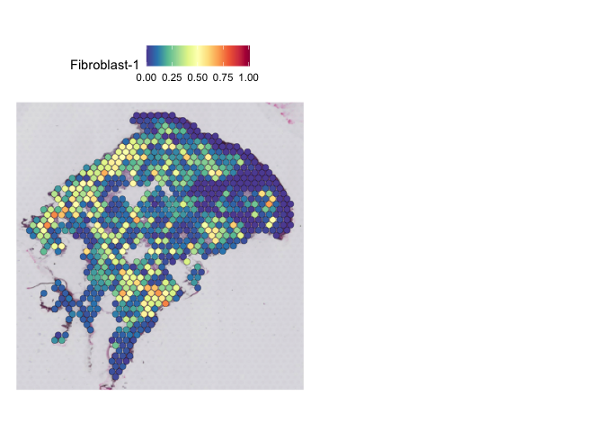
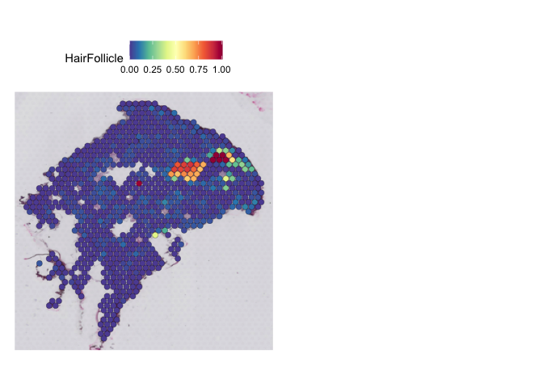
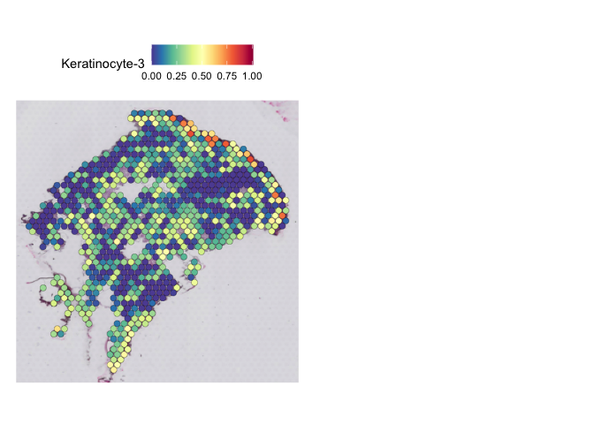
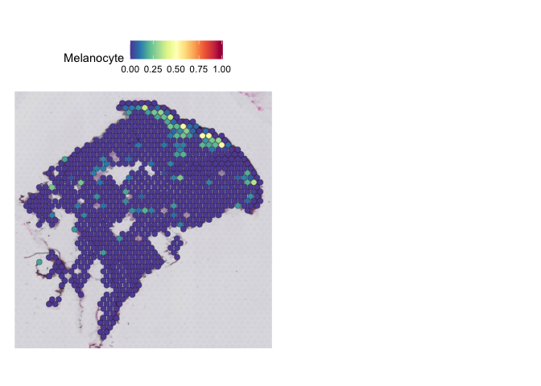
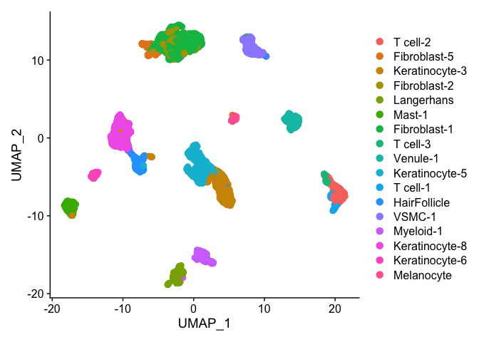
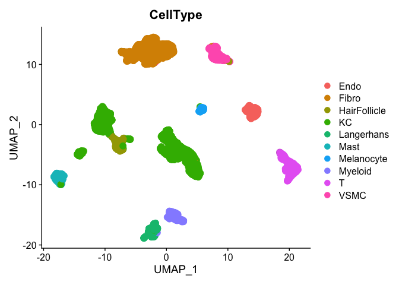

TRAVIS HUGHES et al single cell- healthy skin subset
================

# ST HEALTHY SAMPLES - PART 2

## Integration with TRAVIS HUGHES et al.

## (DOI - <https://doi.org/10.1016/j.immuni.2020.09.015>).

### Load all of the required packages

| FIGURE NO | LINK         |
|-----------|--------------|
| 2B        | [link](#2b)  |
| 3A        | [link](#3a)  |
| S3A       | [link](#s3a) |
| 1E        | [link](#1e)  |

``` r
library(tidyverse)
```

    ## Warning: package 'tidyverse' was built under R version 4.1.2

    ## ── Attaching packages ─────────────────────────────────────── tidyverse 1.3.2 ──
    ## ✔ ggplot2 3.4.0      ✔ purrr   0.3.5 
    ## ✔ tibble  3.1.8      ✔ dplyr   1.0.10
    ## ✔ tidyr   1.2.1      ✔ stringr 1.4.1 
    ## ✔ readr   2.1.3      ✔ forcats 0.5.2

    ## Warning: package 'ggplot2' was built under R version 4.1.2

    ## Warning: package 'tibble' was built under R version 4.1.2

    ## Warning: package 'tidyr' was built under R version 4.1.2

    ## Warning: package 'readr' was built under R version 4.1.2

    ## Warning: package 'purrr' was built under R version 4.1.2

    ## Warning: package 'dplyr' was built under R version 4.1.2

    ## Warning: package 'stringr' was built under R version 4.1.2

    ## Warning: package 'forcats' was built under R version 4.1.2

    ## ── Conflicts ────────────────────────────────────────── tidyverse_conflicts() ──
    ## ✖ dplyr::filter() masks stats::filter()
    ## ✖ dplyr::lag()    masks stats::lag()

``` r
library(Seurat)
```

    ## Warning: package 'Seurat' was built under R version 4.1.2

    ## Attaching SeuratObject
    ## Attaching sp

``` r
library(cowplot)
library(RColorBrewer)
```

    ## Warning: package 'RColorBrewer' was built under R version 4.1.2

``` r
library(pheatmap)
library(scales)
```

    ## Warning: package 'scales' was built under R version 4.1.2

    ## 
    ## Attaching package: 'scales'
    ## 
    ## The following object is masked from 'package:purrr':
    ## 
    ##     discard
    ## 
    ## The following object is masked from 'package:readr':
    ## 
    ##     col_factor

### Import functions from the custom R script

``` r
source("../SPATIAL_FUNCTIONS.R")
```

    ## Warning: package 'reticulate' was built under R version 4.1.2

    ## Warning: package 'clusterProfiler' was built under R version 4.1.1

    ## 

    ## Registered S3 method overwritten by 'ggtree':
    ##   method      from 
    ##   identify.gg ggfun

    ## clusterProfiler v4.0.5  For help: https://yulab-smu.top/biomedical-knowledge-mining-book/
    ## 
    ## If you use clusterProfiler in published research, please cite:
    ## T Wu, E Hu, S Xu, M Chen, P Guo, Z Dai, T Feng, L Zhou, W Tang, L Zhan, X Fu, S Liu, X Bo, and G Yu. clusterProfiler 4.0: A universal enrichment tool for interpreting omics data. The Innovation. 2021, 2(3):100141. doi: 10.1016/j.xinn.2021.100141

    ## 
    ## Attaching package: 'clusterProfiler'

    ## The following object is masked from 'package:purrr':
    ## 
    ##     simplify

    ## The following object is masked from 'package:stats':
    ## 
    ##     filter

    ## Loading required package: AnnotationDbi

    ## Loading required package: stats4

    ## Loading required package: BiocGenerics

    ## Warning: package 'BiocGenerics' was built under R version 4.1.1

    ## 
    ## Attaching package: 'BiocGenerics'

    ## The following objects are masked from 'package:dplyr':
    ## 
    ##     combine, intersect, setdiff, union

    ## The following objects are masked from 'package:stats':
    ## 
    ##     IQR, mad, sd, var, xtabs

    ## The following objects are masked from 'package:base':
    ## 
    ##     anyDuplicated, append, as.data.frame, basename, cbind, colnames,
    ##     dirname, do.call, duplicated, eval, evalq, Filter, Find, get, grep,
    ##     grepl, intersect, is.unsorted, lapply, Map, mapply, match, mget,
    ##     order, paste, pmax, pmax.int, pmin, pmin.int, Position, rank,
    ##     rbind, Reduce, rownames, sapply, setdiff, sort, table, tapply,
    ##     union, unique, unsplit, which.max, which.min

    ## Loading required package: Biobase

    ## Warning: package 'Biobase' was built under R version 4.1.1

    ## Welcome to Bioconductor
    ## 
    ##     Vignettes contain introductory material; view with
    ##     'browseVignettes()'. To cite Bioconductor, see
    ##     'citation("Biobase")', and for packages 'citation("pkgname")'.

    ## Loading required package: IRanges

    ## Warning: package 'IRanges' was built under R version 4.1.1

    ## Loading required package: S4Vectors

    ## Warning: package 'S4Vectors' was built under R version 4.1.3

    ## 
    ## Attaching package: 'S4Vectors'

    ## The following object is masked from 'package:clusterProfiler':
    ## 
    ##     rename

    ## The following objects are masked from 'package:dplyr':
    ## 
    ##     first, rename

    ## The following object is masked from 'package:tidyr':
    ## 
    ##     expand

    ## The following objects are masked from 'package:base':
    ## 
    ##     expand.grid, I, unname

    ## 
    ## Attaching package: 'IRanges'

    ## The following object is masked from 'package:clusterProfiler':
    ## 
    ##     slice

    ## The following object is masked from 'package:sp':
    ## 
    ##     %over%

    ## The following objects are masked from 'package:dplyr':
    ## 
    ##     collapse, desc, slice

    ## The following object is masked from 'package:purrr':
    ## 
    ##     reduce

    ## 
    ## Attaching package: 'AnnotationDbi'

    ## The following object is masked from 'package:clusterProfiler':
    ## 
    ##     select

    ## The following object is masked from 'package:dplyr':
    ## 
    ##     select

    ## 

### Load Color Palette Used for Downstream Plots

``` r
col.pal <- RColorBrewer::brewer.pal(9, "OrRd")
```

### Load Seurat object with healthy samples.

(*replace this with zenodo repo link for final release)*

``` r
#new.skin.combined <- readRDS("/Volumes/Extreme Pro/GITHUB-DATA/ST-DATA/HEALTHY-DATA/RDS-Files/HEALTHY_SKIN_SAMPLES_ST_CLUSTERS_LABELED.RDS")
new.skin.combined <- readRDS("/Volumes/Extreme Pro/GITHUB-DATA/ST-DATA/HEALTHY-DATA/RDS-Files/HEALTHY_SKIN_SAMPLES_ST.RDS")
```

### Load Seurat object + meta-data for scRNA data from Travis et al

(*replace this with zenodo repo link for final release)*

``` r
# Load Travis Data into Seurat Object
travis.sc.seu.obj <- readRDS("/Volumes/Extreme Pro/GITHUB-DATA/SC-RNA-DATA/TRAVIS-DATA/RDS-Files/Travis_Data_Seurat_Object.RDS")
```

``` r
# META DATA FROM TRAVIS Paper 
meta.data <- read.csv("/Volumes/Extreme Pro/GITHUB-DATA/SC-RNA-DATA/TRAVIS-DATA/Meta-Data/Cell_Level_Metadata.csv")
```

``` r
# Gather Travis Meta Data & Subset Psoriasis Data
skin.meta.data <- as.data.frame(travis.sc.seu.obj@meta.data) %>% rownames_to_column("CellID")
travis.sc.seu.obj@meta.data <- inner_join(x=skin.meta.data,y=meta.data,by="CellID") %>% column_to_rownames("CellID")

# Subset Data to have only Healthy Samples
travis_NM_skin_scRNA <- subset(travis.sc.seu.obj,subset = Condition == c("Normal"))
```

``` r
## PROCESS SC RNA DATA
travis_NM_skin_scRNA <- NormalizeData(travis_NM_skin_scRNA)
travis_NM_skin_scRNA <- FindVariableFeatures(travis_NM_skin_scRNA, selection.method = "vst", nfeatures = 2000)
travis_NM_skin_scRNA <- ScaleData(travis_NM_skin_scRNA)
travis_NM_skin_scRNA <- RunPCA(travis_NM_skin_scRNA, features = VariableFeatures(object = travis_NM_skin_scRNA))
travis_NM_skin_scRNA <- FindNeighbors(travis_NM_skin_scRNA, dims = 1:40)
travis_NM_skin_scRNA <- FindClusters(travis_NM_skin_scRNA, resolution = 1)
travis_NM_skin_scRNA <- RunUMAP(travis_NM_skin_scRNA, dims = 1:40)
```

Save the processed Seurat object to an RDS file for quick import.

``` r
#saveRDS(travis_NM_skin_scRNA, file = "/Volumes/Extreme Pro/GITHUB-DATA/SC-RNA-DATA/TRAVIS-DATA/RDS-Files/travis_NM_skin_scRNA.RDS")
```

Import the processed Seurat object

``` r
travis_NM_skin_scRNA <- readRDS("/Volumes/Extreme Pro/GITHUB-DATA/SC-RNA-DATA/TRAVIS-DATA/RDS-Files/travis_NM_skin_scRNA.RDS")
```

Plot UMAP for normal scRNA data

``` r
# Plot UMAP for Specific Cell Types Column in Meta Data
Idents(travis_NM_skin_scRNA) <- "Specific_CellType"
DimPlot(travis_NM_skin_scRNA,pt.size = 2.5,label = TRUE)
```

<!-- -->

``` r
# Plot UMAP for Cell Types Column in Meta Data
Idents(travis_NM_skin_scRNA) <- "CellType"
DimPlot(travis_NM_skin_scRNA,pt.size = 2.5,label = TRUE)
```

<!-- -->

### IDENTIFY MARKER GENES FOR ST DATA AND THE SC RNA DATA

``` r
# 1. Load Healthy Samples Spatial Markers Found in ST_HEALTHY_SAMPLES_PART_1
filtered_spatial_markers <- readRDS("/Volumes/Extreme Pro/GITHUB-DATA/ST-DATA/HEALTHY-DATA/RDS-Files/HEALTHY_ST_MARKERS.RDS")
```

``` r
# 2. Find All Markers from Travis Healthy Samples
Idents(travis_NM_skin_scRNA) <- "Specific_CellType"
single_cell.markers <- FindAllMarkers(travis_NM_skin_scRNA, assay = "RNA", logfc.threshold = 0.25)
#saveRDS(single_cell.markers, file="../../TRAVIS_scRNA_DATA/Travis_NM_skin_scRNA_markers.RDS")
```

``` r
# 3. Load Saved Single Cell Healthy Markers
single_cell.markers <- readRDS("/Volumes/Extreme Pro/GITHUB-DATA/SC-RNA-DATA/TRAVIS-DATA/RDS-Files/Travis_NM_skin_scRNA_markers.RDS")
```

``` r
# 4. Filter Single Cell Markers
filtered_single_cell.markers <- single_cell.markers %>% 
  filter(p_val_adj <= 0.05) %>% 
  group_by(cluster) %>% 
  top_n(n = 300, wt = avg_log2FC) %>% 
  filter(avg_log2FC > 0.25)
```

## Figure - 2B

### MIA ( Multi-modal intersection analysis)

#### original publication- (<https://doi.org/10.1038/s41587-019-0392-8>)

#### pre-computation parameters

#### Number of intersecting / common genes between ST and scRNA data -set as background genes.

``` r
##INTERSECT GENES BETWEEN scRNA and Spatial data
st.genes <- unique(rownames(new.skin.combined@assays$Spatial@counts))
sc.genes <- unique(rownames(travis_NM_skin_scRNA@assays$RNA@counts))
all.genes.scrna_and_spt <- unique(intersect(sc.genes, st.genes))
```

<a id="2b">

``` r
MIA_results <- MIA(total_genes = length(all.genes.scrna_and_spt), single_cell.markers = filtered_single_cell.markers,spatial.markers = filtered_spatial_markers)

E.data <- MIA_results %>% column_to_rownames("cluster")
E.data <- E.data[,order(colnames(E.data))]
pheatmap(E.data, cluster_cols = FALSE, cluster_rows = FALSE, fontsize=15, color = col.pal)
```

<!-- -->

</a>

## Figure - 3A

### Immune cell types

<a id="3a">

``` r
immune_only.E.data <- E.data[,c("T cell-1","T cell-2","T cell-3","Myeloid-1","Langerhans","Mast-1","Mast-2")]

#pdf(file = "MIA_regions_IMMUNE_CELLS.pdf",width = 10,height = 4)
pheatmap(immune_only.E.data,cluster_cols = FALSE,cluster_rows = FALSE,fontsize=15,color = col.pal)
```

<!-- -->

``` r
#dev.off()
```

</a>

### Strucutural cell types

``` r
structure_only.E_data <- E.data[,c("Fibroblast-1","Fibroblast-2","Fibroblast-4","Fibroblast-5","HairFollicle","Keratinocyte-2","Keratinocyte-3","Keratinocyte-5","Keratinocyte-6","Keratinocyte-8","Sebocyte","Venule-1","Venule-2","Venule-3","Venule-4","VSMC-1")]

#pdf(file = "MIA_regions_STRUCTURAL_CELLS.pdf",width = 10,height = 4)
pheatmap(structure_only.E_data,cluster_cols = FALSE,cluster_rows = FALSE,fontsize=15,color = col.pal)
```

<!-- -->

``` r
#dev.off()
```

### Calculate enrichment for each cell type (Using Seurat Anchor Integration)

``` r
# RUN THIS ON BIG PURPLE 
skin_reference.2 <- SCTransform(travis_NM_skin_scRNA, ncells = 3000, verbose = FALSE) %>% 
  RunPCA(verbose = FALSE) %>% 
  RunUMAP(dims = 1:40)

anchors <- FindTransferAnchors(reference = skin_reference.2, query = new.skin.combined, normalization.method = "SCT")
predictions.assay <- TransferData(anchorset = anchors, refdata = skin_reference.2$Specific_CellType, prediction.assay = TRUE, 
                                  weight.reduction = new.skin.combined[["pca"]], dims = 1:40)

new.skin.combined[["predictions_travis_data"]] <- predictions.assay
```

Color scale for cell type enrichment plots

``` r
SpatialColors <- colorRampPalette(colors = rev(x = brewer.pal(n = 11, name = "Spectral")))
cols <- SpatialColors(n = 100)
```

## Figure -1E

<a id="1e">

``` r
Cell_types <- c("Fibroblast-1","HairFollicle","Keratinocyte-5","Keratinocyte-3","Sebocyte","VSMC-1","Melanocyte")
DefaultAssay(new.skin.combined) <- "predictions_travis_data"

for (x in Cell_types){
  #pdf(file = paste("HEALTHY_FEMALE_1_R2_CELL_TYPE_",x,".pdf"),width = 10,height = 15)
  print(SpatialFeaturePlot(new.skin.combined, features = c(x), pt.size.factor = 2.5, ncol = 2, crop = TRUE, images = "HV2.S1.R2") +
    scale_fill_gradientn(colors=cols,limits = c(0, 1.01))) 
  #dev.off()
}
```

    ## Scale for fill is already present.
    ## Adding another scale for fill, which will replace the existing scale.
    ## Scale for fill is already present.
    ## Adding another scale for fill, which will replace the existing scale.

<!-- -->

    ## Scale for fill is already present.
    ## Adding another scale for fill, which will replace the existing scale.

<!-- -->

    ## Scale for fill is already present.
    ## Adding another scale for fill, which will replace the existing scale.

<!-- -->

    ## Scale for fill is already present.
    ## Adding another scale for fill, which will replace the existing scale.

<!-- -->

    ## Scale for fill is already present.
    ## Adding another scale for fill, which will replace the existing scale.

<!-- -->

    ## Scale for fill is already present.
    ## Adding another scale for fill, which will replace the existing scale.

<!-- --><!-- -->

</a>

### Overall cell frequencies in healthy subset data

``` r
cell.counts <- as.data.frame(table(travis_NM_skin_scRNA@meta.data$Specific_CellType))
#write.csv(cell.counts,"CELL_COUNTS_TRAVIS_HEALTHY_SKIN_DATA.csv")
```

### Filtered out cell types with less than 50 cells

``` r
# Filter Healthy Subset by Cell Types with 50 or mroe cells
filtered_cell.counts <- cell.counts %>% filter(Freq > 50) 
Idents(travis_NM_skin_scRNA) <- "Specific_CellType"
travis_healthy_data.subset <- subset(x = travis_NM_skin_scRNA, idents = c(filtered_cell.counts$Var1))

# Plot UMAP
DimPlot(travis_healthy_data.subset, pt.size = 2.5)
```

<!-- -->

### Supplementary Figure - S3A

<a id="s3a">

``` r
#pdf(width = 12,height=8,file = "UMAP_TRAVIS_DATA_HEALTHY_SAMPLES_ONLY.pdf")
DimPlot(travis_healthy_data.subset, pt.size = 3.5, group.by = "CellType")
```

<!-- -->

``` r
#dev.off()
```

</a>

### Data for Venn diagram - Figure 1F

``` r
# Venn Diagram Data Intersecting Spatial Cluster 5 with Myeloid-1 Cluster
cluster.5 <- filtered_spatial_markers %>% filter(cluster==5)
Myeloid.1 <- filtered_single_cell.markers %>% filter(cluster=="Myeloid-1")

length(intersect(cluster.5$gene,Myeloid.1$gene))
```

    ## [1] 16

``` r
# Venn Diagram Data Intersecting Spatial Cluster 6 with Keratinocyte-5 Cluster
cluster.6 <- filtered_spatial_markers %>% filter(cluster==6)
Keratinocyte.5 <- filtered_single_cell.markers %>% filter(cluster=="Keratinocyte-5")

length(intersect(cluster.6$gene,Keratinocyte.5$gene))
```

    ## [1] 71
