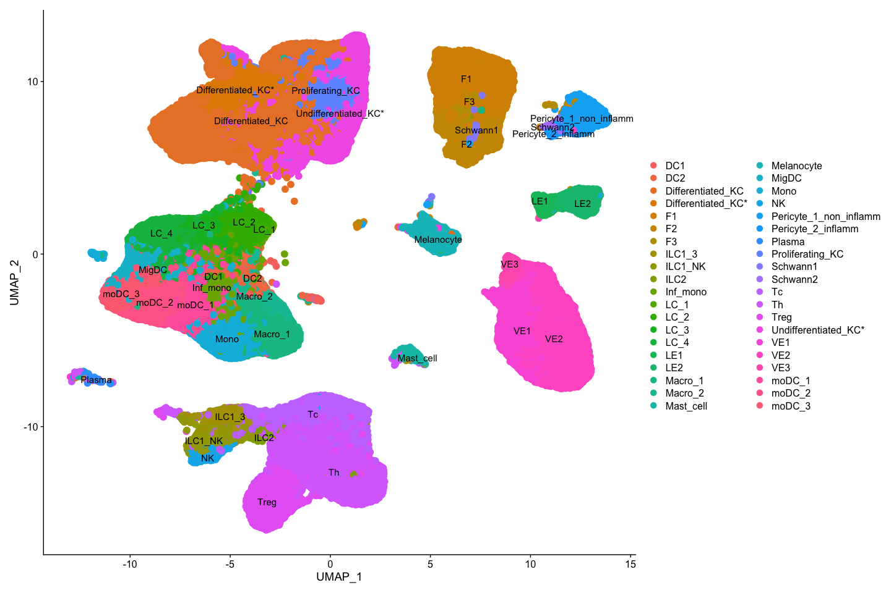
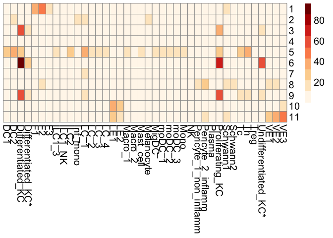
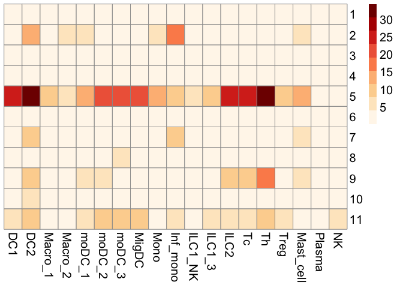
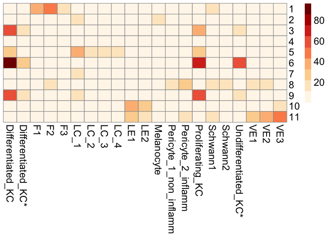

Hannifa et al. single cell - healthy skin data subset
================

# ST HEALTHY SAMPLES - PART 3

## Integration with REYNOLDS et al

## (DOI - <https://doi.org/10.1126/science.aba6500>).

| FIGURE NO | LINK         |
|-----------|--------------|
| 2B        | [link](#2b)  |
| 3A        | [link](#3a)  |
| S3A       | [link](#s3a) |

### Load all of the required packages

``` r
library(tidyverse)
```

    ## Warning: package 'tidyverse' was built under R version 4.1.2

    ## ── Attaching packages ─────────────────────────────────────── tidyverse 1.3.2 ──
    ## ✔ ggplot2 3.4.0      ✔ purrr   0.3.5 
    ## ✔ tibble  3.1.8      ✔ dplyr   1.0.10
    ## ✔ tidyr   1.2.1      ✔ stringr 1.4.1 
    ## ✔ readr   2.1.3      ✔ forcats 0.5.2

    ## Warning: package 'ggplot2' was built under R version 4.1.2

    ## Warning: package 'tibble' was built under R version 4.1.2

    ## Warning: package 'tidyr' was built under R version 4.1.2

    ## Warning: package 'readr' was built under R version 4.1.2

    ## Warning: package 'purrr' was built under R version 4.1.2

    ## Warning: package 'dplyr' was built under R version 4.1.2

    ## Warning: package 'stringr' was built under R version 4.1.2

    ## Warning: package 'forcats' was built under R version 4.1.2

    ## ── Conflicts ────────────────────────────────────────── tidyverse_conflicts() ──
    ## ✖ dplyr::filter() masks stats::filter()
    ## ✖ dplyr::lag()    masks stats::lag()

``` r
library(Seurat)
```

    ## Warning: package 'Seurat' was built under R version 4.1.2

    ## Attaching SeuratObject
    ## Attaching sp

``` r
library(cowplot)
library(RColorBrewer)
```

    ## Warning: package 'RColorBrewer' was built under R version 4.1.2

``` r
library(pheatmap)
library(scales)
```

    ## Warning: package 'scales' was built under R version 4.1.2

    ## 
    ## Attaching package: 'scales'
    ## 
    ## The following object is masked from 'package:purrr':
    ## 
    ##     discard
    ## 
    ## The following object is masked from 'package:readr':
    ## 
    ##     col_factor

### Import functions from the custom R script

``` r
source("../SPATIAL_FUNCTIONS.R")
```

    ## Warning: package 'reticulate' was built under R version 4.1.2

    ## Warning: package 'clusterProfiler' was built under R version 4.1.1

    ## 

    ## Registered S3 method overwritten by 'ggtree':
    ##   method      from 
    ##   identify.gg ggfun

    ## clusterProfiler v4.0.5  For help: https://yulab-smu.top/biomedical-knowledge-mining-book/
    ## 
    ## If you use clusterProfiler in published research, please cite:
    ## T Wu, E Hu, S Xu, M Chen, P Guo, Z Dai, T Feng, L Zhou, W Tang, L Zhan, X Fu, S Liu, X Bo, and G Yu. clusterProfiler 4.0: A universal enrichment tool for interpreting omics data. The Innovation. 2021, 2(3):100141. doi: 10.1016/j.xinn.2021.100141

    ## 
    ## Attaching package: 'clusterProfiler'

    ## The following object is masked from 'package:purrr':
    ## 
    ##     simplify

    ## The following object is masked from 'package:stats':
    ## 
    ##     filter

    ## Loading required package: AnnotationDbi

    ## Loading required package: stats4

    ## Loading required package: BiocGenerics

    ## Warning: package 'BiocGenerics' was built under R version 4.1.1

    ## 
    ## Attaching package: 'BiocGenerics'

    ## The following objects are masked from 'package:dplyr':
    ## 
    ##     combine, intersect, setdiff, union

    ## The following objects are masked from 'package:stats':
    ## 
    ##     IQR, mad, sd, var, xtabs

    ## The following objects are masked from 'package:base':
    ## 
    ##     anyDuplicated, append, as.data.frame, basename, cbind, colnames,
    ##     dirname, do.call, duplicated, eval, evalq, Filter, Find, get, grep,
    ##     grepl, intersect, is.unsorted, lapply, Map, mapply, match, mget,
    ##     order, paste, pmax, pmax.int, pmin, pmin.int, Position, rank,
    ##     rbind, Reduce, rownames, sapply, setdiff, sort, table, tapply,
    ##     union, unique, unsplit, which.max, which.min

    ## Loading required package: Biobase

    ## Warning: package 'Biobase' was built under R version 4.1.1

    ## Welcome to Bioconductor
    ## 
    ##     Vignettes contain introductory material; view with
    ##     'browseVignettes()'. To cite Bioconductor, see
    ##     'citation("Biobase")', and for packages 'citation("pkgname")'.

    ## Loading required package: IRanges

    ## Warning: package 'IRanges' was built under R version 4.1.1

    ## Loading required package: S4Vectors

    ## Warning: package 'S4Vectors' was built under R version 4.1.3

    ## 
    ## Attaching package: 'S4Vectors'

    ## The following object is masked from 'package:clusterProfiler':
    ## 
    ##     rename

    ## The following objects are masked from 'package:dplyr':
    ## 
    ##     first, rename

    ## The following object is masked from 'package:tidyr':
    ## 
    ##     expand

    ## The following objects are masked from 'package:base':
    ## 
    ##     expand.grid, I, unname

    ## 
    ## Attaching package: 'IRanges'

    ## The following object is masked from 'package:clusterProfiler':
    ## 
    ##     slice

    ## The following object is masked from 'package:sp':
    ## 
    ##     %over%

    ## The following objects are masked from 'package:dplyr':
    ## 
    ##     collapse, desc, slice

    ## The following object is masked from 'package:purrr':
    ## 
    ##     reduce

    ## 
    ## Attaching package: 'AnnotationDbi'

    ## The following object is masked from 'package:clusterProfiler':
    ## 
    ##     select

    ## The following object is masked from 'package:dplyr':
    ## 
    ##     select

    ## 

### Load Color Palette Used for Downstream Plots

``` r
col.pal <- RColorBrewer::brewer.pal(9, "OrRd")
```

### Load processed single cell R data.

(*replace this with zenodo repo link for final release)*

``` r
load("../../scRNA_DATA/HEALTHY_SC_RNA_PROCESSED.RData")
```

### UMAP plot for healthy skin data

### (Using final_clustering labels from the original manuscript)

### Remove unlabeled cells (NAN) from the dataset

``` r
healthy_skin.sc_data <- FindNeighbors(healthy_skin.sc_data, dims = 1:40)
healthy_skin.sc_data <- FindClusters(healthy_skin.sc_data, verbose = FALSE,resolution = 1)
healthy_skin.sc_data <- RunUMAP(healthy_skin.sc_data, dims = 1:40)

Idents(healthy_skin.sc_data) <- "final_clustering"
healthy_skin.sc_data <- subset(healthy_skin.sc_data, idents = c("nan"), invert=TRUE)

saveRDS(healthy_skin.sc_data, "/Volumes/Extreme Pro//GITHUB-DATA/SC-RNA-DATA/HANIFFA-DATA/RDS-Files/healthy_skin.sc_data_HNF.RDS")
```

### Import the processed data

``` r
# 1. Healthy Samples Only Hannifa Data
healthy_skin.sc_data <- readRDS("/Volumes/Extreme Pro//GITHUB-DATA/SC-RNA-DATA/HANIFFA-DATA/RDS-Files/healthy_skin.sc_data_HNF.RDS")

# 2. Heqlthy ST Data
new.skin.combined <- readRDS("/Volumes/Extreme Pro//GITHUB-DATA/ST-DATA/HEALTHY-DATA/RDS-Files/HEALTHY_SKIN_SAMPLES_ST.RDS")

# 3. Filtered Healthy ST Markers
filtered_spatial_markers <- readRDS("/Volumes/Extreme Pro//GITHUB-DATA/ST-DATA/HEALTHY-DATA/RDS-Files/HEALTHY_ST_MARKERS.RDS")
```

<a id="s3a">

### Supplementary Figure S3A

</a>

``` r
DimPlot(healthy_skin.sc_data, pt.size = 3.5, raster=FALSE, label = TRUE)
```

<!-- -->

### Identify marker genes for the final_clustering labels

``` r
Idents(healthy_skin.sc_data) <- "final_clustering"
hnf_skin_scRNA.markers <- FindAllMarkers(healthy_skin.sc_data,assay = "RNA",logfc.threshold = 0.25,max.cells.per.ident=400, only.pos = TRUE)

write.csv(hnf_skin_scRNA.markers, "/Volumes/Extreme Pro//GITHUB-DATA/SC-RNA-DATA/HANIFFA-DATA/Meta-Data/HANNIFA_MARKERS.csv")
```

### Load marker genes from the saved file for later use

``` r
hnf_skin_scRNA.markers <- read.csv("/Volumes/Extreme Pro//GITHUB-DATA/SC-RNA-DATA/HANIFFA-DATA/Meta-Data/HANNIFA_MARKERS.csv") %>% 
  filter(p_val_adj <= 0.05) %>% 
  group_by(cluster) %>% 
  top_n(n = 300, wt = avg_log2FC) %>% 
  filter(avg_log2FC > 0.25)
```

### Cell counts / frequency for each cell type in the processed Seurat object

``` r
hnf_data_counts <- as.data.frame(table(healthy_skin.sc_data@meta.data$final_clustering))
#write.csv(hnf_data_counts, file="HEALTHY_SAMPLES_HANNIFA_DATA_COUNTS.csv")
```

### MIA ( Multi-modal intersection analysis)

### original publication- (<https://doi.org/10.1038/s41587-019-0392-8>)

#### pre-computation parameters

#### Number of intersecting / common genes between ST and scRNA data -set as background genes.

``` r
##INTERSECT GENES BETWEEN scRNA and Spatial data
st.genes <- unique(rownames(new.skin.combined@assays$Spatial@counts))
sc.genes <- unique(rownames(healthy_skin.sc_data@assays$RNA@counts))
all.genes.scrna_and_spt <- unique(intersect(sc.genes,st.genes))
```

### Calculate cell type enrichment scores for all cell types in the dataset - healthy sample data only

Top 300 marker genes per cell type / spatial region

``` r
# Run MIA Results
MIA_results_PART_2 <- MIA(total_genes = length(all.genes.scrna_and_spt), single_cell.markers = hnf_skin_scRNA.markers, spatial.markers = filtered_spatial_markers)
 
# Order MIA results & Filter NAs
E.data_PART_2 <- MIA_results_PART_2 %>% column_to_rownames("cluster")
E.data_PART_2 <- E.data_PART_2[ ,order(colnames(E.data_PART_2))]
is.na(E.data_PART_2) <- do.call(cbind, lapply(E.data_PART_2, is.infinite))

# Plot MIA Cell Type Enrichment Heat Map
pheatmap(E.data_PART_2, cluster_cols = FALSE, cluster_rows = FALSE, fontsize=15, color = col.pal)
```

<!-- -->

### Figure 2B <a id="2b">

### Immune cell types only (MIA Heatmap)

``` r
## IMMUNE CELLS
immune_only.E.data_PART_2 <- E.data_PART_2[ ,c("DC1","DC2","Macro_1","Macro_2","moDC_1","moDC_2","moDC_3","MigDC","Mono","Inf_mono","ILC1_NK","ILC1_3","ILC2","Tc","Th","Treg","Mast_cell","Plasma","NK")] 
immune_only.E.data_PART_2[is.na(immune_only.E.data_PART_2)] <- 0

#pdf(file = "MIA_regions_(HANNIFA_PAPER)_IMMUNE_CELLS.pdf",width = 10,height = 5)
pheatmap(immune_only.E.data_PART_2, cluster_cols = FALSE, cluster_rows = FALSE, fontsize=15, color = col.pal)
```

<!-- -->

``` r
#dev.off() 
```

### Non-Immune / Structural cell types

``` r
non_immune_only.E.data_PART_2 <- E.data_PART_2 %>% dplyr::select(-c("DC1","DC2","Macro_1","Macro_2","moDC_1","moDC_2","moDC_3","MigDC","Mono","Inf_mono","ILC1_NK","ILC1_3","ILC2","Tc","Th","Treg","Mast_cell","Plasma","NK"))

#pdf(file = "MIA_regions_(HANNIFA_PAPER)_NON_IMMUNE_CELLS.pdf",width = 10,height = 5)
pheatmap(non_immune_only.E.data_PART_2, cluster_cols = FALSE, cluster_rows = FALSE, fontsize=15, color = col.pal)
```

<!-- -->

``` r
#dev.off() 
```
