# Niche Net LR Interactions

## LIGAND-RECEPTOR ANALYSIS USING NICHE-NET

| FIGURE NO                                                                                           | DESCRIPTION                                                                         |
|-----------------------------------------------------------------------------------------------------|-------------------------------------------------------------------------------------|
| [Cluster 4 - Epidermis (Receptor)](#cluster-4---epidermis-receptor)                                 | Circos plot visualization - cluster 4 receptor with clusters 7, 3 and 10 as ligand. |
| [Cluster 7 - Epidermis (Receptor)](#cluster-7---epidermis-receptor)                                 | Circos plot visualization - cluster 7 receptor with clusters 10, 3 and 4 as ligand. |
| [Cluster 10 - Suprabasal keratinocytes (Receptor)](#cluster-10---suprabasal-keratinocytes-receptor) | Circos plot visualization - cluster 10 receptor with clusters 7, 3 and 4 as ligand. |

``` r
library(nichenetr)
library(Seurat) # please update to Seurat V4
```

    ## Warning: package 'Seurat' was built under R version 4.1.2

    ## Attaching SeuratObject

    ## Attaching sp

``` r
library(tidyverse)
```

    ## Warning: package 'tidyverse' was built under R version 4.1.2

    ## ── Attaching packages
    ## ───────────────────────────────────────
    ## tidyverse 1.3.2 ──

    ## ✔ ggplot2 3.4.0      ✔ purrr   0.3.5 
    ## ✔ tibble  3.1.8      ✔ dplyr   1.0.10
    ## ✔ tidyr   1.2.1      ✔ stringr 1.4.1 
    ## ✔ readr   2.1.3      ✔ forcats 0.5.2

    ## Warning: package 'ggplot2' was built under R version 4.1.2

    ## Warning: package 'tibble' was built under R version 4.1.2

    ## Warning: package 'tidyr' was built under R version 4.1.2

    ## Warning: package 'readr' was built under R version 4.1.2

    ## Warning: package 'purrr' was built under R version 4.1.2

    ## Warning: package 'dplyr' was built under R version 4.1.2

    ## Warning: package 'stringr' was built under R version 4.1.2

    ## Warning: package 'forcats' was built under R version 4.1.2

    ## ── Conflicts ────────────────────────────────────────── tidyverse_conflicts() ──
    ## ✖ dplyr::filter() masks stats::filter()
    ## ✖ dplyr::lag()    masks stats::lag()

Please check the original vignette from NichNet Official Documentation for more information -

(<https://github.com/saeyslab/nichenetr/blob/master/vignettes/differential_nichenet.md>)

#1. Load Seurat object and the relevant reference data for NicheNet

``` r
skin_data.hm.sct <- readRDS("/Volumes/Extreme Pro/GITHUB-DATA/ST-DATA/PSORIASIS-DATA/RDS-Files/ALL_SPATIAL_SAMPLES(HM_BATCH_CORRECTED).RDS")
```

``` r
ligand_target_matrix = readRDS(url("https://zenodo.org/record/3260758/files/ligand_target_matrix.rds"))
lr_network = readRDS(url("https://zenodo.org/record/3260758/files/lr_network.rds"))
lr_network = lr_network %>% mutate(bonafide = ! database %in% c("ppi_prediction","ppi_prediction_go"))
lr_network = lr_network %>% dplyr::rename(ligand = from, receptor = to) %>% distinct(ligand, receptor, bonafide)
```

``` r
organism = "human" 

niches = list(
    "4Epidermis_niche" = list(
      "sender" = c("7 Epidermis", "3 Epidermis", "10 Suprabasal keratinocytes"),
      "receiver" = "4 Epidermis"),
    "7Epidermis_niche" = list(
      "sender" = c("4 Epidermis","3 Epidermis", "10 Suprabasal keratinocytes"),
      "receiver" = "7 Epidermis"),
    "3Epidermis_niche" = list(
      "sender" = c("4 Epidermis","7 Epidermis", "10 Suprabasal keratinocytes"),
      "receiver" = "3 Epidermis"),
    "10Suprabasal_niche" = list(
      "sender" = c("4 Epidermis","7 Epidermis", "3 Epidermis"),
      "receiver" = "10 Suprabasal keratinocytes")
  )
```

#2. Calculate differential expression between the niches

``` r
assay_oi = "Spatial" # other possibilities: RNA,...
skin_data.hm.sct <- NormalizeData(skin_data.hm.sct,assay = "Spatial")
Idents(skin_data.hm.sct) <- "Spatial.regions"
DE_sender = calculate_niche_de(seurat_obj = skin_data.hm.sct %>% subset(features = lr_network$ligand %>% intersect(rownames(skin_data.hm.sct))), niches = niches, type = "sender", assay_oi = assay_oi) # only ligands important for sender cell types
```

    ## [1] "Calculate Sender DE between: 7 Epidermis and 4 Epidermis"
    ## [1] "Calculate Sender DE between: 3 Epidermis and 4 Epidermis"
    ## [1] "Calculate Sender DE between: 10 Suprabasal keratinocytes and 4 Epidermis"
    ## [1] "Calculate Sender DE between: 4 Epidermis and 7 Epidermis"
    ## [1] "Calculate Sender DE between: 3 Epidermis and 7 Epidermis"
    ## [1] "Calculate Sender DE between: 10 Suprabasal keratinocytes and 7 Epidermis"
    ## [1] "Calculate Sender DE between: 4 Epidermis and 3 Epidermis"
    ## [1] "Calculate Sender DE between: 7 Epidermis and 3 Epidermis"
    ## [1] "Calculate Sender DE between: 10 Suprabasal keratinocytes and 3 Epidermis"
    ## [1] "Calculate Sender DE between: 4 Epidermis and 10 Suprabasal keratinocytes"
    ## [1] "Calculate Sender DE between: 7 Epidermis and 10 Suprabasal keratinocytes"
    ## [1] "Calculate Sender DE between: 3 Epidermis and 10 Suprabasal keratinocytes"

``` r
DE_receiver = calculate_niche_de(seurat_obj = skin_data.hm.sct %>% subset(features = lr_network$receptor %>% unique()), niches = niches, type = "receiver", assay_oi = assay_oi) # only receptors now, later on: DE analysis to find targets
```

    ## # A tibble: 6 × 2
    ##   receiver    receiver_other_niche       
    ##   <chr>       <chr>                      
    ## 1 4 Epidermis 7 Epidermis                
    ## 2 4 Epidermis 3 Epidermis                
    ## 3 4 Epidermis 10 Suprabasal keratinocytes
    ## 4 7 Epidermis 3 Epidermis                
    ## 5 7 Epidermis 10 Suprabasal keratinocytes
    ## 6 3 Epidermis 10 Suprabasal keratinocytes
    ## [1] "Calculate receiver DE between: 4 Epidermis and 7 Epidermis"                
    ## [2] "Calculate receiver DE between: 4 Epidermis and 3 Epidermis"                
    ## [3] "Calculate receiver DE between: 4 Epidermis and 10 Suprabasal keratinocytes"
    ## [1] "Calculate receiver DE between: 7 Epidermis and 4 Epidermis"                
    ## [2] "Calculate receiver DE between: 7 Epidermis and 3 Epidermis"                
    ## [3] "Calculate receiver DE between: 7 Epidermis and 10 Suprabasal keratinocytes"
    ## [1] "Calculate receiver DE between: 3 Epidermis and 4 Epidermis"                
    ## [2] "Calculate receiver DE between: 3 Epidermis and 7 Epidermis"                
    ## [3] "Calculate receiver DE between: 3 Epidermis and 10 Suprabasal keratinocytes"
    ## [1] "Calculate receiver DE between: 10 Suprabasal keratinocytes and 4 Epidermis"
    ## [2] "Calculate receiver DE between: 10 Suprabasal keratinocytes and 7 Epidermis"
    ## [3] "Calculate receiver DE between: 10 Suprabasal keratinocytes and 3 Epidermis"

``` r
expression_pct = 0.10
DE_sender_processed = process_niche_de(DE_table = DE_sender, niches = niches, expression_pct = expression_pct, type = "sender")
DE_receiver_processed = process_niche_de(DE_table = DE_receiver, niches = niches, expression_pct = expression_pct, type = "receiver")
```

``` r
specificity_score_LR_pairs = "min_lfc"
DE_sender_receiver = combine_sender_receiver_de(DE_sender_processed, DE_receiver_processed, lr_network, specificity_score = specificity_score_LR_pairs)
```

``` r
include_spatial_info_sender = FALSE # if not spatial info to include: put this to false 
include_spatial_info_receiver = FALSE # if spatial info to include: put this to true 
```

#3. Optional: Calculate differential expression between the different spatial regions

(Ignored here as we are only using spatial transcriptomics (10X genomics, Visium assay))

``` r
# NOT USABLE SINCE WE ONLY HAVE ST DATASET AND NOT THE CORRESPONDING SC RNA DATASET FROM THE SAME SAMPLES
include_spatial_info_sender = FALSE  
include_spatial_info_receiver = FALSE 
```

``` r
# this is how this should be defined if you don't have spatial info
# mock spatial info
if(include_spatial_info_sender == FALSE & include_spatial_info_receiver == FALSE){
    spatial_info = tibble(celltype_region_oi = NA, celltype_other_region = NA) %>% mutate(niche =  niches %>% names() %>% head(1), celltype_type = "sender")
} 
```

``` r
if(include_spatial_info_sender == TRUE){
  sender_spatial_DE = calculate_spatial_DE(seurat_obj = seurat_obj %>% subset(features = lr_network$ligand %>% unique()), spatial_info = spatial_info %>% filter(celltype_type == "sender"))
  sender_spatial_DE_processed = process_spatial_de(DE_table = sender_spatial_DE, type = "sender", lr_network = lr_network, expression_pct = expression_pct, specificity_score = specificity_score_spatial)

  # add a neutral spatial score for sender celltypes in which the spatial is not known / not of importance
  sender_spatial_DE_others = get_non_spatial_de(niches = niches, spatial_info = spatial_info, type = "sender", lr_network = lr_network)
  sender_spatial_DE_processed = sender_spatial_DE_processed %>% bind_rows(sender_spatial_DE_others)

  sender_spatial_DE_processed = sender_spatial_DE_processed %>% mutate(scaled_ligand_score_spatial = scale_quantile_adapted(ligand_score_spatial))

} else {
  # # add a neutral spatial score for all sender celltypes (for none of them, spatial is relevant in this case)
  sender_spatial_DE_processed = get_non_spatial_de(niches = niches, spatial_info = spatial_info, type = "sender", lr_network = lr_network)
  sender_spatial_DE_processed = sender_spatial_DE_processed %>% mutate(scaled_ligand_score_spatial = scale_quantile_adapted(ligand_score_spatial))  

}
```

``` r
if(include_spatial_info_receiver == TRUE){
  receiver_spatial_DE = calculate_spatial_DE(seurat_obj = seurat_obj %>% subset(features = lr_network$receptor %>% unique()), spatial_info = spatial_info %>% filter(celltype_type == "receiver"))
  receiver_spatial_DE_processed = process_spatial_de(DE_table = receiver_spatial_DE, type = "receiver", lr_network = lr_network, expression_pct = expression_pct, specificity_score = specificity_score_spatial)

  # add a neutral spatial score for receiver celltypes in which the spatial is not known / not of importance
  receiver_spatial_DE_others = get_non_spatial_de(niches = niches, spatial_info = spatial_info, type = "receiver", lr_network = lr_network)
  receiver_spatial_DE_processed = receiver_spatial_DE_processed %>% bind_rows(receiver_spatial_DE_others)

  receiver_spatial_DE_processed = receiver_spatial_DE_processed %>% mutate(scaled_receptor_score_spatial = scale_quantile_adapted(receptor_score_spatial))

} else {
    # # add a neutral spatial score for all receiver celltypes (for none of them, spatial is relevant in this case)
  receiver_spatial_DE_processed = get_non_spatial_de(niches = niches, spatial_info = spatial_info, type = "receiver", lr_network = lr_network)
  receiver_spatial_DE_processed = receiver_spatial_DE_processed %>% mutate(scaled_receptor_score_spatial = scale_quantile_adapted(receptor_score_spatial))
}
```

#4. Calculate ligand activities and infer active ligand-target links

``` r
lfc_cutoff = 0.15 # recommended for 10x as min_lfc cutoff. 
specificity_score_targets = "min_lfc"

DE_receiver_targets = calculate_niche_de_targets(seurat_obj = skin_data.hm.sct, niches = niches, lfc_cutoff = lfc_cutoff, expression_pct = expression_pct, assay_oi = assay_oi) %>% dplyr::filter(p_val_adj<=0.1)
```

    ## [1] "Calculate receiver DE between: 4 Epidermis and 7 Epidermis"                
    ## [2] "Calculate receiver DE between: 4 Epidermis and 3 Epidermis"                
    ## [3] "Calculate receiver DE between: 4 Epidermis and 10 Suprabasal keratinocytes"
    ## [1] "Calculate receiver DE between: 7 Epidermis and 4 Epidermis"                
    ## [2] "Calculate receiver DE between: 7 Epidermis and 3 Epidermis"                
    ## [3] "Calculate receiver DE between: 7 Epidermis and 10 Suprabasal keratinocytes"
    ## [1] "Calculate receiver DE between: 3 Epidermis and 4 Epidermis"                
    ## [2] "Calculate receiver DE between: 3 Epidermis and 7 Epidermis"                
    ## [3] "Calculate receiver DE between: 3 Epidermis and 10 Suprabasal keratinocytes"
    ## [1] "Calculate receiver DE between: 10 Suprabasal keratinocytes and 4 Epidermis"
    ## [2] "Calculate receiver DE between: 10 Suprabasal keratinocytes and 7 Epidermis"
    ## [3] "Calculate receiver DE between: 10 Suprabasal keratinocytes and 3 Epidermis"

``` r
DE_receiver_processed_targets = process_receiver_target_de(DE_receiver_targets = DE_receiver_targets, niches = niches, expression_pct = expression_pct, specificity_score = specificity_score_targets) 
  
background = DE_receiver_processed_targets  %>% pull(target) %>% unique()

geneset_4Epidermis = DE_receiver_processed_targets %>% filter(receiver == niches$`4Epidermis_niche`$receiver & target_score >= lfc_cutoff & target_significant == 1 & target_present == 1) %>% pull(target) %>% unique()


geneset_7Epidermis = DE_receiver_processed_targets %>% filter(receiver == niches$`7Epidermis_niche`$receiver & target_score >= lfc_cutoff & target_significant == 1 & target_present == 1) %>% pull(target) %>% unique()

geneset_3Epidermis = DE_receiver_processed_targets %>% filter(receiver == niches$`3Epidermis_niche`$receiver & target_score >= lfc_cutoff & target_significant == 1 & target_present == 1) %>% pull(target) %>% unique()

geneset_10Suprabasal = DE_receiver_processed_targets %>% filter(receiver == niches$`10Suprabasal_niche`$receiver & target_score >= lfc_cutoff & target_significant == 1 & target_present == 1) %>% pull(target) %>% unique()
```

``` r
top_n_target = 250

niche_geneset_list = list(
    "4Epidermis_niche" = list(
      "receiver" = "4 Epidermis",
      "geneset" = geneset_4Epidermis,
      "background" = background),
    "7Epidermis_niche" = list(
      "receiver" = "7 Epidermis",
      "geneset" = geneset_7Epidermis ,
      "background" = background),
    "3Epidermis_niche" = list(
      "receiver" = "3 Epidermis",
      "geneset" = geneset_3Epidermis ,
      "background" = background),
    "10Suprabasal_niche" = list(
      "receiver" = "10 Suprabasal keratinocytes",
      "geneset" = geneset_10Suprabasal ,
      "background" = background)
  )
  
ligand_activities_targets = get_ligand_activities_targets(niche_geneset_list = niche_geneset_list, ligand_target_matrix = ligand_target_matrix, top_n_target = top_n_target)
```

    ## [1] "Calculate Ligand activities for: 4 Epidermis"

    ## Warning in evaluate_target_prediction(setting, ligand_target_matrix,
    ## ligands_position): all target gene probability score predictions have same value

    ## Warning in cor(prediction, response): the standard deviation is zero

    ## Warning in cor(prediction, response, method = "s"): the standard deviation is
    ## zero

    ## [1] "Calculate Ligand activities for: 7 Epidermis"

    ## Warning in evaluate_target_prediction(setting, ligand_target_matrix,
    ## ligands_position): all target gene probability score predictions have same value

    ## Warning in cor(prediction, response): the standard deviation is zero

    ## Warning in cor(prediction, response, method = "s"): the standard deviation is
    ## zero

    ## [1] "Calculate Ligand activities for: 3 Epidermis"

    ## Warning in evaluate_target_prediction(setting, ligand_target_matrix,
    ## ligands_position): all target gene probability score predictions have same value

    ## Warning in cor(prediction, response): the standard deviation is zero

    ## Warning in cor(prediction, response, method = "s"): the standard deviation is
    ## zero

    ## [1] "Calculate Ligand activities for: 10 Suprabasal keratinocytes"

    ## Warning in evaluate_target_prediction(setting, ligand_target_matrix,
    ## ligands_position): all target gene probability score predictions have same value

    ## Warning in cor(prediction, response): the standard deviation is zero

    ## Warning in cor(prediction, response, method = "s"): the standard deviation is
    ## zero

#5. Calculate (scaled) expression of ligands, receptors and targets across cell types of interest (log expression values and expression fractions)

``` r
features_oi = union(lr_network$ligand, lr_network$receptor) %>% union(ligand_activities_targets$target) %>% setdiff(NA)
  
dotplot = suppressWarnings(Seurat::DotPlot(skin_data.hm.sct %>% subset(idents = niches %>% unlist() %>% unique()), features = features_oi, assay = assay_oi))
exprs_tbl = dotplot$data %>% as_tibble()
exprs_tbl = exprs_tbl %>% dplyr::rename(celltype = id, gene = features.plot, expression = avg.exp, expression_scaled = avg.exp.scaled, fraction = pct.exp) %>%
    mutate(fraction = fraction/100) %>% as_tibble() %>% dplyr::select(celltype, gene, expression, expression_scaled, fraction) %>% distinct() %>% arrange(gene) %>% mutate(gene = as.character(gene))
  
exprs_tbl_ligand = exprs_tbl %>% filter(gene %in% lr_network$ligand) %>% dplyr::rename(sender = celltype, ligand = gene, ligand_expression = expression, ligand_expression_scaled = expression_scaled, ligand_fraction = fraction) 
exprs_tbl_receptor = exprs_tbl %>% filter(gene %in% lr_network$receptor) %>% dplyr::rename(receiver = celltype, receptor = gene, receptor_expression = expression, receptor_expression_scaled = expression_scaled, receptor_fraction = fraction)
exprs_tbl_target = exprs_tbl %>% filter(gene %in% ligand_activities_targets$target) %>% dplyr::rename(receiver = celltype, target = gene, target_expression = expression, target_expression_scaled = expression_scaled, target_fraction = fraction)
```

``` r
exprs_tbl_ligand = exprs_tbl_ligand %>%  mutate(scaled_ligand_expression_scaled = scale_quantile_adapted(ligand_expression_scaled)) %>% mutate(ligand_fraction_adapted = ligand_fraction) %>% mutate_cond(ligand_fraction >= expression_pct, ligand_fraction_adapted = expression_pct)  %>% mutate(scaled_ligand_fraction_adapted = scale_quantile_adapted(ligand_fraction_adapted))

exprs_tbl_receptor = exprs_tbl_receptor %>% mutate(scaled_receptor_expression_scaled = scale_quantile_adapted(receptor_expression_scaled))  %>% mutate(receptor_fraction_adapted = receptor_fraction) %>% mutate_cond(receptor_fraction >= expression_pct, receptor_fraction_adapted = expression_pct)  %>% mutate(scaled_receptor_fraction_adapted = scale_quantile_adapted(receptor_fraction_adapted))
```

#6. Expression fraction and receptor

``` r
exprs_sender_receiver = lr_network %>% 
  inner_join(exprs_tbl_ligand, by = c("ligand")) %>% 
  inner_join(exprs_tbl_receptor, by = c("receptor")) %>% inner_join(DE_sender_receiver %>% distinct(niche, sender, receiver))
```

    ## Joining, by = c("sender", "receiver")

``` r
ligand_scaled_receptor_expression_fraction_df = exprs_sender_receiver %>% group_by(ligand, receiver) %>% mutate(rank_receptor_expression = dense_rank(receptor_expression), rank_receptor_fraction  = dense_rank(receptor_fraction)) %>% mutate(ligand_scaled_receptor_expression_fraction = 0.5*( (rank_receptor_fraction / max(rank_receptor_fraction)) + ((rank_receptor_expression / max(rank_receptor_expression))) ) )  %>% distinct(ligand, receptor, receiver, ligand_scaled_receptor_expression_fraction, bonafide) %>% distinct() %>% ungroup() 
```

``` r
prioritizing_weights = c("scaled_ligand_score" = 5,
                         "scaled_ligand_expression_scaled" = 1,
                         "ligand_fraction" = 1,
                         "scaled_ligand_score_spatial" = 2, 
                         "scaled_receptor_score" = 0.5,
                         "scaled_receptor_expression_scaled" = 0.5,
                          "receptor_fraction" = 1, 
                         "ligand_scaled_receptor_expression_fraction" = 1,
                         "scaled_receptor_score_spatial" = 0,
                         "scaled_activity" = 0,
                         "scaled_activity_normalized" = 1,
                         "bona_fide" = 1)
output = list(DE_sender_receiver = DE_sender_receiver, ligand_scaled_receptor_expression_fraction_df = ligand_scaled_receptor_expression_fraction_df, sender_spatial_DE_processed = sender_spatial_DE_processed, receiver_spatial_DE_processed = receiver_spatial_DE_processed,
         ligand_activities_targets = ligand_activities_targets, DE_receiver_processed_targets = DE_receiver_processed_targets, exprs_tbl_ligand = exprs_tbl_ligand,  exprs_tbl_receptor = exprs_tbl_receptor, exprs_tbl_target = exprs_tbl_target)
prioritization_tables = get_prioritization_tables(output, prioritizing_weights)
```

``` r
top_ligand_niche_df = prioritization_tables$prioritization_tbl_ligand_receptor %>% dplyr::select(niche, sender, receiver, ligand, receptor, prioritization_score) %>% group_by(ligand) %>% top_n(1, prioritization_score) %>% ungroup() %>% dplyr::select(ligand, receptor, niche) %>% dplyr::rename(top_niche = niche)
top_ligand_receptor_niche_df = prioritization_tables$prioritization_tbl_ligand_receptor %>% dplyr::select(niche, sender, receiver, ligand, receptor, prioritization_score) %>% group_by(ligand, receptor) %>% top_n(1, prioritization_score) %>% ungroup() %>% dplyr::select(ligand, receptor, niche) %>% dplyr::rename(top_niche = niche)

ligand_prioritized_tbl_oi = prioritization_tables$prioritization_tbl_ligand_receptor %>% dplyr::select(niche, sender, receiver, ligand, prioritization_score) %>% group_by(ligand, niche) %>% top_n(1, prioritization_score) %>% ungroup() %>% distinct() %>% inner_join(top_ligand_niche_df) %>% filter(niche == top_niche) %>% group_by(niche) %>% top_n(50, prioritization_score) %>% ungroup() # get the top50 ligands per niche
```

    ## Joining, by = "ligand"

``` r
## INLCUDES NON-BONAFIDE INTERACTIONS
full_prioritized_tbl_oi = prioritization_tables$prioritization_tbl_ligand_receptor %>% dplyr::select(niche, sender, receiver, ligand, receptor, prioritization_score,bonafide,ligand_receptor) %>% group_by(ligand, niche) 

write.csv(full_prioritized_tbl_oi,"FULL_PSCORE_TABLE.csv")

## ONLY BONDAFIDE INTERACTIONS
full_prioritized_tbl_oi_only_bonafide = prioritization_tables$prioritization_tbl_ligand_receptor %>% dplyr::select(niche, sender, receiver, ligand, receptor, prioritization_score,bonafide,ligand_receptor) %>% group_by(ligand, niche) %>% filter(bonafide=="TRUE")
write.csv(full_prioritized_tbl_oi_only_bonafide,"BONAFIDE_ONLY_PSCORE_TABLE.csv")
```

Full Prioritization score distribution

``` r
top_interactions <- ligand_prioritized_tbl_oi %>% unite("top_interactions",c("niche","receptor","ligand"),remove = TRUE)

FULL.PT.SCORES <- prioritization_tables$prioritization_tbl_ligand_receptor %>% unite("interactions",c("niche","receptor","ligand"),remove = FALSE) %>% left_join(top_interactions,by=c("interactions"="top_interactions"),keep=TRUE) %>% mutate(top_50 = if_else(is.na(top_interactions),"No","Yes")) 

## SCORES TO HIGHLIGHT - top 50

ggplot(FULL.PT.SCORES,aes(x=prioritization_score.x,color=top_50))+
    geom_histogram(fill="white", alpha=0.5, position="identity")
```

    ## `stat_bin()` using `bins = 30`. Pick better value with `binwidth`.

    ## Warning: Removed 21756 rows containing non-finite values (`stat_bin()`).

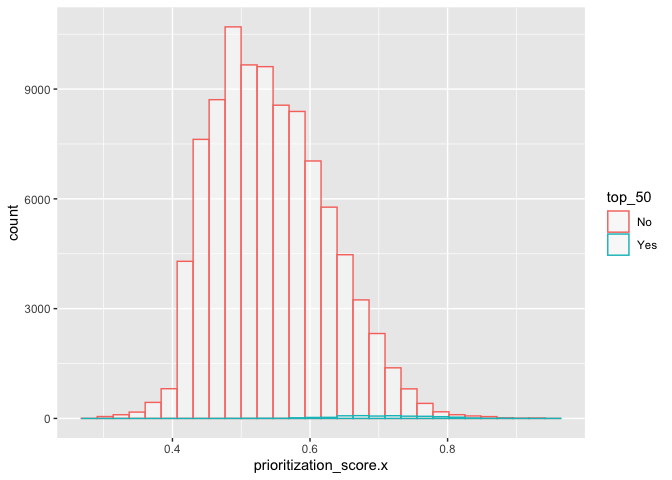<!-- -->

``` r
##SCORES TO HIGHLIGHT - BONAFIDE INTERACTIONS
ggplot(FULL.PT.SCORES,aes(x=prioritization_score.x,color=bonafide))+
    geom_histogram(fill="white", alpha=0.5, position="identity")
```

    ## `stat_bin()` using `bins = 30`. Pick better value with `binwidth`.

    ## Warning: Removed 21756 rows containing non-finite values (`stat_bin()`).

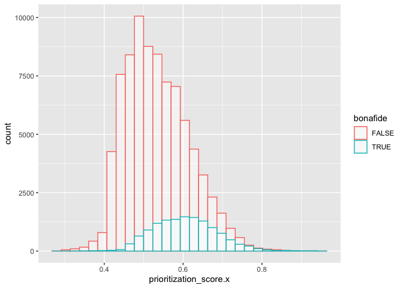<!-- -->

``` r
cluster.3.scores <- FULL.PT.SCORES %>% dplyr::filter(niche=="3Epidermis_niche")

ggplot(cluster.3.scores,aes(x=prioritization_score.x,color=top_50))+
    geom_histogram(fill="white", alpha=0.5, position="identity")
```

    ## `stat_bin()` using `bins = 30`. Pick better value with `binwidth`.

    ## Warning: Removed 5439 rows containing non-finite values (`stat_bin()`).

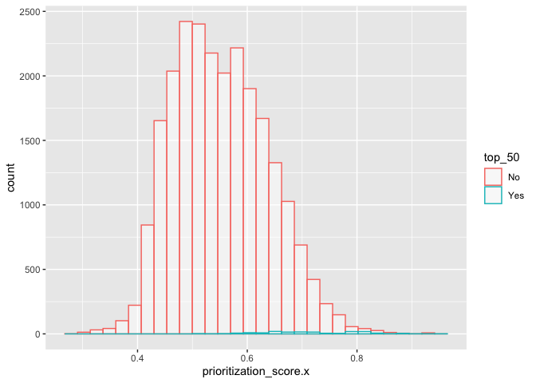<!-- -->

### Save ligand prioritization scores

``` r
write.csv(ligand_prioritized_tbl_oi,file="TOP_50_LIGANDS_PER_NICHE.csv")
```

``` r
ligand_prioritized_tbl_oi <- read_csv("TOP_50_LIGANDS_PER_NICHE.csv")
```

    ## New names:
    ## Rows: 200 Columns: 8
    ## ── Column specification
    ## ──────────────────────────────────────────────────────── Delimiter: "," chr
    ## (6): niche, sender, receiver, ligand, receptor, top_niche dbl (2): ...1,
    ## prioritization_score
    ## ℹ Use `spec()` to retrieve the full column specification for this data. ℹ
    ## Specify the column types or set `show_col_types = FALSE` to quiet this message.
    ## • `` -> `...1`

``` r
receiver_oi = "7 Epidermis" 

filtered_ligands = ligand_prioritized_tbl_oi %>% filter(receiver == receiver_oi) %>% pull(ligand) %>% unique()

prioritized_tbl_oi = prioritization_tables$prioritization_tbl_ligand_receptor %>% filter(ligand %in% filtered_ligands) %>% dplyr::select(niche, sender, receiver, ligand,  receptor, ligand_receptor, prioritization_score) %>% distinct() %>% inner_join(top_ligand_receptor_niche_df) %>% group_by(ligand) %>% filter(receiver == receiver_oi) %>% top_n(50, prioritization_score) %>% ungroup() 
```

    ## Joining, by = c("ligand", "receptor")

``` r
lfc_plot = make_ligand_receptor_lfc_plot(receiver_oi, prioritized_tbl_oi, prioritization_tables$prioritization_tbl_ligand_receptor, plot_legend = FALSE, heights = 10, widths = 10)
```

    ## Joining, by = c("ligand_receptor", "prioritization_score")
    ## Joining, by = "ligand"
    ## Joining, by = c("prioritization_score", "niche", "sender", "ligand")
    ## Joining, by = c("ligand_receptor", "ligand", "receptor")

Looking at unfiltered results.

``` r
library(ggsci)
library(RColorBrewer)
```

    ## Warning: package 'RColorBrewer' was built under R version 4.1.2

``` r
receiver_oi = "7 Epidermis" 

filtered_ligands = ligand_prioritized_tbl_oi %>% filter(receiver == receiver_oi) %>% top_n(15, prioritization_score) %>% pull(ligand) %>% unique()

prioritized_tbl_oi = prioritization_tables$prioritization_tbl_ligand_receptor %>% filter(ligand %in% filtered_ligands) %>% dplyr::select(niche, sender, receiver, ligand,  receptor, ligand_receptor, prioritization_score) %>% distinct() %>% inner_join(top_ligand_receptor_niche_df) %>% group_by(ligand) %>% filter(receiver == receiver_oi) %>% top_n(10, prioritization_score) %>% ungroup() 
```

    ## Joining, by = c("ligand", "receptor")

``` r
colors_sender=c("#C355A0","#BF96FF","#FF0000") %>% magrittr::set_names(prioritized_tbl_oi$sender %>% unique() %>% sort())

colors_receiver=c("#68228B") %>% magrittr::set_names(prioritized_tbl_oi$receiver %>% unique() %>% sort())

#pdf("CIRCOS_PLOT_RECEPTOR-CLUSTER-7.pdf",width = 10,height = 12)
circos_output = make_circos_lr(prioritized_tbl_oi, colors_sender, colors_receiver)
```

    ## Joining, by = "sender"
    ## Joining, by = "receiver"
    ## Joining, by = "receptor"

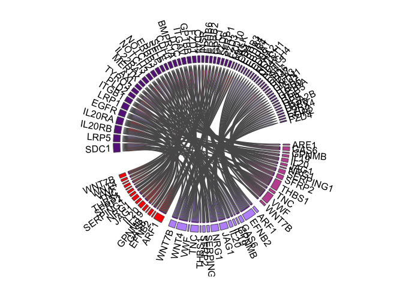<!-- -->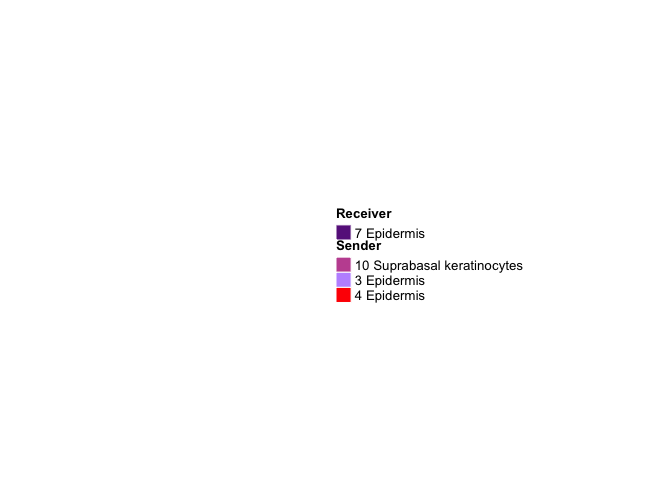<!-- -->

``` r
#dev.off()
```

``` r
lfc_plot = make_ligand_receptor_lfc_plot(receiver_oi, prioritized_tbl_oi, prioritization_tables$prioritization_tbl_ligand_receptor, plot_legend = FALSE, heights = 10, widths = 10)
```

    ## Joining, by = c("ligand_receptor", "prioritization_score")
    ## Joining, by = "ligand"
    ## Joining, by = c("prioritization_score", "niche", "sender", "ligand")
    ## Joining, by = c("ligand_receptor", "ligand", "receptor")

``` r
receiver_oi = "3 Epidermis" 

filtered_ligands = ligand_prioritized_tbl_oi %>% filter(receiver == receiver_oi) %>% top_n(15, prioritization_score) %>% pull(ligand) %>% unique()

prioritized_tbl_oi = prioritization_tables$prioritization_tbl_ligand_receptor %>% filter(ligand %in% filtered_ligands) %>% dplyr::select(niche, sender, receiver, ligand,  receptor, ligand_receptor, prioritization_score) %>% distinct() %>% inner_join(top_ligand_receptor_niche_df) %>% group_by(ligand) %>% filter(receiver == receiver_oi) %>% top_n(15, prioritization_score) %>% ungroup() #colors_sender = brewer.pal(n = 
```

    ## Joining, by = c("ligand", "receptor")

``` r
#prioritized_tbl_oi$sender %>% unique() %>% sort() %>% length(), name = 'Spectral') %>% magrittr::set_names(prioritized_tbl_oi$sender %>% unique() %>% sort())
#colors_receiver = c("lavender")  %>% magrittr::set_names(prioritized_tbl_oi$receiver %>% unique() %>% sort())


colors_sender=c("#C355A0","#FF0000","#68228B") %>% magrittr::set_names(prioritized_tbl_oi$sender %>% unique() %>% sort())

colors_receiver=c("#BF96FF") %>% magrittr::set_names(prioritized_tbl_oi$receiver %>% unique() %>% sort())

#pdf("CIRCOS_PLOT_RECEPTOR-CLUSTER-3.pdf",width = 10,height = 12)
circos_output = make_circos_lr(prioritized_tbl_oi, colors_sender, colors_receiver)
```

    ## Joining, by = "sender"
    ## Joining, by = "receiver"
    ## Joining, by = "receptor"

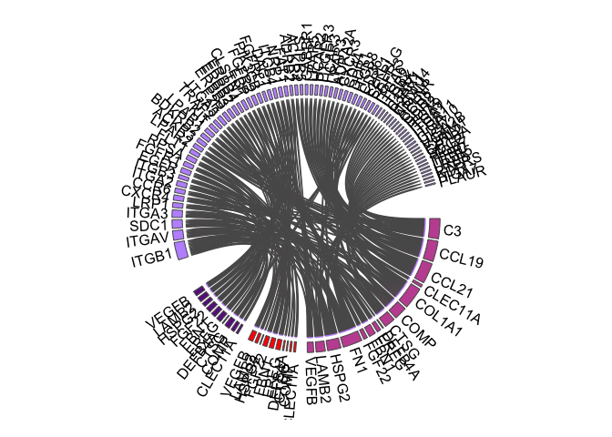<!-- --><!-- -->

``` r
#dev.off()
```

``` r
lfc_plot = make_ligand_receptor_lfc_plot(receiver_oi, prioritized_tbl_oi, prioritization_tables$prioritization_tbl_ligand_receptor, plot_legend = FALSE, heights = 10, widths = 10)
```

    ## Joining, by = c("ligand_receptor", "prioritization_score")
    ## Joining, by = "ligand"
    ## Joining, by = c("prioritization_score", "niche", "sender", "ligand")
    ## Joining, by = c("ligand_receptor", "ligand", "receptor")

``` r
receiver_oi = "4 Epidermis" 

filtered_ligands = ligand_prioritized_tbl_oi %>% filter(receiver == receiver_oi) %>% top_n(15, prioritization_score) %>% pull(ligand) %>% unique()

prioritized_tbl_oi = prioritization_tables$prioritization_tbl_ligand_receptor %>% filter(ligand %in% filtered_ligands) %>% dplyr::select(niche, sender, receiver, ligand,  receptor, ligand_receptor, prioritization_score) %>% distinct() %>% inner_join(top_ligand_receptor_niche_df) %>% group_by(ligand) %>% filter(receiver == receiver_oi) %>% top_n(15, prioritization_score) %>% ungroup() 
```

    ## Joining, by = c("ligand", "receptor")

``` r
#colors_sender = brewer.pal(n = prioritized_tbl_oi$sender %>% unique() %>% sort() %>% length(), name = 'Spectral') %>% magrittr::set_names(prioritized_tbl_oi$sender %>% unique() %>% sort())
#colors_receiver = c("lavender")  %>% magrittr::set_names(prioritized_tbl_oi$receiver %>% unique() %>% sort())


colors_sender=c("#C355A0","#BF96FF","#68228B") %>% magrittr::set_names(prioritized_tbl_oi$sender %>% unique() %>% sort())

colors_receiver=c("#FF0000") %>% magrittr::set_names(prioritized_tbl_oi$receiver %>% unique() %>% sort())


#pdf("CIRCOS_PLOT_RECEPTOR-CLUSTER-4.pdf",width = 10,height = 12)
circos_output = make_circos_lr(prioritized_tbl_oi, colors_sender, colors_receiver)
```

    ## Joining, by = "sender"
    ## Joining, by = "receiver"
    ## Joining, by = "receptor"

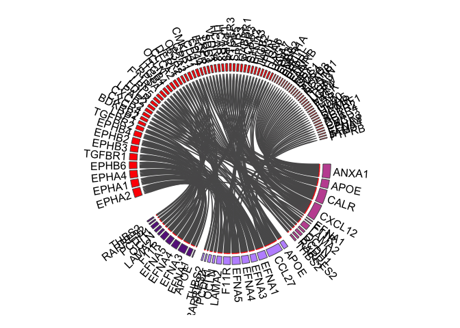<!-- --><!-- -->

``` r
#dev.off()
```

``` r
receiver_oi = "10 Suprabasal keratinocytes" 

filtered_ligands = ligand_prioritized_tbl_oi %>% filter(receiver == receiver_oi) %>% top_n(15, prioritization_score) %>% pull(ligand) %>% unique()

prioritized_tbl_oi = prioritization_tables$prioritization_tbl_ligand_receptor %>% filter(ligand %in% filtered_ligands) %>% dplyr::select(niche, sender, receiver, ligand,  receptor, ligand_receptor, prioritization_score) %>% distinct() %>% inner_join(top_ligand_receptor_niche_df) %>% group_by(ligand) %>% filter(receiver == receiver_oi) %>% top_n(2, prioritization_score) %>% ungroup() 
```

    ## Joining, by = c("ligand", "receptor")

``` r
#colors_sender = brewer.pal(n = prioritized_tbl_oi$sender %>% unique() %>% sort() %>% length(), name = 'Spectral') %>% magrittr::set_names(prioritized_tbl_oi$sender %>% unique() %>% sort())
#colors_receiver = c("lavender")  %>% magrittr::set_names(prioritized_tbl_oi$receiver %>% unique() %>% sort())

colors_sender=c("#BF96FF","#FF0000","#68228B") %>% magrittr::set_names(prioritized_tbl_oi$sender %>% unique() %>% sort())

colors_receiver=c("#C355A0") %>% magrittr::set_names(prioritized_tbl_oi$receiver %>% unique() %>% sort())

#pdf("CIRCOS_PLOT_RECEPTOR-CLUSTER-10.pdf",width = 10,height = 12)
circos_output = make_circos_lr(prioritized_tbl_oi, colors_sender, colors_receiver)
```

    ## Joining, by = "sender"
    ## Joining, by = "receiver"
    ## Joining, by = "receptor"

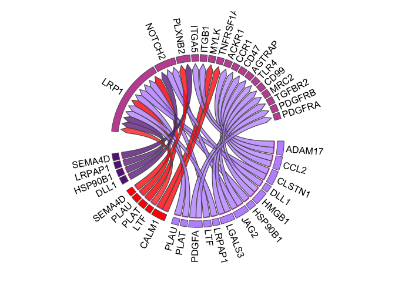<!-- -->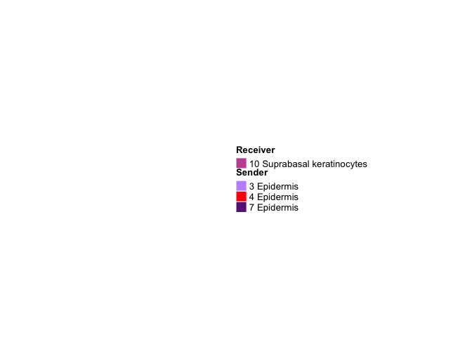<!-- -->

``` r
#dev.off()
```

### Cluster 4 - Epidermis (Receptor) {#cluster-4---epidermis-receptor}

Selected pairs of ligands-receptors from top 50 results.

``` r
receiver_oi = "4 Epidermis" 

prioritized_tbl_oi_v2 <- read.csv("/Volumes/Extreme Pro/GITHUB-DATA/ST-DATA/PSORIASIS-DATA/NICHE_NET_DATA/cluster4_LR_RES.csv")
filtered_ligands = prioritized_tbl_oi_v2 %>% filter(receiver == receiver_oi) %>% pull(ligand) %>% unique()

prioritized_tbl_oi = prioritization_tables$prioritization_tbl_ligand_receptor %>% filter(ligand %in% filtered_ligands) %>% dplyr::select(niche, sender, receiver, ligand,  receptor, ligand_receptor, prioritization_score) %>% distinct() %>% inner_join(top_ligand_receptor_niche_df) %>% group_by(ligand) %>% filter(receiver == receiver_oi) %>% top_n(2, prioritization_score) %>% ungroup() 
```

    ## Joining, by = c("ligand", "receptor")

``` r
#
colors_sender=c("#C355A0","#BF96FF","#68228B") %>% magrittr::set_names(prioritized_tbl_oi$sender %>% unique() %>% sort())

colors_receiver=c("#FF0000") %>% magrittr::set_names(prioritized_tbl_oi$receiver %>% unique() %>% sort())


#pdf("CIRCOS_PLOT_RECEPTOR-CLUSTER-4(FILTERED).pdf",width = 10,height = 12)
circos_output = make_circos_lr(prioritized_tbl_oi, colors_sender, colors_receiver)
```

    ## Joining, by = "sender"
    ## Joining, by = "receiver"
    ## Joining, by = "receptor"

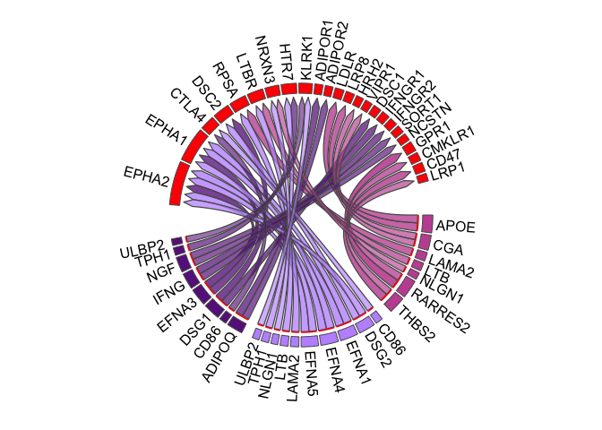<!-- --><!-- -->

``` r
#dev.off()
```

### Cluster 10 - Suprabasal keratinocytes (Receptor) {#cluster-10---suprabasal-keratinocytes-receptor}

Selected pairs of ligands-receptors from top 50 results.

``` r
receiver_oi = "10 Suprabasal keratinocytes" 

prioritized_tbl_oi_v2 <- read.csv("/Volumes/Extreme Pro/GITHUB-DATA/ST-DATA/PSORIASIS-DATA/NICHE_NET_DATA/cluster10_LR_RES.csv")
filtered_ligands = prioritized_tbl_oi_v2 %>% filter(receiver == receiver_oi) %>% pull(ligand) %>% unique()

prioritized_tbl_oi = prioritization_tables$prioritization_tbl_ligand_receptor %>% filter(ligand %in% filtered_ligands) %>% dplyr::select(niche, sender, receiver, ligand,  receptor, ligand_receptor, prioritization_score) %>% distinct() %>% inner_join(top_ligand_receptor_niche_df) %>% group_by(ligand) %>% filter(receiver == receiver_oi) %>% top_n(2, prioritization_score) %>% ungroup() 
```

    ## Joining, by = c("ligand", "receptor")

``` r
colors_sender=c("#BF96FF","#FF0000","#68228B") %>% magrittr::set_names(prioritized_tbl_oi$sender %>% unique() %>% sort())

colors_receiver=c("#C355A0") %>% magrittr::set_names(prioritized_tbl_oi$receiver %>% unique() %>% sort())

#pdf("CIRCOS_PLOT_RECEPTOR-CLUSTER-10(FILTERED).pdf",width = 10,height = 12)
circos_output = make_circos_lr(prioritized_tbl_oi, colors_sender, colors_receiver)
```

    ## Joining, by = "sender"
    ## Joining, by = "receiver"
    ## Joining, by = "receptor"

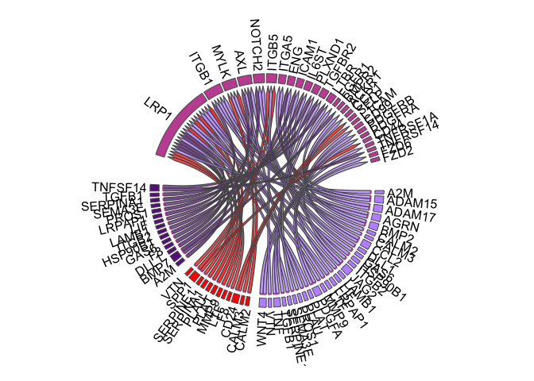<!-- --><!-- -->

``` r
#dev.off()
```

### Cluster 3 - Epidermis (Receptor) (NOT USED IN THE FINAL MANUSCRIPT)

Selected pairs of ligands-receptors from top 50 results.

``` r
receiver_oi = "3 Epidermis" 

prioritized_tbl_oi_v2 <- read.csv("/Volumes/Extreme Pro/GITHUB-DATA/ST-DATA/PSORIASIS-DATA/NICHE_NET_DATA/cluster3_LR_RES.csv")
filtered_ligands = prioritized_tbl_oi_v2 %>% filter(receiver == receiver_oi) %>% pull(ligand) %>% unique()

prioritized_tbl_oi = prioritization_tables$prioritization_tbl_ligand_receptor %>% filter(ligand %in% filtered_ligands) %>% dplyr::select(niche, sender, receiver, ligand,  receptor, ligand_receptor, prioritization_score) %>% distinct() %>% inner_join(top_ligand_receptor_niche_df) %>% group_by(ligand) %>% filter(receiver == receiver_oi) %>% top_n(2, prioritization_score) %>% ungroup() 
```

    ## Joining, by = c("ligand", "receptor")

``` r
#colors_sender = brewer.pal(n = prioritized_tbl_oi$sender %>% unique() %>% sort() %>% length(), name = 'Spectral') %>% magrittr::set_names(prioritized_tbl_oi$sender %>% unique() %>% sort())
#colors_receiver = c("lavender")  %>% magrittr::set_names(prioritized_tbl_oi$receiver %>% unique() %>% sort())


colors_sender=c("#C355A0","#FF0000","#68228B") %>% magrittr::set_names(prioritized_tbl_oi$sender %>% unique() %>% sort())

colors_receiver=c("#BF96FF") %>% magrittr::set_names(prioritized_tbl_oi$receiver %>% unique() %>% sort())

#pdf("CIRCOS_PLOT_RECEPTOR-CLUSTER-3(FILTERED).pdf",width = 10,height = 12)
circos_output = make_circos_lr(prioritized_tbl_oi, colors_sender, colors_receiver)
```

    ## Joining, by = "sender"
    ## Joining, by = "receiver"
    ## Joining, by = "receptor"

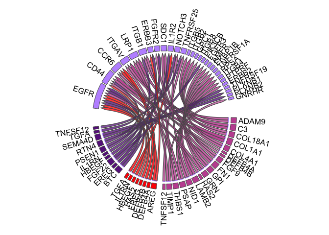<!-- --><!-- -->

``` r
#dev.off()
```

### Cluster 7 - Epidermis (Receptor) {#cluster-7---epidermis-receptor}

``` r
receiver_oi = "7 Epidermis" 

prioritized_tbl_oi_v2 <- read.csv("/Volumes/Extreme Pro/GITHUB-DATA/ST-DATA/PSORIASIS-DATA/NICHE_NET_DATA/cluster7_LR_RES.csv")
filtered_ligands = prioritized_tbl_oi_v2 %>% filter(receiver == receiver_oi) %>% pull(ligand) %>% unique()
filtered_interactions = prioritized_tbl_oi_v2 %>% mutate(ligand_receptor=ligand)


prioritized_tbl_oi = prioritization_tables$prioritization_tbl_ligand_receptor %>% filter(ligand %in% filtered_ligands) %>% dplyr::select(niche, sender, receiver, ligand,  receptor, ligand_receptor, prioritization_score) %>% distinct() %>% inner_join(top_ligand_receptor_niche_df) %>% group_by(ligand) %>% filter(receiver == receiver_oi) %>% top_n(2, prioritization_score) %>% ungroup()
```

    ## Joining, by = c("ligand", "receptor")

``` r
colors_sender=c("#C355A0","#BF96FF","#FF0000") %>% magrittr::set_names(prioritized_tbl_oi$sender %>% unique() %>% sort())

colors_receiver=c("#68228B") %>% magrittr::set_names(prioritized_tbl_oi$receiver %>% unique() %>% sort())

#pdf("CIRCOS_PLOT_RECEPTOR-CLUSTER-7(FILTERED).pdf",width = 10,height = 12)
circos_output = make_circos_lr(prioritized_tbl_oi, colors_sender, colors_receiver)
```

    ## Joining, by = "sender"
    ## Joining, by = "receiver"
    ## Joining, by = "receptor"

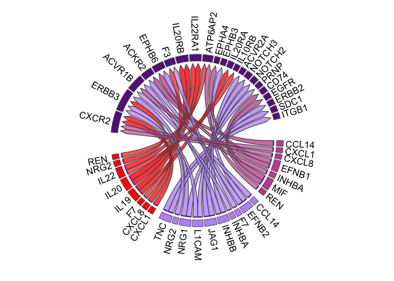<!-- --><!-- -->

``` r
#dev.off()
```

## 
