R Notebook
================

## PSO + PSA + NORMAL SKIN COMBINED ANALYSIS - PART 1

## Table of content

| FIGURE NO | LINK          |
|-----------|---------------|
| S4A       | [link](#s34a) |
| S4C       | [link](#s4c)  |
| S6        | [link](#s6)   |

## (Split into lesional, non-lesional and healthy skin)

### LOAD ALL PACKAGES

``` r
library(tidyverse)
```

    ## ── Attaching packages ─────────────────────────────────────── tidyverse 1.3.1 ──

    ## ✔ ggplot2 3.3.6     ✔ purrr   0.3.4
    ## ✔ tibble  3.1.7     ✔ dplyr   1.0.9
    ## ✔ tidyr   1.2.0     ✔ stringr 1.4.0
    ## ✔ readr   2.1.2     ✔ forcats 0.5.1

    ## Warning: package 'ggplot2' was built under R version 4.1.2

    ## Warning: package 'tibble' was built under R version 4.1.2

    ## Warning: package 'tidyr' was built under R version 4.1.2

    ## Warning: package 'readr' was built under R version 4.1.2

    ## Warning: package 'dplyr' was built under R version 4.1.2

    ## ── Conflicts ────────────────────────────────────────── tidyverse_conflicts() ──
    ## ✖ dplyr::filter() masks stats::filter()
    ## ✖ dplyr::lag()    masks stats::lag()

``` r
library(Seurat)
```

    ## Warning: package 'Seurat' was built under R version 4.1.2

    ## Attaching SeuratObject

    ## Attaching sp

``` r
library(cowplot)
library(ggsci)
source("SPATIAL_FUNCTIONS.R")
```

    ## Warning: package 'RColorBrewer' was built under R version 4.1.2

    ## Warning: package 'reticulate' was built under R version 4.1.2

    ## Warning: package 'clusterProfiler' was built under R version 4.1.1

    ## 

    ## Registered S3 method overwritten by 'ggtree':
    ##   method      from 
    ##   identify.gg ggfun

    ## clusterProfiler v4.0.5  For help: https://yulab-smu.top/biomedical-knowledge-mining-book/
    ## 
    ## If you use clusterProfiler in published research, please cite:
    ## T Wu, E Hu, S Xu, M Chen, P Guo, Z Dai, T Feng, L Zhou, W Tang, L Zhan, X Fu, S Liu, X Bo, and G Yu. clusterProfiler 4.0: A universal enrichment tool for interpreting omics data. The Innovation. 2021, 2(3):100141. doi: 10.1016/j.xinn.2021.100141

    ## 
    ## Attaching package: 'clusterProfiler'

    ## The following object is masked from 'package:purrr':
    ## 
    ##     simplify

    ## The following object is masked from 'package:stats':
    ## 
    ##     filter

    ## Loading required package: AnnotationDbi

    ## Loading required package: stats4

    ## Loading required package: BiocGenerics

    ## Warning: package 'BiocGenerics' was built under R version 4.1.1

    ## 
    ## Attaching package: 'BiocGenerics'

    ## The following objects are masked from 'package:dplyr':
    ## 
    ##     combine, intersect, setdiff, union

    ## The following objects are masked from 'package:stats':
    ## 
    ##     IQR, mad, sd, var, xtabs

    ## The following objects are masked from 'package:base':
    ## 
    ##     anyDuplicated, append, as.data.frame, basename, cbind, colnames,
    ##     dirname, do.call, duplicated, eval, evalq, Filter, Find, get, grep,
    ##     grepl, intersect, is.unsorted, lapply, Map, mapply, match, mget,
    ##     order, paste, pmax, pmax.int, pmin, pmin.int, Position, rank,
    ##     rbind, Reduce, rownames, sapply, setdiff, sort, table, tapply,
    ##     union, unique, unsplit, which.max, which.min

    ## Loading required package: Biobase

    ## Warning: package 'Biobase' was built under R version 4.1.1

    ## Welcome to Bioconductor
    ## 
    ##     Vignettes contain introductory material; view with
    ##     'browseVignettes()'. To cite Bioconductor, see
    ##     'citation("Biobase")', and for packages 'citation("pkgname")'.

    ## Loading required package: IRanges

    ## Warning: package 'IRanges' was built under R version 4.1.1

    ## Loading required package: S4Vectors

    ## Warning: package 'S4Vectors' was built under R version 4.1.2

    ## 
    ## Attaching package: 'S4Vectors'

    ## The following object is masked from 'package:clusterProfiler':
    ## 
    ##     rename

    ## The following objects are masked from 'package:dplyr':
    ## 
    ##     first, rename

    ## The following object is masked from 'package:tidyr':
    ## 
    ##     expand

    ## The following objects are masked from 'package:base':
    ## 
    ##     expand.grid, I, unname

    ## 
    ## Attaching package: 'IRanges'

    ## The following object is masked from 'package:clusterProfiler':
    ## 
    ##     slice

    ## The following object is masked from 'package:sp':
    ## 
    ##     %over%

    ## The following objects are masked from 'package:dplyr':
    ## 
    ##     collapse, desc, slice

    ## The following object is masked from 'package:purrr':
    ## 
    ##     reduce

    ## 
    ## Attaching package: 'AnnotationDbi'

    ## The following object is masked from 'package:clusterProfiler':
    ## 
    ##     select

    ## The following object is masked from 'package:dplyr':
    ## 
    ##     select

    ## 

### Loading the Healthy samples

Outlier spots were identified and the corresponding barcodes were
isolated using loupe browser.

Outlier spots were removed preprocessing.

``` r
## HEALTHY SAMPLES
## HEALTHY MALE SKIN 1 & 2
HEALTHY.Male.s1 <- Load10X_Spatial(data.dir ="../../FOURTH_RUN/SAMPLE A1/",slice="ST-HM-1-R1")
```

    ## Warning: Invalid name supplied, making object name syntactically valid. New
    ## object name is ST.HM.1.R1; see ?make.names for more details on syntax validity

    ## Warning: Keys should be one or more alphanumeric characters followed by an
    ## underscore, setting key from st.hm.1.r1_ to sthm1r1_

``` r
HEALTHY.Male.s2 <- Load10X_Spatial(data.dir ="../../SEVENTH RUN/ST-HM-1/",slice="ST-HM-1-R2")
```

    ## Warning: Invalid name supplied, making object name syntactically valid. New
    ## object name is ST.HM.1.R2; see ?make.names for more details on syntax validity

    ## Warning: Keys should be one or more alphanumeric characters followed by an
    ## underscore, setting key from st.hm.1.r2_ to sthm1r2_

``` r
## HEALTHY FEMALE SKIN 1 & 2 (FROM THE SAME DONOR)
HEALTHY.Female1.s1 <- Load10X_Spatial(data.dir ="../../FOURTH_RUN/SAMPLE B1/",slice="ST-HF-1-R1")
```

    ## Warning: Invalid name supplied, making object name syntactically valid. New
    ## object name is ST.HF.1.R1; see ?make.names for more details on syntax validity

    ## Warning: Keys should be one or more alphanumeric characters followed by an
    ## underscore, setting key from st.hf.1.r1_ to sthf1r1_

``` r
HEALTHY.Female1.s2 <- Load10X_Spatial(data.dir ="../../FIFTH_RUN/SAMPLE D1/",slice="ST-HF-1-R2")
```

    ## Warning: Invalid name supplied, making object name syntactically valid. New
    ## object name is ST.HF.1.R2; see ?make.names for more details on syntax validity

    ## Warning: Keys should be one or more alphanumeric characters followed by an
    ## underscore, setting key from st.hf.1.r2_ to sthf1r2_

``` r
HEALTHY.Female1.s3 <- Load10X_Spatial(data.dir ="../../SEVENTH RUN/ST-HF-1/",slice="ST-HF-1-R3")
```

    ## Warning: Invalid name supplied, making object name syntactically valid. New
    ## object name is ST.HF.1.R3; see ?make.names for more details on syntax validity

    ## Warning: Keys should be one or more alphanumeric characters followed by an
    ## underscore, setting key from st.hf.1.r3_ to sthf1r3_

``` r
## HEALTHY FEMALE
HEALTHY.Female2.s1 <- Load10X_Spatial(data.dir ="../../SEVENTH RUN/ST-HF-2E/",slice="ST-HF-2-R1")
```

    ## Warning: Invalid name supplied, making object name syntactically valid. New
    ## object name is ST.HF.2.R1; see ?make.names for more details on syntax validity

    ## Warning: Keys should be one or more alphanumeric characters followed by an
    ## underscore, setting key from st.hf.2.r1_ to sthf2r1_

``` r
HEALTHY.Female2.s2 <- Load10X_Spatial(data.dir ="../../SEVENTH RUN/ST-HF-2F/",slice="ST-HF-2-R2")
```

    ## Warning: Invalid name supplied, making object name syntactically valid. New
    ## object name is ST.HF.2.R2; see ?make.names for more details on syntax validity

    ## Warning: Keys should be one or more alphanumeric characters followed by an
    ## underscore, setting key from st.hf.2.r2_ to sthf2r2_

``` r
#REMOVE SPOTS
remove.spots <- read.csv(file="../../CLOUPE_FILES/FOURTH_RUN/A1/DELETE.csv")
subset_spots <- Cells(HEALTHY.Male.s1)[which((!(rownames(HEALTHY.Male.s1@meta.data) %in% remove.spots$Barcode)))]
HEALTHY.Male.s1.clean <- subset(HEALTHY.Male.s1,cells=subset_spots)

remove.spots <- read.csv(file="../../CLOUPE_FILES/SEVENTH_RUN/HF-1-SP/remove.csv")
subset_spots <- Cells(HEALTHY.Female1.s3)[which((!(rownames(HEALTHY.Female1.s3@meta.data) %in% remove.spots$Barcode)))]
HEALTHY.Female1.s3.clean <- subset(HEALTHY.Female1.s3,cells=subset_spots)

remove.spots <- read.csv(file="../../CLOUPE_FILES/SEVENTH_RUN/HF-2-SE/Remove.csv")
subset_spots <- Cells(HEALTHY.Female2.s1)[which((!(rownames(HEALTHY.Female2.s1@meta.data) %in% remove.spots$Barcode)))]
HEALTHY.Female2.s1.clean <- subset(HEALTHY.Female2.s1,cells=subset_spots)


remove.spots <- read.csv(file="../../CLOUPE_FILES/SEVENTH_RUN/HF-2-SP/Remove.csv")
subset_spots <- Cells(HEALTHY.Female2.s2)[which((!(rownames(HEALTHY.Female2.s2@meta.data) %in% remove.spots$Barcode)))]
HEALTHY.Female2.s2.clean <- subset(HEALTHY.Female2.s2,cells=subset_spots)

remove.spots <- read.csv(file="../../CLOUPE_FILES/SEVENTH_RUN/HM-SP-2/remove.csv")
subset_spots <- Cells(HEALTHY.Male.s2)[which((!(rownames(HEALTHY.Male.s2@meta.data) %in% remove.spots$Barcode)))]
HEALTHY.Male.s2.clean <- subset(HEALTHY.Male.s2,cells=subset_spots)

remove.spots <- read.csv(file="../../FIFTH_RUN/SAMPLE D1/REMOVE.csv")
subset_spots <- Cells(HEALTHY.Female1.s2)[which((!(rownames(HEALTHY.Female1.s2@meta.data) %in% remove.spots$Barcode)))]
HEALTHY.Female1.s2.clean <- subset(HEALTHY.Female1.s2,cells=subset_spots)
```

### META-DATA FOR ST DATA

Meta-data includes the following:-

1.  Disease Status: Split into Healthy, Non-Lesional and Lesional skin.

2.  Specific (Disease) Status: Includes Disease Status + Disease
    severity

3.  Batch / Sequencing Run

4.  Sample ID

5.  Original Identity / Full Sample ID

6.  PASI (Psoriasis Area and Severity Index) score

7.  Disease Severity : Based on PASI score range, split into Mild and
    Moderate-Severe

8.  Biopsy Site: Original location of the skin biopsy site

### ADD METADATA FOR HEALTHY SAMPLES

``` r
HEALTHY.Male.s1.clean$DISEASE_STATUS <- "Healthy skin" 
HEALTHY.Male.s2.clean$DISEASE_STATUS <- "Healthy skin"

HEALTHY.Female1.s1$DISEASE_STATUS <- "Healthy skin"
HEALTHY.Female1.s2.clean$DISEASE_STATUS <- "Healthy skin"
HEALTHY.Female1.s3.clean$DISEASE_STATUS <- "Healthy skin"

HEALTHY.Female2.s1.clean$DISEASE_STATUS <- "Healthy skin"
HEALTHY.Female2.s2.clean$DISEASE_STATUS <- "Healthy skin"

HEALTHY.Male.s1.clean$SITE <- "Back" 
HEALTHY.Male.s2.clean$SITE <- "Back"

HEALTHY.Female1.s1$SITE <- "Arm"
HEALTHY.Female1.s2.clean$SITE <- "Arm"
HEALTHY.Female1.s3.clean$SITE <- "Back"

HEALTHY.Female2.s1.clean$SITE <- "Arm"
HEALTHY.Female2.s2.clean$SITE <- "Back"
```

``` r
HEALTHY.Male.s1.clean$SPECIFIC_STATUS <- "Healthy skin" 
HEALTHY.Male.s2.clean$SPECIFIC_STATUS <- "Healthy skin"

HEALTHY.Female1.s1$SPECIFIC_STATUS <- "Healthy skin"
HEALTHY.Female1.s2.clean$SPECIFIC_STATUS <- "Healthy skin"
HEALTHY.Female1.s3.clean$SPECIFIC_STATUS<- "Healthy skin"

HEALTHY.Female2.s1.clean$SPECIFIC_STATUS <- "Healthy skin"
HEALTHY.Female2.s2.clean$SPECIFIC_STATUS <- "Healthy skin"
```

``` r
# BATCH INFORMATION
HEALTHY.Male.s1.clean$Batch <- "Batch 4" 
HEALTHY.Male.s2.clean$Batch <- "Batch 7"

HEALTHY.Female1.s1$Batch <- "Batch 4"
HEALTHY.Female1.s2.clean$Batch <- "Batch 4"
HEALTHY.Female1.s3.clean$Batch<- "Batch 7"

HEALTHY.Female2.s1.clean$Batch <- "Batch 7"
HEALTHY.Female2.s2.clean$Batch <- "Batch 7"
```

``` r
HEALTHY.Male.s1.clean$orig.ident <- "Healthy Volunteer 1 - TRUNK R1" 
HEALTHY.Male.s2.clean$orig.ident <- "Healthy Volunteer 1 - TRUNK R2"

HEALTHY.Female1.s1$orig.ident <- "Healthy Volunteer 2 - FA R1"
HEALTHY.Female1.s2.clean$orig.ident <- "Healthy Volunteer 2 - FA R2"
HEALTHY.Female1.s3.clean$orig.ident <- "Healthy Volunteer 2 - TRUNK"

HEALTHY.Female2.s1.clean$orig.ident <- "Healthy Volunteer 3 - FA R1"
HEALTHY.Female2.s2.clean$orig.ident <- "Healthy Volunteer 3 - TRUNK"
```

``` r
#SAMPLE IDS
HEALTHY.Male.s1.clean$sample.id<- "HV1_S1_R1" 
HEALTHY.Male.s2.clean$sample.id<- "HV1_S1_R2"

HEALTHY.Female1.s1$sample.id <- "HV2_S1_R1"
HEALTHY.Female1.s2.clean$sample.id <- "HV2_S1_R2"
HEALTHY.Female1.s3.clean$sample.id <- "HV2_S2"

HEALTHY.Female2.s1.clean$sample.id <- "HV3_S1"
HEALTHY.Female2.s2.clean$sample.id <- "HV3_S2"
```

``` r
HEALTHY.Male.s1.clean$PASI <- 0 
HEALTHY.Male.s2.clean$PASI <- 0

HEALTHY.Female1.s1$PASI <-0
HEALTHY.Female1.s2.clean$PASI <- 0
HEALTHY.Female1.s3.clean$PASI <- 0

HEALTHY.Female2.s1.clean$PASI <- 0
HEALTHY.Female2.s2.clean$PASI <- 0
```

``` r
HEALTHY.Male.s1.clean$Disease_severity <- "NA"
HEALTHY.Male.s2.clean$Disease_severity <- "NA"

HEALTHY.Female1.s1$Disease_severity <- "NA"
HEALTHY.Female1.s2.clean$Disease_severity <- "NA"
HEALTHY.Female1.s3.clean$Disease_severity <-"NA"

HEALTHY.Female2.s1.clean$Disease_severity <- "NA"
HEALTHY.Female2.s2.clean$Disease_severity <- "NA"
```

### POOL ALL HEALTHY SAMPLES

``` r
Healthy_Samples <- c(HEALTHY.Male.s1.clean,HEALTHY.Male.s2.clean,HEALTHY.Female1.s1,HEALTHY.Female1.s2.clean,HEALTHY.Female1.s3.clean,HEALTHY.Female2.s1.clean,HEALTHY.Female2.s2.clean)
```

``` r
i <- 1
while(i <= length(Healthy_Samples)){
  filtered_data <- st_filter_by_genes(st.data = Healthy_Samples[[i]],x = 200)
  filtered_data <- SCTransform(filtered_data,assay = "Spatial")
  Healthy_Samples[[i]] <- filtered_data
  i <- i+1
}
```

    ## Calculating cell attributes from input UMI matrix: log_umi

    ## Variance stabilizing transformation of count matrix of size 11464 by 257

    ## Model formula is y ~ log_umi

    ## Get Negative Binomial regression parameters per gene

    ## Using 2000 genes, 257 cells

    ##   |                                                                              |                                                                      |   0%  |                                                                              |==================                                                    |  25%  |                                                                              |===================================                                   |  50%  |                                                                              |====================================================                  |  75%  |                                                                              |======================================================================| 100%

    ## Found 25 outliers - those will be ignored in fitting/regularization step

    ## Second step: Get residuals using fitted parameters for 11464 genes

    ##   |                                                                              |                                                                      |   0%  |                                                                              |===                                                                   |   4%  |                                                                              |======                                                                |   9%  |                                                                              |=========                                                             |  13%  |                                                                              |============                                                          |  17%  |                                                                              |===============                                                       |  22%  |                                                                              |==================                                                    |  26%  |                                                                              |=====================                                                 |  30%  |                                                                              |========================                                              |  35%  |                                                                              |===========================                                           |  39%  |                                                                              |==============================                                        |  43%  |                                                                              |=================================                                     |  48%  |                                                                              |=====================================                                 |  52%  |                                                                              |========================================                              |  57%  |                                                                              |===========================================                           |  61%  |                                                                              |==============================================                        |  65%  |                                                                              |=================================================                     |  70%  |                                                                              |====================================================                  |  74%  |                                                                              |=======================================================               |  78%  |                                                                              |==========================================================            |  83%  |                                                                              |=============================================================         |  87%  |                                                                              |================================================================      |  91%  |                                                                              |===================================================================   |  96%  |                                                                              |======================================================================| 100%

    ## Computing corrected count matrix for 11464 genes

    ##   |                                                                              |                                                                      |   0%  |                                                                              |===                                                                   |   4%  |                                                                              |======                                                                |   9%  |                                                                              |=========                                                             |  13%  |                                                                              |============                                                          |  17%  |                                                                              |===============                                                       |  22%  |                                                                              |==================                                                    |  26%  |                                                                              |=====================                                                 |  30%  |                                                                              |========================                                              |  35%  |                                                                              |===========================                                           |  39%  |                                                                              |==============================                                        |  43%  |                                                                              |=================================                                     |  48%  |                                                                              |=====================================                                 |  52%  |                                                                              |========================================                              |  57%  |                                                                              |===========================================                           |  61%  |                                                                              |==============================================                        |  65%  |                                                                              |=================================================                     |  70%  |                                                                              |====================================================                  |  74%  |                                                                              |=======================================================               |  78%  |                                                                              |==========================================================            |  83%  |                                                                              |=============================================================         |  87%  |                                                                              |================================================================      |  91%  |                                                                              |===================================================================   |  96%  |                                                                              |======================================================================| 100%

    ## Calculating gene attributes

    ## Wall clock passed: Time difference of 4.953012 secs

    ## Determine variable features

    ## Place corrected count matrix in counts slot

    ## Centering data matrix

    ## Set default assay to SCT

    ## Calculating cell attributes from input UMI matrix: log_umi

    ## Variance stabilizing transformation of count matrix of size 11687 by 431

    ## Model formula is y ~ log_umi

    ## Get Negative Binomial regression parameters per gene

    ## Using 2000 genes, 431 cells

    ##   |                                                                              |                                                                      |   0%  |                                                                              |==================                                                    |  25%  |                                                                              |===================================                                   |  50%  |                                                                              |====================================================                  |  75%  |                                                                              |======================================================================| 100%

    ## Found 38 outliers - those will be ignored in fitting/regularization step

    ## Second step: Get residuals using fitted parameters for 11687 genes

    ##   |                                                                              |                                                                      |   0%  |                                                                              |===                                                                   |   4%  |                                                                              |======                                                                |   8%  |                                                                              |=========                                                             |  12%  |                                                                              |============                                                          |  17%  |                                                                              |===============                                                       |  21%  |                                                                              |==================                                                    |  25%  |                                                                              |====================                                                  |  29%  |                                                                              |=======================                                               |  33%  |                                                                              |==========================                                            |  38%  |                                                                              |=============================                                         |  42%  |                                                                              |================================                                      |  46%  |                                                                              |===================================                                   |  50%  |                                                                              |======================================                                |  54%  |                                                                              |=========================================                             |  58%  |                                                                              |============================================                          |  62%  |                                                                              |===============================================                       |  67%  |                                                                              |==================================================                    |  71%  |                                                                              |====================================================                  |  75%  |                                                                              |=======================================================               |  79%  |                                                                              |==========================================================            |  83%  |                                                                              |=============================================================         |  88%  |                                                                              |================================================================      |  92%  |                                                                              |===================================================================   |  96%  |                                                                              |======================================================================| 100%

    ## Computing corrected count matrix for 11687 genes

    ##   |                                                                              |                                                                      |   0%  |                                                                              |===                                                                   |   4%  |                                                                              |======                                                                |   8%  |                                                                              |=========                                                             |  12%  |                                                                              |============                                                          |  17%  |                                                                              |===============                                                       |  21%  |                                                                              |==================                                                    |  25%  |                                                                              |====================                                                  |  29%  |                                                                              |=======================                                               |  33%  |                                                                              |==========================                                            |  38%  |                                                                              |=============================                                         |  42%  |                                                                              |================================                                      |  46%  |                                                                              |===================================                                   |  50%  |                                                                              |======================================                                |  54%  |                                                                              |=========================================                             |  58%  |                                                                              |============================================                          |  62%  |                                                                              |===============================================                       |  67%  |                                                                              |==================================================                    |  71%  |                                                                              |====================================================                  |  75%  |                                                                              |=======================================================               |  79%  |                                                                              |==========================================================            |  83%  |                                                                              |=============================================================         |  88%  |                                                                              |================================================================      |  92%  |                                                                              |===================================================================   |  96%  |                                                                              |======================================================================| 100%

    ## Calculating gene attributes

    ## Wall clock passed: Time difference of 6.147041 secs

    ## Determine variable features

    ## Place corrected count matrix in counts slot

    ## Centering data matrix

    ## Set default assay to SCT

    ## Calculating cell attributes from input UMI matrix: log_umi

    ## Variance stabilizing transformation of count matrix of size 12275 by 441

    ## Model formula is y ~ log_umi

    ## Get Negative Binomial regression parameters per gene

    ## Using 2000 genes, 441 cells

    ##   |                                                                              |                                                                      |   0%  |                                                                              |==================                                                    |  25%  |                                                                              |===================================                                   |  50%  |                                                                              |====================================================                  |  75%  |                                                                              |======================================================================| 100%

    ## Found 50 outliers - those will be ignored in fitting/regularization step

    ## Second step: Get residuals using fitted parameters for 12275 genes

    ##   |                                                                              |                                                                      |   0%  |                                                                              |===                                                                   |   4%  |                                                                              |======                                                                |   8%  |                                                                              |========                                                              |  12%  |                                                                              |===========                                                           |  16%  |                                                                              |==============                                                        |  20%  |                                                                              |=================                                                     |  24%  |                                                                              |====================                                                  |  28%  |                                                                              |======================                                                |  32%  |                                                                              |=========================                                             |  36%  |                                                                              |============================                                          |  40%  |                                                                              |===============================                                       |  44%  |                                                                              |==================================                                    |  48%  |                                                                              |====================================                                  |  52%  |                                                                              |=======================================                               |  56%  |                                                                              |==========================================                            |  60%  |                                                                              |=============================================                         |  64%  |                                                                              |================================================                      |  68%  |                                                                              |==================================================                    |  72%  |                                                                              |=====================================================                 |  76%  |                                                                              |========================================================              |  80%  |                                                                              |===========================================================           |  84%  |                                                                              |==============================================================        |  88%  |                                                                              |================================================================      |  92%  |                                                                              |===================================================================   |  96%  |                                                                              |======================================================================| 100%

    ## Computing corrected count matrix for 12275 genes

    ##   |                                                                              |                                                                      |   0%  |                                                                              |===                                                                   |   4%  |                                                                              |======                                                                |   8%  |                                                                              |========                                                              |  12%  |                                                                              |===========                                                           |  16%  |                                                                              |==============                                                        |  20%  |                                                                              |=================                                                     |  24%  |                                                                              |====================                                                  |  28%  |                                                                              |======================                                                |  32%  |                                                                              |=========================                                             |  36%  |                                                                              |============================                                          |  40%  |                                                                              |===============================                                       |  44%  |                                                                              |==================================                                    |  48%  |                                                                              |====================================                                  |  52%  |                                                                              |=======================================                               |  56%  |                                                                              |==========================================                            |  60%  |                                                                              |=============================================                         |  64%  |                                                                              |================================================                      |  68%  |                                                                              |==================================================                    |  72%  |                                                                              |=====================================================                 |  76%  |                                                                              |========================================================              |  80%  |                                                                              |===========================================================           |  84%  |                                                                              |==============================================================        |  88%  |                                                                              |================================================================      |  92%  |                                                                              |===================================================================   |  96%  |                                                                              |======================================================================| 100%

    ## Calculating gene attributes

    ## Wall clock passed: Time difference of 6.691103 secs

    ## Determine variable features

    ## Place corrected count matrix in counts slot

    ## Centering data matrix

    ## Set default assay to SCT

    ## Calculating cell attributes from input UMI matrix: log_umi

    ## Variance stabilizing transformation of count matrix of size 14332 by 831

    ## Model formula is y ~ log_umi

    ## Get Negative Binomial regression parameters per gene

    ## Using 2000 genes, 831 cells

    ##   |                                                                              |                                                                      |   0%  |                                                                              |==================                                                    |  25%  |                                                                              |===================================                                   |  50%  |                                                                              |====================================================                  |  75%  |                                                                              |======================================================================| 100%

    ## Found 36 outliers - those will be ignored in fitting/regularization step

    ## Second step: Get residuals using fitted parameters for 14332 genes

    ##   |                                                                              |                                                                      |   0%  |                                                                              |==                                                                    |   3%  |                                                                              |=====                                                                 |   7%  |                                                                              |=======                                                               |  10%  |                                                                              |==========                                                            |  14%  |                                                                              |============                                                          |  17%  |                                                                              |==============                                                        |  21%  |                                                                              |=================                                                     |  24%  |                                                                              |===================                                                   |  28%  |                                                                              |======================                                                |  31%  |                                                                              |========================                                              |  34%  |                                                                              |===========================                                           |  38%  |                                                                              |=============================                                         |  41%  |                                                                              |===============================                                       |  45%  |                                                                              |==================================                                    |  48%  |                                                                              |====================================                                  |  52%  |                                                                              |=======================================                               |  55%  |                                                                              |=========================================                             |  59%  |                                                                              |===========================================                           |  62%  |                                                                              |==============================================                        |  66%  |                                                                              |================================================                      |  69%  |                                                                              |===================================================                   |  72%  |                                                                              |=====================================================                 |  76%  |                                                                              |========================================================              |  79%  |                                                                              |==========================================================            |  83%  |                                                                              |============================================================          |  86%  |                                                                              |===============================================================       |  90%  |                                                                              |=================================================================     |  93%  |                                                                              |====================================================================  |  97%  |                                                                              |======================================================================| 100%

    ## Computing corrected count matrix for 14332 genes

    ##   |                                                                              |                                                                      |   0%  |                                                                              |==                                                                    |   3%  |                                                                              |=====                                                                 |   7%  |                                                                              |=======                                                               |  10%  |                                                                              |==========                                                            |  14%  |                                                                              |============                                                          |  17%  |                                                                              |==============                                                        |  21%  |                                                                              |=================                                                     |  24%  |                                                                              |===================                                                   |  28%  |                                                                              |======================                                                |  31%  |                                                                              |========================                                              |  34%  |                                                                              |===========================                                           |  38%  |                                                                              |=============================                                         |  41%  |                                                                              |===============================                                       |  45%  |                                                                              |==================================                                    |  48%  |                                                                              |====================================                                  |  52%  |                                                                              |=======================================                               |  55%  |                                                                              |=========================================                             |  59%  |                                                                              |===========================================                           |  62%  |                                                                              |==============================================                        |  66%  |                                                                              |================================================                      |  69%  |                                                                              |===================================================                   |  72%  |                                                                              |=====================================================                 |  76%  |                                                                              |========================================================              |  79%  |                                                                              |==========================================================            |  83%  |                                                                              |============================================================          |  86%  |                                                                              |===============================================================       |  90%  |                                                                              |=================================================================     |  93%  |                                                                              |====================================================================  |  97%  |                                                                              |======================================================================| 100%

    ## Calculating gene attributes

    ## Wall clock passed: Time difference of 12.21232 secs

    ## Determine variable features

    ## Place corrected count matrix in counts slot

    ## Centering data matrix

    ## Set default assay to SCT

    ## Calculating cell attributes from input UMI matrix: log_umi

    ## Variance stabilizing transformation of count matrix of size 10385 by 358

    ## Model formula is y ~ log_umi

    ## Get Negative Binomial regression parameters per gene

    ## Using 2000 genes, 358 cells

    ##   |                                                                              |                                                                      |   0%  |                                                                              |==================                                                    |  25%  |                                                                              |===================================                                   |  50%  |                                                                              |====================================================                  |  75%  |                                                                              |======================================================================| 100%

    ## Found 34 outliers - those will be ignored in fitting/regularization step

    ## Second step: Get residuals using fitted parameters for 10385 genes

    ##   |                                                                              |                                                                      |   0%  |                                                                              |===                                                                   |   5%  |                                                                              |=======                                                               |  10%  |                                                                              |==========                                                            |  14%  |                                                                              |=============                                                         |  19%  |                                                                              |=================                                                     |  24%  |                                                                              |====================                                                  |  29%  |                                                                              |=======================                                               |  33%  |                                                                              |===========================                                           |  38%  |                                                                              |==============================                                        |  43%  |                                                                              |=================================                                     |  48%  |                                                                              |=====================================                                 |  52%  |                                                                              |========================================                              |  57%  |                                                                              |===========================================                           |  62%  |                                                                              |===============================================                       |  67%  |                                                                              |==================================================                    |  71%  |                                                                              |=====================================================                 |  76%  |                                                                              |=========================================================             |  81%  |                                                                              |============================================================          |  86%  |                                                                              |===============================================================       |  90%  |                                                                              |===================================================================   |  95%  |                                                                              |======================================================================| 100%

    ## Computing corrected count matrix for 10385 genes

    ##   |                                                                              |                                                                      |   0%  |                                                                              |===                                                                   |   5%  |                                                                              |=======                                                               |  10%  |                                                                              |==========                                                            |  14%  |                                                                              |=============                                                         |  19%  |                                                                              |=================                                                     |  24%  |                                                                              |====================                                                  |  29%  |                                                                              |=======================                                               |  33%  |                                                                              |===========================                                           |  38%  |                                                                              |==============================                                        |  43%  |                                                                              |=================================                                     |  48%  |                                                                              |=====================================                                 |  52%  |                                                                              |========================================                              |  57%  |                                                                              |===========================================                           |  62%  |                                                                              |===============================================                       |  67%  |                                                                              |==================================================                    |  71%  |                                                                              |=====================================================                 |  76%  |                                                                              |=========================================================             |  81%  |                                                                              |============================================================          |  86%  |                                                                              |===============================================================       |  90%  |                                                                              |===================================================================   |  95%  |                                                                              |======================================================================| 100%

    ## Calculating gene attributes

    ## Wall clock passed: Time difference of 5.284481 secs

    ## Determine variable features

    ## Place corrected count matrix in counts slot

    ## Centering data matrix

    ## Set default assay to SCT

    ## Calculating cell attributes from input UMI matrix: log_umi

    ## Variance stabilizing transformation of count matrix of size 13707 by 777

    ## Model formula is y ~ log_umi

    ## Get Negative Binomial regression parameters per gene

    ## Using 2000 genes, 777 cells

    ##   |                                                                              |                                                                      |   0%  |                                                                              |==================                                                    |  25%  |                                                                              |===================================                                   |  50%  |                                                                              |====================================================                  |  75%  |                                                                              |======================================================================| 100%

    ## Found 44 outliers - those will be ignored in fitting/regularization step

    ## Second step: Get residuals using fitted parameters for 13707 genes

    ##   |                                                                              |                                                                      |   0%  |                                                                              |==                                                                    |   4%  |                                                                              |=====                                                                 |   7%  |                                                                              |========                                                              |  11%  |                                                                              |==========                                                            |  14%  |                                                                              |============                                                          |  18%  |                                                                              |===============                                                       |  21%  |                                                                              |==================                                                    |  25%  |                                                                              |====================                                                  |  29%  |                                                                              |======================                                                |  32%  |                                                                              |=========================                                             |  36%  |                                                                              |============================                                          |  39%  |                                                                              |==============================                                        |  43%  |                                                                              |================================                                      |  46%  |                                                                              |===================================                                   |  50%  |                                                                              |======================================                                |  54%  |                                                                              |========================================                              |  57%  |                                                                              |==========================================                            |  61%  |                                                                              |=============================================                         |  64%  |                                                                              |================================================                      |  68%  |                                                                              |==================================================                    |  71%  |                                                                              |====================================================                  |  75%  |                                                                              |=======================================================               |  79%  |                                                                              |==========================================================            |  82%  |                                                                              |============================================================          |  86%  |                                                                              |==============================================================        |  89%  |                                                                              |=================================================================     |  93%  |                                                                              |====================================================================  |  96%  |                                                                              |======================================================================| 100%

    ## Computing corrected count matrix for 13707 genes

    ##   |                                                                              |                                                                      |   0%  |                                                                              |==                                                                    |   4%  |                                                                              |=====                                                                 |   7%  |                                                                              |========                                                              |  11%  |                                                                              |==========                                                            |  14%  |                                                                              |============                                                          |  18%  |                                                                              |===============                                                       |  21%  |                                                                              |==================                                                    |  25%  |                                                                              |====================                                                  |  29%  |                                                                              |======================                                                |  32%  |                                                                              |=========================                                             |  36%  |                                                                              |============================                                          |  39%  |                                                                              |==============================                                        |  43%  |                                                                              |================================                                      |  46%  |                                                                              |===================================                                   |  50%  |                                                                              |======================================                                |  54%  |                                                                              |========================================                              |  57%  |                                                                              |==========================================                            |  61%  |                                                                              |=============================================                         |  64%  |                                                                              |================================================                      |  68%  |                                                                              |==================================================                    |  71%  |                                                                              |====================================================                  |  75%  |                                                                              |=======================================================               |  79%  |                                                                              |==========================================================            |  82%  |                                                                              |============================================================          |  86%  |                                                                              |==============================================================        |  89%  |                                                                              |=================================================================     |  93%  |                                                                              |====================================================================  |  96%  |                                                                              |======================================================================| 100%

    ## Calculating gene attributes

    ## Wall clock passed: Time difference of 9.620583 secs

    ## Determine variable features

    ## Place corrected count matrix in counts slot

    ## Centering data matrix

    ## Set default assay to SCT

    ## Calculating cell attributes from input UMI matrix: log_umi

    ## Variance stabilizing transformation of count matrix of size 12786 by 691

    ## Model formula is y ~ log_umi

    ## Get Negative Binomial regression parameters per gene

    ## Using 2000 genes, 691 cells

    ##   |                                                                              |                                                                      |   0%  |                                                                              |==================                                                    |  25%  |                                                                              |===================================                                   |  50%  |                                                                              |====================================================                  |  75%  |                                                                              |======================================================================| 100%

    ## Found 38 outliers - those will be ignored in fitting/regularization step

    ## Second step: Get residuals using fitted parameters for 12786 genes

    ##   |                                                                              |                                                                      |   0%  |                                                                              |===                                                                   |   4%  |                                                                              |=====                                                                 |   8%  |                                                                              |========                                                              |  12%  |                                                                              |===========                                                           |  15%  |                                                                              |=============                                                         |  19%  |                                                                              |================                                                      |  23%  |                                                                              |===================                                                   |  27%  |                                                                              |======================                                                |  31%  |                                                                              |========================                                              |  35%  |                                                                              |===========================                                           |  38%  |                                                                              |==============================                                        |  42%  |                                                                              |================================                                      |  46%  |                                                                              |===================================                                   |  50%  |                                                                              |======================================                                |  54%  |                                                                              |========================================                              |  58%  |                                                                              |===========================================                           |  62%  |                                                                              |==============================================                        |  65%  |                                                                              |================================================                      |  69%  |                                                                              |===================================================                   |  73%  |                                                                              |======================================================                |  77%  |                                                                              |=========================================================             |  81%  |                                                                              |===========================================================           |  85%  |                                                                              |==============================================================        |  88%  |                                                                              |=================================================================     |  92%  |                                                                              |===================================================================   |  96%  |                                                                              |======================================================================| 100%

    ## Computing corrected count matrix for 12786 genes

    ##   |                                                                              |                                                                      |   0%  |                                                                              |===                                                                   |   4%  |                                                                              |=====                                                                 |   8%  |                                                                              |========                                                              |  12%  |                                                                              |===========                                                           |  15%  |                                                                              |=============                                                         |  19%  |                                                                              |================                                                      |  23%  |                                                                              |===================                                                   |  27%  |                                                                              |======================                                                |  31%  |                                                                              |========================                                              |  35%  |                                                                              |===========================                                           |  38%  |                                                                              |==============================                                        |  42%  |                                                                              |================================                                      |  46%  |                                                                              |===================================                                   |  50%  |                                                                              |======================================                                |  54%  |                                                                              |========================================                              |  58%  |                                                                              |===========================================                           |  62%  |                                                                              |==============================================                        |  65%  |                                                                              |================================================                      |  69%  |                                                                              |===================================================                   |  73%  |                                                                              |======================================================                |  77%  |                                                                              |=========================================================             |  81%  |                                                                              |===========================================================           |  85%  |                                                                              |==============================================================        |  88%  |                                                                              |=================================================================     |  92%  |                                                                              |===================================================================   |  96%  |                                                                              |======================================================================| 100%

    ## Calculating gene attributes

    ## Wall clock passed: Time difference of 9.636147 secs

    ## Determine variable features

    ## Place corrected count matrix in counts slot

    ## Centering data matrix

    ## Set default assay to SCT

### IMPORT PSORIATIC SAMPLES - BY SEQUENCING RUN / BATCH + REMOVE OUTLIER SPOTS

(Outlier spots were identified and the corresponding barcodes were
isolated using loupe browser.)

### BATCH 1 + BATCH 2

``` r
## PATIENT 1
##LESIONAL SKIN  - PSO PATIENT 1
LES.A1 <- Load10X_Spatial(data.dir ="../../FIRST_RUN/SAMPLE_A1/",slice="ST_13_L_Batch_1")
```

    ## Warning: Keys should be one or more alphanumeric characters followed by an
    ## underscore, setting key from st_13_l_batch_1_ to st13lbatch1_

``` r
## NORMAL SKIN - PSO PATIENT 1
NON_LES.A1 <- Load10X_Spatial(data.dir ="../../FIRST_RUN/SAMPLE_B1/",slice="ST_13_NL_Batch_1")
```

    ## Warning: Keys should be one or more alphanumeric characters followed by an
    ## underscore, setting key from st_13_nl_batch_1_ to st13nlbatch1_

``` r
## PATIENT 2
## LESIONAL SKIN - PSA PATIENT 1 (Psoriatic Arthritis patient)
LES.B1 <- Load10X_Spatial(data.dir ="../../FIRST_RUN/SAMPLE_C1/",slice="ST_16_L_Batch_1")
```

    ## Warning: Keys should be one or more alphanumeric characters followed by an
    ## underscore, setting key from st_16_l_batch_1_ to st16lbatch1_

``` r
NON_LES.B1 <- Load10X_Spatial(data.dir ="../../FIRST_RUN/SAMPLE_D1/",slice="ST_16_NL_Batch_1")
```

    ## Warning: Keys should be one or more alphanumeric characters followed by an
    ## underscore, setting key from st_16_nl_batch_1_ to st16nlbatch1_

``` r
## PATIENT 3
## LESIONAL SKIN - PSO PATIENT 2
LES.C1 <- Load10X_Spatial(data.dir ="../../SECOND_RUN/SAMPLE_A1_BATCH_2/",slice="ST_14_L_R1_Batch_2")
```

    ## Warning: Keys should be one or more alphanumeric characters followed by an
    ## underscore, setting key from st_14_l_r1_batch_2_ to st14lr1batch2_

``` r
## NORMAL SKIN - PSO PATIENT 2
NON_LES.C1 <- Load10X_Spatial(data.dir ="../../SECOND_RUN/SAMPLE_B1_BATCH_2/",slice="ST_14_NL_Batch_2")
```

    ## Warning: Keys should be one or more alphanumeric characters followed by an
    ## underscore, setting key from st_14_nl_batch_2_ to st14nlbatch2_

``` r
## PATIENT 4
## LESIONAL SKIN - PSO PATIENT 3 
LES.D1 <- Load10X_Spatial(data.dir ="../../SECOND_RUN/SAMPLE_C1_BATCH_2/",slice="ST_17_L_Batch_2")
```

    ## Warning: Keys should be one or more alphanumeric characters followed by an
    ## underscore, setting key from st_17_l_batch_2_ to st17lbatch2_

``` r
## NON-LESIONAL SKIN - PSO PATIENT 3
NON_LES.D1 <- Load10X_Spatial(data.dir ="../../SECOND_RUN/SAMPLE_D1_BATCH_2/",slice="ST_17_NL_Batch_2")
```

    ## Warning: Keys should be one or more alphanumeric characters followed by an
    ## underscore, setting key from st_17_nl_batch_2_ to st17nlbatch2_

``` r
## SUBSET SPOTS
# IMPORT IDS

LES.A1.ids <- read.csv(file = "../BARCODES/LES_A1_ids.csv")
NON_LES.A1.ids <- read.csv(file = "../BARCODES/NORMAL_A1_ids.csv")
LES.B1.ids <- read.csv(file = "../BARCODES/LES_B1_ids.csv")
NON_LES.B1.ids <-read.csv(file = "../BARCODES/NORMAL_B1_ids.csv")

LES.A1.clean <- subset(LES.A1,cells=LES.A1.ids$Barcode)
NON_LES.A1.clean <- subset(NON_LES.A1,cells=NON_LES.A1.ids$Barcode)
LES.B1.clean <- subset(LES.B1,cells=LES.B1.ids$Barcode)
NON_LES.B1.clean <- subset(NON_LES.B1,cells=NON_LES.B1.ids$Barcode)
```

``` r
SpatialDimPlot(LES.A1.clean)
```

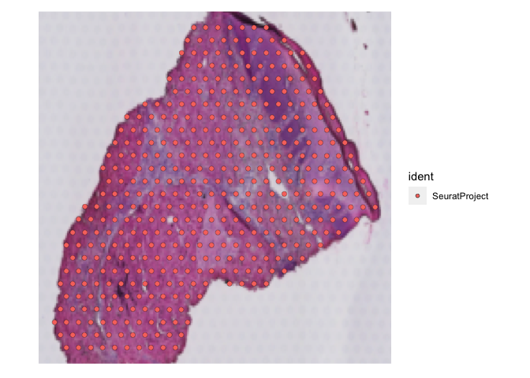<!-- -->

``` r
SpatialDimPlot(NON_LES.A1.clean)
```

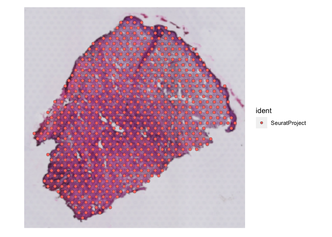<!-- -->

``` r
SpatialDimPlot(LES.B1.clean)
```

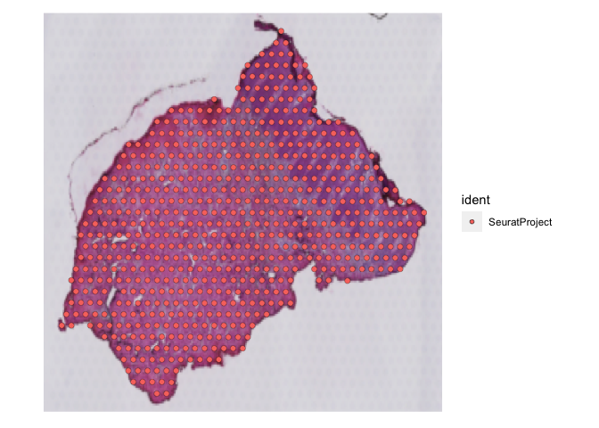<!-- -->

``` r
SpatialDimPlot(NON_LES.B1.clean)
```

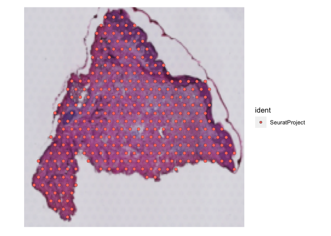<!-- -->

### BATCH 3

``` r
## PSA PATIENT 2
## LESIONAL SKIN - (Psoriatic Arthritis patient)
LES.PSA_P2_B3 <- Load10X_Spatial(data.dir ="../../THIRD_RUN/SAMPLE_1/",slice="ST_15_L_R1_Batch_3")
```

    ## Warning: Keys should be one or more alphanumeric characters followed by an
    ## underscore, setting key from st_15_l_r1_batch_3_ to st15lr1batch3_

``` r
## NON-LESIONAL SKIN - (Psoriatic Arthritis patient)
NON_LES.PSA_P2_B3 <- Load10X_Spatial(data.dir ="../../THIRD_RUN/SAMPLE_2/",slice="ST_15_NL_Batch_3")
```

    ## Warning: Keys should be one or more alphanumeric characters followed by an
    ## underscore, setting key from st_15_nl_batch_3_ to st15nlbatch3_

``` r
## PATIENT 2
## LESIONAL SKIN - PATIENT 2 (Psoriatic Arthritis patient)
TREATED_LES.PSA_P2_B3 <- Load10X_Spatial(data.dir ="../../THIRD_RUN/SAMPLE_3/",slice="Treated_PSA_Lesional_Patient_2_Batch_3")
```

    ## Warning: Keys should be one or more alphanumeric characters followed by
    ## an underscore, setting key from treated_psa_lesional_patient_2_batch_3_ to
    ## treatedpsalesionalpatient2batch3_

``` r
TREATED_NON_LES.PSA_P2_B3 <- Load10X_Spatial(data.dir ="../../THIRD_RUN/SAMPLE_4/",slice="Treated_PSA_Non_Lesional_Patient_2_Batch_3")
```

    ## Warning: Keys should be one or more alphanumeric characters followed by an
    ## underscore, setting key from treated_psa_non_lesional_patient_2_batch_3_ to
    ## treatedpsanonlesionalpatient2batch3_

### BATCH 4

``` r
## PSA PATIENT 3
## LESIONAL SKIN - (Psoriatic Arthritis patient)
LES.PSA_B4 <- Load10X_Spatial(data.dir ="../../FOURTH_RUN/SAMPLE C1/",slice="ST_18_L_R1_Batch_4")
```

    ## Warning: Keys should be one or more alphanumeric characters followed by an
    ## underscore, setting key from st_18_l_r1_batch_4_ to st18lr1batch4_

``` r
##
## NON-LESIONAL SKIN - (Psoriatic Arthritis patient)
NON_LES.PSA_B4 <- Load10X_Spatial(data.dir ="../../FOURTH_RUN/SAMPLE D1/",slice="ST_18_NL_Batch_4")
```

    ## Warning: Keys should be one or more alphanumeric characters followed by an
    ## underscore, setting key from st_18_nl_batch_4_ to st18nlbatch4_

``` r
SpatialDimPlot(LES.PSA_B4)
```

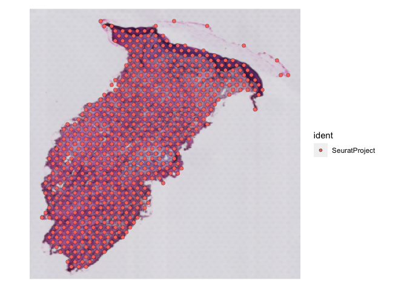<!-- -->

``` r
SpatialDimPlot(NON_LES.PSA_B4)
```

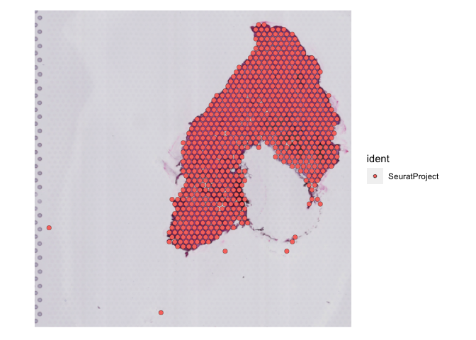<!-- -->

``` r
remove.spots <- read.csv(file="../../FOURTH_RUN/SAMPLE C1/remove.csv")
subset_spots <- Cells(LES.PSA_B4)[which((!(rownames(LES.PSA_B4@meta.data) %in% remove.spots$Barcode)))]
LES.PSA_B4.clean <- subset(LES.PSA_B4,cells=subset_spots)

remove.spots <- read.csv(file="../../FOURTH_RUN/SAMPLE D1/remove.csv")
subset_spots <- Cells(NON_LES.PSA_B4)[which((!(rownames(NON_LES.PSA_B4@meta.data) %in% remove.spots$Barcode)))]
NON_LES.PSA_B4.clean <- subset(NON_LES.PSA_B4,cells=subset_spots)
```

### BATCH 5

``` r
## LESIONAL SKIN - (Psoriasis patient)
LES.PSO_P2_B5 <- Load10X_Spatial(data.dir ="../../FIFTH_RUN/SAMPLE A1/",slice="ST_14_L_R2_Batch_5")
```

    ## Warning: Keys should be one or more alphanumeric characters followed by an
    ## underscore, setting key from st_14_l_r2_batch_5_ to st14lr2batch5_

``` r
## LESIONAL SKIN - (Psoriatic Arthritis patient)
LES.PSA_P2_B5 <- Load10X_Spatial(data.dir ="../../FIFTH_RUN/SAMPLE B1/",slice="ST_15_L_R2_Batch_5")
```

    ## Warning: Keys should be one or more alphanumeric characters followed by an
    ## underscore, setting key from st_15_l_r2_batch_5_ to st15lr2batch5_

``` r
## LESIONAL SKIN - (Psoriatic Arthritis patient)
LES.PSA_P3_B5 <- Load10X_Spatial(data.dir ="../../FIFTH_RUN/SAMPLE C1/",slice="ST_18_L_R2_Batch_5")
```

    ## Warning: Keys should be one or more alphanumeric characters followed by an
    ## underscore, setting key from st_18_l_r2_batch_5_ to st18lr2batch5_

``` r
SpatialDimPlot(LES.PSO_P2_B5)
```

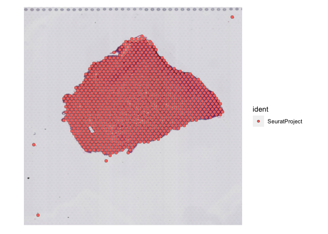<!-- -->

``` r
SpatialDimPlot(LES.PSA_P3_B5)
```

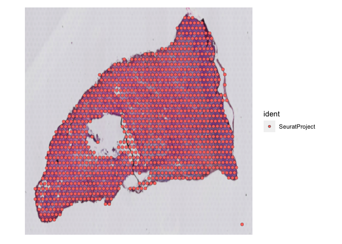<!-- -->

``` r
remove.spots <- read.csv(file="../../FIFTH_RUN/SAMPLE A1/remove.csv")
subset_spots <- Cells(LES.PSO_P2_B5)[which((!(rownames(LES.PSO_P2_B5@meta.data) %in% remove.spots$Barcode)))]
LES.PSO_P2_B5.clean <- subset(LES.PSO_P2_B5,cells=subset_spots)

remove.spots <- read.csv(file="../../FIFTH_RUN/SAMPLE C1/remove.csv")
subset_spots <- Cells(LES.PSA_P3_B5)[which((!(rownames(LES.PSA_P3_B5@meta.data) %in% remove.spots$Barcode)))]
LES.PSA_P3_B5.clean <- subset(LES.PSA_P3_B5,cells=subset_spots)
```

``` r
SpatialDimPlot(LES.PSO_P2_B5.clean)
```

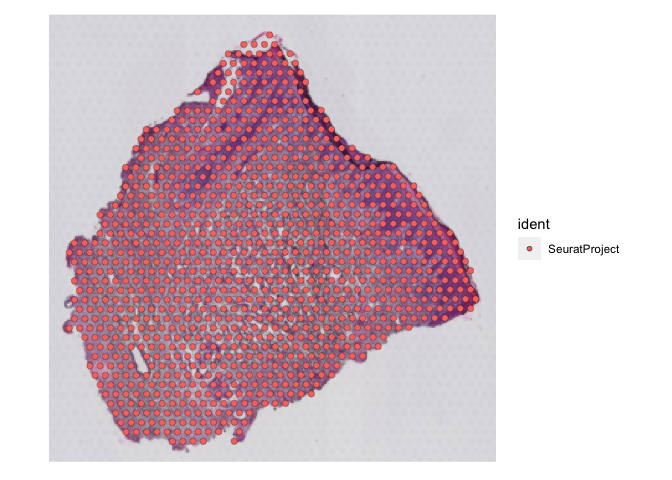<!-- -->

``` r
SpatialDimPlot(LES.PSA_P3_B5.clean)
```

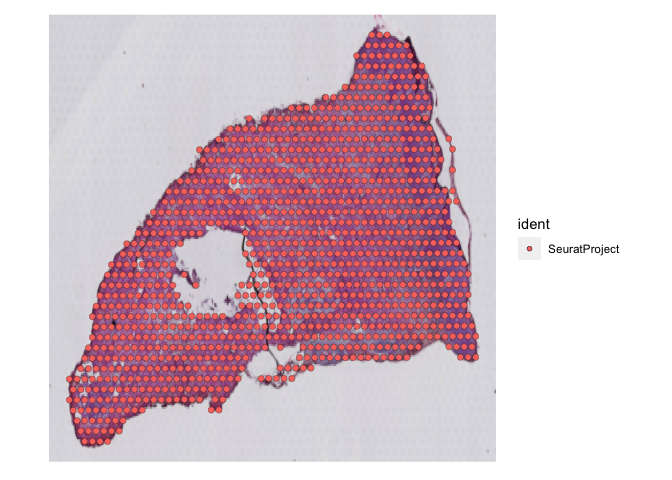<!-- -->

### BATCH 6

``` r
## LESIONAL SKIN - (Psoriasis patient)
LES.PSO_S1_B6 <- Load10X_Spatial(data.dir ="../../SIXTH_RUN/SAMPLE_A1/",slice="ST_20_L_Batch_6")
```

    ## Warning: Keys should be one or more alphanumeric characters followed by an
    ## underscore, setting key from st_20_l_batch_6_ to st20lbatch6_

``` r
## NON-LESIONAL SKIN - (Psoriasis patient)
NON_LES.PSO_S1_B6 <- Load10X_Spatial(data.dir ="../../SIXTH_RUN/SAMPLE_B1/",slice="ST_20_NL_Batch_6")
```

    ## Warning: Keys should be one or more alphanumeric characters followed by an
    ## underscore, setting key from st_20_nl_batch_6_ to st20nlbatch6_

``` r
## LESIONAL SKIN - (Psoriatic patient)
LES.PSO_S2_B6 <- Load10X_Spatial(data.dir ="../../SIXTH_RUN/SAMPLE_C1/",slice="ST_21_L_Batch_6")
```

    ## Warning: Keys should be one or more alphanumeric characters followed by an
    ## underscore, setting key from st_21_l_batch_6_ to st21lbatch6_

``` r
## NON-LESIONAL SKIN - (Psoriatic patient)
NON_LES.PSO_S2_B6 <- Load10X_Spatial(data.dir ="../../SIXTH_RUN/SAMPLE_D1/",slice="ST_21_NL_Batch_6")
```

    ## Warning: Keys should be one or more alphanumeric characters followed by an
    ## underscore, setting key from st_21_nl_batch_6_ to st21nlbatch6_

``` r
SpatialDimPlot(LES.PSO_S1_B6)
```

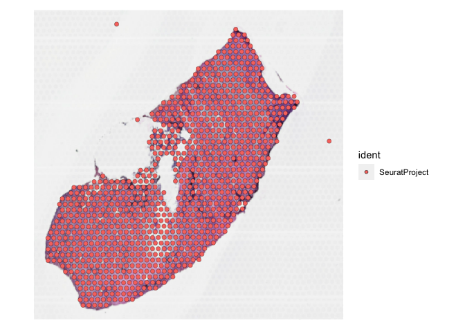<!-- -->

``` r
SpatialDimPlot(NON_LES.PSO_S1_B6)
```

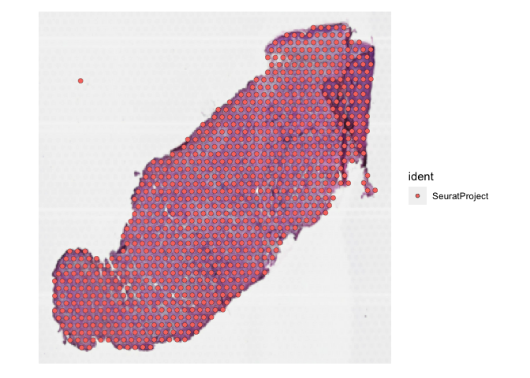<!-- -->

``` r
SpatialDimPlot(LES.PSO_S2_B6)
```

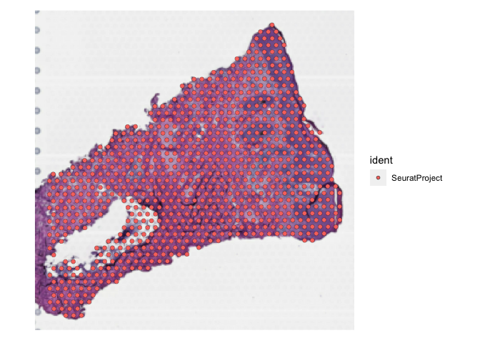<!-- -->

``` r
SpatialDimPlot(NON_LES.PSO_S2_B6)
```

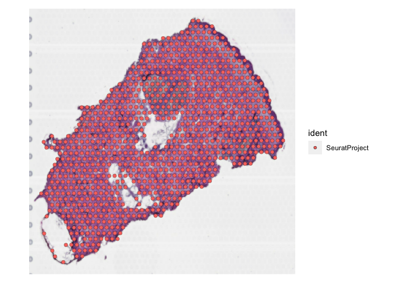<!-- -->

``` r
remove.spots <- read.csv(file="../../SIXTH_RUN/SAMPLE_A1/remove.csv")
subset_spots <- Cells(LES.PSO_S1_B6)[which((!(rownames(LES.PSO_S1_B6@meta.data) %in% remove.spots$Barcode)))]
LES.PSO_S1_B6.clean <- subset(LES.PSO_S1_B6,cells=subset_spots)

remove.spots <- read.csv(file="../../SIXTH_RUN/SAMPLE_B1/remove.csv")
subset_spots <- Cells(NON_LES.PSO_S1_B6)[which((!(rownames(NON_LES.PSO_S1_B6@meta.data) %in% remove.spots$Barcode)))]
NON_LES.PSO_S1_B6.clean <- subset(NON_LES.PSO_S1_B6,cells=subset_spots)
```

### BATCH 8

``` r
## LESIONAL SKIN - (Psoriatic Arthritis patient)
LES.PSO_B8_ROCHESTER_PATIENT_1 <- Load10X_Spatial(data.dir ="../../EIGHTH_RUN/SAMPLE_A1/",slice="PSO_Lesional_Patient1_Batch_8_ROCHESTER_SAMPLE")
```

    ## Warning: Keys should be one or more alphanumeric characters followed by an
    ## underscore, setting key from pso_lesional_patient1_batch_8_rochester_sample_ to
    ## psolesionalpatient1batch8rochestersample_

``` r
## NON-LESIONAL SKIN - (Psoriatic Arthritis patient)
LES.PSA_B8_ROCHESTER_PATIENT_2 <- Load10X_Spatial(data.dir ="../../EIGHTH_RUN/SAMPLE_B1/",slice="PSA_Lesional_Patient2_Batch_8_ROCHESTER_SAMPLE")
```

    ## Warning: Keys should be one or more alphanumeric characters followed by an
    ## underscore, setting key from psa_lesional_patient2_batch_8_rochester_sample_ to
    ## psalesionalpatient2batch8rochestersample_

``` r
## LESIONAL SKIN - (Psoriatic Arthritis patient)
LES.PSA_B8 <- Load10X_Spatial(data.dir ="../../EIGHTH_RUN/SAMPLE_C1/",slice="ST_22L_Batch_8")
```

    ## Warning: Keys should be one or more alphanumeric characters followed by an
    ## underscore, setting key from st_22l_batch_8_ to st22lbatch8_

``` r
## NON-LESIONAL SKIN - (Psoriatic Arthritis patient)
NON_LES.PSA_B8 <- Load10X_Spatial(data.dir ="../../EIGHTH_RUN/SAMPLE_D1/",slice="ST_22NL_Batch_8")
```

    ## Warning: Keys should be one or more alphanumeric characters followed by an
    ## underscore, setting key from st_22nl_batch_8_ to st22nlbatch8_

``` r
remove.spots <- read.csv(file="../../EIGHTH_RUN/SAMPLE_B1/remove.csv")
subset_spots <- Cells(LES.PSA_B8_ROCHESTER_PATIENT_2)[which((!(rownames(LES.PSA_B8_ROCHESTER_PATIENT_2@meta.data) %in% remove.spots$Barcode)))]
LES.PSA_B8_ROCHESTER_PATIENT_2.clean <- subset(LES.PSA_B8_ROCHESTER_PATIENT_2,cells=subset_spots)

remove.spots <- read.csv(file="../../EIGHTH_RUN/SAMPLE_C1/remove.csv")
subset_spots <- Cells(LES.PSA_B8)[which((!(rownames(LES.PSA_B8@meta.data) %in% remove.spots$Barcode)))]
LES.PSA_B8.clean <- subset(LES.PSA_B8,cells=subset_spots)

remove.spots <- read.csv(file="../../EIGHTH_RUN/SAMPLE_D1/remove.csv")
subset_spots <- Cells(NON_LES.PSA_B8)[which((!(rownames(NON_LES.PSA_B8@meta.data) %in% remove.spots$Barcode)))]
NON_LES.PSA_B8.clean <- subset(NON_LES.PSA_B8,cells=subset_spots)
```

``` r
SpatialDimPlot(LES.PSA_B8_ROCHESTER_PATIENT_2.clean)
```

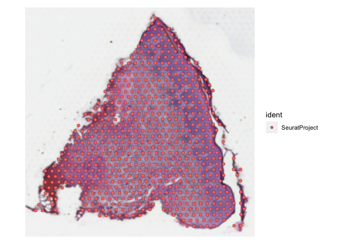<!-- -->

``` r
SpatialDimPlot(LES.PSA_B8.clean)
```

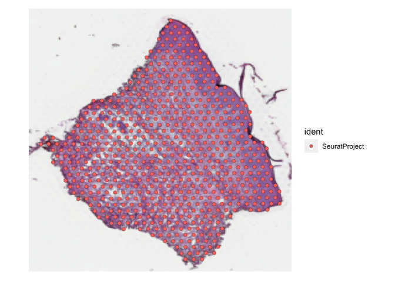<!-- -->

``` r
SpatialDimPlot(NON_LES.PSA_B8.clean)
```

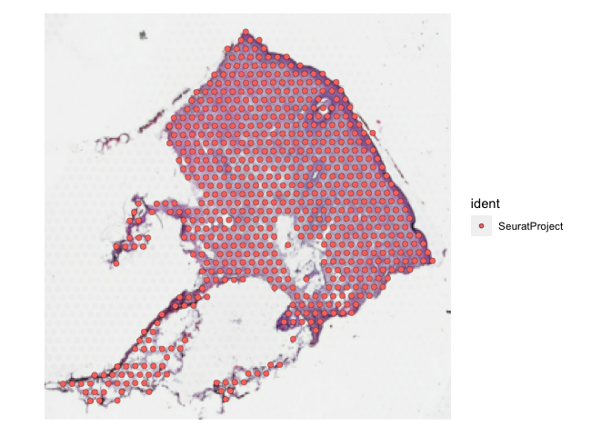<!-- -->

``` r
# PATIENT 3
remove.p3.les <- read.csv(file="../../CLOUPE_FILES/LES.C1/REMOVE.csv")
subset_spots <- Cells(LES.C1)[which((!(rownames(LES.C1@meta.data) %in% remove.p3.les$Barcode)))]
LES.C1.clean <- subset(LES.C1,cells=subset_spots)

# PATIENT 3
remove.p3.normal <- read.csv(file="../../CLOUPE_FILES/NORMAL.C1/delete.csv")
subset_spots <- Cells(NON_LES.C1)[which((!(rownames(NON_LES.C1@meta.data) %in% remove.p3.normal$Barcode)))]
NON_LES.C1.clean <- subset(NON_LES.C1,cells=subset_spots)
```

``` r
# PATIENT 4
remove.p4.les <- read.csv(file="../../CLOUPE_FILES/LES.D1/remove.csv")
subset_spots <- Cells(LES.D1)[which((!(rownames(LES.D1@meta.data) %in% remove.p4.les$Barcode)))]
LES.D1.clean <- subset(LES.D1,cells=subset_spots)

remove.p4.NON_LES <- read.csv(file="../../CLOUPE_FILES/NORMAL.D1/remove.csv")
subset_spots <- Cells(NON_LES.D1)[which((!(rownames(NON_LES.D1@meta.data) %in% remove.p4.NON_LES$Barcode)))]
NON_LES.D1.clean <- subset(NON_LES.D1,cells=subset_spots)
```

### ADD METADATA FOR PSORIATIC SAMPLES

``` r
## Assign sample names
## Refer to metadata sheet for reference.

# BATCH 1

LES.A1.clean$orig.ident <- "PSO Lesional Skin Patient 1"
NON_LES.A1.clean$orig.ident <- "PSO Non-Lesional Skin Patient 1"
LES.B1.clean$orig.ident <- "PSA Lesional Skin Patient 1"
NON_LES.B1.clean$orig.ident <- "PSA Non-Lesional Skin Patient 1"

# BATCH 2
LES.C1.clean$orig.ident <- "PSO Lesional Skin Patient 2 R1"
NON_LES.C1.clean$orig.ident <- "PSO Non-Lesional Skin Patient 2"
LES.D1.clean$orig.ident <- "PSO Lesional Skin Patient 3"
NON_LES.D1.clean$orig.ident <- "PSO Non-Lesional Skin Patient 3"

# BATCH 3
LES.PSA_P2_B3$orig.ident <- "PSA Lesional Patient 2 R1"
NON_LES.PSA_P2_B3$orig.ident <- "PSA Non-Lesional Skin Patient 2"

# BATCH 4
LES.PSA_B4.clean$orig.ident <-"PSA Lesional Patient 3 R1"
NON_LES.PSA_B4.clean$orig.ident <- "PSA Non-Lesional Patient 3"

# BATCH 5
## LESIONAL SKIN - (Psoriasis patient)
LES.PSO_P2_B5.clean$orig.ident <- "PSO Lesional Patient 2 R2"


## LESIONAL SKIN - (Psoriatic Arthritis patient)
LES.PSA_P3_B5.clean$orig.ident <- "PSA Lesional Patient 3 R2"
LES.PSA_P2_B5$orig.ident <- "PSA Lesional Patient 2 R2"

#BATCH 6
## LESIONAL SKIN - (Psoriasis patient)
LES.PSO_S1_B6.clean$orig.ident <- "PSO Lesional Patient 4"

## NON-LESIONAL SKIN - (Psoriasis patient)
NON_LES.PSO_S1_B6.clean$orig.ident <- "PSO Non-Lesional Patient 4"

## LESIONAL SKIN - (Psoriasis patient)
LES.PSO_S2_B6$orig.ident <- "PSO Lesional Patient 5"

## NON-LESIONAL SKIN - (Psoriasis patient)
NON_LES.PSO_S2_B6$orig.ident <- "PSO Non-Lesional Patient 5"

# BATCH 8
## LESIONAL SKIN - (Psoriasis patient)
LES.PSO_B8_ROCHESTER_PATIENT_1$orig.ident <- "PSO Lesional Patient1 - ROCHESTER SAMPLE"

## NON-LESIONAL SKIN - (Psoriasis patient)
LES.PSA_B8_ROCHESTER_PATIENT_2.clean$orig.ident <- "PSA Lesional Patient2 - ROCHESTER SAMPLE"

## LESIONAL SKIN - (Psoriatic Arthritis patient)
LES.PSA_B8.clean$orig.ident <- "PSA Lesional Patient 4"

## NON-LESIONAL SKIN - (Psoriatic Arthritis patient)
NON_LES.PSA_B8.clean$orig.ident <- "PSA Non-Lesional Patient 4"
```

``` r
## Assign SAMPLE IDS
## Refer to metadata sheet for reference.

# BATCH 1
LES.A1.clean$sample.id <- "PSO_LES_P1"
NON_LES.A1.clean$sample.id <- "PSO_NON_LES_P1"
LES.B1.clean$sample.id <- "PSA_LES_P1"
NON_LES.B1.clean$sample.id <- "PSA_NON_LES_P1"

# BATCH 2
LES.C1.clean$sample.id <- "PSO_LES_P2_R1"
NON_LES.C1.clean$sample.id <- "PSO_NON_LES_P2"
LES.D1.clean$sample.id <- "PSO_LES_P3"
NON_LES.D1.clean$sample.id <- "PSO_NON_LES_P3"


# BATCH 3
LES.PSA_P2_B3$sample.id <- "PSA_LES_P2_R1"
NON_LES.PSA_P2_B3$sample.id <- "PSA_NON_LES_P2"

# BATCH 4
LES.PSA_B4.clean$sample.id <-"PSA_LES_P3_R1"
NON_LES.PSA_B4.clean$sample.id <- "PSA_NON_LES_P3"

# BATCH 5
## LESIONAL SKIN - (Psoriasis patient)
LES.PSO_P2_B5.clean$sample.id <- "PSO_LES_P2_R2"

## LESIONAL SKIN - (Psoriatic Arthritis patient)
LES.PSA_P3_B5.clean$sample.id <- "PSA_LES_P3_R2"
## NON-LESIONAL SKIN - (Psoriasis patient)
LES.PSA_P2_B5$sample.id <- "PSA_LES_P2_R2"


#BATCH 6
## LESIONAL SKIN - (Psoriasis patient)
LES.PSO_S1_B6.clean$sample.id <- "PSO_LES_P4"

## NON-LESIONAL SKIN - (Psoriasis patient)
NON_LES.PSO_S1_B6.clean$sample.id <- "PSO_NON_LES_P4"

## LESIONAL SKIN - (Psoriasis patient)
LES.PSO_S2_B6$sample.id <- "PSO_LES_P5"

## NON-LESIONAL SKIN - (Psoriasis patient)
NON_LES.PSO_S2_B6$sample.id <- "PSO_NON_LES_P5"

# BATCH 8
## LESIONAL SKIN - (Psoriasis patient)
LES.PSO_B8_ROCHESTER_PATIENT_1$sample.id <- "PSO_LES_P6"

## NON-LESIONAL SKIN - (Psoriasis patient)
LES.PSA_B8_ROCHESTER_PATIENT_2.clean$sample.id <- "PSA_LES_P6"

## LESIONAL SKIN - (Psoriatic Arthritis patient)
LES.PSA_B8.clean$sample.id <- "PSA_LES_P4"

## NON-LESIONAL SKIN - (Psoriatic Arthritis patient)
NON_LES.PSA_B8.clean$sample.id <- "PSA_NON_LES_P4"
```

``` r
## BATCH INFORMATION
LES.A1.clean$Batch <- "Batch 1"
NON_LES.A1.clean$Batch <- "Batch 1"
LES.B1.clean$Batch <- "Batch 1"
NON_LES.B1.clean$Batch <- "Batch 1"

LES.C1.clean$Batch <- "Batch 2"
NON_LES.C1.clean$Batch <- "Batch 2"
LES.D1.clean$Batch <- "Batch 2"
NON_LES.D1.clean$Batch <- "Batch 2"


LES.PSA_P2_B3$Batch <- "Batch 3"
NON_LES.PSA_P2_B3$Batch <- "Batch 3"


LES.PSA_B4.clean$Batch <-"Batch 4"
NON_LES.PSA_B4.clean$Batch <- "Batch 4"


LES.PSO_P2_B5.clean$Batch <- "Batch 5"

LES.PSA_P2_B5$Batch <- "Batch 5"

LES.PSA_P3_B5.clean$Batch <- "Batch 5"

LES.PSO_S1_B6.clean$Batch <- "Batch 6"

NON_LES.PSO_S1_B6.clean$Batch <- "Batch 6"

LES.PSO_S2_B6$Batch <- "Batch 6"

NON_LES.PSO_S2_B6$Batch <- "Batch 6"

LES.PSO_B8_ROCHESTER_PATIENT_1$Batch <- "Batch 8"

LES.PSA_B8_ROCHESTER_PATIENT_2.clean$Batch <- "Batch 8"

LES.PSA_B8.clean$Batch <- "Batch 8"

NON_LES.PSA_B8.clean$Batch <- "Batch 8"
```

``` r
## NON-LESIONAL SKIN - Psoriasis only
NON_LES.A1.clean$SPECIFIC_STATUS <- "Non-Lesional PSO"
NON_LES.C1.clean$SPECIFIC_STATUS <- "Non-Lesional PSO"
NON_LES.D1.clean$SPECIFIC_STATUS <- "Non-Lesional PSO"
NON_LES.PSO_S1_B6.clean$SPECIFIC_STATUS <- "Non-Lesional PSO"
NON_LES.PSO_S2_B6$SPECIFIC_STATUS <- "Non-Lesional PSO"

## LESIONAL - Psoriasis only
LES.A1.clean$SPECIFIC_STATUS <- "Lesional PSO"
LES.C1.clean$SPECIFIC_STATUS <- "Lesional PSO"
LES.D1.clean$SPECIFIC_STATUS <- "Lesional PSO"
LES.PSO_P2_B5.clean$SPECIFIC_STATUS <- "Lesional PSO"
LES.PSO_S1_B6.clean$SPECIFIC_STATUS <- "Lesional PSO"
LES.PSO_S2_B6$SPECIFIC_STATUS <- "Lesional PSO"
LES.PSO_B8_ROCHESTER_PATIENT_1$SPECIFIC_STATUS <- "Lesional PSO"

##NON-LESIONAL SKIN - Psoriatic Arthritis
NON_LES.B1.clean$SPECIFIC_STATUS <- "Non-Lesional PSA"
NON_LES.PSA_P2_B3$SPECIFIC_STATUS <- "Non-Lesional PSA"
NON_LES.PSA_B4.clean$SPECIFIC_STATUS <- "Non-Lesional PSA"
NON_LES.PSA_B8.clean$SPECIFIC_STATUS <- "Non-Lesional PSA"

## LESIONAL SKIN - Psoriatic Arthritis
LES.B1.clean$SPECIFIC_STATUS <- "Lesional PSA"
LES.PSA_P2_B3$SPECIFIC_STATUS <- "Lesional PSA"
LES.PSA_B4.clean$SPECIFIC_STATUS <- "Lesional PSA"
LES.PSA_P3_B5.clean$SPECIFIC_STATUS <- "Lesional PSA"
LES.PSA_P2_B5$SPECIFIC_STATUS <- "Lesional PSA"
LES.PSA_B8_ROCHESTER_PATIENT_2.clean$SPECIFIC_STATUS <- "Lesional PSA"
LES.PSA_B8.clean$SPECIFIC_STATUS <- "Lesional PSA"
```

``` r
# PSORIATIC STATUS - LESIONAL OR NON-LESIONAL

## NON-LESIONAL SKIN 
NON_LES.A1.clean$DISEASE_STATUS <- "Non-Lesional"
NON_LES.C1.clean$DISEASE_STATUS <- "Non-Lesional"
NON_LES.D1.clean$DISEASE_STATUS <- "Non-Lesional"
NON_LES.PSO_S1_B6.clean$DISEASE_STATUS <- "Non-Lesional"
NON_LES.PSO_S2_B6$DISEASE_STATUS <- "Non-Lesional"

NON_LES.B1.clean$DISEASE_STATUS <- "Non-Lesional"
NON_LES.PSA_P2_B3$DISEASE_STATUS <- "Non-Lesional"
NON_LES.PSA_B4.clean$DISEASE_STATUS <- "Non-Lesional"
NON_LES.PSA_B8.clean$DISEASE_STATUS <- "Non-Lesional"

## LESIONAL 
LES.A1.clean$DISEASE_STATUS <- "Lesional"
LES.C1.clean$DISEASE_STATUS <- "Lesional"
LES.D1.clean$DISEASE_STATUS <- "Lesional"
LES.PSO_P2_B5.clean$DISEASE_STATUS <- "Lesional"
LES.PSO_S1_B6.clean$DISEASE_STATUS <- "Lesional"
LES.PSO_S2_B6$DISEASE_STATUS <- "Lesional"

LES.B1.clean$DISEASE_STATUS <- "Lesional"
LES.PSA_P2_B3$DISEASE_STATUS <- "Lesional"
LES.PSA_B4.clean$DISEASE_STATUS <- "Lesional"
LES.PSA_P2_B5$DISEASE_STATUS <- "Lesional"
LES.PSA_P3_B5.clean$DISEASE_STATUS <- "Lesional"
LES.PSA_B8_ROCHESTER_PATIENT_2.clean$DISEASE_STATUS <- "Lesional"
LES.PSO_B8_ROCHESTER_PATIENT_1$DISEASE_STATUS <- "Lesional"
LES.PSA_B8.clean$DISEASE_STATUS <- "Lesional"
```

``` r
## PASI SCORES
## NON-LESIONAL SKIN 
NON_LES.A1.clean$PASI <- 11.2
NON_LES.C1.clean$PASI <- 1.8
NON_LES.D1.clean$PASI <- 6
NON_LES.PSO_S1_B6.clean$PASI <- 32
NON_LES.PSO_S2_B6$PASI <- 18

NON_LES.B1.clean$PASI <- 28.8
NON_LES.PSA_P2_B3$PASI <- 5
NON_LES.PSA_B4.clean$PASI <- 13.2
NON_LES.PSA_B8.clean$PASI <- 8.4

## LESIONAL 
LES.A1.clean$PASI <- 11.2
LES.C1.clean$PASI <- 1.8
LES.D1.clean$PASI <- 6
LES.PSO_P2_B5.clean$PASI <- 1.8
LES.PSO_S1_B6.clean$PASI <- 32
LES.PSO_S2_B6$PASI <- 18
LES.PSA_P2_B5$PASI <- 5

LES.B1.clean$PASI <- 28.8
LES.PSA_P2_B3$PASI <- 5
LES.PSA_B4.clean$PASI <- 13.2
LES.PSA_P3_B5.clean$PASI <- 13.2
LES.PSA_B8_ROCHESTER_PATIENT_2.clean$PASI <- 4.8
LES.PSO_B8_ROCHESTER_PATIENT_1$PASI <- 10.1
LES.PSA_B8.clean$PASI <- 8.4
```

``` r
## PASI SCORES
## NON-LESIONAL SKIN 
NON_LES.A1.clean$Disease_severity <- "Mild"
NON_LES.C1.clean$Disease_severity <- "Mild"
NON_LES.D1.clean$Disease_severity <- "Mild"
NON_LES.PSO_S1_B6.clean$Disease_severity <- "Moderate-Severe"
NON_LES.PSO_S2_B6$Disease_severity <- "Moderate-Severe"

NON_LES.B1.clean$Disease_severity <- "Moderate-Severe"
NON_LES.PSA_P2_B3$Disease_severity <-"Mild"
NON_LES.PSA_B4.clean$Disease_severity <- "Moderate-Severe"
NON_LES.PSA_B8.clean$Disease_severity <- "Mild"

## LESIONAL 
LES.A1.clean$Disease_severity <- "Mild"
LES.C1.clean$Disease_severity <- "Mild"
LES.D1.clean$Disease_severity <- "Mild"
LES.PSO_P2_B5.clean$Disease_severity <- "Mild"
LES.PSO_S1_B6.clean$Disease_severity <- "Moderate-Severe"
LES.PSO_S2_B6$Disease_severity <- "Moderate-Severe"

LES.B1.clean$Disease_severity <- "Moderate-Severe"
LES.PSA_P2_B3$Disease_severity <- "Mild"
LES.PSA_B4.clean$Disease_severity <- "Moderate-Severe"
LES.PSA_P3_B5.clean$Disease_severity <- "Moderate-Severe"
LES.PSA_B8_ROCHESTER_PATIENT_2.clean$Disease_severity <- "Mild"
LES.PSO_B8_ROCHESTER_PATIENT_1$Disease_severity <- "Moderate-Severe"
LES.PSA_B8.clean$Disease_severity <- "Mild"
LES.PSA_P2_B5$Disease_severity <- "Mild"
```

``` r
## BODY SITE FOR BIOPSY
## NON-LESIONAL SKIN 
NON_LES.A1.clean$SITE <- "Back"
NON_LES.C1.clean$SITE <- "Arm"
NON_LES.D1.clean$SITE <- "Back"
NON_LES.PSO_S1_B6.clean$SITE <- "Back"
NON_LES.PSO_S2_B6$SITE <- "Back"

NON_LES.B1.clean$SITE <- "Trunk"
NON_LES.PSA_P2_B3$SITE <- "Thigh"
NON_LES.PSA_B4.clean$SITE <- "Back"
NON_LES.PSA_B8.clean$SITE <- "Leg"

## LESIONAL 
LES.A1.clean$SITE <- "Back"
LES.C1.clean$SITE <- "Forearm"
LES.D1.clean$SITE <- "Back"
LES.PSO_P2_B5.clean$SITE <- "Arm"
LES.PSO_S1_B6.clean$SITE <- "Back"
LES.PSO_S2_B6$SITE <- "Arm"

LES.B1.clean$SITE <- "Back"
LES.PSA_P2_B3$SITE <- "Thigh"
LES.PSA_B4.clean$SITE <- "Back"
LES.PSA_P3_B5.clean$SITE <- "Back"
LES.PSA_B8_ROCHESTER_PATIENT_2.clean$SITE <- "NA"
LES.PSO_B8_ROCHESTER_PATIENT_1$SITE <- "NA"
LES.PSA_B8.clean$SITE <- "Leg"
```

### POOL NON-LESIONAL AND LESIONAL SAMPLES

``` r
NON_LES_SAMPLES <- c(NON_LES.A1.clean,NON_LES.C1.clean,NON_LES.D1.clean,NON_LES.PSO_S1_B6.clean,NON_LES.PSO_S2_B6,NON_LES.B1.clean,NON_LES.PSA_P2_B3,NON_LES.PSA_B4.clean,NON_LES.PSA_B8.clean)

## LESIONAL 
LES_SAMPLES <- c(LES.A1.clean,LES.C1.clean,LES.D1.clean,LES.PSO_P2_B5.clean,LES.PSO_S1_B6.clean,LES.PSO_S2_B6,LES.B1.clean,LES.PSA_P2_B3,LES.PSA_B4.clean,LES.PSA_P2_B5,LES.PSA_P3_B5.clean,LES.PSA_B8_ROCHESTER_PATIENT_2.clean,LES.PSO_B8_ROCHESTER_PATIENT_1,LES.PSA_B8.clean)
```

\#SPATIAL PLOTS (WITHOUT QC FILTERING)

``` r
for (x in NON_LES_SAMPLES){
  st_plot(x)
}
for (x in LES_SAMPLES){
  st_plot(x)
}
```

### STANDARD QC SCATTER PLOTS WITH - UMIs vs Genes

``` r
for (x in NON_LES_SAMPLES){
  st_scatter_QC(x)
}
for (x in LES_SAMPLES){
  st_scatter_QC(x)
}
```

### PERFORMING STANDARD QC FILTERING (REMOVE SPOTS WITH LESS THAN 200 GENES)

``` r
i <- 1
while(i <= length(Healthy_Samples)){
  filtered_data <- st_filter_by_genes(st.data = Healthy_Samples[[i]],x = 200)
  filtered_data <- SCTransform(filtered_data,assay = "Spatial")
  Healthy_Samples[[i]] <- filtered_data
  i <- i+1
}
```

    ## Calculating cell attributes from input UMI matrix: log_umi

    ## Variance stabilizing transformation of count matrix of size 11464 by 257

    ## Model formula is y ~ log_umi

    ## Get Negative Binomial regression parameters per gene

    ## Using 2000 genes, 257 cells

    ##   |                                                                              |                                                                      |   0%  |                                                                              |==================                                                    |  25%  |                                                                              |===================================                                   |  50%  |                                                                              |====================================================                  |  75%  |                                                                              |======================================================================| 100%

    ## Found 25 outliers - those will be ignored in fitting/regularization step

    ## Second step: Get residuals using fitted parameters for 11464 genes

    ##   |                                                                              |                                                                      |   0%  |                                                                              |===                                                                   |   4%  |                                                                              |======                                                                |   9%  |                                                                              |=========                                                             |  13%  |                                                                              |============                                                          |  17%  |                                                                              |===============                                                       |  22%  |                                                                              |==================                                                    |  26%  |                                                                              |=====================                                                 |  30%  |                                                                              |========================                                              |  35%  |                                                                              |===========================                                           |  39%  |                                                                              |==============================                                        |  43%  |                                                                              |=================================                                     |  48%  |                                                                              |=====================================                                 |  52%  |                                                                              |========================================                              |  57%  |                                                                              |===========================================                           |  61%  |                                                                              |==============================================                        |  65%  |                                                                              |=================================================                     |  70%  |                                                                              |====================================================                  |  74%  |                                                                              |=======================================================               |  78%  |                                                                              |==========================================================            |  83%  |                                                                              |=============================================================         |  87%  |                                                                              |================================================================      |  91%  |                                                                              |===================================================================   |  96%  |                                                                              |======================================================================| 100%

    ## Computing corrected count matrix for 11464 genes

    ##   |                                                                              |                                                                      |   0%  |                                                                              |===                                                                   |   4%  |                                                                              |======                                                                |   9%  |                                                                              |=========                                                             |  13%  |                                                                              |============                                                          |  17%  |                                                                              |===============                                                       |  22%  |                                                                              |==================                                                    |  26%  |                                                                              |=====================                                                 |  30%  |                                                                              |========================                                              |  35%  |                                                                              |===========================                                           |  39%  |                                                                              |==============================                                        |  43%  |                                                                              |=================================                                     |  48%  |                                                                              |=====================================                                 |  52%  |                                                                              |========================================                              |  57%  |                                                                              |===========================================                           |  61%  |                                                                              |==============================================                        |  65%  |                                                                              |=================================================                     |  70%  |                                                                              |====================================================                  |  74%  |                                                                              |=======================================================               |  78%  |                                                                              |==========================================================            |  83%  |                                                                              |=============================================================         |  87%  |                                                                              |================================================================      |  91%  |                                                                              |===================================================================   |  96%  |                                                                              |======================================================================| 100%

    ## Calculating gene attributes

    ## Wall clock passed: Time difference of 4.771179 secs

    ## Determine variable features

    ## Place corrected count matrix in counts slot

    ## Centering data matrix

    ## Set default assay to SCT

    ## Calculating cell attributes from input UMI matrix: log_umi

    ## Variance stabilizing transformation of count matrix of size 11687 by 431

    ## Model formula is y ~ log_umi

    ## Get Negative Binomial regression parameters per gene

    ## Using 2000 genes, 431 cells

    ##   |                                                                              |                                                                      |   0%  |                                                                              |==================                                                    |  25%  |                                                                              |===================================                                   |  50%  |                                                                              |====================================================                  |  75%  |                                                                              |======================================================================| 100%

    ## Found 38 outliers - those will be ignored in fitting/regularization step

    ## Second step: Get residuals using fitted parameters for 11687 genes

    ##   |                                                                              |                                                                      |   0%  |                                                                              |===                                                                   |   4%  |                                                                              |======                                                                |   8%  |                                                                              |=========                                                             |  12%  |                                                                              |============                                                          |  17%  |                                                                              |===============                                                       |  21%  |                                                                              |==================                                                    |  25%  |                                                                              |====================                                                  |  29%  |                                                                              |=======================                                               |  33%  |                                                                              |==========================                                            |  38%  |                                                                              |=============================                                         |  42%  |                                                                              |================================                                      |  46%  |                                                                              |===================================                                   |  50%  |                                                                              |======================================                                |  54%  |                                                                              |=========================================                             |  58%  |                                                                              |============================================                          |  62%  |                                                                              |===============================================                       |  67%  |                                                                              |==================================================                    |  71%  |                                                                              |====================================================                  |  75%  |                                                                              |=======================================================               |  79%  |                                                                              |==========================================================            |  83%  |                                                                              |=============================================================         |  88%  |                                                                              |================================================================      |  92%  |                                                                              |===================================================================   |  96%  |                                                                              |======================================================================| 100%

    ## Computing corrected count matrix for 11687 genes

    ##   |                                                                              |                                                                      |   0%  |                                                                              |===                                                                   |   4%  |                                                                              |======                                                                |   8%  |                                                                              |=========                                                             |  12%  |                                                                              |============                                                          |  17%  |                                                                              |===============                                                       |  21%  |                                                                              |==================                                                    |  25%  |                                                                              |====================                                                  |  29%  |                                                                              |=======================                                               |  33%  |                                                                              |==========================                                            |  38%  |                                                                              |=============================                                         |  42%  |                                                                              |================================                                      |  46%  |                                                                              |===================================                                   |  50%  |                                                                              |======================================                                |  54%  |                                                                              |=========================================                             |  58%  |                                                                              |============================================                          |  62%  |                                                                              |===============================================                       |  67%  |                                                                              |==================================================                    |  71%  |                                                                              |====================================================                  |  75%  |                                                                              |=======================================================               |  79%  |                                                                              |==========================================================            |  83%  |                                                                              |=============================================================         |  88%  |                                                                              |================================================================      |  92%  |                                                                              |===================================================================   |  96%  |                                                                              |======================================================================| 100%

    ## Calculating gene attributes

    ## Wall clock passed: Time difference of 6.366016 secs

    ## Determine variable features

    ## Place corrected count matrix in counts slot

    ## Centering data matrix

    ## Set default assay to SCT

    ## Calculating cell attributes from input UMI matrix: log_umi

    ## Variance stabilizing transformation of count matrix of size 12275 by 441

    ## Model formula is y ~ log_umi

    ## Get Negative Binomial regression parameters per gene

    ## Using 2000 genes, 441 cells

    ##   |                                                                              |                                                                      |   0%  |                                                                              |==================                                                    |  25%  |                                                                              |===================================                                   |  50%  |                                                                              |====================================================                  |  75%  |                                                                              |======================================================================| 100%

    ## Found 50 outliers - those will be ignored in fitting/regularization step

    ## Second step: Get residuals using fitted parameters for 12275 genes

    ##   |                                                                              |                                                                      |   0%  |                                                                              |===                                                                   |   4%  |                                                                              |======                                                                |   8%  |                                                                              |========                                                              |  12%  |                                                                              |===========                                                           |  16%  |                                                                              |==============                                                        |  20%  |                                                                              |=================                                                     |  24%  |                                                                              |====================                                                  |  28%  |                                                                              |======================                                                |  32%  |                                                                              |=========================                                             |  36%  |                                                                              |============================                                          |  40%  |                                                                              |===============================                                       |  44%  |                                                                              |==================================                                    |  48%  |                                                                              |====================================                                  |  52%  |                                                                              |=======================================                               |  56%  |                                                                              |==========================================                            |  60%  |                                                                              |=============================================                         |  64%  |                                                                              |================================================                      |  68%  |                                                                              |==================================================                    |  72%  |                                                                              |=====================================================                 |  76%  |                                                                              |========================================================              |  80%  |                                                                              |===========================================================           |  84%  |                                                                              |==============================================================        |  88%  |                                                                              |================================================================      |  92%  |                                                                              |===================================================================   |  96%  |                                                                              |======================================================================| 100%

    ## Computing corrected count matrix for 12275 genes

    ##   |                                                                              |                                                                      |   0%  |                                                                              |===                                                                   |   4%  |                                                                              |======                                                                |   8%  |                                                                              |========                                                              |  12%  |                                                                              |===========                                                           |  16%  |                                                                              |==============                                                        |  20%  |                                                                              |=================                                                     |  24%  |                                                                              |====================                                                  |  28%  |                                                                              |======================                                                |  32%  |                                                                              |=========================                                             |  36%  |                                                                              |============================                                          |  40%  |                                                                              |===============================                                       |  44%  |                                                                              |==================================                                    |  48%  |                                                                              |====================================                                  |  52%  |                                                                              |=======================================                               |  56%  |                                                                              |==========================================                            |  60%  |                                                                              |=============================================                         |  64%  |                                                                              |================================================                      |  68%  |                                                                              |==================================================                    |  72%  |                                                                              |=====================================================                 |  76%  |                                                                              |========================================================              |  80%  |                                                                              |===========================================================           |  84%  |                                                                              |==============================================================        |  88%  |                                                                              |================================================================      |  92%  |                                                                              |===================================================================   |  96%  |                                                                              |======================================================================| 100%

    ## Calculating gene attributes

    ## Wall clock passed: Time difference of 6.377364 secs

    ## Determine variable features

    ## Place corrected count matrix in counts slot

    ## Centering data matrix

    ## Set default assay to SCT

    ## Calculating cell attributes from input UMI matrix: log_umi

    ## Variance stabilizing transformation of count matrix of size 14332 by 831

    ## Model formula is y ~ log_umi

    ## Get Negative Binomial regression parameters per gene

    ## Using 2000 genes, 831 cells

    ##   |                                                                              |                                                                      |   0%  |                                                                              |==================                                                    |  25%  |                                                                              |===================================                                   |  50%  |                                                                              |====================================================                  |  75%  |                                                                              |======================================================================| 100%

    ## Found 36 outliers - those will be ignored in fitting/regularization step

    ## Second step: Get residuals using fitted parameters for 14332 genes

    ##   |                                                                              |                                                                      |   0%  |                                                                              |==                                                                    |   3%  |                                                                              |=====                                                                 |   7%  |                                                                              |=======                                                               |  10%  |                                                                              |==========                                                            |  14%  |                                                                              |============                                                          |  17%  |                                                                              |==============                                                        |  21%  |                                                                              |=================                                                     |  24%  |                                                                              |===================                                                   |  28%  |                                                                              |======================                                                |  31%  |                                                                              |========================                                              |  34%  |                                                                              |===========================                                           |  38%  |                                                                              |=============================                                         |  41%  |                                                                              |===============================                                       |  45%  |                                                                              |==================================                                    |  48%  |                                                                              |====================================                                  |  52%  |                                                                              |=======================================                               |  55%  |                                                                              |=========================================                             |  59%  |                                                                              |===========================================                           |  62%  |                                                                              |==============================================                        |  66%  |                                                                              |================================================                      |  69%  |                                                                              |===================================================                   |  72%  |                                                                              |=====================================================                 |  76%  |                                                                              |========================================================              |  79%  |                                                                              |==========================================================            |  83%  |                                                                              |============================================================          |  86%  |                                                                              |===============================================================       |  90%  |                                                                              |=================================================================     |  93%  |                                                                              |====================================================================  |  97%  |                                                                              |======================================================================| 100%

    ## Computing corrected count matrix for 14332 genes

    ##   |                                                                              |                                                                      |   0%  |                                                                              |==                                                                    |   3%  |                                                                              |=====                                                                 |   7%  |                                                                              |=======                                                               |  10%  |                                                                              |==========                                                            |  14%  |                                                                              |============                                                          |  17%  |                                                                              |==============                                                        |  21%  |                                                                              |=================                                                     |  24%  |                                                                              |===================                                                   |  28%  |                                                                              |======================                                                |  31%  |                                                                              |========================                                              |  34%  |                                                                              |===========================                                           |  38%  |                                                                              |=============================                                         |  41%  |                                                                              |===============================                                       |  45%  |                                                                              |==================================                                    |  48%  |                                                                              |====================================                                  |  52%  |                                                                              |=======================================                               |  55%  |                                                                              |=========================================                             |  59%  |                                                                              |===========================================                           |  62%  |                                                                              |==============================================                        |  66%  |                                                                              |================================================                      |  69%  |                                                                              |===================================================                   |  72%  |                                                                              |=====================================================                 |  76%  |                                                                              |========================================================              |  79%  |                                                                              |==========================================================            |  83%  |                                                                              |============================================================          |  86%  |                                                                              |===============================================================       |  90%  |                                                                              |=================================================================     |  93%  |                                                                              |====================================================================  |  97%  |                                                                              |======================================================================| 100%

    ## Calculating gene attributes

    ## Wall clock passed: Time difference of 10.58626 secs

    ## Determine variable features

    ## Place corrected count matrix in counts slot

    ## Centering data matrix

    ## Set default assay to SCT

    ## Calculating cell attributes from input UMI matrix: log_umi

    ## Variance stabilizing transformation of count matrix of size 10385 by 358

    ## Model formula is y ~ log_umi

    ## Get Negative Binomial regression parameters per gene

    ## Using 2000 genes, 358 cells

    ##   |                                                                              |                                                                      |   0%  |                                                                              |==================                                                    |  25%  |                                                                              |===================================                                   |  50%  |                                                                              |====================================================                  |  75%  |                                                                              |======================================================================| 100%

    ## Found 34 outliers - those will be ignored in fitting/regularization step

    ## Second step: Get residuals using fitted parameters for 10385 genes

    ##   |                                                                              |                                                                      |   0%  |                                                                              |===                                                                   |   5%  |                                                                              |=======                                                               |  10%  |                                                                              |==========                                                            |  14%  |                                                                              |=============                                                         |  19%  |                                                                              |=================                                                     |  24%  |                                                                              |====================                                                  |  29%  |                                                                              |=======================                                               |  33%  |                                                                              |===========================                                           |  38%  |                                                                              |==============================                                        |  43%  |                                                                              |=================================                                     |  48%  |                                                                              |=====================================                                 |  52%  |                                                                              |========================================                              |  57%  |                                                                              |===========================================                           |  62%  |                                                                              |===============================================                       |  67%  |                                                                              |==================================================                    |  71%  |                                                                              |=====================================================                 |  76%  |                                                                              |=========================================================             |  81%  |                                                                              |============================================================          |  86%  |                                                                              |===============================================================       |  90%  |                                                                              |===================================================================   |  95%  |                                                                              |======================================================================| 100%

    ## Computing corrected count matrix for 10385 genes

    ##   |                                                                              |                                                                      |   0%  |                                                                              |===                                                                   |   5%  |                                                                              |=======                                                               |  10%  |                                                                              |==========                                                            |  14%  |                                                                              |=============                                                         |  19%  |                                                                              |=================                                                     |  24%  |                                                                              |====================                                                  |  29%  |                                                                              |=======================                                               |  33%  |                                                                              |===========================                                           |  38%  |                                                                              |==============================                                        |  43%  |                                                                              |=================================                                     |  48%  |                                                                              |=====================================                                 |  52%  |                                                                              |========================================                              |  57%  |                                                                              |===========================================                           |  62%  |                                                                              |===============================================                       |  67%  |                                                                              |==================================================                    |  71%  |                                                                              |=====================================================                 |  76%  |                                                                              |=========================================================             |  81%  |                                                                              |============================================================          |  86%  |                                                                              |===============================================================       |  90%  |                                                                              |===================================================================   |  95%  |                                                                              |======================================================================| 100%

    ## Calculating gene attributes

    ## Wall clock passed: Time difference of 5.338243 secs

    ## Determine variable features

    ## Place corrected count matrix in counts slot

    ## Centering data matrix

    ## Set default assay to SCT

    ## Calculating cell attributes from input UMI matrix: log_umi

    ## Variance stabilizing transformation of count matrix of size 13707 by 777

    ## Model formula is y ~ log_umi

    ## Get Negative Binomial regression parameters per gene

    ## Using 2000 genes, 777 cells

    ##   |                                                                              |                                                                      |   0%  |                                                                              |==================                                                    |  25%  |                                                                              |===================================                                   |  50%  |                                                                              |====================================================                  |  75%  |                                                                              |======================================================================| 100%

    ## Found 44 outliers - those will be ignored in fitting/regularization step

    ## Second step: Get residuals using fitted parameters for 13707 genes

    ##   |                                                                              |                                                                      |   0%  |                                                                              |==                                                                    |   4%  |                                                                              |=====                                                                 |   7%  |                                                                              |========                                                              |  11%  |                                                                              |==========                                                            |  14%  |                                                                              |============                                                          |  18%  |                                                                              |===============                                                       |  21%  |                                                                              |==================                                                    |  25%  |                                                                              |====================                                                  |  29%  |                                                                              |======================                                                |  32%  |                                                                              |=========================                                             |  36%  |                                                                              |============================                                          |  39%  |                                                                              |==============================                                        |  43%  |                                                                              |================================                                      |  46%  |                                                                              |===================================                                   |  50%  |                                                                              |======================================                                |  54%  |                                                                              |========================================                              |  57%  |                                                                              |==========================================                            |  61%  |                                                                              |=============================================                         |  64%  |                                                                              |================================================                      |  68%  |                                                                              |==================================================                    |  71%  |                                                                              |====================================================                  |  75%  |                                                                              |=======================================================               |  79%  |                                                                              |==========================================================            |  82%  |                                                                              |============================================================          |  86%  |                                                                              |==============================================================        |  89%  |                                                                              |=================================================================     |  93%  |                                                                              |====================================================================  |  96%  |                                                                              |======================================================================| 100%

    ## Computing corrected count matrix for 13707 genes

    ##   |                                                                              |                                                                      |   0%  |                                                                              |==                                                                    |   4%  |                                                                              |=====                                                                 |   7%  |                                                                              |========                                                              |  11%  |                                                                              |==========                                                            |  14%  |                                                                              |============                                                          |  18%  |                                                                              |===============                                                       |  21%  |                                                                              |==================                                                    |  25%  |                                                                              |====================                                                  |  29%  |                                                                              |======================                                                |  32%  |                                                                              |=========================                                             |  36%  |                                                                              |============================                                          |  39%  |                                                                              |==============================                                        |  43%  |                                                                              |================================                                      |  46%  |                                                                              |===================================                                   |  50%  |                                                                              |======================================                                |  54%  |                                                                              |========================================                              |  57%  |                                                                              |==========================================                            |  61%  |                                                                              |=============================================                         |  64%  |                                                                              |================================================                      |  68%  |                                                                              |==================================================                    |  71%  |                                                                              |====================================================                  |  75%  |                                                                              |=======================================================               |  79%  |                                                                              |==========================================================            |  82%  |                                                                              |============================================================          |  86%  |                                                                              |==============================================================        |  89%  |                                                                              |=================================================================     |  93%  |                                                                              |====================================================================  |  96%  |                                                                              |======================================================================| 100%

    ## Calculating gene attributes

    ## Wall clock passed: Time difference of 9.811453 secs

    ## Determine variable features

    ## Place corrected count matrix in counts slot

    ## Centering data matrix

    ## Set default assay to SCT

    ## Calculating cell attributes from input UMI matrix: log_umi

    ## Variance stabilizing transformation of count matrix of size 12786 by 691

    ## Model formula is y ~ log_umi

    ## Get Negative Binomial regression parameters per gene

    ## Using 2000 genes, 691 cells

    ##   |                                                                              |                                                                      |   0%  |                                                                              |==================                                                    |  25%  |                                                                              |===================================                                   |  50%  |                                                                              |====================================================                  |  75%  |                                                                              |======================================================================| 100%

    ## Found 38 outliers - those will be ignored in fitting/regularization step

    ## Second step: Get residuals using fitted parameters for 12786 genes

    ##   |                                                                              |                                                                      |   0%  |                                                                              |===                                                                   |   4%  |                                                                              |=====                                                                 |   8%  |                                                                              |========                                                              |  12%  |                                                                              |===========                                                           |  15%  |                                                                              |=============                                                         |  19%  |                                                                              |================                                                      |  23%  |                                                                              |===================                                                   |  27%  |                                                                              |======================                                                |  31%  |                                                                              |========================                                              |  35%  |                                                                              |===========================                                           |  38%  |                                                                              |==============================                                        |  42%  |                                                                              |================================                                      |  46%  |                                                                              |===================================                                   |  50%  |                                                                              |======================================                                |  54%  |                                                                              |========================================                              |  58%  |                                                                              |===========================================                           |  62%  |                                                                              |==============================================                        |  65%  |                                                                              |================================================                      |  69%  |                                                                              |===================================================                   |  73%  |                                                                              |======================================================                |  77%  |                                                                              |=========================================================             |  81%  |                                                                              |===========================================================           |  85%  |                                                                              |==============================================================        |  88%  |                                                                              |=================================================================     |  92%  |                                                                              |===================================================================   |  96%  |                                                                              |======================================================================| 100%

    ## Computing corrected count matrix for 12786 genes

    ##   |                                                                              |                                                                      |   0%  |                                                                              |===                                                                   |   4%  |                                                                              |=====                                                                 |   8%  |                                                                              |========                                                              |  12%  |                                                                              |===========                                                           |  15%  |                                                                              |=============                                                         |  19%  |                                                                              |================                                                      |  23%  |                                                                              |===================                                                   |  27%  |                                                                              |======================                                                |  31%  |                                                                              |========================                                              |  35%  |                                                                              |===========================                                           |  38%  |                                                                              |==============================                                        |  42%  |                                                                              |================================                                      |  46%  |                                                                              |===================================                                   |  50%  |                                                                              |======================================                                |  54%  |                                                                              |========================================                              |  58%  |                                                                              |===========================================                           |  62%  |                                                                              |==============================================                        |  65%  |                                                                              |================================================                      |  69%  |                                                                              |===================================================                   |  73%  |                                                                              |======================================================                |  77%  |                                                                              |=========================================================             |  81%  |                                                                              |===========================================================           |  85%  |                                                                              |==============================================================        |  88%  |                                                                              |=================================================================     |  92%  |                                                                              |===================================================================   |  96%  |                                                                              |======================================================================| 100%

    ## Calculating gene attributes

    ## Wall clock passed: Time difference of 8.953163 secs

    ## Determine variable features

    ## Place corrected count matrix in counts slot

    ## Centering data matrix

    ## Set default assay to SCT

``` r
i <- 1
while(i <= length(NON_LES_SAMPLES)){
  filtered_data <- st_filter_by_genes(st.data = NON_LES_SAMPLES[[i]],x = 200)
  filtered_data <- SCTransform(filtered_data,assay = "Spatial")
  NON_LES_SAMPLES[[i]] <- filtered_data
  i <- i+1
}
```

    ## Calculating cell attributes from input UMI matrix: log_umi

    ## Variance stabilizing transformation of count matrix of size 10146 by 238

    ## Model formula is y ~ log_umi

    ## Get Negative Binomial regression parameters per gene

    ## Using 2000 genes, 238 cells

    ##   |                                                                              |                                                                      |   0%  |                                                                              |==================                                                    |  25%  |                                                                              |===================================                                   |  50%  |                                                                              |====================================================                  |  75%  |                                                                              |======================================================================| 100%

    ## Found 37 outliers - those will be ignored in fitting/regularization step

    ## Second step: Get residuals using fitted parameters for 10146 genes

    ##   |                                                                              |                                                                      |   0%  |                                                                              |===                                                                   |   5%  |                                                                              |=======                                                               |  10%  |                                                                              |==========                                                            |  14%  |                                                                              |=============                                                         |  19%  |                                                                              |=================                                                     |  24%  |                                                                              |====================                                                  |  29%  |                                                                              |=======================                                               |  33%  |                                                                              |===========================                                           |  38%  |                                                                              |==============================                                        |  43%  |                                                                              |=================================                                     |  48%  |                                                                              |=====================================                                 |  52%  |                                                                              |========================================                              |  57%  |                                                                              |===========================================                           |  62%  |                                                                              |===============================================                       |  67%  |                                                                              |==================================================                    |  71%  |                                                                              |=====================================================                 |  76%  |                                                                              |=========================================================             |  81%  |                                                                              |============================================================          |  86%  |                                                                              |===============================================================       |  90%  |                                                                              |===================================================================   |  95%  |                                                                              |======================================================================| 100%

    ## Computing corrected count matrix for 10146 genes

    ##   |                                                                              |                                                                      |   0%  |                                                                              |===                                                                   |   5%  |                                                                              |=======                                                               |  10%  |                                                                              |==========                                                            |  14%  |                                                                              |=============                                                         |  19%  |                                                                              |=================                                                     |  24%  |                                                                              |====================                                                  |  29%  |                                                                              |=======================                                               |  33%  |                                                                              |===========================                                           |  38%  |                                                                              |==============================                                        |  43%  |                                                                              |=================================                                     |  48%  |                                                                              |=====================================                                 |  52%  |                                                                              |========================================                              |  57%  |                                                                              |===========================================                           |  62%  |                                                                              |===============================================                       |  67%  |                                                                              |==================================================                    |  71%  |                                                                              |=====================================================                 |  76%  |                                                                              |=========================================================             |  81%  |                                                                              |============================================================          |  86%  |                                                                              |===============================================================       |  90%  |                                                                              |===================================================================   |  95%  |                                                                              |======================================================================| 100%

    ## Calculating gene attributes

    ## Wall clock passed: Time difference of 4.209438 secs

    ## Determine variable features

    ## Place corrected count matrix in counts slot

    ## Centering data matrix

    ## Set default assay to SCT

    ## Calculating cell attributes from input UMI matrix: log_umi

    ## Variance stabilizing transformation of count matrix of size 5746 by 169

    ## Model formula is y ~ log_umi

    ## Get Negative Binomial regression parameters per gene

    ## Using 2000 genes, 169 cells

    ##   |                                                                              |                                                                      |   0%  |                                                                              |==================                                                    |  25%  |                                                                              |===================================                                   |  50%  |                                                                              |====================================================                  |  75%  |                                                                              |======================================================================| 100%

    ## Found 2 outliers - those will be ignored in fitting/regularization step

    ## Second step: Get residuals using fitted parameters for 5746 genes

    ##   |                                                                              |                                                                      |   0%  |                                                                              |======                                                                |   8%  |                                                                              |============                                                          |  17%  |                                                                              |==================                                                    |  25%  |                                                                              |=======================                                               |  33%  |                                                                              |=============================                                         |  42%  |                                                                              |===================================                                   |  50%  |                                                                              |=========================================                             |  58%  |                                                                              |===============================================                       |  67%  |                                                                              |====================================================                  |  75%  |                                                                              |==========================================================            |  83%  |                                                                              |================================================================      |  92%  |                                                                              |======================================================================| 100%

    ## Computing corrected count matrix for 5746 genes

    ##   |                                                                              |                                                                      |   0%  |                                                                              |======                                                                |   8%  |                                                                              |============                                                          |  17%  |                                                                              |==================                                                    |  25%  |                                                                              |=======================                                               |  33%  |                                                                              |=============================                                         |  42%  |                                                                              |===================================                                   |  50%  |                                                                              |=========================================                             |  58%  |                                                                              |===============================================                       |  67%  |                                                                              |====================================================                  |  75%  |                                                                              |==========================================================            |  83%  |                                                                              |================================================================      |  92%  |                                                                              |======================================================================| 100%

    ## Calculating gene attributes

    ## Wall clock passed: Time difference of 3.190827 secs

    ## Determine variable features

    ## Place corrected count matrix in counts slot

    ## Centering data matrix

    ## Set default assay to SCT

    ## Calculating cell attributes from input UMI matrix: log_umi

    ## Variance stabilizing transformation of count matrix of size 7175 by 244

    ## Model formula is y ~ log_umi

    ## Get Negative Binomial regression parameters per gene

    ## Using 2000 genes, 244 cells

    ##   |                                                                              |                                                                      |   0%  |                                                                              |==================                                                    |  25%  |                                                                              |===================================                                   |  50%  |                                                                              |====================================================                  |  75%  |                                                                              |======================================================================| 100%

    ## Found 30 outliers - those will be ignored in fitting/regularization step

    ## Second step: Get residuals using fitted parameters for 7175 genes

    ##   |                                                                              |                                                                      |   0%  |                                                                              |=====                                                                 |   7%  |                                                                              |=========                                                             |  13%  |                                                                              |==============                                                        |  20%  |                                                                              |===================                                                   |  27%  |                                                                              |=======================                                               |  33%  |                                                                              |============================                                          |  40%  |                                                                              |=================================                                     |  47%  |                                                                              |=====================================                                 |  53%  |                                                                              |==========================================                            |  60%  |                                                                              |===============================================                       |  67%  |                                                                              |===================================================                   |  73%  |                                                                              |========================================================              |  80%  |                                                                              |=============================================================         |  87%  |                                                                              |=================================================================     |  93%  |                                                                              |======================================================================| 100%

    ## Computing corrected count matrix for 7175 genes

    ##   |                                                                              |                                                                      |   0%  |                                                                              |=====                                                                 |   7%  |                                                                              |=========                                                             |  13%  |                                                                              |==============                                                        |  20%  |                                                                              |===================                                                   |  27%  |                                                                              |=======================                                               |  33%  |                                                                              |============================                                          |  40%  |                                                                              |=================================                                     |  47%  |                                                                              |=====================================                                 |  53%  |                                                                              |==========================================                            |  60%  |                                                                              |===============================================                       |  67%  |                                                                              |===================================================                   |  73%  |                                                                              |========================================================              |  80%  |                                                                              |=============================================================         |  87%  |                                                                              |=================================================================     |  93%  |                                                                              |======================================================================| 100%

    ## Calculating gene attributes

    ## Wall clock passed: Time difference of 4.036865 secs

    ## Determine variable features

    ## Place corrected count matrix in counts slot

    ## Centering data matrix

    ## Set default assay to SCT

    ## Calculating cell attributes from input UMI matrix: log_umi

    ## Variance stabilizing transformation of count matrix of size 12812 by 766

    ## Model formula is y ~ log_umi

    ## Get Negative Binomial regression parameters per gene

    ## Using 2000 genes, 766 cells

    ##   |                                                                              |                                                                      |   0%  |                                                                              |==================                                                    |  25%  |                                                                              |===================================                                   |  50%  |                                                                              |====================================================                  |  75%  |                                                                              |======================================================================| 100%

    ## Found 35 outliers - those will be ignored in fitting/regularization step

    ## Second step: Get residuals using fitted parameters for 12812 genes

    ##   |                                                                              |                                                                      |   0%  |                                                                              |===                                                                   |   4%  |                                                                              |=====                                                                 |   8%  |                                                                              |========                                                              |  12%  |                                                                              |===========                                                           |  15%  |                                                                              |=============                                                         |  19%  |                                                                              |================                                                      |  23%  |                                                                              |===================                                                   |  27%  |                                                                              |======================                                                |  31%  |                                                                              |========================                                              |  35%  |                                                                              |===========================                                           |  38%  |                                                                              |==============================                                        |  42%  |                                                                              |================================                                      |  46%  |                                                                              |===================================                                   |  50%  |                                                                              |======================================                                |  54%  |                                                                              |========================================                              |  58%  |                                                                              |===========================================                           |  62%  |                                                                              |==============================================                        |  65%  |                                                                              |================================================                      |  69%  |                                                                              |===================================================                   |  73%  |                                                                              |======================================================                |  77%  |                                                                              |=========================================================             |  81%  |                                                                              |===========================================================           |  85%  |                                                                              |==============================================================        |  88%  |                                                                              |=================================================================     |  92%  |                                                                              |===================================================================   |  96%  |                                                                              |======================================================================| 100%

    ## Computing corrected count matrix for 12812 genes

    ##   |                                                                              |                                                                      |   0%  |                                                                              |===                                                                   |   4%  |                                                                              |=====                                                                 |   8%  |                                                                              |========                                                              |  12%  |                                                                              |===========                                                           |  15%  |                                                                              |=============                                                         |  19%  |                                                                              |================                                                      |  23%  |                                                                              |===================                                                   |  27%  |                                                                              |======================                                                |  31%  |                                                                              |========================                                              |  35%  |                                                                              |===========================                                           |  38%  |                                                                              |==============================                                        |  42%  |                                                                              |================================                                      |  46%  |                                                                              |===================================                                   |  50%  |                                                                              |======================================                                |  54%  |                                                                              |========================================                              |  58%  |                                                                              |===========================================                           |  62%  |                                                                              |==============================================                        |  65%  |                                                                              |================================================                      |  69%  |                                                                              |===================================================                   |  73%  |                                                                              |======================================================                |  77%  |                                                                              |=========================================================             |  81%  |                                                                              |===========================================================           |  85%  |                                                                              |==============================================================        |  88%  |                                                                              |=================================================================     |  92%  |                                                                              |===================================================================   |  96%  |                                                                              |======================================================================| 100%

    ## Calculating gene attributes

    ## Wall clock passed: Time difference of 9.519512 secs

    ## Determine variable features

    ## Place corrected count matrix in counts slot

    ## Centering data matrix

    ## Set default assay to SCT

    ## Calculating cell attributes from input UMI matrix: log_umi

    ## Variance stabilizing transformation of count matrix of size 13646 by 815

    ## Model formula is y ~ log_umi

    ## Get Negative Binomial regression parameters per gene

    ## Using 2000 genes, 815 cells

    ##   |                                                                              |                                                                      |   0%  |                                                                              |==================                                                    |  25%  |                                                                              |===================================                                   |  50%  |                                                                              |====================================================                  |  75%  |                                                                              |======================================================================| 100%

    ## Found 24 outliers - those will be ignored in fitting/regularization step

    ## Second step: Get residuals using fitted parameters for 13646 genes

    ##   |                                                                              |                                                                      |   0%  |                                                                              |==                                                                    |   4%  |                                                                              |=====                                                                 |   7%  |                                                                              |========                                                              |  11%  |                                                                              |==========                                                            |  14%  |                                                                              |============                                                          |  18%  |                                                                              |===============                                                       |  21%  |                                                                              |==================                                                    |  25%  |                                                                              |====================                                                  |  29%  |                                                                              |======================                                                |  32%  |                                                                              |=========================                                             |  36%  |                                                                              |============================                                          |  39%  |                                                                              |==============================                                        |  43%  |                                                                              |================================                                      |  46%  |                                                                              |===================================                                   |  50%  |                                                                              |======================================                                |  54%  |                                                                              |========================================                              |  57%  |                                                                              |==========================================                            |  61%  |                                                                              |=============================================                         |  64%  |                                                                              |================================================                      |  68%  |                                                                              |==================================================                    |  71%  |                                                                              |====================================================                  |  75%  |                                                                              |=======================================================               |  79%  |                                                                              |==========================================================            |  82%  |                                                                              |============================================================          |  86%  |                                                                              |==============================================================        |  89%  |                                                                              |=================================================================     |  93%  |                                                                              |====================================================================  |  96%  |                                                                              |======================================================================| 100%

    ## Computing corrected count matrix for 13646 genes

    ##   |                                                                              |                                                                      |   0%  |                                                                              |==                                                                    |   4%  |                                                                              |=====                                                                 |   7%  |                                                                              |========                                                              |  11%  |                                                                              |==========                                                            |  14%  |                                                                              |============                                                          |  18%  |                                                                              |===============                                                       |  21%  |                                                                              |==================                                                    |  25%  |                                                                              |====================                                                  |  29%  |                                                                              |======================                                                |  32%  |                                                                              |=========================                                             |  36%  |                                                                              |============================                                          |  39%  |                                                                              |==============================                                        |  43%  |                                                                              |================================                                      |  46%  |                                                                              |===================================                                   |  50%  |                                                                              |======================================                                |  54%  |                                                                              |========================================                              |  57%  |                                                                              |==========================================                            |  61%  |                                                                              |=============================================                         |  64%  |                                                                              |================================================                      |  68%  |                                                                              |==================================================                    |  71%  |                                                                              |====================================================                  |  75%  |                                                                              |=======================================================               |  79%  |                                                                              |==========================================================            |  82%  |                                                                              |============================================================          |  86%  |                                                                              |==============================================================        |  89%  |                                                                              |=================================================================     |  93%  |                                                                              |====================================================================  |  96%  |                                                                              |======================================================================| 100%

    ## Calculating gene attributes

    ## Wall clock passed: Time difference of 10.09912 secs

    ## Determine variable features

    ## Place corrected count matrix in counts slot

    ## Centering data matrix

    ## Set default assay to SCT

    ## Calculating cell attributes from input UMI matrix: log_umi

    ## Variance stabilizing transformation of count matrix of size 11977 by 190

    ## Model formula is y ~ log_umi

    ## Get Negative Binomial regression parameters per gene

    ## Using 2000 genes, 190 cells

    ##   |                                                                              |                                                                      |   0%  |                                                                              |==================                                                    |  25%  |                                                                              |===================================                                   |  50%  |                                                                              |====================================================                  |  75%  |                                                                              |======================================================================| 100%

    ## Found 28 outliers - those will be ignored in fitting/regularization step

    ## Second step: Get residuals using fitted parameters for 11977 genes

    ##   |                                                                              |                                                                      |   0%  |                                                                              |===                                                                   |   4%  |                                                                              |======                                                                |   8%  |                                                                              |=========                                                             |  12%  |                                                                              |============                                                          |  17%  |                                                                              |===============                                                       |  21%  |                                                                              |==================                                                    |  25%  |                                                                              |====================                                                  |  29%  |                                                                              |=======================                                               |  33%  |                                                                              |==========================                                            |  38%  |                                                                              |=============================                                         |  42%  |                                                                              |================================                                      |  46%  |                                                                              |===================================                                   |  50%  |                                                                              |======================================                                |  54%  |                                                                              |=========================================                             |  58%  |                                                                              |============================================                          |  62%  |                                                                              |===============================================                       |  67%  |                                                                              |==================================================                    |  71%  |                                                                              |====================================================                  |  75%  |                                                                              |=======================================================               |  79%  |                                                                              |==========================================================            |  83%  |                                                                              |=============================================================         |  88%  |                                                                              |================================================================      |  92%  |                                                                              |===================================================================   |  96%  |                                                                              |======================================================================| 100%

    ## Computing corrected count matrix for 11977 genes

    ##   |                                                                              |                                                                      |   0%  |                                                                              |===                                                                   |   4%  |                                                                              |======                                                                |   8%  |                                                                              |=========                                                             |  12%  |                                                                              |============                                                          |  17%  |                                                                              |===============                                                       |  21%  |                                                                              |==================                                                    |  25%  |                                                                              |====================                                                  |  29%  |                                                                              |=======================                                               |  33%  |                                                                              |==========================                                            |  38%  |                                                                              |=============================                                         |  42%  |                                                                              |================================                                      |  46%  |                                                                              |===================================                                   |  50%  |                                                                              |======================================                                |  54%  |                                                                              |=========================================                             |  58%  |                                                                              |============================================                          |  62%  |                                                                              |===============================================                       |  67%  |                                                                              |==================================================                    |  71%  |                                                                              |====================================================                  |  75%  |                                                                              |=======================================================               |  79%  |                                                                              |==========================================================            |  83%  |                                                                              |=============================================================         |  88%  |                                                                              |================================================================      |  92%  |                                                                              |===================================================================   |  96%  |                                                                              |======================================================================| 100%

    ## Calculating gene attributes

    ## Wall clock passed: Time difference of 3.784827 secs

    ## Determine variable features

    ## Place corrected count matrix in counts slot

    ## Centering data matrix

    ## Set default assay to SCT

    ## Calculating cell attributes from input UMI matrix: log_umi

    ## Variance stabilizing transformation of count matrix of size 10781 by 261

    ## Model formula is y ~ log_umi

    ## Get Negative Binomial regression parameters per gene

    ## Using 2000 genes, 261 cells

    ##   |                                                                              |                                                                      |   0%  |                                                                              |==================                                                    |  25%  |                                                                              |===================================                                   |  50%  |                                                                              |====================================================                  |  75%  |                                                                              |======================================================================| 100%

    ## Found 28 outliers - those will be ignored in fitting/regularization step

    ## Second step: Get residuals using fitted parameters for 10781 genes

    ##   |                                                                              |                                                                      |   0%  |                                                                              |===                                                                   |   5%  |                                                                              |======                                                                |   9%  |                                                                              |==========                                                            |  14%  |                                                                              |=============                                                         |  18%  |                                                                              |================                                                      |  23%  |                                                                              |===================                                                   |  27%  |                                                                              |======================                                                |  32%  |                                                                              |=========================                                             |  36%  |                                                                              |=============================                                         |  41%  |                                                                              |================================                                      |  45%  |                                                                              |===================================                                   |  50%  |                                                                              |======================================                                |  55%  |                                                                              |=========================================                             |  59%  |                                                                              |=============================================                         |  64%  |                                                                              |================================================                      |  68%  |                                                                              |===================================================                   |  73%  |                                                                              |======================================================                |  77%  |                                                                              |=========================================================             |  82%  |                                                                              |============================================================          |  86%  |                                                                              |================================================================      |  91%  |                                                                              |===================================================================   |  95%  |                                                                              |======================================================================| 100%

    ## Computing corrected count matrix for 10781 genes

    ##   |                                                                              |                                                                      |   0%  |                                                                              |===                                                                   |   5%  |                                                                              |======                                                                |   9%  |                                                                              |==========                                                            |  14%  |                                                                              |=============                                                         |  18%  |                                                                              |================                                                      |  23%  |                                                                              |===================                                                   |  27%  |                                                                              |======================                                                |  32%  |                                                                              |=========================                                             |  36%  |                                                                              |=============================                                         |  41%  |                                                                              |================================                                      |  45%  |                                                                              |===================================                                   |  50%  |                                                                              |======================================                                |  55%  |                                                                              |=========================================                             |  59%  |                                                                              |=============================================                         |  64%  |                                                                              |================================================                      |  68%  |                                                                              |===================================================                   |  73%  |                                                                              |======================================================                |  77%  |                                                                              |=========================================================             |  82%  |                                                                              |============================================================          |  86%  |                                                                              |================================================================      |  91%  |                                                                              |===================================================================   |  95%  |                                                                              |======================================================================| 100%

    ## Calculating gene attributes

    ## Wall clock passed: Time difference of 4.488173 secs

    ## Determine variable features

    ## Place corrected count matrix in counts slot

    ## Centering data matrix

    ## Set default assay to SCT

    ## Calculating cell attributes from input UMI matrix: log_umi

    ## Variance stabilizing transformation of count matrix of size 14590 by 570

    ## Model formula is y ~ log_umi

    ## Get Negative Binomial regression parameters per gene

    ## Using 2000 genes, 570 cells

    ##   |                                                                              |                                                                      |   0%  |                                                                              |==================                                                    |  25%  |                                                                              |===================================                                   |  50%  |                                                                              |====================================================                  |  75%  |                                                                              |======================================================================| 100%

    ## Found 31 outliers - those will be ignored in fitting/regularization step

    ## Second step: Get residuals using fitted parameters for 14590 genes

    ##   |                                                                              |                                                                      |   0%  |                                                                              |==                                                                    |   3%  |                                                                              |=====                                                                 |   7%  |                                                                              |=======                                                               |  10%  |                                                                              |=========                                                             |  13%  |                                                                              |============                                                          |  17%  |                                                                              |==============                                                        |  20%  |                                                                              |================                                                      |  23%  |                                                                              |===================                                                   |  27%  |                                                                              |=====================                                                 |  30%  |                                                                              |=======================                                               |  33%  |                                                                              |==========================                                            |  37%  |                                                                              |============================                                          |  40%  |                                                                              |==============================                                        |  43%  |                                                                              |=================================                                     |  47%  |                                                                              |===================================                                   |  50%  |                                                                              |=====================================                                 |  53%  |                                                                              |========================================                              |  57%  |                                                                              |==========================================                            |  60%  |                                                                              |============================================                          |  63%  |                                                                              |===============================================                       |  67%  |                                                                              |=================================================                     |  70%  |                                                                              |===================================================                   |  73%  |                                                                              |======================================================                |  77%  |                                                                              |========================================================              |  80%  |                                                                              |==========================================================            |  83%  |                                                                              |=============================================================         |  87%  |                                                                              |===============================================================       |  90%  |                                                                              |=================================================================     |  93%  |                                                                              |====================================================================  |  97%  |                                                                              |======================================================================| 100%

    ## Computing corrected count matrix for 14590 genes

    ##   |                                                                              |                                                                      |   0%  |                                                                              |==                                                                    |   3%  |                                                                              |=====                                                                 |   7%  |                                                                              |=======                                                               |  10%  |                                                                              |=========                                                             |  13%  |                                                                              |============                                                          |  17%  |                                                                              |==============                                                        |  20%  |                                                                              |================                                                      |  23%  |                                                                              |===================                                                   |  27%  |                                                                              |=====================                                                 |  30%  |                                                                              |=======================                                               |  33%  |                                                                              |==========================                                            |  37%  |                                                                              |============================                                          |  40%  |                                                                              |==============================                                        |  43%  |                                                                              |=================================                                     |  47%  |                                                                              |===================================                                   |  50%  |                                                                              |=====================================                                 |  53%  |                                                                              |========================================                              |  57%  |                                                                              |==========================================                            |  60%  |                                                                              |============================================                          |  63%  |                                                                              |===============================================                       |  67%  |                                                                              |=================================================                     |  70%  |                                                                              |===================================================                   |  73%  |                                                                              |======================================================                |  77%  |                                                                              |========================================================              |  80%  |                                                                              |==========================================================            |  83%  |                                                                              |=============================================================         |  87%  |                                                                              |===============================================================       |  90%  |                                                                              |=================================================================     |  93%  |                                                                              |====================================================================  |  97%  |                                                                              |======================================================================| 100%

    ## Calculating gene attributes

    ## Wall clock passed: Time difference of 7.780246 secs

    ## Determine variable features

    ## Place corrected count matrix in counts slot

    ## Centering data matrix

    ## Set default assay to SCT

    ## Calculating cell attributes from input UMI matrix: log_umi

    ## Variance stabilizing transformation of count matrix of size 13836 by 632

    ## Model formula is y ~ log_umi

    ## Get Negative Binomial regression parameters per gene

    ## Using 2000 genes, 632 cells

    ##   |                                                                              |                                                                      |   0%  |                                                                              |==================                                                    |  25%  |                                                                              |===================================                                   |  50%  |                                                                              |====================================================                  |  75%  |                                                                              |======================================================================| 100%

    ## Found 23 outliers - those will be ignored in fitting/regularization step

    ## Second step: Get residuals using fitted parameters for 13836 genes

    ##   |                                                                              |                                                                      |   0%  |                                                                              |==                                                                    |   4%  |                                                                              |=====                                                                 |   7%  |                                                                              |========                                                              |  11%  |                                                                              |==========                                                            |  14%  |                                                                              |============                                                          |  18%  |                                                                              |===============                                                       |  21%  |                                                                              |==================                                                    |  25%  |                                                                              |====================                                                  |  29%  |                                                                              |======================                                                |  32%  |                                                                              |=========================                                             |  36%  |                                                                              |============================                                          |  39%  |                                                                              |==============================                                        |  43%  |                                                                              |================================                                      |  46%  |                                                                              |===================================                                   |  50%  |                                                                              |======================================                                |  54%  |                                                                              |========================================                              |  57%  |                                                                              |==========================================                            |  61%  |                                                                              |=============================================                         |  64%  |                                                                              |================================================                      |  68%  |                                                                              |==================================================                    |  71%  |                                                                              |====================================================                  |  75%  |                                                                              |=======================================================               |  79%  |                                                                              |==========================================================            |  82%  |                                                                              |============================================================          |  86%  |                                                                              |==============================================================        |  89%  |                                                                              |=================================================================     |  93%  |                                                                              |====================================================================  |  96%  |                                                                              |======================================================================| 100%

    ## Computing corrected count matrix for 13836 genes

    ##   |                                                                              |                                                                      |   0%  |                                                                              |==                                                                    |   4%  |                                                                              |=====                                                                 |   7%  |                                                                              |========                                                              |  11%  |                                                                              |==========                                                            |  14%  |                                                                              |============                                                          |  18%  |                                                                              |===============                                                       |  21%  |                                                                              |==================                                                    |  25%  |                                                                              |====================                                                  |  29%  |                                                                              |======================                                                |  32%  |                                                                              |=========================                                             |  36%  |                                                                              |============================                                          |  39%  |                                                                              |==============================                                        |  43%  |                                                                              |================================                                      |  46%  |                                                                              |===================================                                   |  50%  |                                                                              |======================================                                |  54%  |                                                                              |========================================                              |  57%  |                                                                              |==========================================                            |  61%  |                                                                              |=============================================                         |  64%  |                                                                              |================================================                      |  68%  |                                                                              |==================================================                    |  71%  |                                                                              |====================================================                  |  75%  |                                                                              |=======================================================               |  79%  |                                                                              |==========================================================            |  82%  |                                                                              |============================================================          |  86%  |                                                                              |==============================================================        |  89%  |                                                                              |=================================================================     |  93%  |                                                                              |====================================================================  |  96%  |                                                                              |======================================================================| 100%

    ## Calculating gene attributes

    ## Wall clock passed: Time difference of 8.509751 secs

    ## Determine variable features

    ## Place corrected count matrix in counts slot

    ## Centering data matrix

    ## Set default assay to SCT

``` r
i <- 1
while(i <= length(LES_SAMPLES)){
  filtered_data <- st_filter_by_genes(st.data = LES_SAMPLES[[i]],x = 200)
  filtered_data <- SCTransform(filtered_data,assay = "Spatial")
  LES_SAMPLES[[i]] <- filtered_data
  i <- i+1
}
```

    ## Calculating cell attributes from input UMI matrix: log_umi

    ## Variance stabilizing transformation of count matrix of size 14346 by 353

    ## Model formula is y ~ log_umi

    ## Get Negative Binomial regression parameters per gene

    ## Using 2000 genes, 353 cells

    ##   |                                                                              |                                                                      |   0%  |                                                                              |==================                                                    |  25%  |                                                                              |===================================                                   |  50%  |                                                                              |====================================================                  |  75%  |                                                                              |======================================================================| 100%

    ## Found 26 outliers - those will be ignored in fitting/regularization step

    ## Second step: Get residuals using fitted parameters for 14346 genes

    ##   |                                                                              |                                                                      |   0%  |                                                                              |==                                                                    |   3%  |                                                                              |=====                                                                 |   7%  |                                                                              |=======                                                               |  10%  |                                                                              |==========                                                            |  14%  |                                                                              |============                                                          |  17%  |                                                                              |==============                                                        |  21%  |                                                                              |=================                                                     |  24%  |                                                                              |===================                                                   |  28%  |                                                                              |======================                                                |  31%  |                                                                              |========================                                              |  34%  |                                                                              |===========================                                           |  38%  |                                                                              |=============================                                         |  41%  |                                                                              |===============================                                       |  45%  |                                                                              |==================================                                    |  48%  |                                                                              |====================================                                  |  52%  |                                                                              |=======================================                               |  55%  |                                                                              |=========================================                             |  59%  |                                                                              |===========================================                           |  62%  |                                                                              |==============================================                        |  66%  |                                                                              |================================================                      |  69%  |                                                                              |===================================================                   |  72%  |                                                                              |=====================================================                 |  76%  |                                                                              |========================================================              |  79%  |                                                                              |==========================================================            |  83%  |                                                                              |============================================================          |  86%  |                                                                              |===============================================================       |  90%  |                                                                              |=================================================================     |  93%  |                                                                              |====================================================================  |  97%  |                                                                              |======================================================================| 100%

    ## Computing corrected count matrix for 14346 genes

    ##   |                                                                              |                                                                      |   0%  |                                                                              |==                                                                    |   3%  |                                                                              |=====                                                                 |   7%  |                                                                              |=======                                                               |  10%  |                                                                              |==========                                                            |  14%  |                                                                              |============                                                          |  17%  |                                                                              |==============                                                        |  21%  |                                                                              |=================                                                     |  24%  |                                                                              |===================                                                   |  28%  |                                                                              |======================                                                |  31%  |                                                                              |========================                                              |  34%  |                                                                              |===========================                                           |  38%  |                                                                              |=============================                                         |  41%  |                                                                              |===============================                                       |  45%  |                                                                              |==================================                                    |  48%  |                                                                              |====================================                                  |  52%  |                                                                              |=======================================                               |  55%  |                                                                              |=========================================                             |  59%  |                                                                              |===========================================                           |  62%  |                                                                              |==============================================                        |  66%  |                                                                              |================================================                      |  69%  |                                                                              |===================================================                   |  72%  |                                                                              |=====================================================                 |  76%  |                                                                              |========================================================              |  79%  |                                                                              |==========================================================            |  83%  |                                                                              |============================================================          |  86%  |                                                                              |===============================================================       |  90%  |                                                                              |=================================================================     |  93%  |                                                                              |====================================================================  |  97%  |                                                                              |======================================================================| 100%

    ## Calculating gene attributes

    ## Wall clock passed: Time difference of 5.56984 secs

    ## Determine variable features

    ## Place corrected count matrix in counts slot

    ## Centering data matrix

    ## Set default assay to SCT

    ## Calculating cell attributes from input UMI matrix: log_umi

    ## Variance stabilizing transformation of count matrix of size 10710 by 352

    ## Model formula is y ~ log_umi

    ## Get Negative Binomial regression parameters per gene

    ## Using 2000 genes, 352 cells

    ##   |                                                                              |                                                                      |   0%  |                                                                              |==================                                                    |  25%  |                                                                              |===================================                                   |  50%  |                                                                              |====================================================                  |  75%  |                                                                              |======================================================================| 100%

    ## Found 15 outliers - those will be ignored in fitting/regularization step

    ## Second step: Get residuals using fitted parameters for 10710 genes

    ##   |                                                                              |                                                                      |   0%  |                                                                              |===                                                                   |   5%  |                                                                              |======                                                                |   9%  |                                                                              |==========                                                            |  14%  |                                                                              |=============                                                         |  18%  |                                                                              |================                                                      |  23%  |                                                                              |===================                                                   |  27%  |                                                                              |======================                                                |  32%  |                                                                              |=========================                                             |  36%  |                                                                              |=============================                                         |  41%  |                                                                              |================================                                      |  45%  |                                                                              |===================================                                   |  50%  |                                                                              |======================================                                |  55%  |                                                                              |=========================================                             |  59%  |                                                                              |=============================================                         |  64%  |                                                                              |================================================                      |  68%  |                                                                              |===================================================                   |  73%  |                                                                              |======================================================                |  77%  |                                                                              |=========================================================             |  82%  |                                                                              |============================================================          |  86%  |                                                                              |================================================================      |  91%  |                                                                              |===================================================================   |  95%  |                                                                              |======================================================================| 100%

    ## Computing corrected count matrix for 10710 genes

    ##   |                                                                              |                                                                      |   0%  |                                                                              |===                                                                   |   5%  |                                                                              |======                                                                |   9%  |                                                                              |==========                                                            |  14%  |                                                                              |=============                                                         |  18%  |                                                                              |================                                                      |  23%  |                                                                              |===================                                                   |  27%  |                                                                              |======================                                                |  32%  |                                                                              |=========================                                             |  36%  |                                                                              |=============================                                         |  41%  |                                                                              |================================                                      |  45%  |                                                                              |===================================                                   |  50%  |                                                                              |======================================                                |  55%  |                                                                              |=========================================                             |  59%  |                                                                              |=============================================                         |  64%  |                                                                              |================================================                      |  68%  |                                                                              |===================================================                   |  73%  |                                                                              |======================================================                |  77%  |                                                                              |=========================================================             |  82%  |                                                                              |============================================================          |  86%  |                                                                              |================================================================      |  91%  |                                                                              |===================================================================   |  95%  |                                                                              |======================================================================| 100%

    ## Calculating gene attributes

    ## Wall clock passed: Time difference of 5.286479 secs

    ## Determine variable features

    ## Place corrected count matrix in counts slot

    ## Centering data matrix

    ## Set default assay to SCT

    ## Calculating cell attributes from input UMI matrix: log_umi

    ## Variance stabilizing transformation of count matrix of size 13008 by 473

    ## Model formula is y ~ log_umi

    ## Get Negative Binomial regression parameters per gene

    ## Using 2000 genes, 473 cells

    ##   |                                                                              |                                                                      |   0%  |                                                                              |==================                                                    |  25%  |                                                                              |===================================                                   |  50%  |                                                                              |====================================================                  |  75%  |                                                                              |======================================================================| 100%

    ## Found 48 outliers - those will be ignored in fitting/regularization step

    ## Second step: Get residuals using fitted parameters for 13008 genes

    ##   |                                                                              |                                                                      |   0%  |                                                                              |===                                                                   |   4%  |                                                                              |=====                                                                 |   7%  |                                                                              |========                                                              |  11%  |                                                                              |==========                                                            |  15%  |                                                                              |=============                                                         |  19%  |                                                                              |================                                                      |  22%  |                                                                              |==================                                                    |  26%  |                                                                              |=====================                                                 |  30%  |                                                                              |=======================                                               |  33%  |                                                                              |==========================                                            |  37%  |                                                                              |=============================                                         |  41%  |                                                                              |===============================                                       |  44%  |                                                                              |==================================                                    |  48%  |                                                                              |====================================                                  |  52%  |                                                                              |=======================================                               |  56%  |                                                                              |=========================================                             |  59%  |                                                                              |============================================                          |  63%  |                                                                              |===============================================                       |  67%  |                                                                              |=================================================                     |  70%  |                                                                              |====================================================                  |  74%  |                                                                              |======================================================                |  78%  |                                                                              |=========================================================             |  81%  |                                                                              |============================================================          |  85%  |                                                                              |==============================================================        |  89%  |                                                                              |=================================================================     |  93%  |                                                                              |===================================================================   |  96%  |                                                                              |======================================================================| 100%

    ## Computing corrected count matrix for 13008 genes

    ##   |                                                                              |                                                                      |   0%  |                                                                              |===                                                                   |   4%  |                                                                              |=====                                                                 |   7%  |                                                                              |========                                                              |  11%  |                                                                              |==========                                                            |  15%  |                                                                              |=============                                                         |  19%  |                                                                              |================                                                      |  22%  |                                                                              |==================                                                    |  26%  |                                                                              |=====================                                                 |  30%  |                                                                              |=======================                                               |  33%  |                                                                              |==========================                                            |  37%  |                                                                              |=============================                                         |  41%  |                                                                              |===============================                                       |  44%  |                                                                              |==================================                                    |  48%  |                                                                              |====================================                                  |  52%  |                                                                              |=======================================                               |  56%  |                                                                              |=========================================                             |  59%  |                                                                              |============================================                          |  63%  |                                                                              |===============================================                       |  67%  |                                                                              |=================================================                     |  70%  |                                                                              |====================================================                  |  74%  |                                                                              |======================================================                |  78%  |                                                                              |=========================================================             |  81%  |                                                                              |============================================================          |  85%  |                                                                              |==============================================================        |  89%  |                                                                              |=================================================================     |  93%  |                                                                              |===================================================================   |  96%  |                                                                              |======================================================================| 100%

    ## Calculating gene attributes

    ## Wall clock passed: Time difference of 6.72866 secs

    ## Determine variable features

    ## Place corrected count matrix in counts slot

    ## Centering data matrix

    ## Set default assay to SCT

    ## Calculating cell attributes from input UMI matrix: log_umi

    ## Variance stabilizing transformation of count matrix of size 15019 by 930

    ## Model formula is y ~ log_umi

    ## Get Negative Binomial regression parameters per gene

    ## Using 2000 genes, 930 cells

    ##   |                                                                              |                                                                      |   0%  |                                                                              |==================                                                    |  25%  |                                                                              |===================================                                   |  50%  |                                                                              |====================================================                  |  75%  |                                                                              |======================================================================| 100%

    ## Found 37 outliers - those will be ignored in fitting/regularization step

    ## Second step: Get residuals using fitted parameters for 15019 genes

    ##   |                                                                              |                                                                      |   0%  |                                                                              |==                                                                    |   3%  |                                                                              |=====                                                                 |   6%  |                                                                              |=======                                                               |  10%  |                                                                              |=========                                                             |  13%  |                                                                              |===========                                                           |  16%  |                                                                              |==============                                                        |  19%  |                                                                              |================                                                      |  23%  |                                                                              |==================                                                    |  26%  |                                                                              |====================                                                  |  29%  |                                                                              |=======================                                               |  32%  |                                                                              |=========================                                             |  35%  |                                                                              |===========================                                           |  39%  |                                                                              |=============================                                         |  42%  |                                                                              |================================                                      |  45%  |                                                                              |==================================                                    |  48%  |                                                                              |====================================                                  |  52%  |                                                                              |======================================                                |  55%  |                                                                              |=========================================                             |  58%  |                                                                              |===========================================                           |  61%  |                                                                              |=============================================                         |  65%  |                                                                              |===============================================                       |  68%  |                                                                              |==================================================                    |  71%  |                                                                              |====================================================                  |  74%  |                                                                              |======================================================                |  77%  |                                                                              |========================================================              |  81%  |                                                                              |===========================================================           |  84%  |                                                                              |=============================================================         |  87%  |                                                                              |===============================================================       |  90%  |                                                                              |=================================================================     |  94%  |                                                                              |====================================================================  |  97%  |                                                                              |======================================================================| 100%

    ## Computing corrected count matrix for 15019 genes

    ##   |                                                                              |                                                                      |   0%  |                                                                              |==                                                                    |   3%  |                                                                              |=====                                                                 |   6%  |                                                                              |=======                                                               |  10%  |                                                                              |=========                                                             |  13%  |                                                                              |===========                                                           |  16%  |                                                                              |==============                                                        |  19%  |                                                                              |================                                                      |  23%  |                                                                              |==================                                                    |  26%  |                                                                              |====================                                                  |  29%  |                                                                              |=======================                                               |  32%  |                                                                              |=========================                                             |  35%  |                                                                              |===========================                                           |  39%  |                                                                              |=============================                                         |  42%  |                                                                              |================================                                      |  45%  |                                                                              |==================================                                    |  48%  |                                                                              |====================================                                  |  52%  |                                                                              |======================================                                |  55%  |                                                                              |=========================================                             |  58%  |                                                                              |===========================================                           |  61%  |                                                                              |=============================================                         |  65%  |                                                                              |===============================================                       |  68%  |                                                                              |==================================================                    |  71%  |                                                                              |====================================================                  |  74%  |                                                                              |======================================================                |  77%  |                                                                              |========================================================              |  81%  |                                                                              |===========================================================           |  84%  |                                                                              |=============================================================         |  87%  |                                                                              |===============================================================       |  90%  |                                                                              |=================================================================     |  94%  |                                                                              |====================================================================  |  97%  |                                                                              |======================================================================| 100%

    ## Calculating gene attributes

    ## Wall clock passed: Time difference of 11.63936 secs

    ## Determine variable features

    ## Place corrected count matrix in counts slot

    ## Centering data matrix

    ## Set default assay to SCT

    ## Calculating cell attributes from input UMI matrix: log_umi

    ## Variance stabilizing transformation of count matrix of size 14927 by 765

    ## Model formula is y ~ log_umi

    ## Get Negative Binomial regression parameters per gene

    ## Using 2000 genes, 765 cells

    ##   |                                                                              |                                                                      |   0%  |                                                                              |==================                                                    |  25%  |                                                                              |===================================                                   |  50%  |                                                                              |====================================================                  |  75%  |                                                                              |======================================================================| 100%

    ## Found 50 outliers - those will be ignored in fitting/regularization step

    ## Second step: Get residuals using fitted parameters for 14927 genes

    ##   |                                                                              |                                                                      |   0%  |                                                                              |==                                                                    |   3%  |                                                                              |=====                                                                 |   7%  |                                                                              |=======                                                               |  10%  |                                                                              |=========                                                             |  13%  |                                                                              |============                                                          |  17%  |                                                                              |==============                                                        |  20%  |                                                                              |================                                                      |  23%  |                                                                              |===================                                                   |  27%  |                                                                              |=====================                                                 |  30%  |                                                                              |=======================                                               |  33%  |                                                                              |==========================                                            |  37%  |                                                                              |============================                                          |  40%  |                                                                              |==============================                                        |  43%  |                                                                              |=================================                                     |  47%  |                                                                              |===================================                                   |  50%  |                                                                              |=====================================                                 |  53%  |                                                                              |========================================                              |  57%  |                                                                              |==========================================                            |  60%  |                                                                              |============================================                          |  63%  |                                                                              |===============================================                       |  67%  |                                                                              |=================================================                     |  70%  |                                                                              |===================================================                   |  73%  |                                                                              |======================================================                |  77%  |                                                                              |========================================================              |  80%  |                                                                              |==========================================================            |  83%  |                                                                              |=============================================================         |  87%  |                                                                              |===============================================================       |  90%  |                                                                              |=================================================================     |  93%  |                                                                              |====================================================================  |  97%  |                                                                              |======================================================================| 100%

    ## Computing corrected count matrix for 14927 genes

    ##   |                                                                              |                                                                      |   0%  |                                                                              |==                                                                    |   3%  |                                                                              |=====                                                                 |   7%  |                                                                              |=======                                                               |  10%  |                                                                              |=========                                                             |  13%  |                                                                              |============                                                          |  17%  |                                                                              |==============                                                        |  20%  |                                                                              |================                                                      |  23%  |                                                                              |===================                                                   |  27%  |                                                                              |=====================                                                 |  30%  |                                                                              |=======================                                               |  33%  |                                                                              |==========================                                            |  37%  |                                                                              |============================                                          |  40%  |                                                                              |==============================                                        |  43%  |                                                                              |=================================                                     |  47%  |                                                                              |===================================                                   |  50%  |                                                                              |=====================================                                 |  53%  |                                                                              |========================================                              |  57%  |                                                                              |==========================================                            |  60%  |                                                                              |============================================                          |  63%  |                                                                              |===============================================                       |  67%  |                                                                              |=================================================                     |  70%  |                                                                              |===================================================                   |  73%  |                                                                              |======================================================                |  77%  |                                                                              |========================================================              |  80%  |                                                                              |==========================================================            |  83%  |                                                                              |=============================================================         |  87%  |                                                                              |===============================================================       |  90%  |                                                                              |=================================================================     |  93%  |                                                                              |====================================================================  |  97%  |                                                                              |======================================================================| 100%

    ## Calculating gene attributes

    ## Wall clock passed: Time difference of 9.675427 secs

    ## Determine variable features

    ## Place corrected count matrix in counts slot

    ## Centering data matrix

    ## Set default assay to SCT

    ## Calculating cell attributes from input UMI matrix: log_umi

    ## Variance stabilizing transformation of count matrix of size 14523 by 813

    ## Model formula is y ~ log_umi

    ## Get Negative Binomial regression parameters per gene

    ## Using 2000 genes, 813 cells

    ##   |                                                                              |                                                                      |   0%  |                                                                              |==================                                                    |  25%  |                                                                              |===================================                                   |  50%  |                                                                              |====================================================                  |  75%  |                                                                              |======================================================================| 100%

    ## Found 47 outliers - those will be ignored in fitting/regularization step

    ## Second step: Get residuals using fitted parameters for 14523 genes

    ##   |                                                                              |                                                                      |   0%  |                                                                              |==                                                                    |   3%  |                                                                              |=====                                                                 |   7%  |                                                                              |=======                                                               |  10%  |                                                                              |=========                                                             |  13%  |                                                                              |============                                                          |  17%  |                                                                              |==============                                                        |  20%  |                                                                              |================                                                      |  23%  |                                                                              |===================                                                   |  27%  |                                                                              |=====================                                                 |  30%  |                                                                              |=======================                                               |  33%  |                                                                              |==========================                                            |  37%  |                                                                              |============================                                          |  40%  |                                                                              |==============================                                        |  43%  |                                                                              |=================================                                     |  47%  |                                                                              |===================================                                   |  50%  |                                                                              |=====================================                                 |  53%  |                                                                              |========================================                              |  57%  |                                                                              |==========================================                            |  60%  |                                                                              |============================================                          |  63%  |                                                                              |===============================================                       |  67%  |                                                                              |=================================================                     |  70%  |                                                                              |===================================================                   |  73%  |                                                                              |======================================================                |  77%  |                                                                              |========================================================              |  80%  |                                                                              |==========================================================            |  83%  |                                                                              |=============================================================         |  87%  |                                                                              |===============================================================       |  90%  |                                                                              |=================================================================     |  93%  |                                                                              |====================================================================  |  97%  |                                                                              |======================================================================| 100%

    ## Computing corrected count matrix for 14523 genes

    ##   |                                                                              |                                                                      |   0%  |                                                                              |==                                                                    |   3%  |                                                                              |=====                                                                 |   7%  |                                                                              |=======                                                               |  10%  |                                                                              |=========                                                             |  13%  |                                                                              |============                                                          |  17%  |                                                                              |==============                                                        |  20%  |                                                                              |================                                                      |  23%  |                                                                              |===================                                                   |  27%  |                                                                              |=====================                                                 |  30%  |                                                                              |=======================                                               |  33%  |                                                                              |==========================                                            |  37%  |                                                                              |============================                                          |  40%  |                                                                              |==============================                                        |  43%  |                                                                              |=================================                                     |  47%  |                                                                              |===================================                                   |  50%  |                                                                              |=====================================                                 |  53%  |                                                                              |========================================                              |  57%  |                                                                              |==========================================                            |  60%  |                                                                              |============================================                          |  63%  |                                                                              |===============================================                       |  67%  |                                                                              |=================================================                     |  70%  |                                                                              |===================================================                   |  73%  |                                                                              |======================================================                |  77%  |                                                                              |========================================================              |  80%  |                                                                              |==========================================================            |  83%  |                                                                              |=============================================================         |  87%  |                                                                              |===============================================================       |  90%  |                                                                              |=================================================================     |  93%  |                                                                              |====================================================================  |  97%  |                                                                              |======================================================================| 100%

    ## Calculating gene attributes

    ## Wall clock passed: Time difference of 10.19168 secs

    ## Determine variable features

    ## Place corrected count matrix in counts slot

    ## Centering data matrix

    ## Set default assay to SCT

    ## Calculating cell attributes from input UMI matrix: log_umi

    ## Variance stabilizing transformation of count matrix of size 14661 by 461

    ## Model formula is y ~ log_umi

    ## Get Negative Binomial regression parameters per gene

    ## Using 2000 genes, 461 cells

    ##   |                                                                              |                                                                      |   0%  |                                                                              |==================                                                    |  25%  |                                                                              |===================================                                   |  50%  |                                                                              |====================================================                  |  75%  |                                                                              |======================================================================| 100%

    ## Found 39 outliers - those will be ignored in fitting/regularization step

    ## Second step: Get residuals using fitted parameters for 14661 genes

    ##   |                                                                              |                                                                      |   0%  |                                                                              |==                                                                    |   3%  |                                                                              |=====                                                                 |   7%  |                                                                              |=======                                                               |  10%  |                                                                              |=========                                                             |  13%  |                                                                              |============                                                          |  17%  |                                                                              |==============                                                        |  20%  |                                                                              |================                                                      |  23%  |                                                                              |===================                                                   |  27%  |                                                                              |=====================                                                 |  30%  |                                                                              |=======================                                               |  33%  |                                                                              |==========================                                            |  37%  |                                                                              |============================                                          |  40%  |                                                                              |==============================                                        |  43%  |                                                                              |=================================                                     |  47%  |                                                                              |===================================                                   |  50%  |                                                                              |=====================================                                 |  53%  |                                                                              |========================================                              |  57%  |                                                                              |==========================================                            |  60%  |                                                                              |============================================                          |  63%  |                                                                              |===============================================                       |  67%  |                                                                              |=================================================                     |  70%  |                                                                              |===================================================                   |  73%  |                                                                              |======================================================                |  77%  |                                                                              |========================================================              |  80%  |                                                                              |==========================================================            |  83%  |                                                                              |=============================================================         |  87%  |                                                                              |===============================================================       |  90%  |                                                                              |=================================================================     |  93%  |                                                                              |====================================================================  |  97%  |                                                                              |======================================================================| 100%

    ## Computing corrected count matrix for 14661 genes

    ##   |                                                                              |                                                                      |   0%  |                                                                              |==                                                                    |   3%  |                                                                              |=====                                                                 |   7%  |                                                                              |=======                                                               |  10%  |                                                                              |=========                                                             |  13%  |                                                                              |============                                                          |  17%  |                                                                              |==============                                                        |  20%  |                                                                              |================                                                      |  23%  |                                                                              |===================                                                   |  27%  |                                                                              |=====================                                                 |  30%  |                                                                              |=======================                                               |  33%  |                                                                              |==========================                                            |  37%  |                                                                              |============================                                          |  40%  |                                                                              |==============================                                        |  43%  |                                                                              |=================================                                     |  47%  |                                                                              |===================================                                   |  50%  |                                                                              |=====================================                                 |  53%  |                                                                              |========================================                              |  57%  |                                                                              |==========================================                            |  60%  |                                                                              |============================================                          |  63%  |                                                                              |===============================================                       |  67%  |                                                                              |=================================================                     |  70%  |                                                                              |===================================================                   |  73%  |                                                                              |======================================================                |  77%  |                                                                              |========================================================              |  80%  |                                                                              |==========================================================            |  83%  |                                                                              |=============================================================         |  87%  |                                                                              |===============================================================       |  90%  |                                                                              |=================================================================     |  93%  |                                                                              |====================================================================  |  97%  |                                                                              |======================================================================| 100%

    ## Calculating gene attributes

    ## Wall clock passed: Time difference of 6.766872 secs

    ## Determine variable features

    ## Place corrected count matrix in counts slot

    ## Centering data matrix

    ## Set default assay to SCT

    ## Calculating cell attributes from input UMI matrix: log_umi

    ## Variance stabilizing transformation of count matrix of size 12516 by 216

    ## Model formula is y ~ log_umi

    ## Get Negative Binomial regression parameters per gene

    ## Using 2000 genes, 216 cells

    ##   |                                                                              |                                                                      |   0%  |                                                                              |==================                                                    |  25%  |                                                                              |===================================                                   |  50%  |                                                                              |====================================================                  |  75%  |                                                                              |======================================================================| 100%

    ## Found 28 outliers - those will be ignored in fitting/regularization step

    ## Second step: Get residuals using fitted parameters for 12516 genes

    ##   |                                                                              |                                                                      |   0%  |                                                                              |===                                                                   |   4%  |                                                                              |=====                                                                 |   8%  |                                                                              |========                                                              |  12%  |                                                                              |===========                                                           |  15%  |                                                                              |=============                                                         |  19%  |                                                                              |================                                                      |  23%  |                                                                              |===================                                                   |  27%  |                                                                              |======================                                                |  31%  |                                                                              |========================                                              |  35%  |                                                                              |===========================                                           |  38%  |                                                                              |==============================                                        |  42%  |                                                                              |================================                                      |  46%  |                                                                              |===================================                                   |  50%  |                                                                              |======================================                                |  54%  |                                                                              |========================================                              |  58%  |                                                                              |===========================================                           |  62%  |                                                                              |==============================================                        |  65%  |                                                                              |================================================                      |  69%  |                                                                              |===================================================                   |  73%  |                                                                              |======================================================                |  77%  |                                                                              |=========================================================             |  81%  |                                                                              |===========================================================           |  85%  |                                                                              |==============================================================        |  88%  |                                                                              |=================================================================     |  92%  |                                                                              |===================================================================   |  96%  |                                                                              |======================================================================| 100%

    ## Computing corrected count matrix for 12516 genes

    ##   |                                                                              |                                                                      |   0%  |                                                                              |===                                                                   |   4%  |                                                                              |=====                                                                 |   8%  |                                                                              |========                                                              |  12%  |                                                                              |===========                                                           |  15%  |                                                                              |=============                                                         |  19%  |                                                                              |================                                                      |  23%  |                                                                              |===================                                                   |  27%  |                                                                              |======================                                                |  31%  |                                                                              |========================                                              |  35%  |                                                                              |===========================                                           |  38%  |                                                                              |==============================                                        |  42%  |                                                                              |================================                                      |  46%  |                                                                              |===================================                                   |  50%  |                                                                              |======================================                                |  54%  |                                                                              |========================================                              |  58%  |                                                                              |===========================================                           |  62%  |                                                                              |==============================================                        |  65%  |                                                                              |================================================                      |  69%  |                                                                              |===================================================                   |  73%  |                                                                              |======================================================                |  77%  |                                                                              |=========================================================             |  81%  |                                                                              |===========================================================           |  85%  |                                                                              |==============================================================        |  88%  |                                                                              |=================================================================     |  92%  |                                                                              |===================================================================   |  96%  |                                                                              |======================================================================| 100%

    ## Calculating gene attributes

    ## Wall clock passed: Time difference of 4.136579 secs

    ## Determine variable features

    ## Place corrected count matrix in counts slot

    ## Centering data matrix

    ## Set default assay to SCT

    ## Calculating cell attributes from input UMI matrix: log_umi

    ## Variance stabilizing transformation of count matrix of size 11062 by 330

    ## Model formula is y ~ log_umi

    ## Get Negative Binomial regression parameters per gene

    ## Using 2000 genes, 330 cells

    ##   |                                                                              |                                                                      |   0%  |                                                                              |==================                                                    |  25%  |                                                                              |===================================                                   |  50%  |                                                                              |====================================================                  |  75%  |                                                                              |======================================================================| 100%

    ## Found 55 outliers - those will be ignored in fitting/regularization step

    ## Second step: Get residuals using fitted parameters for 11062 genes

    ##   |                                                                              |                                                                      |   0%  |                                                                              |===                                                                   |   4%  |                                                                              |======                                                                |   9%  |                                                                              |=========                                                             |  13%  |                                                                              |============                                                          |  17%  |                                                                              |===============                                                       |  22%  |                                                                              |==================                                                    |  26%  |                                                                              |=====================                                                 |  30%  |                                                                              |========================                                              |  35%  |                                                                              |===========================                                           |  39%  |                                                                              |==============================                                        |  43%  |                                                                              |=================================                                     |  48%  |                                                                              |=====================================                                 |  52%  |                                                                              |========================================                              |  57%  |                                                                              |===========================================                           |  61%  |                                                                              |==============================================                        |  65%  |                                                                              |=================================================                     |  70%  |                                                                              |====================================================                  |  74%  |                                                                              |=======================================================               |  78%  |                                                                              |==========================================================            |  83%  |                                                                              |=============================================================         |  87%  |                                                                              |================================================================      |  91%  |                                                                              |===================================================================   |  96%  |                                                                              |======================================================================| 100%

    ## Computing corrected count matrix for 11062 genes

    ##   |                                                                              |                                                                      |   0%  |                                                                              |===                                                                   |   4%  |                                                                              |======                                                                |   9%  |                                                                              |=========                                                             |  13%  |                                                                              |============                                                          |  17%  |                                                                              |===============                                                       |  22%  |                                                                              |==================                                                    |  26%  |                                                                              |=====================                                                 |  30%  |                                                                              |========================                                              |  35%  |                                                                              |===========================                                           |  39%  |                                                                              |==============================                                        |  43%  |                                                                              |=================================                                     |  48%  |                                                                              |=====================================                                 |  52%  |                                                                              |========================================                              |  57%  |                                                                              |===========================================                           |  61%  |                                                                              |==============================================                        |  65%  |                                                                              |=================================================                     |  70%  |                                                                              |====================================================                  |  74%  |                                                                              |=======================================================               |  78%  |                                                                              |==========================================================            |  83%  |                                                                              |=============================================================         |  87%  |                                                                              |================================================================      |  91%  |                                                                              |===================================================================   |  96%  |                                                                              |======================================================================| 100%

    ## Calculating gene attributes

    ## Wall clock passed: Time difference of 5.096082 secs

    ## Determine variable features

    ## Place corrected count matrix in counts slot

    ## Centering data matrix

    ## Set default assay to SCT

    ## Calculating cell attributes from input UMI matrix: log_umi

    ## Variance stabilizing transformation of count matrix of size 15390 by 979

    ## Model formula is y ~ log_umi

    ## Get Negative Binomial regression parameters per gene

    ## Using 2000 genes, 979 cells

    ##   |                                                                              |                                                                      |   0%  |                                                                              |==================                                                    |  25%  |                                                                              |===================================                                   |  50%  |                                                                              |====================================================                  |  75%  |                                                                              |======================================================================| 100%

    ## Found 52 outliers - those will be ignored in fitting/regularization step

    ## Second step: Get residuals using fitted parameters for 15390 genes

    ##   |                                                                              |                                                                      |   0%  |                                                                              |==                                                                    |   3%  |                                                                              |=====                                                                 |   6%  |                                                                              |=======                                                               |  10%  |                                                                              |=========                                                             |  13%  |                                                                              |===========                                                           |  16%  |                                                                              |==============                                                        |  19%  |                                                                              |================                                                      |  23%  |                                                                              |==================                                                    |  26%  |                                                                              |====================                                                  |  29%  |                                                                              |=======================                                               |  32%  |                                                                              |=========================                                             |  35%  |                                                                              |===========================                                           |  39%  |                                                                              |=============================                                         |  42%  |                                                                              |================================                                      |  45%  |                                                                              |==================================                                    |  48%  |                                                                              |====================================                                  |  52%  |                                                                              |======================================                                |  55%  |                                                                              |=========================================                             |  58%  |                                                                              |===========================================                           |  61%  |                                                                              |=============================================                         |  65%  |                                                                              |===============================================                       |  68%  |                                                                              |==================================================                    |  71%  |                                                                              |====================================================                  |  74%  |                                                                              |======================================================                |  77%  |                                                                              |========================================================              |  81%  |                                                                              |===========================================================           |  84%  |                                                                              |=============================================================         |  87%  |                                                                              |===============================================================       |  90%  |                                                                              |=================================================================     |  94%  |                                                                              |====================================================================  |  97%  |                                                                              |======================================================================| 100%

    ## Computing corrected count matrix for 15390 genes

    ##   |                                                                              |                                                                      |   0%  |                                                                              |==                                                                    |   3%  |                                                                              |=====                                                                 |   6%  |                                                                              |=======                                                               |  10%  |                                                                              |=========                                                             |  13%  |                                                                              |===========                                                           |  16%  |                                                                              |==============                                                        |  19%  |                                                                              |================                                                      |  23%  |                                                                              |==================                                                    |  26%  |                                                                              |====================                                                  |  29%  |                                                                              |=======================                                               |  32%  |                                                                              |=========================                                             |  35%  |                                                                              |===========================                                           |  39%  |                                                                              |=============================                                         |  42%  |                                                                              |================================                                      |  45%  |                                                                              |==================================                                    |  48%  |                                                                              |====================================                                  |  52%  |                                                                              |======================================                                |  55%  |                                                                              |=========================================                             |  58%  |                                                                              |===========================================                           |  61%  |                                                                              |=============================================                         |  65%  |                                                                              |===============================================                       |  68%  |                                                                              |==================================================                    |  71%  |                                                                              |====================================================                  |  74%  |                                                                              |======================================================                |  77%  |                                                                              |========================================================              |  81%  |                                                                              |===========================================================           |  84%  |                                                                              |=============================================================         |  87%  |                                                                              |===============================================================       |  90%  |                                                                              |=================================================================     |  94%  |                                                                              |====================================================================  |  97%  |                                                                              |======================================================================| 100%

    ## Calculating gene attributes

    ## Wall clock passed: Time difference of 11.98762 secs

    ## Determine variable features

    ## Place corrected count matrix in counts slot

    ## Centering data matrix

    ## Set default assay to SCT

    ## Calculating cell attributes from input UMI matrix: log_umi

    ## Variance stabilizing transformation of count matrix of size 15464 by 707

    ## Model formula is y ~ log_umi

    ## Get Negative Binomial regression parameters per gene

    ## Using 2000 genes, 707 cells

    ##   |                                                                              |                                                                      |   0%  |                                                                              |==================                                                    |  25%  |                                                                              |===================================                                   |  50%  |                                                                              |====================================================                  |  75%  |                                                                              |======================================================================| 100%

    ## There are 1 estimated thetas smaller than 1e-07 - will be set to 1e-07

    ## Found 88 outliers - those will be ignored in fitting/regularization step

    ## Second step: Get residuals using fitted parameters for 15464 genes

    ##   |                                                                              |                                                                      |   0%  |                                                                              |==                                                                    |   3%  |                                                                              |=====                                                                 |   6%  |                                                                              |=======                                                               |  10%  |                                                                              |=========                                                             |  13%  |                                                                              |===========                                                           |  16%  |                                                                              |==============                                                        |  19%  |                                                                              |================                                                      |  23%  |                                                                              |==================                                                    |  26%  |                                                                              |====================                                                  |  29%  |                                                                              |=======================                                               |  32%  |                                                                              |=========================                                             |  35%  |                                                                              |===========================                                           |  39%  |                                                                              |=============================                                         |  42%  |                                                                              |================================                                      |  45%  |                                                                              |==================================                                    |  48%  |                                                                              |====================================                                  |  52%  |                                                                              |======================================                                |  55%  |                                                                              |=========================================                             |  58%  |                                                                              |===========================================                           |  61%  |                                                                              |=============================================                         |  65%  |                                                                              |===============================================                       |  68%  |                                                                              |==================================================                    |  71%  |                                                                              |====================================================                  |  74%  |                                                                              |======================================================                |  77%  |                                                                              |========================================================              |  81%  |                                                                              |===========================================================           |  84%  |                                                                              |=============================================================         |  87%  |                                                                              |===============================================================       |  90%  |                                                                              |=================================================================     |  94%  |                                                                              |====================================================================  |  97%  |                                                                              |======================================================================| 100%

    ## Computing corrected count matrix for 15464 genes

    ##   |                                                                              |                                                                      |   0%  |                                                                              |==                                                                    |   3%  |                                                                              |=====                                                                 |   6%  |                                                                              |=======                                                               |  10%  |                                                                              |=========                                                             |  13%  |                                                                              |===========                                                           |  16%  |                                                                              |==============                                                        |  19%  |                                                                              |================                                                      |  23%  |                                                                              |==================                                                    |  26%  |                                                                              |====================                                                  |  29%  |                                                                              |=======================                                               |  32%  |                                                                              |=========================                                             |  35%  |                                                                              |===========================                                           |  39%  |                                                                              |=============================                                         |  42%  |                                                                              |================================                                      |  45%  |                                                                              |==================================                                    |  48%  |                                                                              |====================================                                  |  52%  |                                                                              |======================================                                |  55%  |                                                                              |=========================================                             |  58%  |                                                                              |===========================================                           |  61%  |                                                                              |=============================================                         |  65%  |                                                                              |===============================================                       |  68%  |                                                                              |==================================================                    |  71%  |                                                                              |====================================================                  |  74%  |                                                                              |======================================================                |  77%  |                                                                              |========================================================              |  81%  |                                                                              |===========================================================           |  84%  |                                                                              |=============================================================         |  87%  |                                                                              |===============================================================       |  90%  |                                                                              |=================================================================     |  94%  |                                                                              |====================================================================  |  97%  |                                                                              |======================================================================| 100%

    ## Calculating gene attributes

    ## Wall clock passed: Time difference of 9.29804 secs

    ## Determine variable features

    ## Place corrected count matrix in counts slot

    ## Centering data matrix

    ## Set default assay to SCT

    ## Calculating cell attributes from input UMI matrix: log_umi

    ## Variance stabilizing transformation of count matrix of size 14201 by 641

    ## Model formula is y ~ log_umi

    ## Get Negative Binomial regression parameters per gene

    ## Using 2000 genes, 641 cells

    ##   |                                                                              |                                                                      |   0%  |                                                                              |==================                                                    |  25%  |                                                                              |===================================                                   |  50%  |                                                                              |====================================================                  |  75%  |                                                                              |======================================================================| 100%

    ## Found 44 outliers - those will be ignored in fitting/regularization step

    ## Second step: Get residuals using fitted parameters for 14201 genes

    ##   |                                                                              |                                                                      |   0%  |                                                                              |==                                                                    |   3%  |                                                                              |=====                                                                 |   7%  |                                                                              |=======                                                               |  10%  |                                                                              |==========                                                            |  14%  |                                                                              |============                                                          |  17%  |                                                                              |==============                                                        |  21%  |                                                                              |=================                                                     |  24%  |                                                                              |===================                                                   |  28%  |                                                                              |======================                                                |  31%  |                                                                              |========================                                              |  34%  |                                                                              |===========================                                           |  38%  |                                                                              |=============================                                         |  41%  |                                                                              |===============================                                       |  45%  |                                                                              |==================================                                    |  48%  |                                                                              |====================================                                  |  52%  |                                                                              |=======================================                               |  55%  |                                                                              |=========================================                             |  59%  |                                                                              |===========================================                           |  62%  |                                                                              |==============================================                        |  66%  |                                                                              |================================================                      |  69%  |                                                                              |===================================================                   |  72%  |                                                                              |=====================================================                 |  76%  |                                                                              |========================================================              |  79%  |                                                                              |==========================================================            |  83%  |                                                                              |============================================================          |  86%  |                                                                              |===============================================================       |  90%  |                                                                              |=================================================================     |  93%  |                                                                              |====================================================================  |  97%  |                                                                              |======================================================================| 100%

    ## Computing corrected count matrix for 14201 genes

    ##   |                                                                              |                                                                      |   0%  |                                                                              |==                                                                    |   3%  |                                                                              |=====                                                                 |   7%  |                                                                              |=======                                                               |  10%  |                                                                              |==========                                                            |  14%  |                                                                              |============                                                          |  17%  |                                                                              |==============                                                        |  21%  |                                                                              |=================                                                     |  24%  |                                                                              |===================                                                   |  28%  |                                                                              |======================                                                |  31%  |                                                                              |========================                                              |  34%  |                                                                              |===========================                                           |  38%  |                                                                              |=============================                                         |  41%  |                                                                              |===============================                                       |  45%  |                                                                              |==================================                                    |  48%  |                                                                              |====================================                                  |  52%  |                                                                              |=======================================                               |  55%  |                                                                              |=========================================                             |  59%  |                                                                              |===========================================                           |  62%  |                                                                              |==============================================                        |  66%  |                                                                              |================================================                      |  69%  |                                                                              |===================================================                   |  72%  |                                                                              |=====================================================                 |  76%  |                                                                              |========================================================              |  79%  |                                                                              |==========================================================            |  83%  |                                                                              |============================================================          |  86%  |                                                                              |===============================================================       |  90%  |                                                                              |=================================================================     |  93%  |                                                                              |====================================================================  |  97%  |                                                                              |======================================================================| 100%

    ## Calculating gene attributes

    ## Wall clock passed: Time difference of 8.245258 secs

    ## Determine variable features

    ## Place corrected count matrix in counts slot

    ## Centering data matrix

    ## Set default assay to SCT

    ## Calculating cell attributes from input UMI matrix: log_umi

    ## Variance stabilizing transformation of count matrix of size 14817 by 1102

    ## Model formula is y ~ log_umi

    ## Get Negative Binomial regression parameters per gene

    ## Using 2000 genes, 1102 cells

    ##   |                                                                              |                                                                      |   0%  |                                                                              |==================                                                    |  25%  |                                                                              |===================================                                   |  50%  |                                                                              |====================================================                  |  75%  |                                                                              |======================================================================| 100%

    ## Found 39 outliers - those will be ignored in fitting/regularization step

    ## Second step: Get residuals using fitted parameters for 14817 genes

    ##   |                                                                              |                                                                      |   0%  |                                                                              |==                                                                    |   3%  |                                                                              |=====                                                                 |   7%  |                                                                              |=======                                                               |  10%  |                                                                              |=========                                                             |  13%  |                                                                              |============                                                          |  17%  |                                                                              |==============                                                        |  20%  |                                                                              |================                                                      |  23%  |                                                                              |===================                                                   |  27%  |                                                                              |=====================                                                 |  30%  |                                                                              |=======================                                               |  33%  |                                                                              |==========================                                            |  37%  |                                                                              |============================                                          |  40%  |                                                                              |==============================                                        |  43%  |                                                                              |=================================                                     |  47%  |                                                                              |===================================                                   |  50%  |                                                                              |=====================================                                 |  53%  |                                                                              |========================================                              |  57%  |                                                                              |==========================================                            |  60%  |                                                                              |============================================                          |  63%  |                                                                              |===============================================                       |  67%  |                                                                              |=================================================                     |  70%  |                                                                              |===================================================                   |  73%  |                                                                              |======================================================                |  77%  |                                                                              |========================================================              |  80%  |                                                                              |==========================================================            |  83%  |                                                                              |=============================================================         |  87%  |                                                                              |===============================================================       |  90%  |                                                                              |=================================================================     |  93%  |                                                                              |====================================================================  |  97%  |                                                                              |======================================================================| 100%

    ## Computing corrected count matrix for 14817 genes

    ##   |                                                                              |                                                                      |   0%  |                                                                              |==                                                                    |   3%  |                                                                              |=====                                                                 |   7%  |                                                                              |=======                                                               |  10%  |                                                                              |=========                                                             |  13%  |                                                                              |============                                                          |  17%  |                                                                              |==============                                                        |  20%  |                                                                              |================                                                      |  23%  |                                                                              |===================                                                   |  27%  |                                                                              |=====================                                                 |  30%  |                                                                              |=======================                                               |  33%  |                                                                              |==========================                                            |  37%  |                                                                              |============================                                          |  40%  |                                                                              |==============================                                        |  43%  |                                                                              |=================================                                     |  47%  |                                                                              |===================================                                   |  50%  |                                                                              |=====================================                                 |  53%  |                                                                              |========================================                              |  57%  |                                                                              |==========================================                            |  60%  |                                                                              |============================================                          |  63%  |                                                                              |===============================================                       |  67%  |                                                                              |=================================================                     |  70%  |                                                                              |===================================================                   |  73%  |                                                                              |======================================================                |  77%  |                                                                              |========================================================              |  80%  |                                                                              |==========================================================            |  83%  |                                                                              |=============================================================         |  87%  |                                                                              |===============================================================       |  90%  |                                                                              |=================================================================     |  93%  |                                                                              |====================================================================  |  97%  |                                                                              |======================================================================| 100%

    ## Calculating gene attributes

    ## Wall clock passed: Time difference of 12.80757 secs

    ## Determine variable features

    ## Place corrected count matrix in counts slot

    ## Centering data matrix

    ## Set default assay to SCT

    ## Calculating cell attributes from input UMI matrix: log_umi

    ## Variance stabilizing transformation of count matrix of size 14184 by 631

    ## Model formula is y ~ log_umi

    ## Get Negative Binomial regression parameters per gene

    ## Using 2000 genes, 631 cells

    ##   |                                                                              |                                                                      |   0%  |                                                                              |==================                                                    |  25%  |                                                                              |===================================                                   |  50%  |                                                                              |====================================================                  |  75%  |                                                                              |======================================================================| 100%

    ## Found 35 outliers - those will be ignored in fitting/regularization step

    ## Second step: Get residuals using fitted parameters for 14184 genes

    ##   |                                                                              |                                                                      |   0%  |                                                                              |==                                                                    |   3%  |                                                                              |=====                                                                 |   7%  |                                                                              |=======                                                               |  10%  |                                                                              |==========                                                            |  14%  |                                                                              |============                                                          |  17%  |                                                                              |==============                                                        |  21%  |                                                                              |=================                                                     |  24%  |                                                                              |===================                                                   |  28%  |                                                                              |======================                                                |  31%  |                                                                              |========================                                              |  34%  |                                                                              |===========================                                           |  38%  |                                                                              |=============================                                         |  41%  |                                                                              |===============================                                       |  45%  |                                                                              |==================================                                    |  48%  |                                                                              |====================================                                  |  52%  |                                                                              |=======================================                               |  55%  |                                                                              |=========================================                             |  59%  |                                                                              |===========================================                           |  62%  |                                                                              |==============================================                        |  66%  |                                                                              |================================================                      |  69%  |                                                                              |===================================================                   |  72%  |                                                                              |=====================================================                 |  76%  |                                                                              |========================================================              |  79%  |                                                                              |==========================================================            |  83%  |                                                                              |============================================================          |  86%  |                                                                              |===============================================================       |  90%  |                                                                              |=================================================================     |  93%  |                                                                              |====================================================================  |  97%  |                                                                              |======================================================================| 100%

    ## Computing corrected count matrix for 14184 genes

    ##   |                                                                              |                                                                      |   0%  |                                                                              |==                                                                    |   3%  |                                                                              |=====                                                                 |   7%  |                                                                              |=======                                                               |  10%  |                                                                              |==========                                                            |  14%  |                                                                              |============                                                          |  17%  |                                                                              |==============                                                        |  21%  |                                                                              |=================                                                     |  24%  |                                                                              |===================                                                   |  28%  |                                                                              |======================                                                |  31%  |                                                                              |========================                                              |  34%  |                                                                              |===========================                                           |  38%  |                                                                              |=============================                                         |  41%  |                                                                              |===============================                                       |  45%  |                                                                              |==================================                                    |  48%  |                                                                              |====================================                                  |  52%  |                                                                              |=======================================                               |  55%  |                                                                              |=========================================                             |  59%  |                                                                              |===========================================                           |  62%  |                                                                              |==============================================                        |  66%  |                                                                              |================================================                      |  69%  |                                                                              |===================================================                   |  72%  |                                                                              |=====================================================                 |  76%  |                                                                              |========================================================              |  79%  |                                                                              |==========================================================            |  83%  |                                                                              |============================================================          |  86%  |                                                                              |===============================================================       |  90%  |                                                                              |=================================================================     |  93%  |                                                                              |====================================================================  |  97%  |                                                                              |======================================================================| 100%

    ## Calculating gene attributes

    ## Wall clock passed: Time difference of 8.656573 secs

    ## Determine variable features

    ## Place corrected count matrix in counts slot

    ## Centering data matrix

    ## Set default assay to SCT

### BATCH ALIGNED DATA (USING ANCHOR INTEGERATION FROM SEURAT)

``` r
## ALL SAMPLES - BATCH ALIGNED
All_Samples <- c(LES_SAMPLES,NON_LES_SAMPLES,Healthy_Samples)
save(All_Samples,file="ALL_SPATIAL_SAMPLES.Rdata")
```

### DO NOT RUN THIS LOCALLY

### ONLY FOR SAVING PARAMETERS

``` r
load("ALL_SPATIAL_SAMPLES.Rdata")
all.skin.combined <- st_combine(All_Samples,ndim = 40,res =0.8)
```

``` r
## ADDING CLUSTER LABELS TO BATCH ALIGNED DATA
cluster.ids_v1 <- c("0 - Fibroblasts","1 - Mixed","2 – Keratinocytes (basal and suprabasal)","3 - Keratinocytes (basal and suprabasal)","4 - Macrophages, fibroblasts","5 - Smooth muscle cells","6 - Macrophages, fibroblasts","7 - Endothelial cells, smooth muscle cells","8 - Suprabasal keratinocytes","9 - Melanocytes","10 - Smooth muscle cells","11 - Suprabasal keratinocytes","12 - Mixed","13 - Melanocytes","14 - Adipose")
names(cluster.ids_v1) <- levels(all.skin.combined)
all.skin.combined <- RenameIdents(all.skin.combined, cluster.ids_v1)
all.skin.combined <- StashIdent(all.skin.combined, save.name = "Spatial.regions_V1")
```

``` r
saveRDS(all.skin.combined,"ST_DATA_ANCHOR_ALIGNED.RDS")
```

``` r
all.skin.combined <- readRDS("ST_DATA_ANCHOR_ALIGNED.RDS")
```

``` r
#Define color scheme
color.labels.anchor <- c("0 - Fibroblasts"="#8cccf0","1 - Mixed"="#e0bfb6","2 – Keratinocytes (basal and suprabasal)"="#af97c8","3 - Keratinocytes (basal and suprabasal)"="#ed2224","4 - Macrophages, fibroblasts"="#5570b6","5 - Smooth muscle cells"="#025a48","6 - Macrophages, fibroblasts"="#04A584","7 - Endothelial cells, smooth muscle cells"="#8c5b2c","8 - Suprabasal keratinocytes"="#c356a0","9 - Melanocytes"="#cd863e","10 - Smooth muscle cells"="#24b34b","11 - Suprabasal keratinocytes"="#692c89","12 - Mixed"="#c1cdcd","13 - Melanocytes"="#D79E64","14 - Adipose"="#ffc81c")
```

## FIGURE S4A

### UMAP after anchor batch correction <a id="s4a">

``` r
DimPlot(all.skin.combined,pt.size = 3.5,shuffle = TRUE,cols = color.labels.anchor,group.by = "Spatial.regions_V1")
```

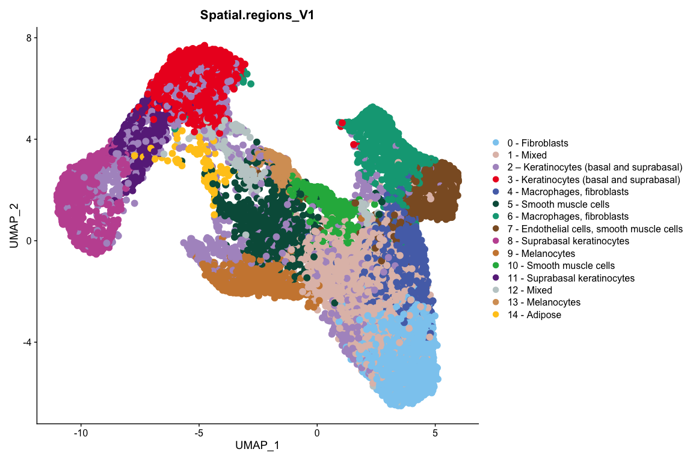<!-- -->

</a>

## FIGURE SUPPLEMENTARY S4C

### Spatial Dim Plot - NON-LESIONAL SKIN SAMPLE (ST 21 NL) and LESIONAL SKIN SAMPLE (ST 22 L) <a id="s4c"></a>

``` r
SpatialDimPlot(all.skin.combined,images = c("ST_21_NL_Batch_6"),cols =color.labels.anchor ,pt.size.factor = 2.5)
```

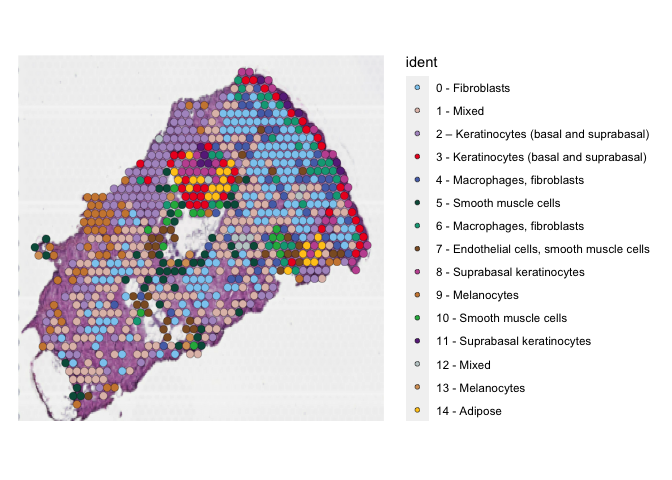<!-- -->

``` r
SpatialDimPlot(all.skin.combined,images = c("ST_22L_Batch_8"),cols =color.labels.anchor,pt.size.factor = 2.5)
```

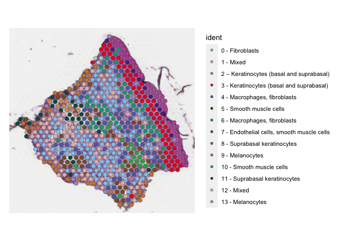<!-- -->

``` r
VlnPlot(all.skin.combined,features =  "nFeature_Spatial") + scale_fill_manual(values = color.labels.anchor)
```

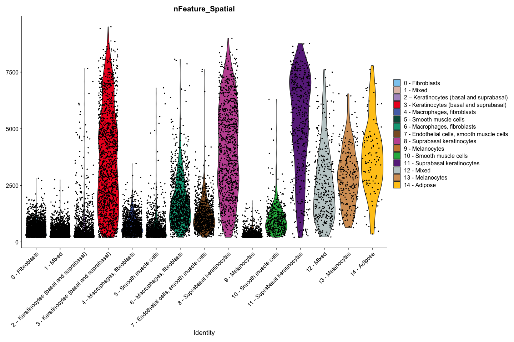<!-- -->

``` r
VlnPlot(all.skin.combined,features =  "nCount_Spatial") + scale_fill_manual(values =color.labels.anchor)
```

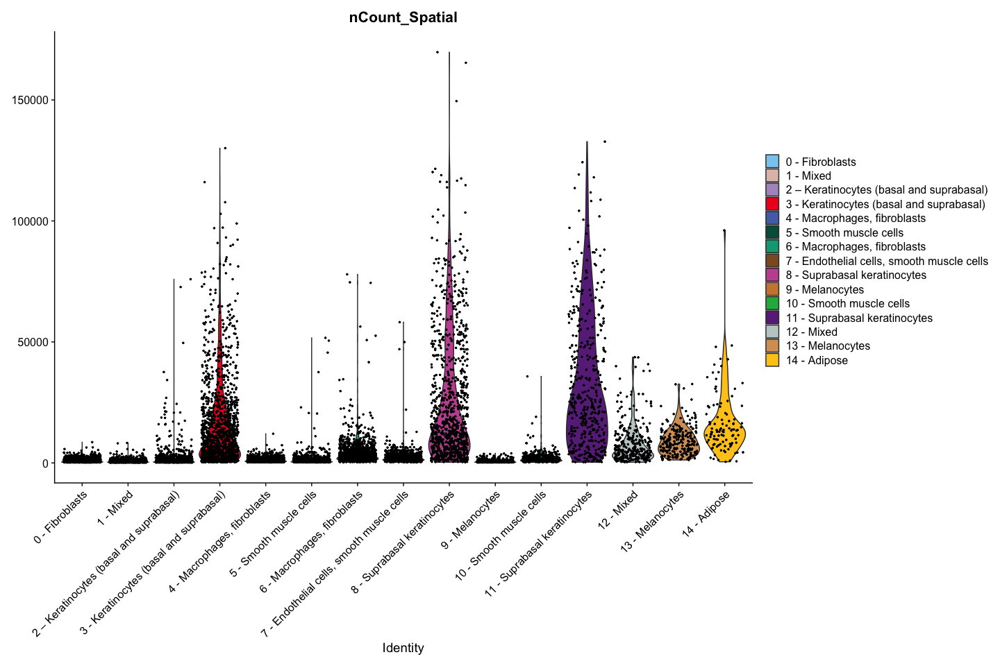<!-- -->

``` r
Idents(all.skin.combined) <- "Spatial.regions_V1"
all.skin.combined <- PrepSCTFindMarkers(all.skin.combined)
```

    ## Found 30 SCT models. Recorrecting SCT counts using minimum median counts: 516

``` r
all.skin.combined.markers <- FindAllMarkers(all.skin.combined, only.pos = TRUE, min.pct = 0.25, logfc.threshold = 0.25,assay = "SCT",) %>% filter(p_val_adj<0.05)
```

    ## Calculating cluster 0 - Fibroblasts

    ## Calculating cluster 1 - Mixed

    ## Calculating cluster 2 – Keratinocytes (basal and suprabasal)

    ## Calculating cluster 3 - Keratinocytes (basal and suprabasal)

    ## Calculating cluster 4 - Macrophages, fibroblasts

    ## Calculating cluster 5 - Smooth muscle cells

    ## Calculating cluster 6 - Macrophages, fibroblasts

    ## Calculating cluster 7 - Endothelial cells, smooth muscle cells

    ## Calculating cluster 8 - Suprabasal keratinocytes

    ## Calculating cluster 9 - Melanocytes

    ## Calculating cluster 10 - Smooth muscle cells

    ## Calculating cluster 11 - Suprabasal keratinocytes

    ## Calculating cluster 12 - Mixed

    ## Calculating cluster 13 - Melanocytes

    ## Calculating cluster 14 - Adipose

``` r
DefaultAssay(all.skin.combined) <- "SCT"
top10 <- all.skin.combined.markers %>%
    filter(gene %in% rownames(all.skin.combined@assays$SCT@scale.data)) %>%
    group_by(cluster) %>%
    top_n(n = 10, wt = avg_log2FC)
```

## FIGURE SUPPLEMENTARY (S6)

### HEATMAP -showing top 10 marker genes per cluster

<a id="s6">

``` r
DoHeatmap(all.skin.combined, features = top10$gene,assay = "SCT",group.colors = color.labels.anchor,angle = 90) + NoLegend()
```

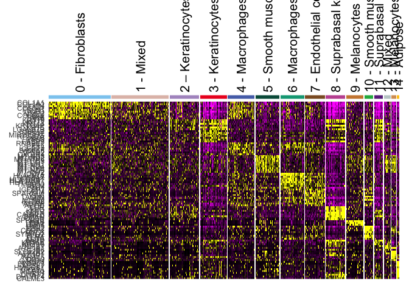<!-- -->

</a>

### PERCENTAGE PLOT FOR DIFFERENT SPATIAL REGIONS

``` r
seurat_clusters.df <- table(all.skin.combined@meta.data$Spatial.regions_V1,all.skin.combined@meta.data$DISEASE_STATUS) %>% as.data.frame() %>%
  dplyr::rename(seurat_clusters=Var1,Group=Var2) 

black.bold.16.text <- element_text(face = "bold", color = "black", size = 14,angle = 90, vjust = 0.5, hjust=1)
brks <- c(0, 0.25, 0.5, 0.75, 1)


ggplot(seurat_clusters.df,aes(x=Group,y=Freq,fill=seurat_clusters)) + geom_bar(stat="identity",position="fill") + ggplot2::theme(panel.grid.major = element_blank(), panel.grid.minor = element_blank(), panel.background = element_blank(),axis.text.x =black.bold.16.text) + scale_y_continuous(breaks = brks, labels = scales::percent(brks)) + scale_fill_manual(values=color.labels.anchor)
```

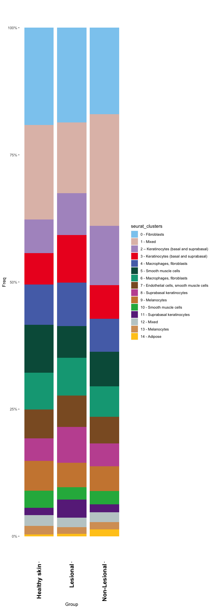<!-- -->
