R Notebook
================

# PSO + PSA + NORMAL SKIN COMBINED ANALYSIS - PART 2

# CONTINUED

## Harmony-batch correction

## Table of content

| FIGURE NO | DESCRIPTION                                                             | LINK        |
|-----------|-------------------------------------------------------------------------|-------------|
| S4A       | UMAP WITH ALL SPATIAL SAMPLES (Using Harmony batch correction)          | [link](#3b) |
| 3B        | UMAP WITH ALL SPATIAL SAMPLES (Using Harmony batch correction)          | [link](#3b) |
| 3A        | NON-LESIONAL SKIN SAMPLE (ST 21 NL), and LESIONAL SKIN SAMPLE (ST 22 L) | [link](#3a) |
| S5        | Heatmap (After Harmony batch correction)                                | [link](#s5) |
| 3C        | Percentage composition                                                  | [link](#3c) |

### LOAD ALL PACKAGES

``` r
library(tidyverse)
```

    ## ── Attaching packages ─────────────────────────────────────── tidyverse 1.3.1 ──

    ## ✔ ggplot2 3.3.6     ✔ purrr   0.3.4
    ## ✔ tibble  3.1.7     ✔ dplyr   1.0.9
    ## ✔ tidyr   1.2.0     ✔ stringr 1.4.0
    ## ✔ readr   2.1.2     ✔ forcats 0.5.1

    ## Warning: package 'ggplot2' was built under R version 4.1.2

    ## Warning: package 'tibble' was built under R version 4.1.2

    ## Warning: package 'tidyr' was built under R version 4.1.2

    ## Warning: package 'readr' was built under R version 4.1.2

    ## Warning: package 'dplyr' was built under R version 4.1.2

    ## ── Conflicts ────────────────────────────────────────── tidyverse_conflicts() ──
    ## ✖ dplyr::filter() masks stats::filter()
    ## ✖ dplyr::lag()    masks stats::lag()

``` r
library(Seurat)
```

    ## Warning: package 'Seurat' was built under R version 4.1.2

    ## Attaching SeuratObject

    ## Attaching sp

``` r
library(cowplot)
library(ggsci)
library(ggpubr)
```

    ## 
    ## Attaching package: 'ggpubr'

    ## The following object is masked from 'package:cowplot':
    ## 
    ##     get_legend

``` r
library(harmony)
```

    ## Loading required package: Rcpp

    ## Warning: package 'Rcpp' was built under R version 4.1.2

``` r
load("../all_samples_merge.RData")
```

### Running Harmony batch correction

``` r
DefaultAssay(all_samples.merge) <- "SCT"
all_samples.hm.sct <- RunHarmony(all_samples.merge,assay.use = "SCT",project.dim = FALSE,group.by.vars = "sample.id")
```

``` r
ElbowPlot(skin_data.hm.sct,ndims = 50)
```

``` r
skin_data.hm.sct <- skin_data.hm.sct %>% 
    RunUMAP(reduction = "harmony", dims = 1:40) %>% 
    FindNeighbors(reduction = "harmony", dims = 1:40) %>% 
    FindClusters(resolution = 0.35) %>% 
    identity()
```

``` r
skin_data.hm.sct <- readRDS(file="../ALL_SPATIAL_SAMPLES.RDS")
```

``` r
## COLOR FOR LABELS
color.labels.heatmap <- c("#87CEFA",
"#4876FF",
"#CD853F",
"#BF96FF",
"#FF0000",
"#CAF178",
"#E0BFB6",
"#68228B",
"#7B0000",
"#FFC71A",
"#C355A0",
"#00B923",
"#8B5A2B",
"#838B8B",
"#005947",
"#C1CDCD",
"#FF7545")
```

``` r
DefaultAssay(skin_data.hm.sct) <- "SCT"
skin_data.hm.sct.markers <- FindAllMarkers(skin_data.hm.sct, only.pos = TRUE, min.pct = 0.25, logfc.threshold = 0.25,assay = "SCT",) %>% filter(p_val_adj<0.05)
```

    ## Calculating cluster 0 Fibroblasts

    ## Calculating cluster 1 Macs + fibroblasts

    ## Calculating cluster 2 Eccrine + melanocyte precursors

    ## Calculating cluster 3 Epidermis

    ## Calculating cluster 4 Epidermis

    ## Calculating cluster 5 Connective tissue

    ## Calculating cluster 6 Mixed

    ## Warning in FindMarkers.default(object = data.use, slot = data.slot, counts =
    ## counts, : No features pass logfc.threshold threshold; returning empty data.frame

    ## Calculating cluster 7 Epidermis

    ## Calculating cluster 8 Hair follicle and sebaceous glands

    ## Calculating cluster 9 Adipose

    ## Calculating cluster 10 Suprabasal keratinocytes

    ## Calculating cluster 11 Smooth muscle

    ## Calculating cluster 12 Endothelial cells

    ## Calculating cluster 13 Immunoglobulins, fibroblasts

    ## Calculating cluster 14 Smooth muscle

    ## Calculating cluster 15 Mixed

    ## Calculating cluster 16 Adipose, fibroblasts

``` r
top10 <- skin_data.hm.sct.markers %>%
    group_by(cluster) %>%
    filter(gene %in% rownames(skin_data.hm.sct@assays$SCT@scale.data)) %>%
    top_n(n = 10, wt = avg_log2FC)

DoHeatmap(skin_data.hm.sct, features = top10$gene,assay = "SCT",group.colors = color.labels.heatmap,angle=90) + NoLegend()
```

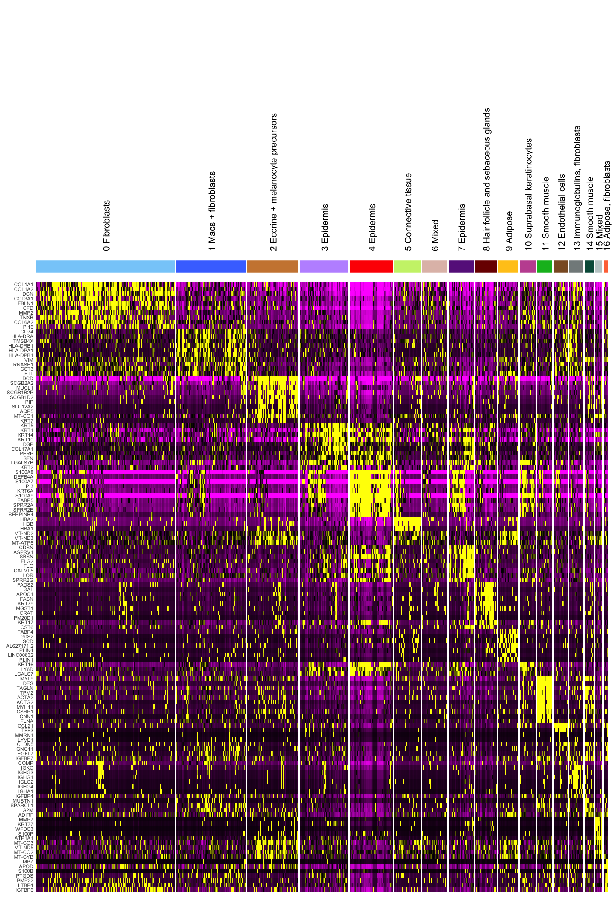<!-- -->

Defining cluster labels based on marker genes

``` r
## ADDING CLUSTER LABELS
cluster.labels <- c("0 Fibroblasts",
"1 Macs + fibroblasts",
"2 Eccrine + melanocyte precursors",
"3 Epidermis",
"4 Epidermis",
"5 Connective tissue",
"6 Mixed",
"7 Epidermis",
"8 Hair follicle and sebaceous glands",
"9 Adipose",
"10 Suprabasal keratinocytes",
"11 Smooth muscle",
"12 Endothelial cells",
"13 Immunoglobulins, fibroblasts",
"14 Smooth muscle",
"15 Mixed",
"16 Adipose, fibroblasts")

## COLOR FOR LABELS
color.labels <- c("0 Fibroblasts"="#87CEFA",
"1 Macs + fibroblasts"="#4876FF",
"2 Eccrine + melanocyte precursors"="#CD853F",
"3 Epidermis"="#BF96FF",
"4 Epidermis"="#FF0000",
"5 Connective tissue"="#CAF178",
"6 Mixed"="#E0BFB6",
"7 Epidermis"="#68228B",
"8 Hair follicle and sebaceous glands"="#7B0000",
"9 Adipose"="#FFC71A",
"10 Suprabasal keratinocytes"="#C355A0",
"11 Smooth muscle"="#00B923",
"12 Endothelial cells"="#8B5A2B",
"13 Immunoglobulins, fibroblasts"="#838B8B",
"14 Smooth muscle"="#005947",
"15 Mixed"="#C1CDCD",
"16 Adipose, fibroblasts"="#FF7545")
```

``` r
names(cluster.labels) <- levels(skin_data.hm.sct)
skin_data.hm.sct <- RenameIdents(skin_data.hm.sct, cluster.labels)
skin_data.hm.sct <- StashIdent(skin_data.hm.sct, save.name = "Spatial.regions")
```

    ## With Seurat 3.X, stashing identity classes can be accomplished with the following:
    ## skin_data.hm.sct[["Spatial.regions"]] <- Idents(object = skin_data.hm.sct)

``` r
Idents(skin_data.hm.sct) <- "Spatial.regions"
```

``` r
DimPlot(skin_data.hm.sct,split.by="DISEASE_STATUS",cols=color.labels,pt.size=3.5)
```

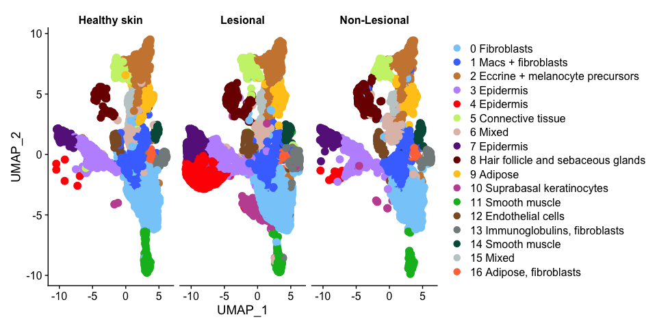<!-- -->

## FIGURE 3B and S4A

### UMAP WITH ALL SPATIAL SAMPLES (AFTER HARMONY BATCH CORRECTION)

<a id="3b">

``` r
DimPlot(skin_data.hm.sct,cols=color.labels,pt.size=3.5)
```

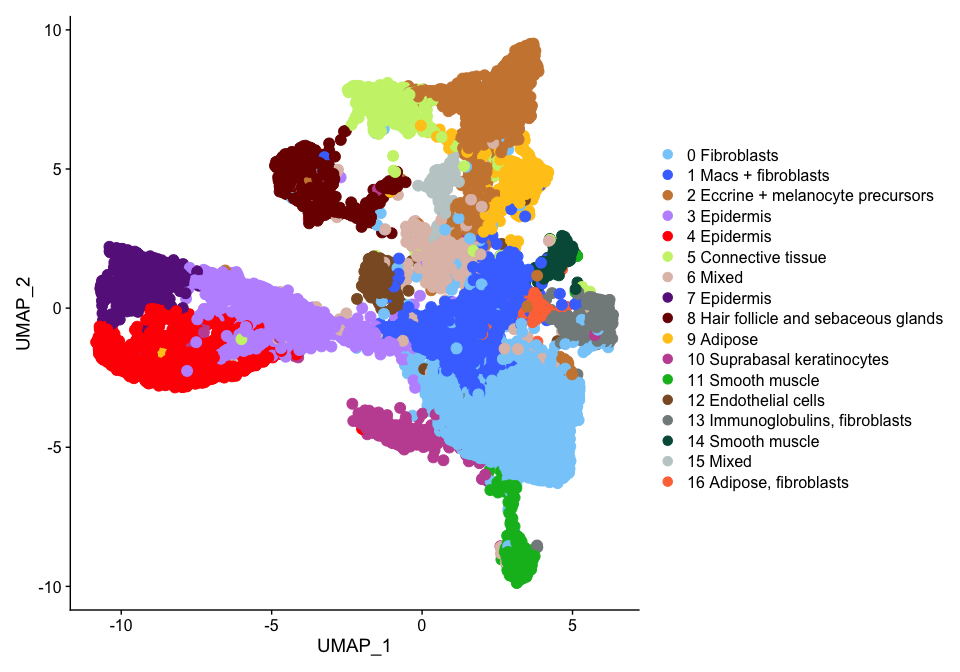<!-- -->

</a>

## FIGURE 3A -

### NON-LESIONAL SKIN SAMPLE (ST 21 NL)

<a id="3a">

``` r
SpatialDimPlot(skin_data.hm.sct,images = c("ST_21_NL_Batch_6"),cols=color.labels,pt.size.factor = 2.5)
```

<!-- -->

## FIGURE 3A -

### LESIONAL SKIN SAMPLE (ST 22 L)

``` r
SpatialDimPlot(skin_data.hm.sct,images = c("ST_22L_Batch_8"),cols=color.labels,pt.size.factor = 2.5)
```

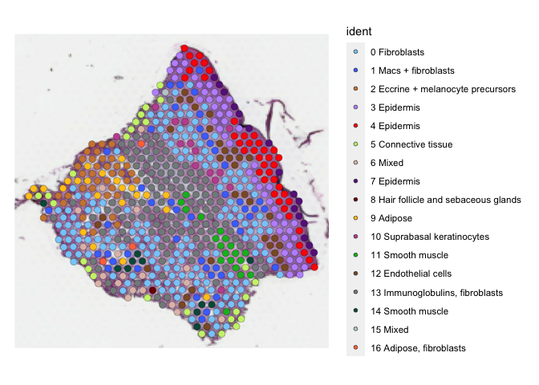<!-- -->

</a>

``` r
DefaultAssay(skin_data.hm.sct) <- "SCT"
top10 <- skin_data.hm.sct.markers %>%
    group_by(cluster) %>%
    filter(gene %in% rownames(skin_data.hm.sct@assays$SCT@scale.data)) %>%
    top_n(n = 10, wt = avg_log2FC)
```

## FIGURE SUPPLEMENTARY S5 -

### HEATMAP showing top marker genes after Harmony batch correction

<a id="s5">

``` r
DoHeatmap(skin_data.hm.sct, features = top10$gene,assay = "SCT",group.colors = color.labels,angle=90) + NoLegend()
```

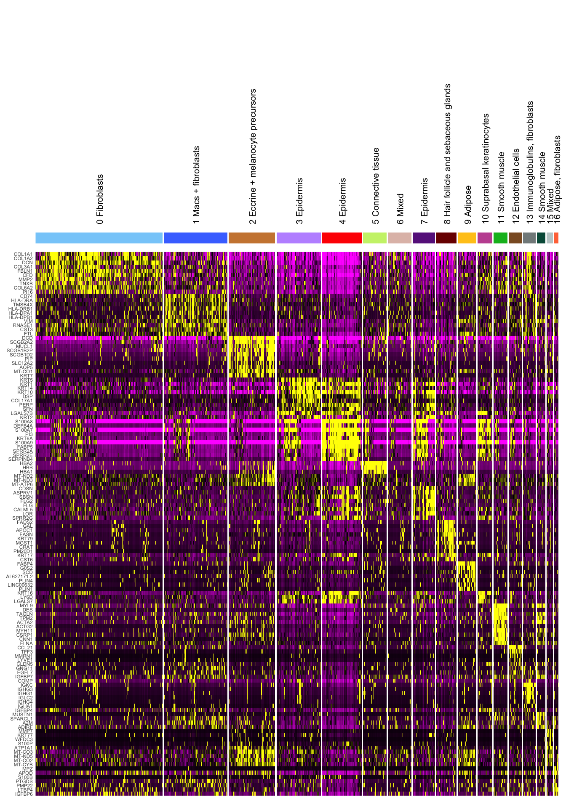<!-- -->

</a>

### Fraction of spots per group (DISEASE STATUS)

``` r
seurat_clusters.df.v2 <- table(skin_data.hm.sct@active.ident,skin_data.hm.sct@meta.data$DISEASE_STATUS,skin_data.hm.sct@meta.data$sample.id) %>% as.data.frame() %>%
  dplyr::rename(Cluster_id=Var1,Group=Var2,Sample_id=Var3) %>% filter(Freq!=0)  %>% group_by(Sample_id)%>% mutate(Fraction=Freq*100/sum(Freq)) %>% mutate(SUM_OF_FRACTIONS=sum(Fraction)) 
```

## FIGURE 3C -

### PERCENTAGE COMPOSITION PLOT

<a id="3c">

``` r
black.bold.16.text <- element_text(face = "bold", color = "black", size = 14,angle = 90, vjust = 0.5, hjust=1)
brks <- c(0, 0.25, 0.5, 0.75, 1)

ggplot(seurat_clusters.df.v2,aes(x=Group,y=Freq,fill=Cluster_id)) + geom_bar(stat="identity",position="fill") + ggplot2::theme(panel.grid.major = element_blank(), panel.grid.minor = element_blank(),
panel.background = element_blank(),axis.text.x =black.bold.16.text) + scale_y_continuous(breaks = brks, labels = scales::percent(brks)) + scale_fill_manual(values = color.labels)
```

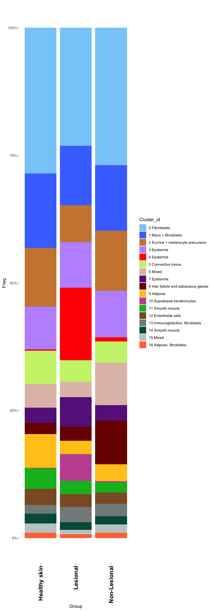<!-- -->

</a>

### FIGURE S7B -

### (1) UMIs per cluster

<a id="s7b"> \### (2) Number of genes expressed per cluster

``` r
VlnPlot(skin_data.hm.sct,features =  "nFeature_Spatial") + scale_fill_manual(values = color.labels)
```

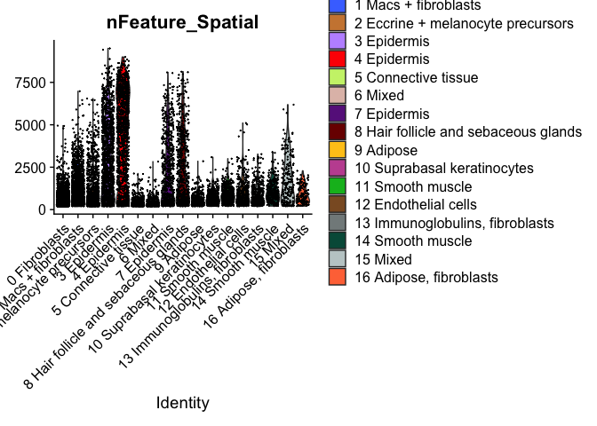<!-- -->

``` r
VlnPlot(skin_data.hm.sct,features =  "nCount_Spatial") + scale_fill_manual(values = color.labels)
```

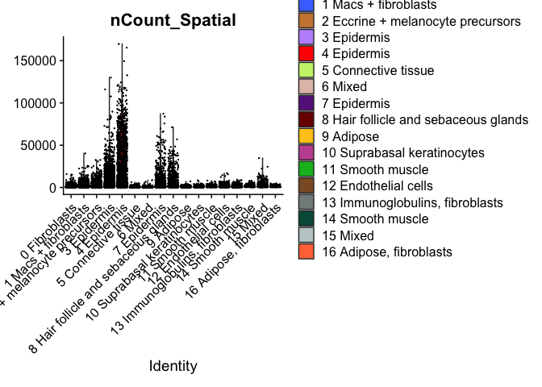<!-- -->
</a>

``` r
saveRDS(skin_data.hm.sct.markers,"ALL_ST_HARMONY_ALIGNED_MARKERS.RDS")
```

## Spatial plots with cluster labels

``` r
Images(skin_data.hm.sct)
```

    ##  [1] "ST_13_L_Batch_1"                               
    ##  [2] "ST_14_L_R1_Batch_2"                            
    ##  [3] "ST_17_L_Batch_2"                               
    ##  [4] "ST_14_L_R2_Batch_5"                            
    ##  [5] "ST_20_L_Batch_6"                               
    ##  [6] "ST_21_L_Batch_6"                               
    ##  [7] "ST_16_L_Batch_1"                               
    ##  [8] "ST_15_L_R1_Batch_3"                            
    ##  [9] "ST_18_L_R1_Batch_4"                            
    ## [10] "ST_15_L_R2_Batch_5"                            
    ## [11] "ST_18_L_R2_Batch_5"                            
    ## [12] "PSA_Lesional_Patient2_Batch_8_ROCHESTER_SAMPLE"
    ## [13] "PSO_Lesional_Patient1_Batch_8_ROCHESTER_SAMPLE"
    ## [14] "ST_22L_Batch_8"                                
    ## [15] "ST_13_NL_Batch_1"                              
    ## [16] "ST_14_NL_Batch_2"                              
    ## [17] "ST_17_NL_Batch_2"                              
    ## [18] "ST_20_NL_Batch_6"                              
    ## [19] "ST_21_NL_Batch_6"                              
    ## [20] "ST_16_NL_Batch_1"                              
    ## [21] "ST_15_NL_Batch_3"                              
    ## [22] "ST_18_NL_Batch_4"                              
    ## [23] "ST_22NL_Batch_8"                               
    ## [24] "ST.HM.1.R1"                                    
    ## [25] "ST.HM.1.R2"                                    
    ## [26] "ST.HF.1.R1"                                    
    ## [27] "ST.HF.1.R2"                                    
    ## [28] "ST.HF.1.R3"                                    
    ## [29] "ST.HF.2.R1"                                    
    ## [30] "ST.HF.2.R2"

``` r
## HEALTHY SAMPLE
SpatialDimPlot(skin_data.hm.sct, pt.size.factor = 2.5,  crop = TRUE,images = "ST.HF.1.R2",cols = color.labels) 
```

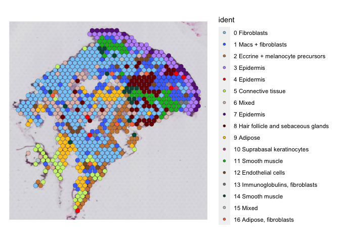<!-- -->

``` r
## NON-LESIONAL PSO SAMPLE
# PSO_Non_Lesional_Patient5_Batch_6 (SAMPLE ID NEEDS TO BE CORRECTED)
SpatialDimPlot(skin_data.hm.sct,  pt.size.factor = 2.5,  crop = TRUE,images = "ST_21_NL_Batch_6",cols = color.labels)
```

<!-- -->

``` r
## LESIONAL PSO SAMPLE
# PSO_Lesional_Patient5_Batch_6 (SAMPLE ID NEEDS TO BE CORRECTED)
SpatialDimPlot(skin_data.hm.sct, pt.size.factor = 2.5,  crop = TRUE,images = "ST_21_L_Batch_6",cols = color.labels)
```

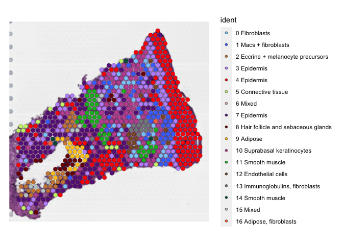<!-- -->

``` r
## LESIONAL PSA SAMPLE
# PSA_LesionalSkinPatient1_Batch_1
SpatialDimPlot(skin_data.hm.sct, pt.size.factor = 2.5, crop = TRUE,images = "ST_16_L_Batch_1",cols = color.labels)
```

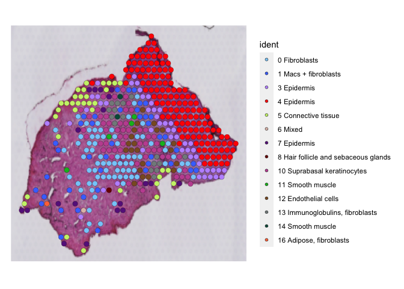<!-- -->

``` r
## NON-LESIONAL PSA SAMPLE

SpatialDimPlot(skin_data.hm.sct, pt.size.factor = 2.5, crop = TRUE,images = "ST_16_NL_Batch_1",cols = color.labels)
```

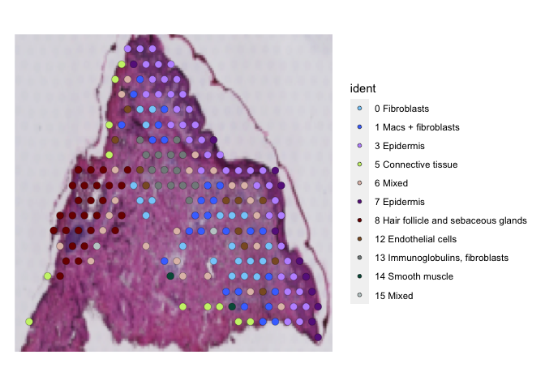<!-- -->
