R Notebook
================

# PSORIASIS SAMPLES - CONTINUED - PART 3

## PSO + PSA + NORMAL SKIN COMBINED ANALYSIS

### Integration with PS skin data from (Hughes et al).

| FIGURE NO | DESCRIPTION                                                                                               | LINK               |
|-----------|-----------------------------------------------------------------------------------------------------------|--------------------|
| 5A        | Spatial plots for cell type enrichment using (PS only) data-set 1 (Hughes et al.) - Structural cell types | [li](#3b)[nk](#5a) |
| 5B        | MIA for (PS only) dataset 1 - Immune cell types                                                           | [link](#5b)        |
| 5C        | MIA for TRM (Bulk RNAseq dataset)                                                                         | [link](#5c)        |
| 5E        | B CELL - PATHWAYS                                                                                         | [link](#5e)        |

### LOAD ALL PACKAGES

``` r
library(tidyverse)
```

    ## ── Attaching packages ─────────────────────────────────────── tidyverse 1.3.1 ──

    ## ✔ ggplot2 3.3.6     ✔ purrr   0.3.4
    ## ✔ tibble  3.1.7     ✔ dplyr   1.0.9
    ## ✔ tidyr   1.2.0     ✔ stringr 1.4.0
    ## ✔ readr   2.1.2     ✔ forcats 0.5.1

    ## Warning: package 'ggplot2' was built under R version 4.1.2

    ## Warning: package 'tibble' was built under R version 4.1.2

    ## Warning: package 'tidyr' was built under R version 4.1.2

    ## Warning: package 'readr' was built under R version 4.1.2

    ## Warning: package 'dplyr' was built under R version 4.1.2

    ## ── Conflicts ────────────────────────────────────────── tidyverse_conflicts() ──
    ## ✖ dplyr::filter() masks stats::filter()
    ## ✖ dplyr::lag()    masks stats::lag()

``` r
library(Seurat)
```

    ## Warning: package 'Seurat' was built under R version 4.1.2

    ## Attaching SeuratObject

    ## Attaching sp

``` r
library(cowplot)
library(ggsci)
library(RColorBrewer)
```

    ## Warning: package 'RColorBrewer' was built under R version 4.1.2

``` r
library(pheatmap)
col.pal <- RColorBrewer::brewer.pal(9, "OrRd")
source("../Spatial-HP-Skin/SPATIAL_FUNCTIONS.R")
```

    ## Warning: package 'reticulate' was built under R version 4.1.2

    ## Warning: package 'clusterProfiler' was built under R version 4.1.1

    ## 

    ## Registered S3 method overwritten by 'ggtree':
    ##   method      from 
    ##   identify.gg ggfun

    ## clusterProfiler v4.0.5  For help: https://yulab-smu.top/biomedical-knowledge-mining-book/
    ## 
    ## If you use clusterProfiler in published research, please cite:
    ## T Wu, E Hu, S Xu, M Chen, P Guo, Z Dai, T Feng, L Zhou, W Tang, L Zhan, X Fu, S Liu, X Bo, and G Yu. clusterProfiler 4.0: A universal enrichment tool for interpreting omics data. The Innovation. 2021, 2(3):100141. doi: 10.1016/j.xinn.2021.100141

    ## 
    ## Attaching package: 'clusterProfiler'

    ## The following object is masked from 'package:purrr':
    ## 
    ##     simplify

    ## The following object is masked from 'package:stats':
    ## 
    ##     filter

    ## Loading required package: AnnotationDbi

    ## Loading required package: stats4

    ## Loading required package: BiocGenerics

    ## Warning: package 'BiocGenerics' was built under R version 4.1.1

    ## 
    ## Attaching package: 'BiocGenerics'

    ## The following objects are masked from 'package:dplyr':
    ## 
    ##     combine, intersect, setdiff, union

    ## The following objects are masked from 'package:stats':
    ## 
    ##     IQR, mad, sd, var, xtabs

    ## The following objects are masked from 'package:base':
    ## 
    ##     anyDuplicated, append, as.data.frame, basename, cbind, colnames,
    ##     dirname, do.call, duplicated, eval, evalq, Filter, Find, get, grep,
    ##     grepl, intersect, is.unsorted, lapply, Map, mapply, match, mget,
    ##     order, paste, pmax, pmax.int, pmin, pmin.int, Position, rank,
    ##     rbind, Reduce, rownames, sapply, setdiff, sort, table, tapply,
    ##     union, unique, unsplit, which.max, which.min

    ## Loading required package: Biobase

    ## Warning: package 'Biobase' was built under R version 4.1.1

    ## Welcome to Bioconductor
    ## 
    ##     Vignettes contain introductory material; view with
    ##     'browseVignettes()'. To cite Bioconductor, see
    ##     'citation("Biobase")', and for packages 'citation("pkgname")'.

    ## Loading required package: IRanges

    ## Warning: package 'IRanges' was built under R version 4.1.1

    ## Loading required package: S4Vectors

    ## Warning: package 'S4Vectors' was built under R version 4.1.2

    ## 
    ## Attaching package: 'S4Vectors'

    ## The following object is masked from 'package:clusterProfiler':
    ## 
    ##     rename

    ## The following objects are masked from 'package:dplyr':
    ## 
    ##     first, rename

    ## The following object is masked from 'package:tidyr':
    ## 
    ##     expand

    ## The following objects are masked from 'package:base':
    ## 
    ##     expand.grid, I, unname

    ## 
    ## Attaching package: 'IRanges'

    ## The following object is masked from 'package:clusterProfiler':
    ## 
    ##     slice

    ## The following object is masked from 'package:sp':
    ## 
    ##     %over%

    ## The following objects are masked from 'package:dplyr':
    ## 
    ##     collapse, desc, slice

    ## The following object is masked from 'package:purrr':
    ## 
    ##     reduce

    ## 
    ## Attaching package: 'AnnotationDbi'

    ## The following object is masked from 'package:clusterProfiler':
    ## 
    ##     select

    ## The following object is masked from 'package:dplyr':
    ## 
    ##     select

    ## 

### Integration with dataset 1 (Hughes et al)

``` r
skin_data.hm.sct <- readRDS(file="../ALL_SPATIAL_SAMPLES.RDS")
```

``` r
skin_data.hm.sct.markers <- readRDS("ALL_ST_HARMONY_ALIGNED_MARKERS.RDS")
```

``` r
## COLOR FOR LABELS
color.labels <- c("0 Fibroblasts"="#87CEFA",
"1 Macs + fibroblasts"="#4876FF",
"2 Eccrine + melanocyte precursors"="#CD853F",
"3 Epidermis"="#BF96FF",
"4 Epidermis"="#FF0000",
"5 Connective tissue"="#CAF178",
"6 Mixed"="#E0BFB6",
"7 Epidermis"="#68228B",
"8 Hair follicle and sebaceous glands"="#7B0000",
"9 Adipose"="#FFC71A",
"10 Suprabasal keratinocytes"="#C355A0",
"11 Smooth muscle"="#00B923",
"12 Endothelial cells"="#8B5A2B",
"13 Immunoglobulins, fibroblasts"="#838B8B",
"14 Smooth muscle"="#005947",
"15 Mixed"="#C1CDCD",
"16 Adipose, fibroblasts"="#FF7545")
```

## Load (Hughes et al.) scRNA data

### (DOI - <https://doi.org/10.1016/j.immuni.2020.09.015>).

``` r
load("../TRAVIS_scRNA_DATA/SkinSeuratTotal.Rdata")
```

``` r
# META DATA FROM TRAVIS 
meta.data <- read.csv("../TRAVIS_scRNA_DATA/Cell_Level_Metadata.csv")
```

``` r
skin.meta.data <- as.data.frame(SkinSeuratTotal@meta.data) %>% rownames_to_column("CellID") 
```

``` r
SkinSeuratTotal@meta.data <- inner_join(x=skin.meta.data,y=meta.data,by="CellID",keep=FALSE) %>% column_to_rownames("CellID")
```

``` r
travis.psoriatic_data <- subset(SkinSeuratTotal,Condition == c("Psoriasis"))
```

``` r
## PROCESS SC RNA DATA
travis.psoriatic_data <- NormalizeData(travis.psoriatic_data)
travis.psoriatic_data <- FindVariableFeatures(travis.psoriatic_data, selection.method = "vst", nfeatures = 2000)
travis.psoriatic_data <- ScaleData(travis.psoriatic_data)
travis.psoriatic_data <- RunPCA(travis.psoriatic_data, features = VariableFeatures(object = travis.psoriatic_data))
travis.psoriatic_data <- FindNeighbors(travis.psoriatic_data, dims = 1:40)
travis.psoriatic_data <- FindClusters(travis.psoriatic_data, resolution = 1)
travis.psoriatic_data <- RunUMAP(travis.psoriatic_data, dims = 1:40)
```

``` r
pdf(width = 12,height=8,file = "../TRAVIS_scRNA_DATA/UMAP_TRAVIS_DATA_PS_SAMPLES_ONLY.pdf")
DimPlot(travis.psoriatic_data,group.by = "Specific_CellType",pt.size = 3.5)
dev.off()
```

``` r
saveRDS(travis.psoriatic_data,file="../TRAVIS_scRNA_DATA/TRAVIS_PS_DATA.RDS")
```

## READ TRAVIS DATA FROM RDS FILE

``` r
travis.psoriatic_data <- readRDS("../../TRAVIS_scRNA_DATA/TRAVIS_PS_DATA.RDS")
```

``` r
Idents(travis.psoriatic_data) <- "Specific_CellType"
Marker_genes.TRAVIS <- FindAllMarkers(travis.psoriatic_data,max.cells.per.ident=1000,min.pct = 0.25,assay = "RNA")
saveRDS(Marker_genes.TRAVIS,file="MARKER_GENES.TRAVIS.RDS")
```

``` r
Marker_genes.TRAVIS <- readRDS("MARKER_GENES.TRAVIS.RDS")
```

## MIA FOR TRAVIS DATA

### USING ALL SKIN ST DATA

``` r
filtered_single_cell.markers <- Marker_genes.TRAVIS %>% filter(p_val_adj<=0.05) %>% group_by(cluster) %>% top_n(n =300,wt = avg_log2FC) %>% filter(avg_log2FC>0.25)
filtered_spatial_markers <- skin_data.hm.sct.markers %>% filter(p_val_adj<=0.05) %>% group_by(cluster) %>% top_n(n =300,wt = avg_log2FC) %>% filter(avg_log2FC>0.25)

##INTERSECT GENES BETWEEN scRNA and Spatial data
st.genes <- unique(rownames(skin_data.hm.sct@assays$Spatial@counts))
sc.genes <- unique(rownames(travis.psoriatic_data@assays$RNA@counts))
all.genes.scrna_and_spt <- unique(intersect(sc.genes,st.genes))

MIA_results <- MIA(total_genes = length(all.genes.scrna_and_spt),single_cell.markers = filtered_single_cell.markers,spatial.markers = filtered_spatial_markers)

E.data <- MIA_results %>% column_to_rownames("cluster")
E.data <- E.data[,order(colnames(E.data))]
pheatmap(E.data,cluster_cols = FALSE,cluster_rows = FALSE,fontsize=15,color = col.pal)
```

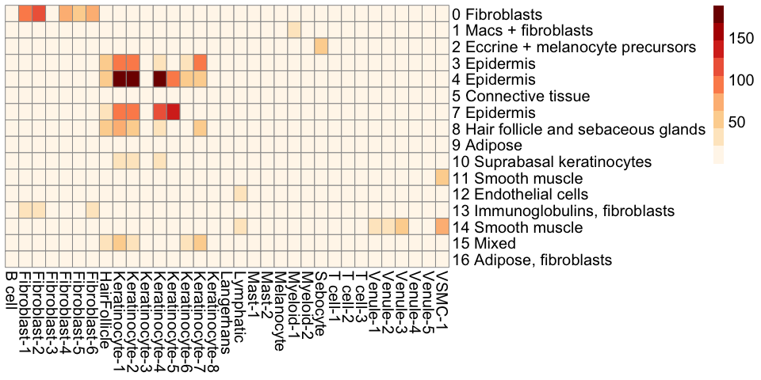<!-- -->

<a id="#5a">

``` r
immune_only.E.data <- E.data[,c("B cell","T cell-1","T cell-2","T cell-3","Myeloid-1","Myeloid-2","Langerhans","Mast-1","Mast-2")]
#pdf(file = "MIA_regions_IMMUNE_CELLS_ALL_PS_SAMPLES.pdf",width = 10,height = 10)
pheatmap(immune_only.E.data,cluster_cols = FALSE,cluster_rows = FALSE,fontsize=15,color = col.pal)
```

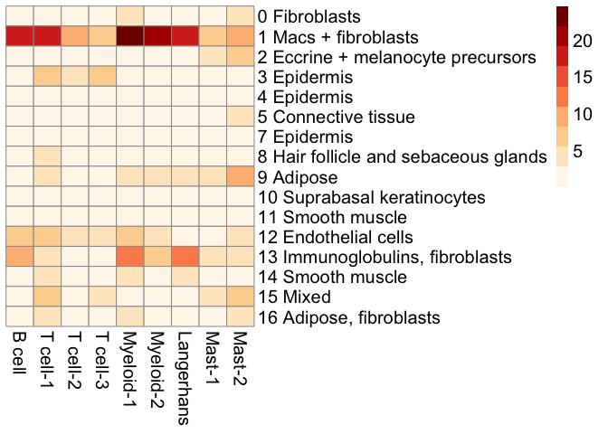<!-- -->

``` r
#dev.off()

structure_only.E_data <- E.data[,c("Fibroblast-1","Fibroblast-2","Fibroblast-3","Fibroblast-4","Fibroblast-5","Fibroblast-6","HairFollicle","Keratinocyte-1","Keratinocyte-2","Keratinocyte-3","Keratinocyte-4","Keratinocyte-5","Keratinocyte-6","Keratinocyte-7","Keratinocyte-8","Sebocyte","Venule-1","Venule-2","Venule-3","Venule-4","Venule-5","VSMC-1","Lymphatic")]
#pdf(file = "MIA_regions_STRUCTURAL_CELLS_ALL_PS_SAMPLES.pdf",width = 10,height = 10)
pheatmap(structure_only.E_data,cluster_cols = FALSE,cluster_rows = FALSE,fontsize=15,color = col.pal)
```

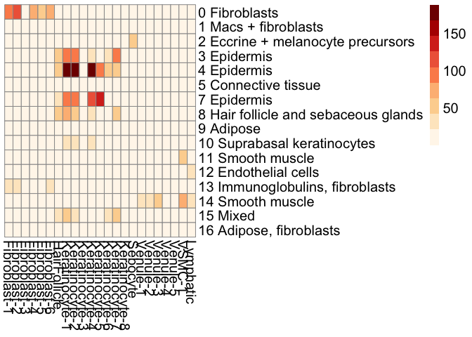<!-- -->

``` r
#dev.off()
```

</a>

\### NOW CALCULATING ENRICHMENT USING

### APPROACH \#2 - SEURAT scRNA INTEGERATION

``` r
# RUN THIS ON BIG PURPLE 
skin_reference.3 <- SCTransform(travis.psoriatic_data, ncells = 3000, verbose = FALSE) %>% RunPCA(verbose = FALSE) %>% RunUMAP(dims = 1:40)
anchors <- FindTransferAnchors(reference = skin_reference.3, query = skin_data.hm.sct, normalization.method = "SCT")
predictions.assay <- TransferData(anchorset = anchors, refdata = skin_reference.3$Specific_CellType, prediction.assay = TRUE, weight.reduction = skin_data.hm.sct[["harmony"]],dims = 1:40)
skin_data.hm.sct[["predictions_travis_data_harmony_version"]] <- predictions.assay
saveRDS(skin_data.hm.sct,file="SKIN_SPATIAL_AND_SC_MERGED_SCORES_HARMONY_VERSION.RDS")
```

``` r
skin_data.hm.combined.v2 <- readRDS("SKIN_SPATIAL_AND_SC_MERGED_SCORES_HARMONY_VERSION.RDS")
```

## CELL TYPE ENRICHMENT PLOTS FOR STRUCTURAL CELLS

# Define color scheme for spatial plots

``` r
SpatialColors <- colorRampPalette(colors = rev(x = brewer.pal(n = 11, name = "Spectral")))
cols <- SpatialColors(n = 100)
```

``` r
Cell_types <- c("Fibroblast-1","Fibroblast-2","HairFollicle","Keratinocyte-1","Keratinocyte-2","Keratinocyte-3","Sebocyte","VSMC-1","Melanocyte","Lymphatic")
DefaultAssay(skin_data.hm.combined.v2) <- "predictions_travis_data_harmony_version"

## HEALTHY SAMPLE
for (x in Cell_types){
  print(SpatialFeaturePlot(skin_data.hm.combined.v2, features = c(x), pt.size.factor = 2.5, ncol = 2, crop = TRUE,images = "ST.HF.1.R2") + scale_fill_gradientn(colors=cols,limits = c(0,1.01))) 
}
```

    ## Scale for 'fill' is already present. Adding another scale for 'fill', which
    ## will replace the existing scale.
    ## Scale for 'fill' is already present. Adding another scale for 'fill', which
    ## will replace the existing scale.

<!-- -->

    ## Scale for 'fill' is already present. Adding another scale for 'fill', which
    ## will replace the existing scale.

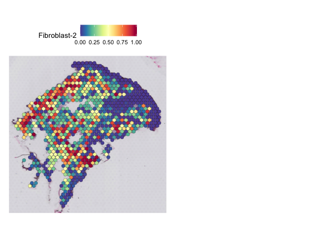<!-- -->

    ## Scale for 'fill' is already present. Adding another scale for 'fill', which
    ## will replace the existing scale.

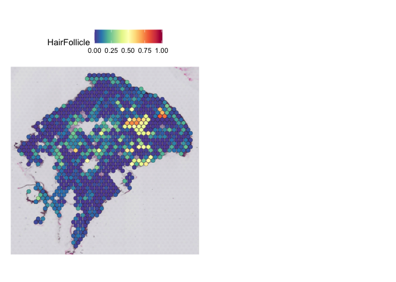<!-- -->

    ## Scale for 'fill' is already present. Adding another scale for 'fill', which
    ## will replace the existing scale.

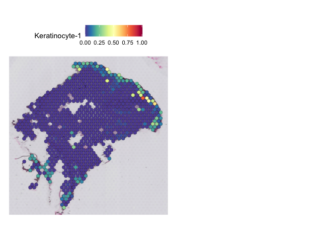<!-- -->

    ## Scale for 'fill' is already present. Adding another scale for 'fill', which
    ## will replace the existing scale.

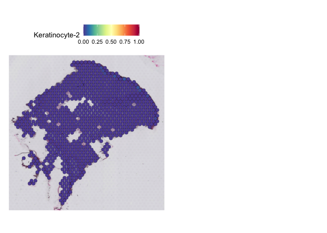<!-- -->

    ## Scale for 'fill' is already present. Adding another scale for 'fill', which
    ## will replace the existing scale.

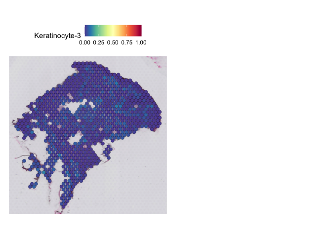<!-- -->

    ## Scale for 'fill' is already present. Adding another scale for 'fill', which
    ## will replace the existing scale.

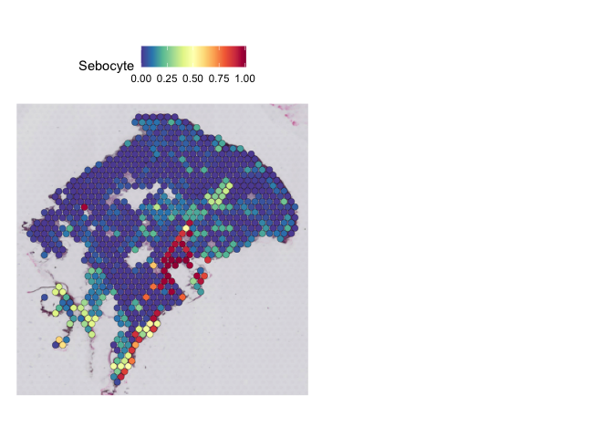<!-- -->

    ## Scale for 'fill' is already present. Adding another scale for 'fill', which
    ## will replace the existing scale.

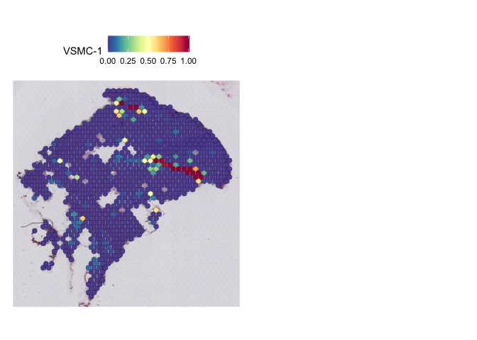<!-- -->

    ## Scale for 'fill' is already present. Adding another scale for 'fill', which
    ## will replace the existing scale.

<!-- -->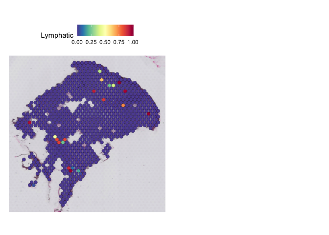<!-- -->

``` r
SpatialDimPlot(skin_data.hm.combined.v2,images = c("ST_21_L_Batch_6"))
```

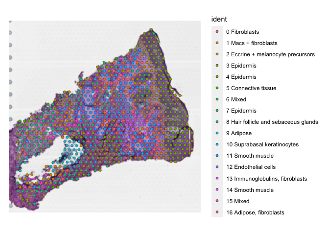<!-- -->

``` r
## NON-LESIONAL PSO SAMPLE
# PSO_Non_Lesional_Patient5_Batch_6 (SAMPLE ID NEEDS TO BE CORRECTED)
for (x in Cell_types){
  print(SpatialFeaturePlot(skin_data.hm.combined.v2, features = c(x), pt.size.factor = 2.5, ncol = 2, crop = TRUE,images =c("ST_21_L_Batch_6")) + scale_fill_gradientn(colors=cols,limits = c(0,1.01))) 
}
```

    ## Scale for 'fill' is already present. Adding another scale for 'fill', which
    ## will replace the existing scale.
    ## Scale for 'fill' is already present. Adding another scale for 'fill', which
    ## will replace the existing scale.

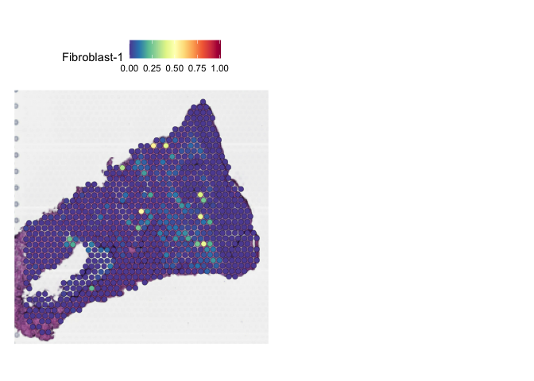<!-- -->

    ## Scale for 'fill' is already present. Adding another scale for 'fill', which
    ## will replace the existing scale.

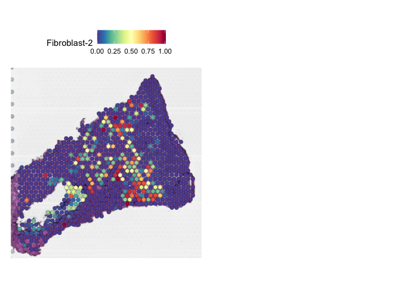<!-- -->

    ## Scale for 'fill' is already present. Adding another scale for 'fill', which
    ## will replace the existing scale.

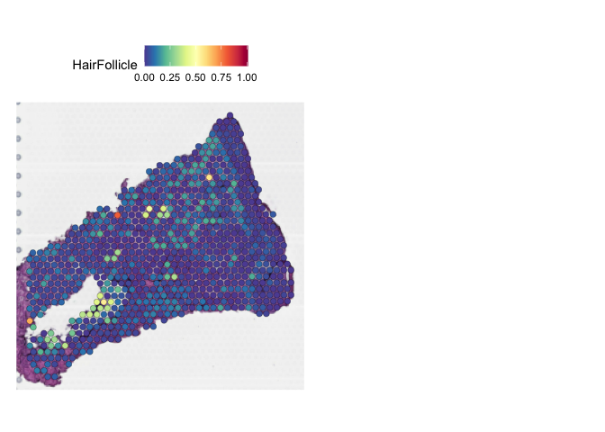<!-- -->

    ## Scale for 'fill' is already present. Adding another scale for 'fill', which
    ## will replace the existing scale.

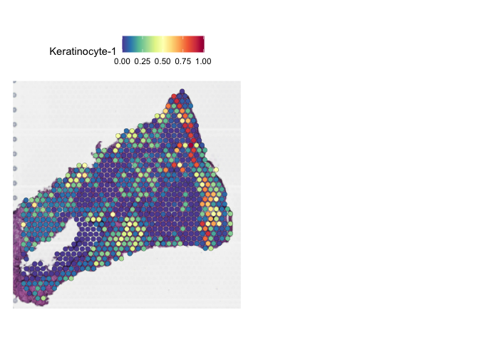<!-- -->

    ## Scale for 'fill' is already present. Adding another scale for 'fill', which
    ## will replace the existing scale.

<!-- -->

    ## Scale for 'fill' is already present. Adding another scale for 'fill', which
    ## will replace the existing scale.

<!-- -->

    ## Scale for 'fill' is already present. Adding another scale for 'fill', which
    ## will replace the existing scale.

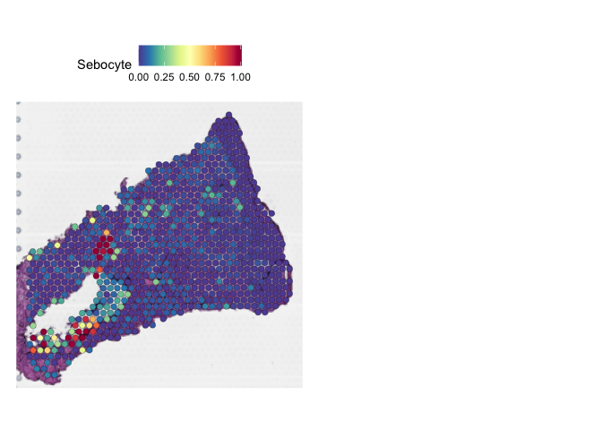<!-- -->

    ## Scale for 'fill' is already present. Adding another scale for 'fill', which
    ## will replace the existing scale.

<!-- -->

    ## Scale for 'fill' is already present. Adding another scale for 'fill', which
    ## will replace the existing scale.

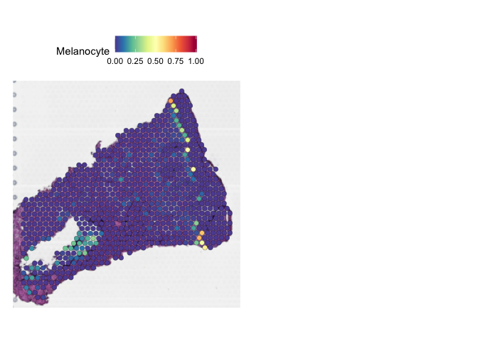<!-- --><!-- -->

## CELL TYPE ENRICHMENT PLOTS FOR IMMUNE CELLS

``` r
Cell_types <- c("T cell-1","T cell-2","T cell-3","B cell","Myeloid-1","Myeloid-2","Langerhans")
DefaultAssay(skin_data.hm.combined.v2) <- "predictions_travis_data_harmony_version"

## HEALTHY SAMPLE
for (x in Cell_types){
  #pdf(file = paste("HEALTHY_FEMALE_1_R2_IMMUNE_CELL_TYPE_",x,".pdf"),width = 10,height = 15)
  print(SpatialFeaturePlot(skin_data.hm.combined.v2, features = c(x), pt.size.factor = 2.5, ncol = 2, crop = TRUE,images = "ST.HF.1.R2") + scale_fill_gradientn(colors=cols,limits = c(0,1.01))) 
  #dev.off()
}
```

    ## Scale for 'fill' is already present. Adding another scale for 'fill', which
    ## will replace the existing scale.
    ## Scale for 'fill' is already present. Adding another scale for 'fill', which
    ## will replace the existing scale.

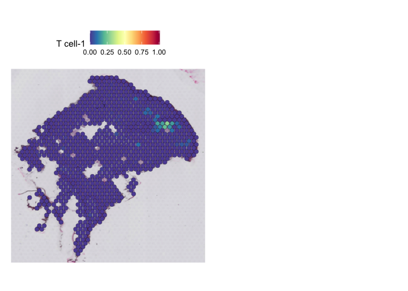<!-- -->

    ## Scale for 'fill' is already present. Adding another scale for 'fill', which
    ## will replace the existing scale.

<!-- -->

    ## Scale for 'fill' is already present. Adding another scale for 'fill', which
    ## will replace the existing scale.

<!-- -->

    ## Scale for 'fill' is already present. Adding another scale for 'fill', which
    ## will replace the existing scale.

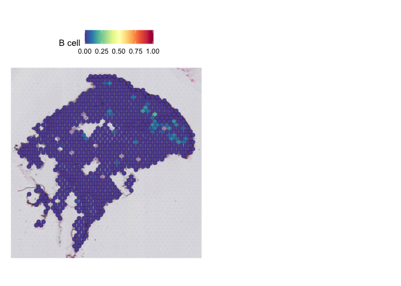<!-- -->

    ## Scale for 'fill' is already present. Adding another scale for 'fill', which
    ## will replace the existing scale.

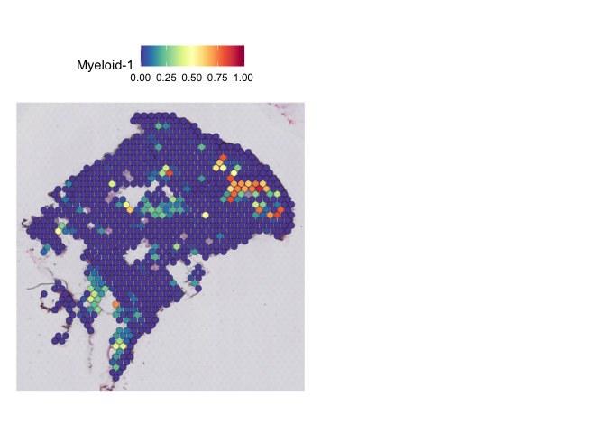<!-- -->

    ## Scale for 'fill' is already present. Adding another scale for 'fill', which
    ## will replace the existing scale.

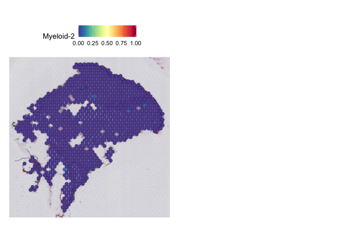<!-- -->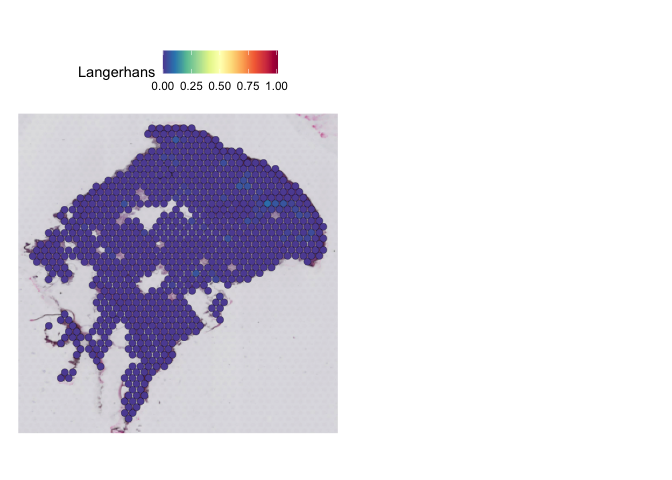<!-- -->

``` r
for (x in Cell_types){
  print(SpatialFeaturePlot(skin_data.hm.combined.v2, features = c(x), pt.size.factor = 2.5, ncol = 2, crop = TRUE,images =c("ST_21_L_Batch_6")) + scale_fill_gradientn(colors=cols,limits = c(0,1.01))) 
}
```

    ## Scale for 'fill' is already present. Adding another scale for 'fill', which
    ## will replace the existing scale.
    ## Scale for 'fill' is already present. Adding another scale for 'fill', which
    ## will replace the existing scale.

<!-- -->

    ## Scale for 'fill' is already present. Adding another scale for 'fill', which
    ## will replace the existing scale.

<!-- -->

    ## Scale for 'fill' is already present. Adding another scale for 'fill', which
    ## will replace the existing scale.

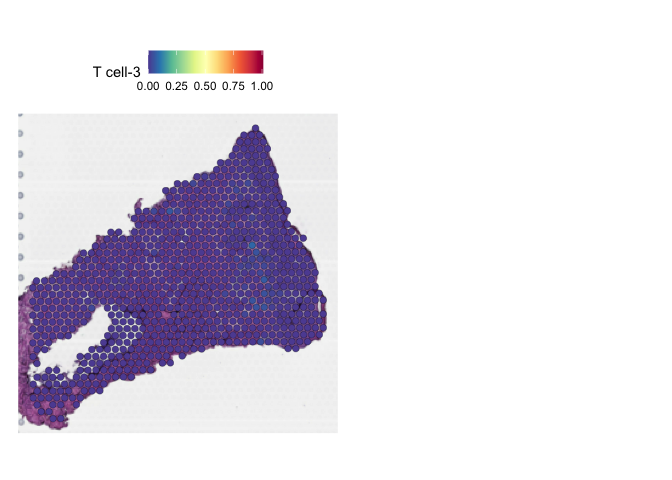<!-- -->

    ## Scale for 'fill' is already present. Adding another scale for 'fill', which
    ## will replace the existing scale.

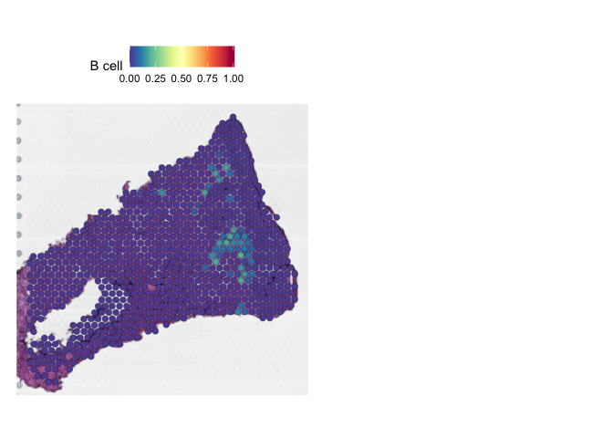<!-- -->

    ## Scale for 'fill' is already present. Adding another scale for 'fill', which
    ## will replace the existing scale.

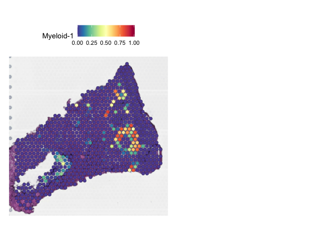<!-- -->

    ## Scale for 'fill' is already present. Adding another scale for 'fill', which
    ## will replace the existing scale.

<!-- -->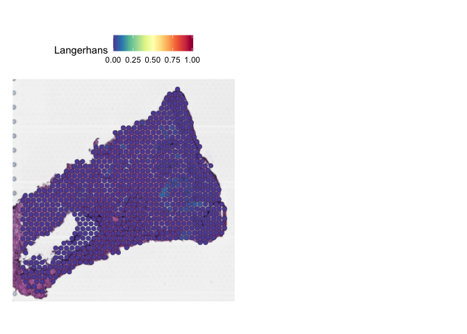<!-- -->

### Figure 5C <a id="5c"></a>

### TRM (BULK RNAseq data) - MIA Analysis

### Color scheme for MIA heatmaps

``` r
library(RColorBrewer)
library(pheatmap)
col.pal <- RColorBrewer::brewer.pal(9, "OrRd")
```

``` r
B.CELL.MARKERS <- Marker_genes.TRAVIS %>% filter(cluster=="B cell") %>% filter(avg_log2FC>0)
#write.csv(B.CELL.MARKERS,file="B_CELL_MARKERS.csv")
```

``` r
trm.signature <- read.csv("../../TRM_DATA/TRM_SIGNATURE.csv")
trm.exclusive <- read.csv("../../TRM_DATA/TRM_SIGNATURE.csv")
trm.up <- read.csv("../../TRM_DATA/TRM_up.csv")
trm.high <- read.csv("../../TRM_DATA/TRM_high.csv")
all.trm.genes <- c(trm.exclusive$Gene,trm.high$Gene,trm.up$Gene,trm.signature$Gene) %>% unique()


filtered_spatial_markers <- skin_data.hm.sct.markers %>% filter(p_val_adj<=0.05) %>% group_by(cluster) %>% top_n(n =350,wt = avg_log2FC) %>% filter(avg_log2FC>0.25)

##INTERSECT GENES BETWEEN scRNA and Spatial data
st.genes <- unique(rownames(skin_data.hm.sct@assays$Spatial@counts))

MIA_results <- MIA_bulk(markers = all.trm.genes,spatial.markers = filtered_spatial_markers,total_genes =length(st.genes),name = "TRM-all-genes")

E.data <- MIA_results %>% column_to_rownames("cluster")
#pdf(width = 7,height = 10,file = "TRM_MIA_PLOT.pdf")
pheatmap(E.data,cluster_cols = FALSE,cluster_rows = FALSE,fontsize=15,color = col.pal)
```

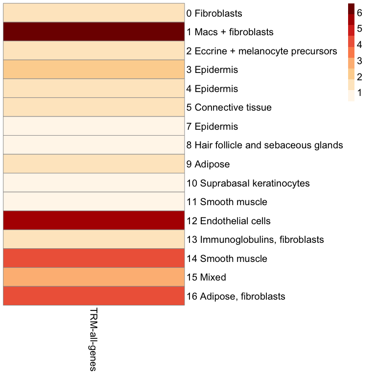<!-- -->

``` r
#dev.off()
```
