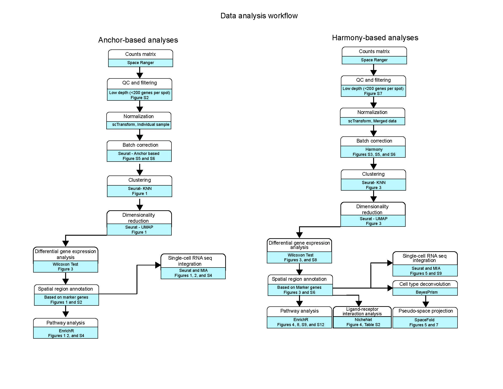

# Spatial-HP-Skin

{width="312"}

This repo will cover all of the code linked to **Castillo et al.**

(**Manuscript Title:** *Spatial transcriptomics stratifies health and psoriatic disease severity by emergent cellular ecosystems*)

## GEO DATA LINK

All of the raw files linked to this project can be found under GEO Accession number - ([**GSE202011**](https://www.ncbi.nlm.nih.gov/geo/query/acc.cgi?acc=GSE202011))

## WORKFLOW OVERVIEW

{width="515"}

## CODE AND REPOSITORY NAVIGATION

The code is organised into several R notebooks with each notebook covering different parts of the analysis. The figure numbers and references are found within each notebook and a table content will also be added to link each figure to different parts of code for ease of navigation. Reproducibility is the key here, please contact **XXXX** for any issues with the code.

The notebooks will also require you to import the data from the linked Zenodo / Figshare repository (Will be added soon) in order to reproduce all of the respective figures.

Please make sure to install all of the dependencies prior to running the code by running the script **XXXX**.

Each notebook link will take you to the notebook with necessary code, please select the figure number in the table of contents found on top of the notebook to .

### FIGURE 1

| FIGURE NO | NOTEBOOK LINK                                                                       | DESCRIPTION                                                                      |
|----------------------|------------------------|--------------------------|
| 1B        | [link](../upgrade/Final_Notebooks/ST_HEALTHY_SAMPLES_PART_1_Final.md)               | Spatial Plot - Healthy sample with cluster labels                                |
| 1C        | [link](../upgrade/Final_Notebooks/ST_HEALTHY_SAMPLES_PART_1_Final.md)               | UMAP (Healthy samples only) - with spatial regions labels                        |
| 1D        | [link](../upgrade/Final_Notebooks/ST_HEALTHY_SAMPLES_PART_1_Final.md)               | Percentage composition (Healthy samples only)                                    |
| 1E        | [link](../upgrade/Final_Notebooks/ST_HEALTHY_SAMPLES_PART_2_TRAVIS_DATA_Final.md)   | Seurat Integeration (scRNA + ST data) showing cell type enrichment               |
| 1G        | [link](../upgrade/Final_Notebooks/ST_HEALTHY_SAMPLES_PART_2_TRAVIS_DATA_Final.md)   | MIA - healthy skin with dataset 1 (Hughes et al.) - Structural cell types only   |
| 1H        | [link](../upgrade/Final_Notebooks/ST_HEALTHY_SAMPLES_PART_3_REYNOLDS_DATA_Final.md) | MIA - healthy skin with dataset 2 (Reynolds et al.) - Structural cell types only |
| 1I        | [link](../upgrade/Final_Notebooks/ST_HEALTHY_SAMPLES_PART_4_SULLIVAN_DATA.md)       | MIA - healthy skin with dataset 3 (Sullivan et al.) - APCs and Preadiplocytes    |

### FIGURE 2

| FIGURE NO | NOTEBOOK LINK                                                                       | DESCRIPTION                                                                  |
|----------------------|------------------------|--------------------------|
| 2A        | [link](../upgrade/Final_Notebooks/ST_HEALTHY_SAMPLES_PART_2_TRAVIS_DATA_Final.md)   | MIA - healthy skin with dataset 1 (Hughes et al.) - Immune cell types only   |
| 2B        | [link](../upgrade/Final_Notebooks/ST_HEALTHY_SAMPLES_PART_3_REYNOLDS_DATA_Final.md) | MIA - healthy skin with dataset 2 (Reynolds et al.) - Immune cell types only |

### FIGURE 3

| FIGURE NO | NOTEBOOK LINK                                                 | DESCRIPTION                                                                    |
|----------------------|----------------------|-----------------------------|
| 3A        | [link](../upgrade/Final_Notebooks/PS_SAMPLES_PART_2_Final.md) | Spatial Plots with cluster labels - Lesional and Non-Lesional skin             |
| 3B        | [link](../upgrade/Final_Notebooks/PS_SAMPLES_PART_2_Final.md) | UMAP - All samples combined (PS + Healthy skin) after Harmony batch correction |
| 3C        | [link](../upgrade/Final_Notebooks/PS_SAMPLES_PART_2_Final.md) | Percentage composition plots for different clusters / spatial regions          |

### FIGURE 5

| FIGURE NO | NOTEBOOK LINK                                                       | DESCRIPTION                                                                                              |
|-------------------|-------------------|-----------------------------------|
| 5A        | [link](../upgrade/Final_Notebooks/PS_SAMPLES_PART_3_TRAVIS_DATA.md) | Spatial plots for cell type enrichment using (PS only) dataset 1 (Hughes et al.) - Structural cell types |
| 5B        | [link](../upgrade/Final_Notebooks/PS_SAMPLES_PART_3_TRAVIS_DATA.md) | MIA for (PS only) dataset 1 - Immune cell types                                                          |
| 5E        | [link](../upgrade/Final_Notebooks/PS_SAMPLES_PART_3_TRAVIS_DATA.md) | B cell (From dataset 1) pathways                                                                         |

### FIGURE 6

| FIGURE NO | NOTEBOOK LINK                                                                      | DESCRIPTION                                            |
|------------------|----------------------|--------------------------------|
| 6A        | [link](../upgrade/Final_Notebooks/PS_SAMPLES_PART_4_PSEUDO_BULK_ANALYSIS_Final.md) | Hierarchical clustering based heatmap for all samples  |
| 6B        | [link](../upgrade/Final_Notebooks/PS_SAMPLES_PART_4_PSEUDO_BULK_ANALYSIS_Final.md) | PCA plot for all samples - grouped by PS group         |
| 6C        | [link](../upgrade/Final_Notebooks/PS_SAMPLES_PART_4_PSEUDO_BULK_ANALYSIS_Final.md) | PCA plot for all samples - grouped by Disease severity |

### FIGURE 7

| FIGURE NO | NOTEBOOK LINK                                                | DESCRIPTION                                                                            |
|------------------|---------------------|---------------------------------|
| 7A        | [link](../upgrade/SPACEFOLD-BAYESPRISM-ANALYSIS-COMPLETE.md) | Space-fold projection - Mild disease (split into non-lesional and lesional)            |
| 7B        | [link](../upgrade/SPACEFOLD-BAYESPRISM-ANALYSIS-COMPLETE.md) | Space-fold projection - Moderate-severe disease (split into non-lesional and lesional) |

### SUPPLEMENTARY FIGURE 2

| FIGURE NO | NOTEBOOK LINK                                                           | DESCRIPTION                                                                |
|----------------------|----------------------|----------------------------|
| S2-B      |                                                                         |                                                                            |
| S2-C      | [link](../upgrade/Final_Notebooks/ST_HEALTHY_SAMPLES_FIGURE_1_Final.md) | Heat-map showing top 8 marker genes per cluster (Healthy sample data only) |
| S2-D      | [link](../upgrade/Final_Notebooks/ST_HEALTHY_SAMPLES_FIGURE_1_Final.md) | UMI counts                                                                 |

### SUPPLEMENTARY FIGURE 3

| FIGURE NO | NOTEBOOK LINK                                                                       | DESCRIPTION                                                |
|-----------------------|--------------------------|-----------------------|
| S3-A      | [link](../upgrade/Final_Notebooks/ST_HEALTHY_SAMPLES_PART_2_TRAVIS_DATA_Final.md)   | UMAP - healthy skin with scRNA dataset 1 (Hughes et al.)   |
| S3-B      | [link](../upgrade/Final_Notebooks/ST_HEALTHY_SAMPLES_PART_3_REYNOLDS_DATA_Final.md) | UMAP - healthy skin with scRNA dataset 2 (Reynolds et al.) |

### SUPPLEMENTARY FIGURE 4

| FIGURE NO | NOTEBOOK LINK                                                                     | DESCRIPTION                                                        |
|-------------------|----------------------|-------------------------------|
| S4-A      | [link](../upgrade/Final_Notebooks/PS_SAMPLES_PART_1_Final.md) (Anchor data UMAP)  | UMAP plots - Harmony batch correction vs Anchor batch correction   |
| S4-A      | [link](../upgrade/Final_Notebooks/PS_SAMPLES_PART_2_Final.md) (Harmony data UMAP) | UMAP plots - Harmony batch correction vs Anchor batch correction   |
| S4-C      | [link](../upgrade/Final_Notebooks/PS_SAMPLES_PART_1_Final.md) (Anchor data)       | Spatial plots- Harmony batch correction vs Anchor batch correction |
| S4-C      | [link](../upgrade/Final_Notebooks/PS_SAMPLES_PART_2_Final.md) (Harmony data)      | Spatial plots- Harmony batch correction vs Anchor batch correction |

### SUPPLEMENTARY FIGURE 5

| FIGURE NO | NOTEBOOK LINK                                                 | DESCRIPTION                                                                              |
|-------------------|--------------------------|----------------------------|
| S5        | [link](../upgrade/Final_Notebooks/PS_SAMPLES_PART_2_Final.md) | Heat-map showing top 10 marker genes per cluster (All samples) - Harmony batch corrected |

### SUPPLEMENTARY FIGURE 6

| FIGURE NO | NOTEBOOK LINK                                                 | DESCRIPTION                                                                             |
|-------------------|---------------------------|---------------------------|
| S6        | [link](../upgrade/Final_Notebooks/PS_SAMPLES_PART_1_Final.md) | Heat-map showing top 10 marker genes per cluster (All samples) - Anchor batch corrected |

### SUPPLEMENTARY FIGURE 7

| FIGURE NO | NOTEBOOK LINK                                                 | DESCRIPTION                                      |
|---------------------|-----------------------------|----------------------|
| S7-B      | [link](../upgrade/Final_Notebooks/PS_SAMPLES_PART_2_Final.md) | UMIs per clusters - Harmony batch corrected data |

### SUPPLEMENTARY FIGURE 9

| FIGURE NO | NOTEBOOK LINK                                                                      | DESCRIPTION                                               |
|---------------------|-----------------------------|----------------------|
| S9        | [link](../upgrade/Final_Notebooks/PS_SAMPLES_PART_4_PSEUDO_BULK_ANALYSIS_Final.md) | Dendogram for all samples based on pseudo-bulk expression |

### SUPPLEMENTARY FIGURE 10

| FIGURE NO | NOTEBOOK LINK                                                                      | DESCRIPTION                                    |
|-----------------------|--------------------------|------------------------|
| S10       | [link](../upgrade/Final_Notebooks/PS_SAMPLES_PART_4_PSEUDO_BULK_ANALYSIS_Final.md) | PCA plots - per cluster bass (PS samples only) |
