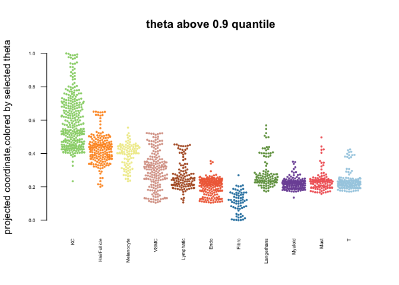
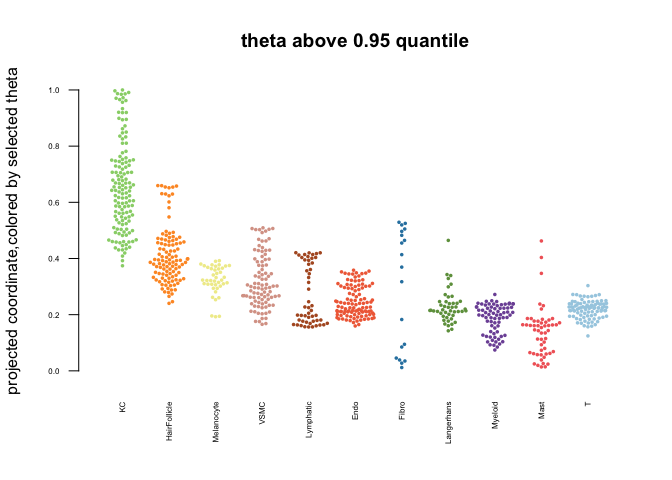
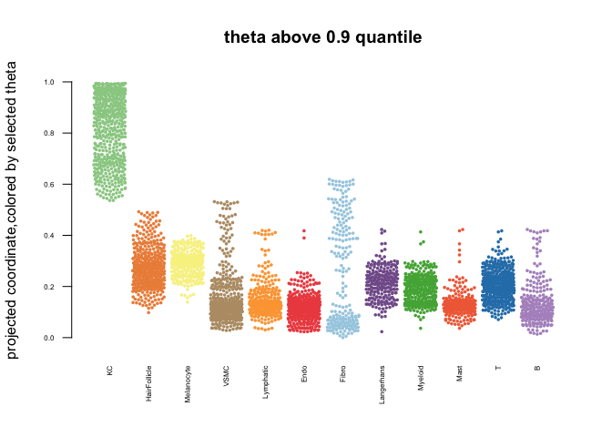
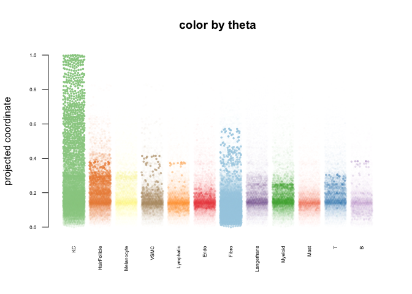
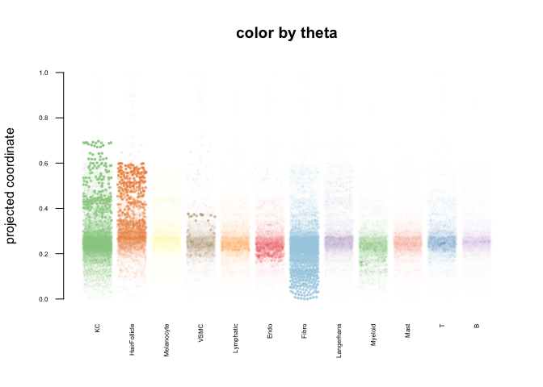

# BAYESPRISM + SPACEFOLD

## BAYESPRISM + SPACEFOLD -

De-convolution and pseudo-space projection.

References and links-

### **BayesPrism**

-   Original paper -(DOI- <https://doi.org/10.1038/s43018-022-00356-3>),

-   Github page and documentation (<https://github.com/Danko-Lab/BayesPrism>)

### **SpaceFold**

-   Original paper - (DOI- <https://doi.org/10.1016/j.stem.2022.05.007>),

-   Github page and documentation (<https://github.com/dpeerlab/SpaceFold_paper>)

| FIGURE NO / LINK                 | DESCRIPTION                                                               |
|----------------------|------------------------------------------------|
| [FIGURE 5D - HEALTHY SKIN]       | Space-fold projection - healthy                                           |
| [FIGURE 5D - NON -LESIONAL SKIN] | Space-fold projection - non-lesional                                      |
| [FIGURE 5D - LESIONAL SKIN]      | Space-fold projection - lesional                                          |
| [FIGURE 7A]                      | Space-fold projection - Mild disease (non-lesional & lesional)            |
| [FIGURE 7B]                      | Space-fold projection - Moderate-severe disease (non-lesional & lesional) |

``` r
library(Seurat)
```

    ## Warning: package 'Seurat' was built under R version 4.1.2

    ## Attaching SeuratObject

    ## Attaching sp

``` r
library(tidyverse)
```

    ## Warning: package 'tidyverse' was built under R version 4.1.2

    ## ── Attaching packages
    ## ───────────────────────────────────────
    ## tidyverse 1.3.2 ──

    ## ✔ ggplot2 3.4.0      ✔ purrr   0.3.5 
    ## ✔ tibble  3.1.8      ✔ dplyr   1.0.10
    ## ✔ tidyr   1.2.1      ✔ stringr 1.4.1 
    ## ✔ readr   2.1.3      ✔ forcats 0.5.2

    ## Warning: package 'ggplot2' was built under R version 4.1.2

    ## Warning: package 'tibble' was built under R version 4.1.2

    ## Warning: package 'tidyr' was built under R version 4.1.2

    ## Warning: package 'readr' was built under R version 4.1.2

    ## Warning: package 'purrr' was built under R version 4.1.2

    ## Warning: package 'dplyr' was built under R version 4.1.2

    ## Warning: package 'stringr' was built under R version 4.1.2

    ## Warning: package 'forcats' was built under R version 4.1.2

    ## ── Conflicts ────────────────────────────────────────── tidyverse_conflicts() ──
    ## ✖ dplyr::filter() masks stats::filter()
    ## ✖ dplyr::lag()    masks stats::lag()

``` r
library("devtools")
```

    ## Warning: package 'devtools' was built under R version 4.1.2

    ## Loading required package: usethis

    ## Warning: package 'usethis' was built under R version 4.1.2

``` r
library(TED)
library(ggsci)
```

``` r
skin_data.hm.sct <- readRDS("/Volumes/Extreme Pro/GITHUB-DATA/ST-DATA/PSORIASIS-DATA/RDS-Files/ALL_SPATIAL_SAMPLES(HM_BATCH_CORRECTED).RDS")
```

*Import processed (Seurat object) single cell RNA (scRNA) data from Hughes et al (Dataset 1)*

Psoriatic skin data

``` r
travis.psoriatic_data <- readRDS("/Volumes/Extreme Pro/GITHUB-DATA/SC-RNA-DATA/TRAVIS-DATA/RDS-Files/TRAVIS_PS_DATA.RDS")
```

Healthy skin data

``` r
travis_normal_skin <- readRDS("/Volumes/Extreme Pro/GITHUB-DATA/SC-RNA-DATA/TRAVIS-DATA/RDS-Files/travis_NM_skin_scRNA.RDS")
```

Process single cell data

``` r
source("/Volumes/Extreme Pro/GITHUB-DATA/SCRIPTS/spacefold/process_nm_input.R")
source("/Volumes/Extreme Pro/GITHUB-DATA/SCRIPTS/spacefold/process_ps_input.R")
```

``` r
load("ref.sig.ps.rdata")
```

``` r
##write a function for convenience
### Please adjust parameters as needed
run_bayes_prism <- function(st.data,sc.data){
  ref.sc.data <- t(as.matrix(sc.data@assays$RNA@counts))
  
  ref.data.filtered <- cleanup.genes(ref.dat=ref.sc.data,species="hs",gene.type=c("RB","chrX","chrY","chrM"),input.type="scRNA",exp.cells = 10)
  
  specific.cell.type.labels <- sc.data@meta.data$Specific_CellType
  cell.type.labels <- sc.data@meta.data$CellType
  
  dat.st <- t(as.matrix(GetAssayData(object = st.data, slot = "counts",assay ="Spatial")) %>% data.frame() %>% filter(rowSums(across(where(is.numeric)))!=0) )
  
  ted.output <- run.Ted(ref.dat = ref.data.sig.filtered,
                            X= dat.st,
                            cell.type.labels = cell.type.labels.filtered,
                            cell.subtype.labels = specific.cell.type.labels.filtered,
                            input.type = "scRNA",
                            n.cores =31,
                            seed=123,
                            outlier.fraction=0.9)
  return(ted.output)
}
```

Split the Seurat ST data into three main groups-

1.  Lesional

2.  Non-Lesional

3.  Healthy / Normal skin

Following that, we run BayesPrism pipeline on all three groups, independently.

<u>(NOTE: This process requires a long run time and high memory usage)</u>

``` r
ps_lesional_skin.st <- subset(skin_data.hm.sct,DISEASE_STATUS %in% c("Lesional"))
ps_non_lesional_skin.st <- subset(skin_data.hm.sct,DISEASE_STATUS %in% c("Non-Lesional"))
healthy_skin.st <- subset(skin_data.hm.sct,DISEASE_STATUS %in% c("Healthy skin"))
```

``` r
ps_lesional.st.counts <- as.matrix(GetAssayData(object = ps_lesional_skin.st, slot = "counts",assay ="Spatial")) %>% data.frame() %>% filter(rowSums(across(where(is.numeric)))!=0) 

write_tsv(ps_lesional.st.counts,file="ps_lesional.st.counts.tsv")

ps.lesional.ted <- run_bayes_prism(ps_lesional.st.counts,travis.psoriatic_data)
```

``` r
ps_non_lesional_skin.st.counts <- as.matrix(GetAssayData(object = ps_non_lesional_skin.st, slot = "counts",assay ="Spatial")) %>% data.frame() %>% filter(rowSums(across(where(is.numeric)))!=0) 

write.table(ps_non_lesional_skin.st.counts,file="ps_non_lesional_skin.st.counts.tsv",row.names = TRUE,)

ps.non_lesional.ted <- run_bayes_prism(ps_non_lesional_skin.st,travis.psoriatic_data)
```

``` r
healthy_skin.st.counts <- as.matrix(GetAssayData(object = healthy_skin.st, slot = "counts",assay ="Spatial")) %>% data.frame() %>% filter(rowSums(across(where(is.numeric)))!=0)

write_tsv(healthy_skin.st.counts,file="healthy_skin.st.counts.tsv")

healthy_skin.st.ted <- run_bayes_prism(healthy_skin.st.counts,travis_normal_skin)
```

## PS SAMPLES - grouped by severity ratings

Split the Seurat ST data into different groups on the basis of disease severity i.e. PASI score and disease status . Mild group samples have a PASI score\<12 and Moderate-severe group samples have a PASI score \>= 12.

The following four groups were created:-

1.  Mild Lesional

2.  Mild non-Lesional

3.  Moderate-severe Lesional

4.  Moderate-severe non-Lesional

## Subset the seurat data into the 4 groups

``` r
ps_lesional_skin.st_mild <- subset(skin_data.hm.sct,DISEASE_STATUS %in% c("Lesional")) %>% subset(PASI<12)
ps_lesional_skin.st_severe <- subset(skin_data.hm.sct,DISEASE_STATUS %in% c("Lesional")) %>% subset(PASI>=12)
ps_non_lesional_skin.st_mild <- subset(skin_data.hm.sct,DISEASE_STATUS %in% c("Non-Lesional")) %>% subset(PASI<12)
ps_non_lesional.st_severe <- subset(skin_data.hm.sct,DISEASE_STATUS %in% c("Non-Lesional")) %>% subset(PASI>=12)
```

##Run BayesPrism on each group -

### MILD LESIONAL SAMPLES

``` r
ps_lesional_skin.st_mild.counts <- as.matrix(GetAssayData(object = ps_lesional_skin.st_mild, slot = "counts",assay ="Spatial")) %>% data.frame() %>% filter(rowSums(across(where(is.numeric)))!=0)

write_tsv(ps_lesional_skin.st_mild.counts,file="ps_lesional_skin.st_mild.counts.tsv")

ps_lesional_skin.st_mild.ted <- run_bayes_prism(ps_lesional_skin.st_mild.counts,travis.psoriatic_data)
```

### MODERATE-SEVERE LESIONAL SAMPLES

``` r
ps_lesional_skin.st_severe.counts <- as.matrix(GetAssayData(object = ps_lesional_skin.st_severe, slot = "counts",assay ="Spatial")) %>% data.frame() %>% filter(rowSums(across(where(is.numeric)))!=0)

write_tsv(ps_lesional_skin.st_severe.counts,file="ps_lesional_skin.st_severe.counts.tsv")

ps_lesional_skin.st_severe.ted <- run_bayes_prism(ps_lesional_skin.st_severe.counts,travis.psoriatic_data)
```

### MILD NON-LESIONAL SAMPLES

``` r
ps_non_lesional_skin.st_mild.counts <- as.matrix(GetAssayData(object = ps_non_lesional_skin.st_mild, slot = "counts",assay ="Spatial")) %>% data.frame() %>% filter(rowSums(across(where(is.numeric)))!=0)

write_tsv(ps_non_lesional_skin.st_mild.counts,file="ps_non_lesional_skin.st_mild.counts.tsv")

ps_non_lesional_skin.st_mild.ted <- run_bayes_prism(ps_non_lesional_skin.st_mild.counts,travis.psoriatic_data)
```

### MODERATE-SEVERE NON-LESIONAL SAMPLES

``` r
ps_non_lesional.st_severe.counts <- as.matrix(GetAssayData(object = ps_non_lesional.st_severe, slot = "counts",assay ="Spatial")) %>% data.frame() %>% filter(rowSums(across(where(is.numeric)))!=0)

write_tsv(ps_non_lesional.st_severe.counts,file="ps_non_lesional.st_severe.counts.tsv")

ps_non_lesional.st_severe.ted <- run_bayes_prism(ps_non_lesional.st_severe.counts,travis.psoriatic_data)
```

### LOAD PROCESSED DATA FOR SPACE-FOLD (Pre-processed by running BayesPrism pipeline as described above)

``` r
ps.lesional.ted <- readRDS("/Volumes/Extreme Pro/GITHUB-DATA/BAYESPRISM-DATA/BAYES_PRISM_OUTPUT/Archive/ps.lesional.ted.RDS")
ps.non_lesional.ted <- readRDS("/Volumes/Extreme Pro/GITHUB-DATA/BAYESPRISM-DATA/BAYES_PRISM_OUTPUT/Archive/ps.non_lesional.ted.RDS")
healthy_skin.st.ted <- readRDS("/Volumes/Extreme Pro/GITHUB-DATA/BAYESPRISM-DATA/BAYES_PRISM_OUTPUT/Archive/healthy_skin.st.ted.RDS")
```

``` r
#load source files
source.dir <- "/Volumes/Extreme Pro/GITHUB-DATA/SCRIPTS/spacefold/"
source (paste(source.dir,"bp.merge.function.R",sep=""))
source (paste(source.dir,"bp.utility.functions.R",sep=""))
source (paste(source.dir,"project.exp.functions.R",sep=""))
```

    ## mixtools package, version 1.2.0, Released 2020-02-05
    ## This package is based upon work supported by the National Science Foundation under Grant No. SES-0518772.

    ## Warning: package 'mclust' was built under R version 4.1.2

    ## Package 'mclust' version 5.4.10
    ## Type 'citation("mclust")' for citing this R package in publications.

    ## 
    ## Attaching package: 'mclust'

    ## The following object is masked from 'package:mixtools':
    ## 
    ##     dmvnorm

    ## The following object is masked from 'package:purrr':
    ## 
    ##     map

``` r
source (paste(source.dir,"run.phate.functions.R",sep=""))
```

    ## Loading required package: Matrix

    ## Warning: package 'Matrix' was built under R version 4.1.2

    ## 
    ## Attaching package: 'Matrix'

    ## The following objects are masked from 'package:tidyr':
    ## 
    ##     expand, pack, unpack

    ## Warning: package 'RColorBrewer' was built under R version 4.1.2

``` r
#source("../../SPACE_FOLD_CODE/run.phate.functions.R")
```

``` r
structural.cells<- c("KC","HairFollicle","VSMC","Lymphatic","Endo","Fib")
immune.cells <- c("Langerhans","Myeloid","T","B")

healthy.order <- c("KC","HairFollicle","Melanocyte","VSMC","Lymphatic","Endo","Fibro","Langerhans","Myeloid","Mast","T")
ps.order <- c("KC","HairFollicle","Melanocyte","VSMC","Lymphatic","Endo","Fibro","Langerhans","Myeloid","Mast","T","B")
```

### FIGURE 5D - HEALTHY SKIN {data-link="FIGURE 5D - HEALTHY SKIN"}

(0.9 quantile used in the final manuscript)

``` r
healthy_skin.st.ted$para$feature <- healthy_skin.st.ted$para$X
```

``` r
meta <- as.data.frame(healthy_skin.st@meta.data) %>% rownames_to_column("barcode")
rownames(healthy_skin.st.ted$para$X) <- meta$barcode
healthy_skin.st.ted <- add.meta(bp.obj= healthy_skin.st.ted, meta =meta)
```

``` r
#compute Znk (fraction of reads in each cell type)
healthy_skin.st.ted <- compute.Znk(healthy_skin.st.ted)

#normalize by Znk
healthy_skin.st.ted <- norm.by.sf(healthy_skin.st.ted)

#determine background level, using final theta
healthy_skin.st.ted <- compute.background.level (healthy_skin.st.ted, which.theta='final')
```

    ## [1] "fitting mixture models on theta..."
    ## [1] "T"
    ## number of iterations= 111 
    ## number of iterations= 500 
    ## cls
    ##    1    2 
    ##  532 3254 
    ## [1] "Fibro"
    ## number of iterations= 419 
    ## number of iterations= 1026 
    ## cls
    ##    1    2 
    ## 2863  923 
    ## [1] "KC"
    ## number of iterations= 75 
    ## number of iterations= 997 
    ## cls
    ##    1    2 
    ## 3446  340 
    ## [1] "Langerhans"
    ## number of iterations= 414 
    ## number of iterations= 2081 
    ## cls
    ##    1    2 
    ## 1038 2748 
    ## [1] "Mast"
    ## number of iterations= 219 
    ## number of iterations= 1455 
    ## cls
    ##    1    2 
    ## 1333 2453 
    ## [1] "Endo"
    ## number of iterations= 201 
    ## number of iterations= 648 
    ## cls
    ##    1    2 
    ## 2666 1120 
    ## [1] "HairFollicle"
    ## number of iterations= 358 
    ## number of iterations= 1652 
    ## cls
    ##    1    2 
    ## 3299  487 
    ## [1] "VSMC"
    ## number of iterations= 91 
    ## number of iterations= 445 
    ## cls
    ##    1    2 
    ##  725 3061 
    ## [1] "Myeloid"
    ## number of iterations= 264 
    ## number of iterations= 746 
    ## cls
    ##    1    2 
    ## 1312 2474 
    ## [1] "Melanocyte"
    ## number of iterations= 69 
    ## number of iterations= 990 
    ## cls
    ##    1    2 
    ## 1214 2572 
    ## [1] "Lymphatic"
    ## number of iterations= 261 
    ## number of iterations= 726 
    ## cls
    ##    1    2 
    ##  743 3043 
    ## [1] "fitting mixture models on Znk..."
    ## [1] "T"
    ## cls
    ##    1    2 
    ## 3177  609 
    ## [1] "Fibro"
    ## cls
    ##    1    2 
    ## 2552 1234 
    ## [1] "KC"
    ## cls
    ##    1    2 
    ## 3183  603 
    ## [1] "Langerhans"
    ## cls
    ##    1    2 
    ## 3195  591 
    ## [1] "Mast"
    ## cls
    ##    1    2 
    ## 3225  561 
    ## [1] "Endo"
    ## cls
    ##    1    2 
    ## 3014  772 
    ## [1] "HairFollicle"
    ## cls
    ##    1    2 
    ## 3022  764 
    ## [1] "VSMC"
    ## cls
    ##    1    2 
    ## 2936  850 
    ## [1] "Myeloid"
    ## cls
    ##    1    2 
    ## 2747 1039 
    ## [1] "Melanocyte"
    ## cls
    ##    1    2 
    ## 2997  789 
    ## [1] "Lymphatic"
    ## cls
    ##    1    2 
    ## 2760 1026

``` r
#run phate
# specify anchorCellTypes to select cell types (if you need to held out a group of cell types) 
healthy_skin.st.ted <- phate.bp (healthy_skin.st.ted, if.invert=FALSE)

#plot cell type distribution along the spacefold axis
plot.beeswarm.no.pdf(healthy_skin.st.ted, pdf.prefix="HEALTHY_SKIN_SPACEFOLD_OUTPUT(0.90_cutoff)",q.cut = 0.90,cell.type.order = healthy.order)
```

<!-- --><!-- -->

``` r
#plot cell type distribution along the spacefold axis
plot.beeswarm.no.pdf(healthy_skin.st.ted, pdf.prefix="HEALTHY_SKIN_SPACEFOLD_OUTPUT(0.95_cutoff)",q.cut = 0.95,cell.type.order = healthy.order)
```

<!-- --><!-- -->

### FIGURE 5D - LESIONAL SKIN {data-link="FIGURE 5D - LESIONAL SKIN"}

(0.9 quantile used in the final manuscript)

MATCH THE BARCODES

``` r
ps.lesional.ted$para$feature <- ps.lesional.ted$para$X
```

``` r
meta <- as.data.frame(ps_lesional_skin.st@meta.data) %>% rownames_to_column("barcode")
rownames(ps.lesional.ted$para$X) <- meta$barcode
ps.lesional.ted <- add.meta(bp.obj= ps.lesional.ted, meta =meta)
```

``` r
#compute Znk (fraction of reads in each cell type)
ps.lesional.ted <- compute.Znk(ps.lesional.ted)

#normalize by Znk
ps.lesional.ted <- norm.by.sf(ps.lesional.ted)

#determine background level, using final theta
ps.lesional.ted <- compute.background.level (ps.lesional.ted, which.theta='final')
```

    ## [1] "fitting mixture models on theta..."
    ## [1] "Fibro"
    ## number of iterations= 412 
    ## number of iterations= 595 
    ## cls
    ##    1    2 
    ## 4165 4588 
    ## [1] "T"
    ## number of iterations= 114 
    ## number of iterations= 876 
    ## cls
    ##    1    2 
    ## 8427  326 
    ## [1] "KC"
    ## number of iterations= 202 
    ## number of iterations= 183 
    ## cls
    ##    1    2 
    ## 8722   31 
    ## [1] "Myeloid"
    ## number of iterations= 231 
    ## number of iterations= 1232 
    ## cls
    ##    1    2 
    ## 1781 6972 
    ## [1] "VSMC"
    ## number of iterations= 174 
    ## number of iterations= 1933 
    ## cls
    ##    1    2 
    ## 8365  388 
    ## [1] "Endo"
    ## number of iterations= 274 
    ## number of iterations= 684 
    ## cls
    ##    1    2 
    ## 8359  394 
    ## [1] "Mast"
    ## number of iterations= 156 
    ## number of iterations= 900 
    ## cls
    ##    1    2 
    ## 3825 4928 
    ## [1] "Lymphatic"
    ## number of iterations= 127 
    ## number of iterations= 422 
    ## cls
    ##    1    2 
    ##  106 8647 
    ## [1] "HairFollicle"
    ## number of iterations= 166 
    ## number of iterations= 1093 
    ## cls
    ##    1    2 
    ## 7588 1165 
    ## [1] "B"
    ## number of iterations= 45 
    ## number of iterations= 446 
    ## cls
    ##    1    2 
    ##  118 8635 
    ## [1] "Langerhans"
    ## number of iterations= 674 
    ## number of iterations= 1459 
    ## cls
    ##    1    2 
    ## 3490 5263 
    ## [1] "Melanocyte"
    ## number of iterations= 163 
    ## number of iterations= 903 
    ## cls
    ##    1    2 
    ##  232 8521 
    ## [1] "Sebocyte"
    ## number of iterations= 43 
    ## number of iterations= 191 
    ## cls
    ##    1    2 
    ## 7718 1035 
    ## [1] "fitting mixture models on Znk..."
    ## [1] "Fibro"
    ## cls
    ##    1    2 
    ## 5873 2880 
    ## [1] "T"
    ## cls
    ##    1    2 
    ## 7368 1385 
    ## [1] "KC"
    ## cls
    ##    1    2 
    ## 6443 2310 
    ## [1] "Myeloid"
    ## cls
    ##    1    2 
    ## 5808 2945 
    ## [1] "VSMC"
    ## cls
    ##    1    2 
    ## 6415 2338 
    ## [1] "Endo"
    ## cls
    ##    1    2 
    ## 7173 1580 
    ## [1] "Mast"
    ## cls
    ##    1    2 
    ## 7565 1188 
    ## [1] "Lymphatic"
    ## cls
    ##    1    2 
    ## 6981 1772 
    ## [1] "HairFollicle"
    ## cls
    ##    1    2 
    ## 7931  822 
    ## [1] "B"
    ## cls
    ##    1    2 
    ## 7604 1149 
    ## [1] "Langerhans"
    ## cls
    ##    1    2 
    ## 6367 2386 
    ## [1] "Melanocyte"
    ## cls
    ##    1    2 
    ## 6758 1995 
    ## [1] "Sebocyte"
    ## cls
    ##    1    2 
    ## 7253 1500

``` r
#run phate
# specify anchorCellTypes to select cell types (if you need to held out a group of cell types) 
ps.lesional.ted <- phate.bp (ps.lesional.ted, if.invert=FALSE)

#plot cell type distribution along the spacefold axis
plot.beeswarm.no.pdf(ps.lesional.ted, pdf.prefix="PS_LESIONAL_SKIN_SPACEFOLD_OUTPUT(0.95_cutoff)",q.cut = 0.90,cell.type.order = ps.order)
```

<!-- --><!-- -->

``` r
#plot cell type distribution along the spacefold axis
plot.beeswarm.no.pdf(ps.lesional.ted, pdf.prefix="PS_LESIONAL_SKIN_SPACEFOLD_OUTPUT(0.90_cutoff)",q.cut = 0.90,cell.type.order = ps.order)
```

<!-- --><!-- -->

### FIGURE 5D - NON -LESIONAL SKIN {data-link="FIGURE 5D - NON -LESIONAL SKIN"}

(0.9 quantile used in the final manuscript)

``` r
ps.non_lesional.ted$para$feature <- ps.non_lesional.ted$para$X
```

MATCH THE BARCODES

``` r
meta <- as.data.frame(ps_non_lesional_skin.st@meta.data) %>% rownames_to_column("barcode")
rownames(ps.non_lesional.ted$para$X) <- meta$barcode
ps.non_lesional.ted <- add.meta(bp.obj= ps.non_lesional.ted, meta =meta)
```

``` r
#compute Znk (fraction of reads in each cell type)
ps.non_lesional.ted <- compute.Znk(ps.non_lesional.ted)

#normalize by Znk
ps.non_lesional.ted <- norm.by.sf(ps.non_lesional.ted)

#determine background level, using final theta
ps.non_lesional.ted <- compute.background.level (ps.non_lesional.ted, which.theta='final')
```

    ## [1] "fitting mixture models on theta..."
    ## [1] "Fibro"
    ## number of iterations= 330 
    ## number of iterations= 1418 
    ## cls
    ##    1    2 
    ## 2127 1758 
    ## [1] "T"
    ## number of iterations= 344 
    ## number of iterations= 916 
    ## cls
    ##    1    2 
    ##  146 3739 
    ## [1] "KC"
    ## number of iterations= 187 
    ## number of iterations= 3685 
    ## cls
    ##    1    2 
    ##  318 3567 
    ## [1] "Myeloid"
    ## number of iterations= 203 
    ## number of iterations= 710 
    ## cls
    ##    1    2 
    ##  225 3660 
    ## [1] "VSMC"
    ## number of iterations= 138 
    ## number of iterations= 562 
    ## cls
    ##    1    2 
    ##  379 3506 
    ## [1] "Endo"
    ## number of iterations= 261 
    ## number of iterations= 1043 
    ## cls
    ##    1    2 
    ## 3556  329 
    ## [1] "Mast"
    ## number of iterations= 129 
    ## number of iterations= 603 
    ## cls
    ##    1    2 
    ##   24 3861 
    ## [1] "Lymphatic"
    ## number of iterations= 235 
    ## number of iterations= 605 
    ## cls
    ##    1    2 
    ##  141 3744 
    ## [1] "HairFollicle"
    ## number of iterations= 58 
    ## number of iterations= 547 
    ## cls
    ##    1    2 
    ## 2503 1382 
    ## [1] "B"
    ## number of iterations= 91 
    ## number of iterations= 326 
    ## cls
    ##    1    2 
    ##   45 3840 
    ## [1] "Langerhans"
    ## number of iterations= 405 
    ## number of iterations= 2811 
    ## cls
    ##    1    2 
    ## 1866 2019 
    ## [1] "Melanocyte"
    ## number of iterations= 426 
    ## number of iterations= 1588 
    ## cls
    ##    1    2 
    ##   62 3823 
    ## [1] "Sebocyte"
    ## number of iterations= 71 
    ## number of iterations= 252 
    ## cls
    ##    1    2 
    ## 3193  692 
    ## [1] "fitting mixture models on Znk..."
    ## [1] "Fibro"
    ## cls
    ##    1    2 
    ## 2828 1057 
    ## [1] "T"
    ## cls
    ##    1    2 
    ## 2829 1056 
    ## [1] "KC"
    ## cls
    ##    1    2 
    ## 3001  884 
    ## [1] "Myeloid"
    ## cls
    ##    1    2 
    ## 2984  901 
    ## [1] "VSMC"
    ## cls
    ##    1    2 
    ## 2767 1118 
    ## [1] "Endo"
    ## cls
    ##    1    2 
    ## 2971  914 
    ## [1] "Mast"
    ## cls
    ##    1    2 
    ## 3119  766 
    ## [1] "Lymphatic"
    ## cls
    ##    1    2 
    ## 2657 1228 
    ## [1] "HairFollicle"
    ## cls
    ##    1    2 
    ## 3062  823 
    ## [1] "B"
    ## cls
    ##    1    2 
    ## 3209  676 
    ## [1] "Langerhans"
    ## cls
    ##    1    2 
    ## 2842 1043 
    ## [1] "Melanocyte"
    ## cls
    ##    1    2 
    ## 3065  820 
    ## [1] "Sebocyte"
    ## cls
    ##    1    2 
    ## 3130  755

``` r
#run phate
# specify anchorCellTypes to select cell types (if you need to held out a group of cell types) 
ps.non_lesional.ted <- phate.bp (ps.non_lesional.ted, if.invert=FALSE,renorm.to.one = TRUE)

#plot cell type distribution along the spacefold axis
plot.beeswarm.no.pdf(ps.non_lesional.ted, pdf.prefix="PS_NON_LESIONAL_SKIN_SPACEFOLD_OUTPUT(0.95_cutoff)",q.cut = 0.95,cell.type.order = ps.order)
```

<!-- --><!-- -->

``` r
#plot cell type distribution along the spacefold axis
plot.beeswarm.no.pdf(ps.non_lesional.ted, pdf.prefix="PS_NON_LESIONAL_SKIN_SPACEFOLD_OUTPUT(0.90_cutoff)",q.cut = 0.90,cell.type.order = ps.order)
```

<!-- --><!-- -->

## LOAD SUB-LESIONAL SKIN DATA - BY SEVERITY

``` r
ps_lesional_skin.st_mild.ted <- readRDS("/Volumes/Extreme Pro/GITHUB-DATA/BAYESPRISM-DATA/BAYES_PRISM_OUTPUT/Archive/ps_lesional_skin.st_mild.ted.RDS")
ps_lesional_skin.st_severe.ted <- readRDS("/Volumes/Extreme Pro/GITHUB-DATA/BAYESPRISM-DATA/BAYES_PRISM_OUTPUT/Archive/ps_lesional_skin.st_severe.ted.RDS")
```

``` r
ps_lesional_skin.st_mild.ted$para$feature <- ps_lesional_skin.st_mild.ted$para$X
```

MATCH THE BARCODES

``` r
meta <- as.data.frame(ps_lesional_skin.st_mild@meta.data) %>% rownames_to_column("barcode")
rownames(ps_lesional_skin.st_mild.ted$para$X) <- meta$barcode
ps_lesional_skin.st_mild.ted <- add.meta(bp.obj= ps_lesional_skin.st_mild.ted, meta =meta)
```

#### **FIGURE 7A - 2**

#### SPACE-FOLD PROJECTION (LESIONAL SKIN - MILD GROUP)

``` r
#compute Znk (fraction of reads in each cell type)
ps_lesional_skin.st_mild.ted <- compute.Znk(ps_lesional_skin.st_mild.ted)

#normalize by Znk
ps_lesional_skin.st_mild.ted <- norm.by.sf(ps_lesional_skin.st_mild.ted)

#determine background level, using final theta
ps_lesional_skin.st_mild.ted <- compute.background.level (ps_lesional_skin.st_mild.ted, which.theta='final')
```

    ## [1] "fitting mixture models on theta..."
    ## [1] "Fibro"
    ## number of iterations= 256 
    ## number of iterations= 554 
    ## cls
    ##    1    2 
    ## 3273 2404 
    ## [1] "T"
    ## number of iterations= 164 
    ## number of iterations= 630 
    ## cls
    ##    1    2 
    ## 3877 1800 
    ## [1] "KC"
    ## number of iterations= 87 
    ## number of iterations= 1178 
    ## [1] "refit"
    ## WARNING! NOT CONVERGENT! 
    ## number of iterations= 10000 
    ## cls
    ##    1    2 
    ## 5043  634 
    ## [1] "Myeloid"
    ## number of iterations= 198 
    ## number of iterations= 736 
    ## cls
    ##    1    2 
    ## 3829 1848 
    ## [1] "VSMC"
    ## number of iterations= 121 
    ## number of iterations= 2206 
    ## cls
    ##    1    2 
    ## 5100  577 
    ## [1] "Endo"
    ## number of iterations= 168 
    ## number of iterations= 696 
    ## cls
    ##    1    2 
    ## 5416  261 
    ## [1] "Mast"
    ## number of iterations= 187 
    ## number of iterations= 620 
    ## cls
    ##    1    2 
    ##    7 5670 
    ## [1] "Lymphatic"
    ## number of iterations= 129 
    ## number of iterations= 383 
    ## cls
    ##    1    2 
    ## 5599   78 
    ## [1] "HairFollicle"
    ## number of iterations= 116 
    ## number of iterations= 1180 
    ## cls
    ##    1    2 
    ## 5251  426 
    ## [1] "B"
    ## number of iterations= 74 
    ## number of iterations= 203 
    ## cls
    ##    1    2 
    ## 5566  111 
    ## [1] "Langerhans"
    ## number of iterations= 643 
    ## number of iterations= 1626 
    ## cls
    ##    1    2 
    ##   52 5625 
    ## [1] "Melanocyte"
    ## number of iterations= 242 
    ## number of iterations= 1240 
    ## cls
    ##    1    2 
    ##  177 5500 
    ## [1] "Sebocyte"
    ## number of iterations= 41 
    ## number of iterations= 195 
    ## cls
    ##    1    2 
    ## 5049  628 
    ## [1] "fitting mixture models on Znk..."
    ## [1] "Fibro"
    ## cls
    ##    1    2 
    ## 3532 2145 
    ## [1] "T"
    ## cls
    ##    1    2 
    ## 4729  948 
    ## [1] "KC"
    ## cls
    ##    1    2 
    ## 4031 1646 
    ## [1] "Myeloid"
    ## cls
    ##    1    2 
    ## 4043 1634 
    ## [1] "VSMC"
    ## cls
    ##    1    2 
    ## 4018 1659 
    ## [1] "Endo"
    ## cls
    ##    1    2 
    ## 4595 1082 
    ## [1] "Mast"
    ## cls
    ##    1    2 
    ## 4787  890 
    ## [1] "Lymphatic"
    ## cls
    ##    1    2 
    ## 4472 1205 
    ## [1] "HairFollicle"
    ## cls
    ##    1    2 
    ## 5122  555 
    ## [1] "B"
    ## cls
    ##    1    2 
    ## 4889  788 
    ## [1] "Langerhans"
    ## cls
    ##    1    2 
    ## 4117 1560 
    ## [1] "Melanocyte"
    ## cls
    ##    1    2 
    ## 4439 1238 
    ## [1] "Sebocyte"
    ## cls
    ##    1    2 
    ## 4817  860

``` r
#run phate
# specify anchorCellTypes to select cell types (if you need to held out a group of cell types) 
ps_lesional_skin.st_mild.ted <- phate.bp (ps_lesional_skin.st_mild.ted, if.invert=FALSE)

#plot cell type distribution along the spacefold axis
#plot.beeswarm.no.pdf(ps_lesional_skin.st_mild.ted, pdf.prefix="PS_LESIONAL_SKIN_MILD_SPACEFOLD_OUTPUT(0.95_cutoff)",q.cut = 0.95,cell.type.order = ps.order)

#plot cell type distribution along the spacefold axis
plot.beeswarm.no.pdf(ps_lesional_skin.st_mild.ted, pdf.prefix="PS_LESIONAL_SKIN_MILD_SPACEFOLD_OUTPUT(0.90_cutoff)",q.cut = 0.90,cell.type.order = ps.order)
```

<!-- --><!-- -->

### **FIGURE 7B - 2**

#### SPACE-FOLD PROJECTION (LESIONAL SKIN - MODERATE-SEVERE GROUP)

``` r
ps_lesional_skin.st_severe.ted$para$feature <- ps_lesional_skin.st_severe.ted$para$X
```

``` r
meta <- as.data.frame(ps_lesional_skin.st_severe@meta.data) %>% rownames_to_column("barcode")
rownames(ps_lesional_skin.st_severe.ted$para$X) <- meta$barcode
ps_lesional_skin.st_severe.ted <- add.meta(bp.obj= ps_lesional_skin.st_severe.ted, meta =meta)
```

``` r
#compute Znk (fraction of reads in each cell type)
ps_lesional_skin.st_severe.ted <- compute.Znk(ps_lesional_skin.st_severe.ted)

#normalize by Znk
ps_lesional_skin.st_severe.ted <- norm.by.sf(ps_lesional_skin.st_severe.ted)

#determine background level, using final theta
ps_lesional_skin.st_severe.ted <- compute.background.level (ps_lesional_skin.st_severe.ted, which.theta='final')
```

    ## [1] "fitting mixture models on theta..."
    ## [1] "Fibro"
    ## number of iterations= 114 
    ## number of iterations= 2232 
    ## cls
    ##    1    2 
    ##  459 2617 
    ## [1] "T"
    ## number of iterations= 72 
    ## number of iterations= 561 
    ## cls
    ##    1    2 
    ## 2220  856 
    ## [1] "KC"
    ## number of iterations= 118 
    ## number of iterations= 2979 
    ## cls
    ##    1    2 
    ##  987 2089 
    ## [1] "Myeloid"
    ## number of iterations= 691 
    ## number of iterations= 2054 
    ## cls
    ##    1    2 
    ## 2830  246 
    ## [1] "VSMC"
    ## number of iterations= 39 
    ## number of iterations= 381 
    ## cls
    ##    1    2 
    ## 3003   73 
    ## [1] "Endo"
    ## number of iterations= 211 
    ## number of iterations= 613 
    ## cls
    ##    1    2 
    ## 2919  157 
    ## [1] "Mast"
    ## number of iterations= 32 
    ## number of iterations= 503 
    ## cls
    ##    1    2 
    ## 1803 1273 
    ## [1] "Lymphatic"
    ## number of iterations= 183 
    ## number of iterations= 451 
    ## cls
    ##    1    2 
    ## 3046   30 
    ## [1] "HairFollicle"
    ## number of iterations= 119 
    ## number of iterations= 355 
    ## cls
    ##    1    2 
    ## 1842 1234 
    ## [1] "B"
    ## number of iterations= 45 
    ## number of iterations= 306 
    ## cls
    ##    1    2 
    ## 3048   28 
    ## [1] "Langerhans"
    ## number of iterations= 745 
    ## number of iterations= 705 
    ## cls
    ##    1    2 
    ##   33 3043 
    ## [1] "Melanocyte"
    ## number of iterations= 162 
    ## number of iterations= 682 
    ## cls
    ##    1    2 
    ## 2249  827 
    ## [1] "Sebocyte"
    ## number of iterations= 50 
    ## number of iterations= 307 
    ## cls
    ##    1    2 
    ## 2662  414 
    ## [1] "fitting mixture models on Znk..."
    ## [1] "Fibro"
    ## cls
    ##    1    2 
    ## 2352  724 
    ## [1] "T"
    ## cls
    ##    1    2 
    ## 2461  615 
    ## [1] "KC"
    ## cls
    ##    1    2 
    ## 2292  784 
    ## [1] "Myeloid"
    ## cls
    ##    1    2 
    ## 1895 1181 
    ## [1] "VSMC"
    ## cls
    ##    1    2 
    ## 2344  732 
    ## [1] "Endo"
    ## cls
    ##    1    2 
    ## 2567  509 
    ## [1] "Mast"
    ## cls
    ##    1    2 
    ## 2767  309 
    ## [1] "Lymphatic"
    ## cls
    ##    1    2 
    ## 2485  591 
    ## [1] "HairFollicle"
    ## cls
    ##    1    2 
    ## 2833  243 
    ## [1] "B"
    ## cls
    ##    1    2 
    ## 2631  445 
    ## [1] "Langerhans"
    ## cls
    ##    1    2 
    ## 2179  897 
    ## [1] "Melanocyte"
    ## cls
    ##    1    2 
    ## 2332  744 
    ## [1] "Sebocyte"
    ## cls
    ##    1    2 
    ## 2420  656

``` r
#run phate 
# specify anchorCellTypes to select cell types (if you need to held out a group of cell types) 
ps_lesional_skin.st_severe.ted <- phate.bp (ps_lesional_skin.st_severe.ted, if.invert=FALSE)

#plot cell type distribution along the spacefold axis
#plot.beeswarm.no.pdf(ps_lesional_skin.st_severe.ted, pdf.prefix="PS_LESIONAL_SKIN_SEVERE_SPACEFOLD_OUTPUT(0.95_cutoff)",q.cut = 0.95,cell.type.order = ps.order)

#plot cell type distribution along the spacefold axis
plot.beeswarm.no.pdf(ps_lesional_skin.st_severe.ted, pdf.prefix="PS_LESIONAL_SKIN_SEVERE_SPACEFOLD_OUTPUT(0.90_cutoff)",q.cut = 0.90,cell.type.order = ps.order)
```

<!-- --><!-- -->

LOAD NON-LESIONAL SKIN DATA - GROUPED BY SEVERITY

``` r
ps_non_lesional_skin.st_mild.ted <- readRDS("/Volumes/Extreme Pro/GITHUB-DATA/BAYESPRISM-DATA/BAYES_PRISM_OUTPUT/Archive/ps_non_lesional_skin.st_mild.ted.RDS")
ps_non_lesional_skin.st_severe.ted <- readRDS("/Volumes/Extreme Pro/GITHUB-DATA/BAYESPRISM-DATA/BAYES_PRISM_OUTPUT/Archive/ps_non_lesional.st_severe.ted.RDS")
```

``` r
meta <- as.data.frame(ps_non_lesional_skin.st_mild@meta.data) %>% rownames_to_column("barcode")
rownames(ps_non_lesional_skin.st_mild.ted$para$X) <- meta$barcode
ps_non_lesional_skin.st_mild.ted <- add.meta(bp.obj= ps_non_lesional_skin.st_mild.ted, meta =meta)
```

#### **FIGURE 7A**

#### SPACE-FOLD PROJECTION (NON-LESIONAL SKIN - MILD GROUP)

``` r
#compute Znk (fraction of reads in each cell type)
ps_non_lesional_skin.st_mild.ted <- compute.Znk(ps_non_lesional_skin.st_mild.ted)

#normalize by Znk
ps_non_lesional_skin.st_mild.ted <- norm.by.sf(ps_non_lesional_skin.st_mild.ted)

#determine background level, using final theta
ps_non_lesional_skin.st_mild.ted <- compute.background.level (ps_non_lesional_skin.st_mild.ted, which.theta='final')
```

    ## [1] "fitting mixture models on theta..."
    ## [1] "Fibro"
    ## number of iterations= 26 
    ## number of iterations= 662 
    ## cls
    ##   1   2 
    ## 562 982 
    ## [1] "T"
    ## number of iterations= 99 
    ## number of iterations= 1116 
    ## cls
    ##    1    2 
    ## 1448   96 
    ## [1] "KC"
    ## number of iterations= 76 
    ## number of iterations= 2109 
    ## cls
    ##    1    2 
    ## 1366  178 
    ## [1] "Myeloid"
    ## number of iterations= 72 
    ## number of iterations= 682 
    ## cls
    ##    1    2 
    ## 1387  157 
    ## [1] "VSMC"
    ## number of iterations= 151 
    ## number of iterations= 513 
    ## cls
    ##    1    2 
    ## 1196  348 
    ## [1] "Endo"
    ## number of iterations= 346 
    ## number of iterations= 829 
    ## cls
    ##    1    2 
    ##  334 1210 
    ## [1] "Mast"
    ## number of iterations= 289 
    ## number of iterations= 582 
    ## cls
    ##    1    2 
    ## 1513   31 
    ## [1] "Lymphatic"
    ## number of iterations= 130 
    ## number of iterations= 591 
    ## cls
    ##    1    2 
    ##  118 1426 
    ## [1] "HairFollicle"
    ## number of iterations= 175 
    ## number of iterations= 538 
    ## cls
    ##    1    2 
    ##   61 1483 
    ## [1] "B"
    ## number of iterations= 107 
    ## number of iterations= 249 
    ## cls
    ##    1    2 
    ##   17 1527 
    ## [1] "Langerhans"
    ## number of iterations= 360 
    ## number of iterations= 1504 
    ## cls
    ##    1    2 
    ##   16 1528 
    ## [1] "Melanocyte"
    ## number of iterations= 559 
    ## number of iterations= 1422 
    ## cls
    ##    1    2 
    ## 1517   27 
    ## [1] "Sebocyte"
    ## number of iterations= 66 
    ## number of iterations= 288 
    ## cls
    ##    1    2 
    ## 1237  307 
    ## [1] "fitting mixture models on Znk..."
    ## [1] "Fibro"
    ## cls
    ##    1    2 
    ## 1174  370 
    ## [1] "T"
    ## cls
    ##    1    2 
    ## 1178  366 
    ## [1] "KC"
    ## cls
    ##    1    2 
    ## 1194  350 
    ## [1] "Myeloid"
    ## cls
    ##    1    2 
    ## 1155  389 
    ## [1] "VSMC"
    ## cls
    ##    1    2 
    ## 1049  495 
    ## [1] "Endo"
    ## cls
    ##    1    2 
    ## 1171  373 
    ## [1] "Mast"
    ## cls
    ##    1    2 
    ## 1230  314 
    ## [1] "Lymphatic"
    ## cls
    ##    1    2 
    ## 1028  516 
    ## [1] "HairFollicle"
    ## cls
    ##    1    2 
    ## 1227  317 
    ## [1] "B"
    ## cls
    ##    1    2 
    ## 1286  258 
    ## [1] "Langerhans"
    ## cls
    ##    1    2 
    ## 1182  362 
    ## [1] "Melanocyte"
    ## cls
    ##    1    2 
    ## 1231  313 
    ## [1] "Sebocyte"
    ## cls
    ##    1    2 
    ## 1273  271

``` r
#run phate
# specify anchorCellTypes to select cell types (if you need to held out a group of cell types) 
ps_non_lesional_skin.st_mild.ted <- phate.bp (ps_non_lesional_skin.st_mild.ted, if.invert=FALSE)

#plot cell type distribution along the spacefold axis
#plot.beeswarm.no.pdf(ps_non_lesional_skin.st_mild.ted, pdf.prefix="PS_NON_LESIONAL_SKIN_MILD_SPACEFOLD_OUTPUT(0.95_cutoff)",q.cut = 0.95,cell.type.order = ps.order)

#plot cell type distribution along the spacefold axis
plot.beeswarm.no.pdf(ps_non_lesional_skin.st_mild.ted, pdf.prefix="PS_NON_LESIONAL_SKIN_MILD_SPACEFOLD_OUTPUT(0.90_cutoff)",q.cut = 0.90,cell.type.order = ps.order)
```

<!-- --><!-- -->

### **FIGURE 7B**

#### SPACE-FOLD PROJECTION (NON-LESIONAL SKIN - MODERATE-SEVERE GROUP)

``` r
meta <- as.data.frame(ps_non_lesional.st_severe@meta.data) %>% rownames_to_column("barcode")
rownames(ps_non_lesional_skin.st_severe.ted$para$X) <- meta$barcode
ps_non_lesional_skin.st_severe.ted <- add.meta(bp.obj= ps_non_lesional_skin.st_severe.ted, meta =meta)
```

``` r
#compute Znk (fraction of reads in each cell type)
ps_non_lesional_skin.st_severe.ted<- compute.Znk(ps_non_lesional_skin.st_severe.ted)

#normalize by Znk
ps_non_lesional_skin.st_severe.ted<- norm.by.sf(ps_non_lesional_skin.st_severe.ted)

#determine background level, using final theta
ps_non_lesional_skin.st_severe.ted <- compute.background.level (ps_non_lesional_skin.st_severe.ted, which.theta='final')
```

    ## [1] "fitting mixture models on theta..."
    ## [1] "Fibro"
    ## number of iterations= 554 
    ## number of iterations= 3928 
    ## cls
    ##    1    2 
    ## 1264 1077 
    ## [1] "T"
    ## number of iterations= 493 
    ## number of iterations= 780 
    ## cls
    ##    1    2 
    ## 2309   32 
    ## [1] "KC"
    ## number of iterations= 239 
    ## number of iterations= 4318 
    ## cls
    ##    1    2 
    ## 2187  154 
    ## [1] "Myeloid"
    ## number of iterations= 119 
    ## number of iterations= 2081 
    ## cls
    ##    1    2 
    ##   70 2271 
    ## [1] "VSMC"
    ## number of iterations= 128 
    ## number of iterations= 1466 
    ## cls
    ##    1    2 
    ## 2274   67 
    ## [1] "Endo"
    ## number of iterations= 135 
    ## number of iterations= 559 
    ## cls
    ##    1    2 
    ##  167 2174 
    ## [1] "Mast"
    ## number of iterations= 240 
    ## number of iterations= 3937 
    ## [1] "refit"
    ## number of iterations= 1200 
    ## cls
    ##    1    2 
    ##   77 2264 
    ## [1] "Lymphatic"
    ## number of iterations= 150 
    ## number of iterations= 510 
    ## cls
    ##    1    2 
    ##   17 2324 
    ## [1] "HairFollicle"
    ## number of iterations= 56 
    ## number of iterations= 286 
    ## cls
    ##    1    2 
    ## 1002 1339 
    ## [1] "B"
    ## number of iterations= 25 
    ## number of iterations= 286 
    ## cls
    ##    1    2 
    ## 2327   14 
    ## [1] "Langerhans"
    ## number of iterations= 261 
    ## number of iterations= 1991 
    ## cls
    ##    1    2 
    ##  501 1840 
    ## [1] "Melanocyte"
    ## number of iterations= 2577 
    ## number of iterations= 2349 
    ## cls
    ##    1    2 
    ## 2274   67 
    ## [1] "Sebocyte"
    ## number of iterations= 99 
    ## number of iterations= 296 
    ## cls
    ##    1    2 
    ##  397 1944 
    ## [1] "fitting mixture models on Znk..."
    ## [1] "Fibro"
    ## cls
    ##    1    2 
    ## 1387  954 
    ## [1] "T"
    ## cls
    ##    1    2 
    ## 1702  639 
    ## [1] "KC"
    ## cls
    ##    1    2 
    ## 1767  574 
    ## [1] "Myeloid"
    ## cls
    ##    1    2 
    ## 1829  512 
    ## [1] "VSMC"
    ## cls
    ##    1    2 
    ## 1675  666 
    ## [1] "Endo"
    ## cls
    ##    1    2 
    ## 1769  572 
    ## [1] "Mast"
    ## cls
    ##    1    2 
    ## 1851  490 
    ## [1] "Lymphatic"
    ## cls
    ##    1    2 
    ## 1649  692 
    ## [1] "HairFollicle"
    ## cls
    ##    1    2 
    ## 1788  553 
    ## [1] "B"
    ## cls
    ##    1    2 
    ## 1856  485 
    ## [1] "Langerhans"
    ## cls
    ##    1    2 
    ## 1685  656 
    ## [1] "Melanocyte"
    ## cls
    ##    1    2 
    ## 1833  508 
    ## [1] "Sebocyte"
    ## cls
    ##    1    2 
    ## 1841  500

``` r
#run phate
# specify anchorCellTypes to select cell types (if you need to held out a group of cell types) 
ps_non_lesional_skin.st_severe.ted<- phate.bp (ps_non_lesional_skin.st_severe.ted, if.invert=FALSE)

#plot cell type distribution along the spacefold axis
#plot.beeswarm.no.pdf(ps_non_lesional_skin.st_severe.ted, pdf.prefix="PS_NON_LESIONAL_SKIN_SEVERE_SPACEFOLD_OUTPUT(0.95_cutoff)",q.cut = 0.95,cell.type.order = ps.order)     

#plot cell type distribution along the spacefold axis
plot.beeswarm.no.pdf(ps_non_lesional_skin.st_severe.ted, pdf.prefix="PS_NON_LESIONAL_SKIN_SEVERE_SPACEFOLD_OUTPUT(0.90_cutoff)",q.cut = 0.90,cell.type.order = ps.order)
```

<!-- --><!-- -->
