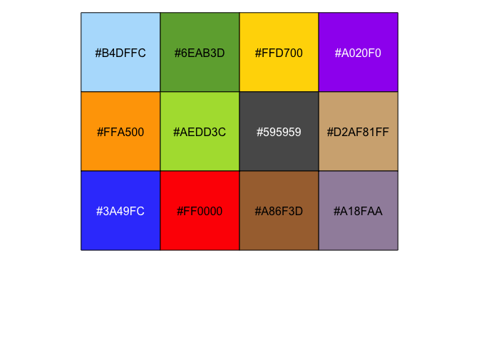
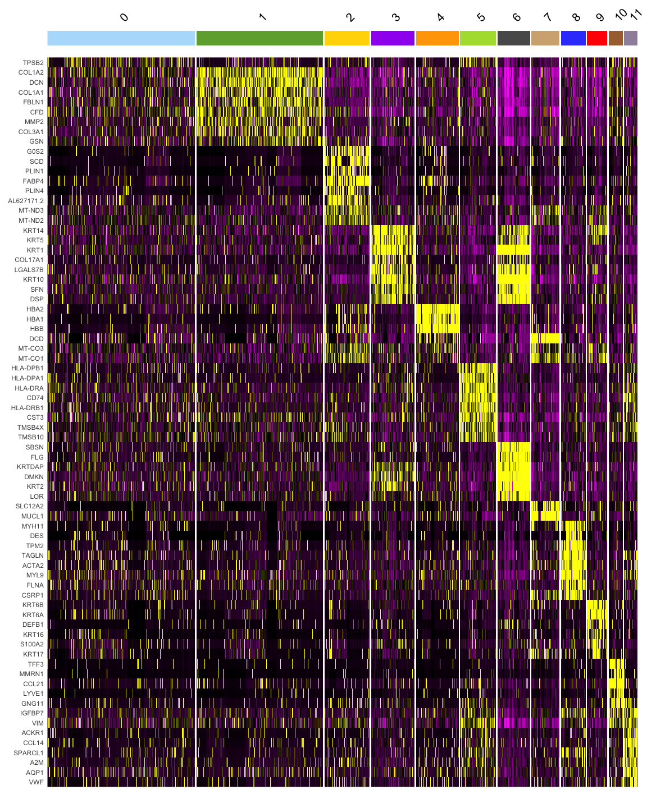
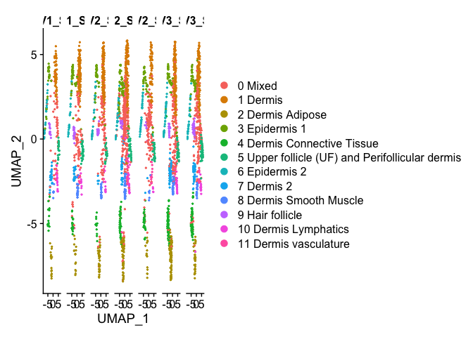
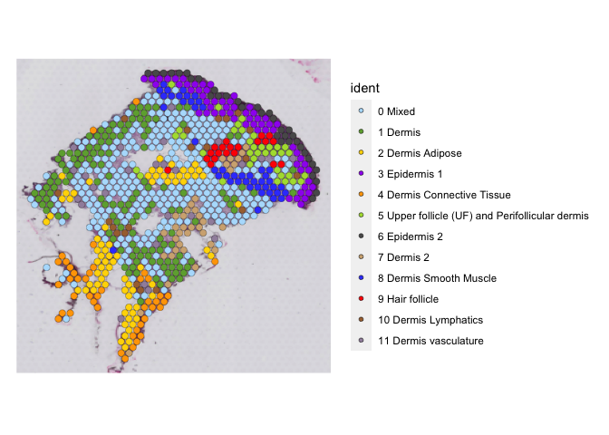
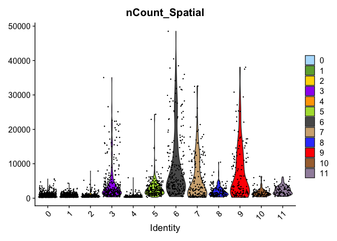
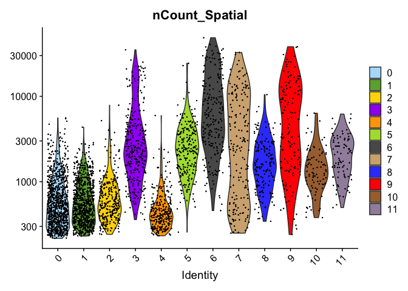
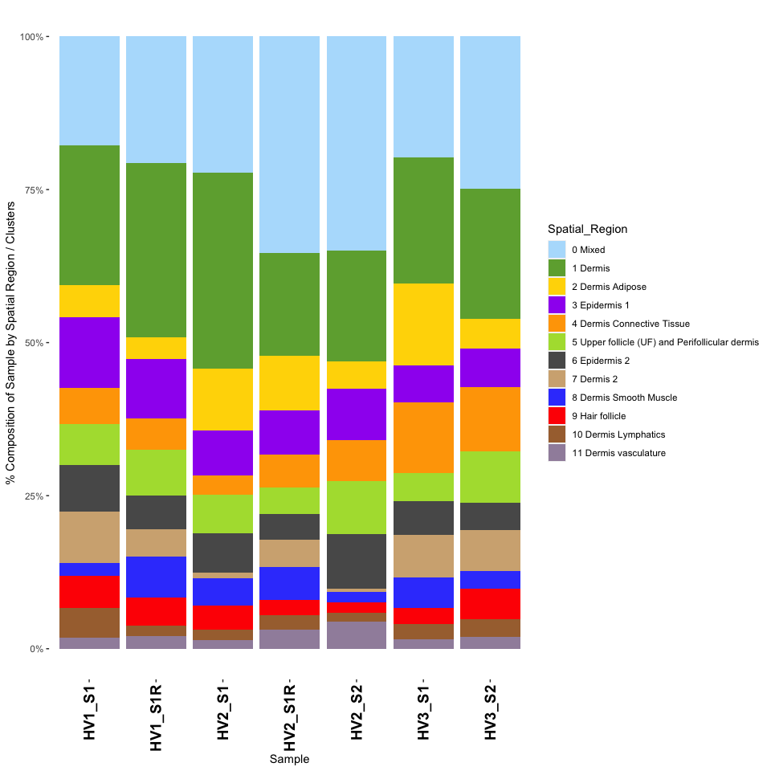

# Healthy donors - Spatial Transcriptomics data analysis workflow

# ST HEALTHY SAMPLES - PART 1

This notebook covers the basic to advanced analysis of ST (spatial
transcriptomic) samples from healthy / normal human skin -

-   Pre-processing

-   Quality Control

-   Clustering

-   Dimensionality Reduction (UMAP)

-   Batch Correction

-   Marker Genes

### TABLE OF CONTENTS

| FIGURE NO | LINK         |
|-----------|--------------|
| 1B        | [link](#1b)  |
| 1C        | [link](#1c)  |
| 1D        | [link](#1d)  |
| S2-C      | [link](#s2c) |
| S2-D      | [link](#s2d) |

## Load required packages

``` r
library(tidyverse)
```

    ## ── Attaching packages ─────────────────────────────────────── tidyverse 1.3.1 ──

    ## ✔ ggplot2 3.3.6     ✔ purrr   0.3.4
    ## ✔ tibble  3.1.7     ✔ dplyr   1.0.9
    ## ✔ tidyr   1.2.0     ✔ stringr 1.4.0
    ## ✔ readr   2.1.2     ✔ forcats 0.5.1

    ## Warning: package 'ggplot2' was built under R version 4.1.2

    ## Warning: package 'tibble' was built under R version 4.1.2

    ## Warning: package 'tidyr' was built under R version 4.1.2

    ## Warning: package 'readr' was built under R version 4.1.2

    ## Warning: package 'dplyr' was built under R version 4.1.2

    ## ── Conflicts ────────────────────────────────────────── tidyverse_conflicts() ──
    ## ✖ dplyr::filter() masks stats::filter()
    ## ✖ dplyr::lag()    masks stats::lag()

``` r
library(Seurat)
```

    ## Warning: package 'Seurat' was built under R version 4.1.2

    ## Attaching SeuratObject

    ## Attaching sp

``` r
library(cowplot)
library(RColorBrewer)
```

    ## Warning: package 'RColorBrewer' was built under R version 4.1.2

``` r
library(pheatmap)
library(scales)
```

    ## Warning: package 'scales' was built under R version 4.1.2

    ## 
    ## Attaching package: 'scales'

    ## The following object is masked from 'package:purrr':
    ## 
    ##     discard

    ## The following object is masked from 'package:readr':
    ## 
    ##     col_factor

``` r
library(ggsci)
```

## Import functions from the custom R script

``` r
source("SPATIAL_FUNCTIONS.R")
```

    ## Warning: package 'reticulate' was built under R version 4.1.2

    ## Warning: package 'clusterProfiler' was built under R version 4.1.1

    ## 

    ## Registered S3 method overwritten by 'ggtree':
    ##   method      from 
    ##   identify.gg ggfun

    ## clusterProfiler v4.0.5  For help: https://yulab-smu.top/biomedical-knowledge-mining-book/
    ## 
    ## If you use clusterProfiler in published research, please cite:
    ## T Wu, E Hu, S Xu, M Chen, P Guo, Z Dai, T Feng, L Zhou, W Tang, L Zhan, X Fu, S Liu, X Bo, and G Yu. clusterProfiler 4.0: A universal enrichment tool for interpreting omics data. The Innovation. 2021, 2(3):100141. doi: 10.1016/j.xinn.2021.100141

    ## 
    ## Attaching package: 'clusterProfiler'

    ## The following object is masked from 'package:purrr':
    ## 
    ##     simplify

    ## The following object is masked from 'package:stats':
    ## 
    ##     filter

    ## Loading required package: AnnotationDbi

    ## Loading required package: stats4

    ## Loading required package: BiocGenerics

    ## Warning: package 'BiocGenerics' was built under R version 4.1.1

    ## 
    ## Attaching package: 'BiocGenerics'

    ## The following objects are masked from 'package:dplyr':
    ## 
    ##     combine, intersect, setdiff, union

    ## The following objects are masked from 'package:stats':
    ## 
    ##     IQR, mad, sd, var, xtabs

    ## The following objects are masked from 'package:base':
    ## 
    ##     anyDuplicated, append, as.data.frame, basename, cbind, colnames,
    ##     dirname, do.call, duplicated, eval, evalq, Filter, Find, get, grep,
    ##     grepl, intersect, is.unsorted, lapply, Map, mapply, match, mget,
    ##     order, paste, pmax, pmax.int, pmin, pmin.int, Position, rank,
    ##     rbind, Reduce, rownames, sapply, setdiff, sort, table, tapply,
    ##     union, unique, unsplit, which.max, which.min

    ## Loading required package: Biobase

    ## Warning: package 'Biobase' was built under R version 4.1.1

    ## Welcome to Bioconductor
    ## 
    ##     Vignettes contain introductory material; view with
    ##     'browseVignettes()'. To cite Bioconductor, see
    ##     'citation("Biobase")', and for packages 'citation("pkgname")'.

    ## Loading required package: IRanges

    ## Warning: package 'IRanges' was built under R version 4.1.1

    ## Loading required package: S4Vectors

    ## Warning: package 'S4Vectors' was built under R version 4.1.2

    ## 
    ## Attaching package: 'S4Vectors'

    ## The following object is masked from 'package:clusterProfiler':
    ## 
    ##     rename

    ## The following objects are masked from 'package:dplyr':
    ## 
    ##     first, rename

    ## The following object is masked from 'package:tidyr':
    ## 
    ##     expand

    ## The following objects are masked from 'package:base':
    ## 
    ##     expand.grid, I, unname

    ## 
    ## Attaching package: 'IRanges'

    ## The following object is masked from 'package:clusterProfiler':
    ## 
    ##     slice

    ## The following object is masked from 'package:sp':
    ## 
    ##     %over%

    ## The following objects are masked from 'package:dplyr':
    ## 
    ##     collapse, desc, slice

    ## The following object is masked from 'package:purrr':
    ## 
    ##     reduce

    ## 
    ## Attaching package: 'AnnotationDbi'

    ## The following object is masked from 'package:clusterProfiler':
    ## 
    ##     select

    ## The following object is masked from 'package:dplyr':
    ## 
    ##     select

    ## 

### Import Healthy Samples

(Raw Data stored in GEO repo: GSE202011)

(Sample meta-data in XXX)

(*replace this with GEO repo link for final release)*

``` r
## HEALTHY SAMPLES
## HEALTHY MALE SKIN 1 & 2
HEALTHY.Male.s1 <- Load10X_Spatial(data.dir ="../../FOURTH_RUN/SAMPLE A1/",slice="HV1.S1.R1")
```

    ## Warning: Keys should be one or more alphanumeric characters followed by an
    ## underscore, setting key from hv1.s1.r1_ to hv1s1r1_

``` r
HEALTHY.Male.s2 <- Load10X_Spatial(data.dir ="../../SEVENTH RUN/ST-HM-1/",slice="HV1.S1.R2")
```

    ## Warning: Keys should be one or more alphanumeric characters followed by an
    ## underscore, setting key from hv1.s1.r2_ to hv1s1r2_

``` r
## HEALTHY FEMALE SKIN 1 & 2 (FROM THE SAME DONOR)
HEALTHY.Female1.s1 <- Load10X_Spatial(data.dir ="../../FOURTH_RUN/SAMPLE B1/",slice="HV2.S1.R1")
```

    ## Warning: Keys should be one or more alphanumeric characters followed by an
    ## underscore, setting key from hv2.s1.r1_ to hv2s1r1_

``` r
HEALTHY.Female1.s2 <- Load10X_Spatial(data.dir ="../../FIFTH_RUN/SAMPLE D1/",slice="HV2.S1.R2")
```

    ## Warning: Keys should be one or more alphanumeric characters followed by an
    ## underscore, setting key from hv2.s1.r2_ to hv2s1r2_

``` r
HEALTHY.Female1.s3 <- Load10X_Spatial(data.dir ="../../SEVENTH RUN/ST-HF-1/",slice="HV2.S2")
```

    ## Warning: Keys should be one or more alphanumeric characters followed by an
    ## underscore, setting key from hv2.s2_ to hv2s2_

``` r
## HEALTHY FEMALE
HEALTHY.Female2.s1 <- Load10X_Spatial(data.dir ="../../SEVENTH RUN/ST-HF-2E/",slice="HV3.S1")
```

    ## Warning: Keys should be one or more alphanumeric characters followed by an
    ## underscore, setting key from hv3.s1_ to hv3s1_

``` r
HEALTHY.Female2.s2 <- Load10X_Spatial(data.dir ="../../SEVENTH RUN/ST-HF-2F/",slice="HV3.S2")
```

    ## Warning: Keys should be one or more alphanumeric characters followed by an
    ## underscore, setting key from hv3.s2_ to hv3s2_

### Import the spots to be removed.

(Outlier spots identified using visual inspection in loupe browser)

Outlier spots here are spots that were not part of tissue slice and
appear to be generated due to

``` r
# HEALTHY FEMALE SKIN 2
#REMOVE SPOTS

remove.spots <- read.csv(file="../../CLOUPE_FILES/FIFTH_RUN/D1/OUTLIERS.csv")
subset_spots <- Cells(HEALTHY.Female1.s2)[which((!(rownames(HEALTHY.Female1.s2@meta.data) %in% remove.spots$Barcode)))]
HEALTHY.Female1.s2.clean <- subset(HEALTHY.Female1.s2,cells=subset_spots)
```

### SAMPLE IDS

(HV - Healthy Volunteer, R - Replicate)

``` r
HEALTHY.Male.s1$sample.id<- "HV1_S1_R1" 
HEALTHY.Male.s2$sample.id<- "HV1_S1_R2"

HEALTHY.Female1.s1$sample.id <- "HV2_S1_R1"
HEALTHY.Female1.s2.clean$sample.id <- "HV2_S1_R2"
HEALTHY.Female1.s3$sample.id <- "HV2_S2"

HEALTHY.Female2.s1$sample.id <- "HV3_S1"
HEALTHY.Female2.s2$sample.id <- "HV3_S2"
```

### SAMPLE IDS (version 2) - (Full name + Biopsy site)

Biopsy sites - Trunk and FA (Forearm)

``` r
HEALTHY.Male.s1$orig.ident <- "Healthy Volunteer 1 - TRUNK R1" 
HEALTHY.Male.s2$orig.ident <-"Healthy Volunteer 1 - TRUNK R2"

HEALTHY.Female1.s1$orig.ident <- "Healthy Volunteer 2 - FA R1"
HEALTHY.Female1.s2.clean$orig.ident <- "Healthy Volunteer 2 - FA R2"
HEALTHY.Female1.s3$orig.ident <- "Healthy Volunteer 2 - TRUNK"

HEALTHY.Female2.s1$orig.ident <- "Healthy Volunteer 3 - FA R1"
HEALTHY.Female2.s2$orig.ident <- "Healthy Volunteer 3 - TRUNK"
```

### Combine all samples into one list

``` r
Healthy_Samples <- c(HEALTHY.Male.s1,HEALTHY.Male.s2,HEALTHY.Female1.s1,HEALTHY.Female1.s2.clean,HEALTHY.Female1.s3,HEALTHY.Female2.s1,HEALTHY.Female2.s2)
```

### Standard spatial plots (before filtering)

Generated per sample

``` r
for (x in Healthy_Samples){
  st_plot(x)
}
```

### QC (Quality control) plots for each healthy sample

``` r
for (x in Healthy_Samples){
  st_plot_QC(x)
}
```

### Standard QC scatter plots

(**UMI** / **nCount Spatial** vs. **Number of genes** / **features
expressed**)

Pre-set limits for X and Y axis - (12500,8500)

``` r
for (x in Healthy_Samples){
  st_scatter_QC(x)
}
```

### QC filtering

Remove spots with low depth (Defined by number of genes expressed per
spot)

\- 200 genes minimum per spot

``` r
i <- 1
while(i <= length(Healthy_Samples)){
  filtered_data <- st_filter_by_genes(st.data = Healthy_Samples[[i]],x = 200)
  Healthy_Samples[[i]] <- filtered_data
  i <- i+1
}
```

### Batch correction - Using Seurat Anchor integration

Original vignette
(<https://satijalab.org/seurat/articles/integration_introduction.html>)

Reference paper- (<https://doi.org/10.1016/j.cell.2019.05.031>)

Each sample - replicate is treated as an individual batch to account for
differences in sequencing depth between replicates and sample to sample
heterogeneity in human patient samples.

``` r
new.skin.combined <- st_combine(Healthy_Samples,ndim = 20,res = 0.6)
```

### Load the pre-processed data

(The RDS was processed using the same parameters that have been defined
above)

``` r
# older version , to be removed
#load(file = "HEALTHY_SKIN_SAMPLES_ST.RData")
new.skin.combined <- readRDS("HEALTHY_SKIN_SAMPLES_ST.RDS")
```

### Defining and viewing color scheme for clustering based UMAP and spatial plots

``` r
custom_colors <- c("#B4DFFC","#6EAB3D","#FFD700","#A020F0","#FFA500","#AEDD3C","#595959","#D2AF81FF","#3A49FC","#FF0000","#A86F3D","#A18FAA")
show_col(custom_colors)
```

<!-- -->

### Finding marker genes for batch corrected healthy samples + plotting for top 8 marker genes per cluster heatmap

``` r
new.skin.combined <- PrepSCTFindMarkers(new.skin.combined,assay = "SCT")
```

    ## Minimum UMI unchanged. Skipping re-correction.

``` r
Idents(new.skin.combined) <- "seurat_clusters"
new.skin.combined.markers <- FindAllMarkers(new.skin.combined, only.pos = TRUE, min.pct = 0.25, logfc.threshold = 0.25,assay = "SCT")
```

    ## Calculating cluster 0

    ## Calculating cluster 1

    ## Calculating cluster 2

    ## Calculating cluster 3

    ## Calculating cluster 4

    ## Calculating cluster 5

    ## Calculating cluster 6

    ## Calculating cluster 7

    ## Calculating cluster 8

    ## Calculating cluster 9

    ## Calculating cluster 10

    ## Calculating cluster 11

``` r
DefaultAssay(new.skin.combined) <- "SCT"
top8 <- new.skin.combined.markers %>%
    dplyr::group_by(cluster) %>%
    dplyr::filter(p_val_adj<0.05) %>%
    top_n(n = 8, wt = avg_log2FC)
#pdf(width = 20,height=15,file = "HEATMAP_HEALTHY_SAMPLES_CLUSTERS_ONLY.pdf")
#print(DoHeatmap(new.skin.combined, features = top10$gene,assay = "SCT",group.colors = custom_colors) + NoLegend())
#dev.off()
```

<a id="s2c"></a>

``` r
DoHeatmap(new.skin.combined, features = top8$gene,assay = "SCT",group.colors = custom_colors) + NoLegend()
```

    ## Warning in DoHeatmap(new.skin.combined, features = top8$gene, assay = "SCT", :
    ## The following features were omitted as they were not found in the scale.data
    ## slot for the SCT assay: HLA-E, S100P, SCGB1B2P, SCGB2A2, SCGB1D2, PIP

<!-- -->

</a>

### Assign spatial region specific cluster ids

``` r
new.cluster.ids <- c("0 Mixed","1 Dermis",
"2 Dermis Adipose","3 Epidermis 1","4 Dermis Connective Tissue","5 Upper follicle (UF) and Perifollicular dermis","6 Epidermis 2","7 Dermis 2","8 Dermis Smooth Muscle","9 Hair follicle","10 Dermis Lymphatics","11 Dermis vasculature")
names(new.cluster.ids) <- levels(new.skin.combined)
new.skin.combined <- RenameIdents(new.skin.combined, new.cluster.ids)
new.skin.combined <- StashIdent(new.skin.combined, save.name = "Spatial.regions")
```

    ## With Seurat 3.X, stashing identity classes can be accomplished with the following:
    ## new.skin.combined[["Spatial.regions"]] <- Idents(object = new.skin.combined)

``` r
# DEFINE COLORS FOR EACH SPATIAL REGION
#color.labels.anchor <- c("0 Mixed","1 Dermis","2 Dermis Adipose","3 Epidermis 1","4 Dermis Connective Tissue","5 Upper follicle (UF) and Perifollicular dermis","6 Epidermis 2","7 Dermis 2","8 Dermis Smooth Muscle","9 Hair follicle","10 Dermis Lymphatics","11 Dermis vasculature")
color.labels.anchor <- c("#B4DFFC","#6EAB3D","#FFD700","#A020F0","#FFA500","#AEDD3C","#595959","#D2AF81FF","#3A49FC","#FF0000","#A86F3D","#A18FAA")
new.cluster.ids <- c("0 Mixed","1 Dermis",
"2 Dermis Adipose","3 Epidermis 1","4 Dermis Connective Tissue","5 Upper follicle (UF) and Perifollicular dermis","6 Epidermis 2","7 Dermis 2","8 Dermis Smooth Muscle","9 Hair follicle","10 Dermis Lymphatics","11 Dermis vasculature")
names(color.labels.anchor) <- new.cluster.ids
```

### General UMAP with defined color scheme

#### FIGURE 1-C

<a id="1c">

``` r
pdf(width = 12,height=8,file = "UMAP_HEALTHY_SAMPLES_CLUSTERS_ONLY.pdf")
DimPlot(new.skin.combined,cols = custom_colors,pt.size = 3.5)
dev.off()
```

    ## quartz_off_screen 
    ##                 2

``` r
# FOR IN NOTEBOOK VIEW
DimPlot(new.skin.combined,cols = custom_colors,pt.size = 3.5)
```

<!-- -->

</a>

### UMAP plot split by samples

``` r
DimPlot(new.skin.combined,split.by = "sample.id")
```

<!-- -->

``` r
## SAVE THE RESULTS
save(new.skin.combined,file = "HEALTHY_SKIN_SAMPLES_ST.RData")
```

### Spatial plot for HV2_S1_R2 / Healthy Volunteer 2 -

``` r
#pdf(width = 8,height=10,file = "HEALTHY_FEMALE_SAMPLE_1_R2_SPATIAL_PLOT.pdf")
#SpatialDimPlot(new.skin.combined,images="HealthyFemale.1.S2",cols = custom_colors,pt.size.factor = 2.4)
#dev.off()
```

### VIEW SPATIAL PLOT HERE

**FIGURE 1-B**

``` r
names(new.skin.combined@images) <- c("HV1.S1.R1","HV1.S1.R2","HV2.S1.R1","HV2.S1.R2","HV2.S1.R2","HV3.S1","HV3.S2")
```

<a id="1b">

``` r
SpatialDimPlot(new.skin.combined,images="HV2.S1.R2",cols = color.labels.anchor,pt.size.factor = 2.4)
```

<!-- -->

</a>

### Generate Spatial plot for all samples

``` r
images <- Images(new.skin.combined) %>% as.vector()
for(x in images){
  pdf(width = 8,height=10,file = paste(x,"_SPATIAL_PLOT.pdf"))
  print(SpatialDimPlot(new.skin.combined,images=x,cols = custom_colors,pt.size.factor = 2))
  dev.off()
}
```

### Pathway analysis - Performed per cluster

``` r
for(i in seq(0,11)){
  cluster <- new.skin.combined.markers %>% filter(cluster==i)
  GO_PATHWAYS_ENRICH(cluster,ONT="BP",OUTPUT = i)
  GO_PATHWAYS_ENRICH(cluster,ONT="CC",OUTPUT = i)
  GO_PATHWAYS_ENRICH(cluster,ONT="MF",OUTPUT = i)
  KEGG_PATHWAYS(cluster,OUTPUT = i)
}
```

### UMI counts per cluster basis

<a id="s2d">

``` r
#VIOLIN PLOT FOR UMIs and SEURAT CLUSTERS
#pdf(file = "VIOLIN_PLOT_UMIs_and_CLUSTERS_HEALTHY_SAMPLES.pdf",width = 16,height=12)
print(VlnPlot(new.skin.combined,group.by = "seurat_clusters",features = "nCount_Spatial",cols = custom_colors))
```

<!-- -->

``` r
#dev.off()
```

</a>

# LOG TRANSFORMED UMI COUNTS

``` r
#pdf(file = "VIOLIN_PLOT_UMIs_and_CLUSTERS_HEALTHY_SAMPLES(LOG_TRANSFORMED).pdf",width = 16,height=12)
print(VlnPlot(new.skin.combined,group.by = "seurat_clusters",features = "nCount_Spatial",cols = custom_colors,log = TRUE))
```

<!-- -->

``` r
#dev.off()
#VlnPlot(new.skin.combined,group.by = "seurat_clusters",features = "nCount_Spatial",cols = custom_colors,log = TRUE)
```

``` r
# SPOT FREQUENCY TABLE - BY SPATIAL REGION
spatial.freq <- as.data.frame(table(new.skin.combined@meta.data$Spatial.regions))
write.csv(spatial.freq,file="SPATIAL_REGIONS_CLUSTERS_SPOT_COUNTS.csv")
```

## AVERAGE GENE COUNTS

``` r
Idents(new.skin.combined) <- "seurat_clusters"

clusters <- unique(new.skin.combined@meta.data$seurat_clusters) %>% as.vector()

for(x in clusters){
  avg_exp.cluster <- AverageExpression(new.skin.combined,slot = "counts",assay="Spatial") %>% as.data.frame() %>% dplyr::select(paste("Spatial.",x,sep = "")) %>% filter(x>0) %>% write.csv(file = paste("CLUSTER_",x,"_GENE_COUNTS.csv",sep = ""))
}
```

## **FIGURE 1D**

## PERCENTAGE PLOT FOR DIFFERENT SPATIAL REGIONS

<a id="1d">

``` r
Regions.df <- table(new.skin.combined@meta.data$Spatial.regions,new.skin.combined@meta.data$sample.id) %>% as.data.frame() %>% dplyr::rename(Spatial_Region=Var1,Sample=Var2) 

black.bold.16.text <- element_text(face = "bold", color = "black", size = 14,angle = 90, vjust = 0.5, hjust=1)

brks <- c(0, 0.25, 0.5, 0.75, 1)

#pdf(file="PERCENTAGE_COMPOSTION_PLOT_HEALTHY_SAMPLES.pdf",height = 14,width = 8)
ggplot(Regions.df,aes(x=Sample,y=Freq,fill=Spatial_Region)) + geom_bar(stat="identity",position="fill") + scale_fill_manual(values =color.labels.anchor)  + ggplot2::theme(panel.grid.major = element_blank(), panel.grid.minor = element_blank(),
panel.background = element_blank(),axis.text.x =black.bold.16.text) + scale_y_continuous(breaks = brks, labels = scales::percent(brks)) + ylab("% Composition of Sample by Spatial Region / Clusters")
```

<!-- -->

``` r
#dev.off()
```

</a>
